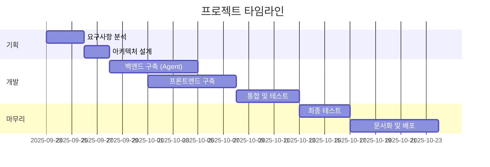
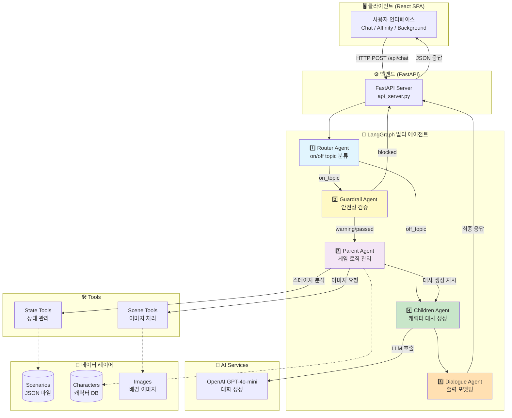
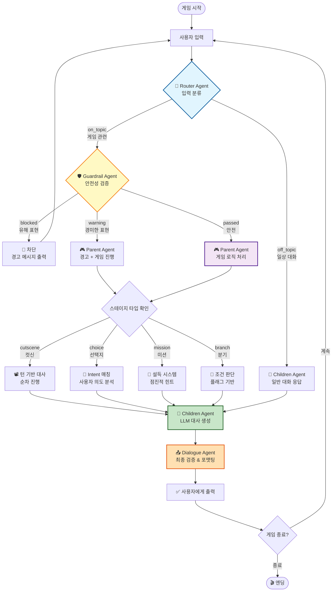
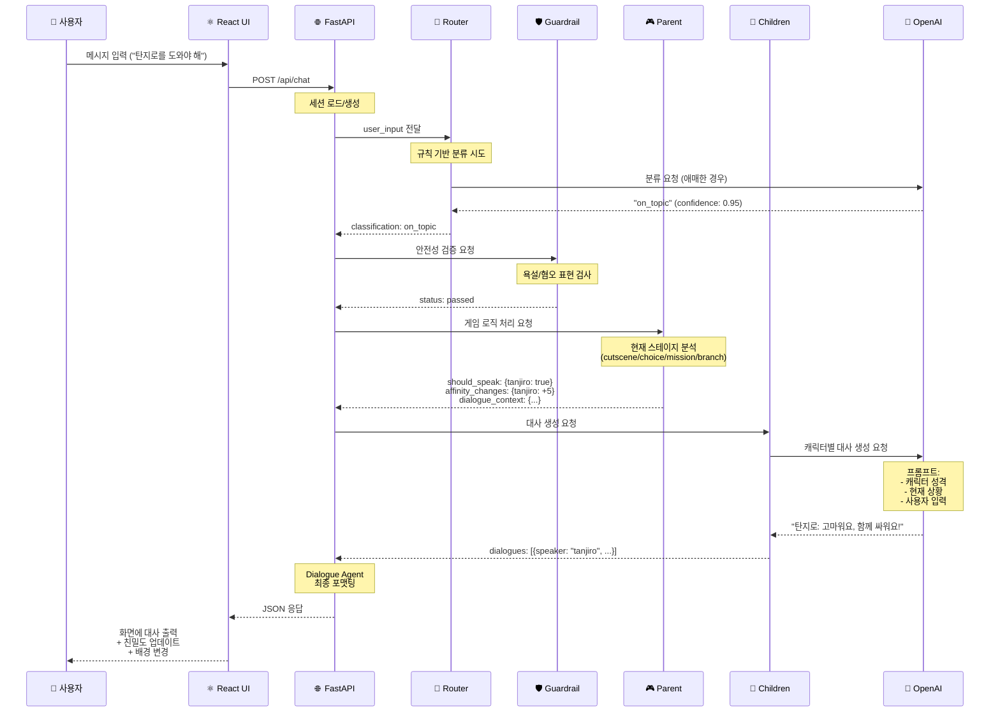
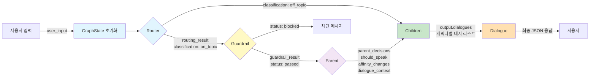

# SKN15-FINAL-5TEAM

**KIME Chat - 귀멸의 칼날 인터랙티브 AI 챗봇**

> LangGraph 기반 멀티 에이전트 시스템을 활용한 차세대 대화형 스토리텔링 플랫폼

[](https://github.com/SKNETWORKS-FAMILY-AICAMP/SKN15-FINAL-5TEAM)
[](https://www.python.org/)
[](https://react.dev/)
[](https://langchain-ai.github.io/langgraph/)

---

## 📑 목차

- [1. 팀 소개](#1-팀-소개)
- [2. 프로젝트 기간](#2-프로젝트-기간)
- [3. 프로젝트 개요](#3-프로젝트-개요)
  - [📕 프로젝트명](#-프로젝트명)
  - [✅ 프로젝트 배경 및 목적](#-프로젝트-배경-및-목적)
  - [🖐️ 프로젝트 소개](#️-프로젝트-소개)
  - [❤️ 기대효과](#️-기대효과)
  - [👤 대상 사용자](#-대상-사용자)
- [4. 기술 스택](#4-기술-스택)
- [5. 수행결과](#5-수행결과)
  - [🏗️ 시스템 아키텍처](#️-시스템-아키텍처)
  - [📁 프로젝트 구조](#-프로젝트-구조)
  - [🔄 데이터 플로우](#-데이터-플로우)
  - [🤖 백엔드 기능](#-백엔드-기능)
  - [💻 프론트엔드 기능](#-프론트엔드-기능)
  - [🚀 빠른 시작](#-빠른-시작)
- [6. 한 줄 회고](#6-한-줄-회고)

---

## 1. 팀 소개

**SK Networks Family AI Camp 15기 - 5조 Andrew팀**

| 이름 | 역할 | GitHub | 담당 업무 |
|------|------|--------|-----------|
| **권도원** | AI, Backend Engineer | [@권도원](https://github.com/username) | LangGraph 아키텍처 설계, Parent Agent 개발 |
| **이준원** | AI, Backend Engineer | [@이준원](https://github.com/username) | Router/Guardrail Agent, FastAPI 서버 개발 |
| **조태민** | Backend-Frontend, Cloud Engineer | [@조태민](https://github.com/username) | Tools, React SPA, UI/UX 설계 및 구현, 서버 구축 |

**팀 문화**
- 매일 오전 10시 데일리 스크럼
- Git Flow 전략 기반 협업
- 코드 리뷰 필수 (2명 이상 Approve)
- 페어 프로그래밍 적극 활용

---

## 2. 프로젝트 기간

**전체 기간**: 2025년 9월 19일 ~ 2025년 11월 21일 (약 9주)

### 단계별 일정 (~중간 발표)



### 주요 마일스톤
- **Week 1** (9/23-9/29): 기획 및 아키텍처 설계
- **Week 2** (9/30-10/06): 백엔드 Agent 시스템 구축
- **Week 3** (10/07-10/13): 프론트엔드 개발 및 통합
- **Week 4** (10/14-10/24): 테스트, 문서화, 최종 발표 준비

---

## 3. 프로젝트 개요

### 📕 프로젝트명

**KIME Chat (Kimetsu Interactive Multi-agent Experience)**

- **Kimetsu**: 귀멸의 칼날 (鬼滅の刃) 세계관
- **Interactive**: 사용자 선택에 따른 동적 스토리 전개
- **Multi-agent**: LangGraph 기반 5개 전문화 에이전트 협업
- **Experience**: 몰입형 대화 경험 제공

### ✅ 프로젝트 배경 및 목적

#### 배경
최근 생성형 AI 기술의 발전으로 **대화형 콘텐츠**에 대한 수요가 급증하고 있습니다. 특히:
- 기존 챗봇은 단순 질의응답 방식으로 **몰입감 부족**
- 게임과 AI의 융합을 통한 **새로운 엔터테인먼트 수요** 증가
- LLM 기반 **동적 스토리텔링** 기술의 상용화 가능성 확대

#### 목적
1. **LangGraph 멀티 에이전트 아키텍처 실증**
   - Router/Guardrail/Parent/Children/Dialogue 5개 Agent 협업
   - 각 Agent의 역할 분리를 통한 확장성 확보

2. **자연어 기반 게임 인터랙션 구현**
   - 사용자 입력을 LLM이 이해하여 스토리 분기 처리
   - 선택지 없이도 자유로운 대화로 게임 진행

3. **안전한 AI 대화 시스템 검증**
   - Guardrail Agent를 통한 유해 표현 실시간 차단
   - 친밀도 시스템을 통한 캐릭터 간 관계 관리

### 🖐️ 프로젝트 소개

**KIME Chat**은 **LangGraph 기반 멀티 에이전트 시스템**을 활용하여 사용자와 AI 캐릭터 간의 **몰입형 대화 경험**을 제공하는 인터랙티브 스토리텔링 플랫폼입니다.

#### 핵심 특징

1️⃣ **5단계 멀티 에이전트 파이프라인**
```
사용자 입력 → Router → Guardrail → Parent → Children → Dialogue → 출력
```
- 각 Agent가 전문화된 역할 수행
- 단계별 검증을 통한 안정성 확보

2️⃣ **LLM 기반 동적 대화 생성**
- OpenAI GPT-4o-mini를 활용한 캐릭터별 대사 생성
- 사용자 맥락을 이해하여 자연스러운 대화 진행

3️⃣ **JSON 기반 시나리오 시스템**
- 하드코딩 없이 시나리오 추가/변경 가능
- cutscene/choice/mission/branch 4가지 스테이지 타입 지원

4️⃣ **React SPA 기반 현대적 UI/UX**
- 실시간 대화 인터페이스
- 캐릭터별 친밀도 시각화
- 배경 이미지 동적 변경 (무한열차 시나리오)

### ❤️ 기대효과

#### 기술적 효과
- ✅ **LangGraph 아키텍처 검증**: 멀티 에이전트 시스템의 실제 프로덕션 적용 사례
- ✅ **확장 가능한 시스템 설계**: 새로운 캐릭터/시나리오 추가 용이
- ✅ **AI 안전성 검증**: Guardrail Agent를 통한 유해 콘텐츠 차단

#### 비즈니스 효과
- 📈 **새로운 엔터테인먼트 형태**: 게임 + AI 융합 콘텐츠
- 📈 **IP 활용 가능성**: 기존 인기 콘텐츠를 AI 대화형 게임으로 전환
- 📈 **교육 분야 적용**: 역사/문학 등 교육용 대화형 콘텐츠 제작

#### 사회적 효과
- 🌍 **접근성 향상**: 텍스트 기반으로 누구나 쉽게 접근 가능
- 🌍 **창의력 증진**: 사용자 선택에 따라 다양한 스토리 경험
- 🌍 **AI 리터러시 향상**: AI와의 자연스러운 대화를 통한 AI 이해도 증진

### 👤 대상 사용자

| 사용자 그룹 | 니즈 | 제공 가치 |
|-------------|------|-----------|
| **게임 유저** (10-30대) | 몰입형 스토리 경험 | 자유로운 대화로 진행되는 인터랙티브 게임 |
| **애니메이션 팬** | 좋아하는 캐릭터와 대화 | 귀멸의 칼날 캐릭터와의 실시간 대화 |
| **개발자** | AI 시스템 참고 사례 | LangGraph 기반 멀티 에이전트 오픈소스 |
| **기업/기관** | AI 콘텐츠 제작 | IP를 활용한 대화형 콘텐츠 제작 템플릿 |

**페르소나 예시**

> **김민준 (24세, 대학생)**
> "귀멸의 칼날 팬인데, 탄지로와 직접 대화할 수 있다니! 내 선택에 따라 스토리가 바뀌는 게 신기해요. 마치 내가 주인공이 된 기분이에요."

> **박지원 (29세, 프론트엔드 개발자)**
> "LangGraph 기반 멀티 에이전트 시스템을 실제로 구현한 사례를 찾고 있었어요. 코드가 깔끔하게 모듈화되어 있어서 우리 회사 프로젝트에도 적용해볼 수 있을 것 같아요."

---

## 4. 기술 스택

### 🧠 AI/LLM

| 기술 | 버전 | 역할 | 특이사항 |
|------|------|------|----------|
| **LangChain** | 1.0+ | LLM 체인 구성 | OpenAI 모델 래핑 |
| **LangGraph** | 0.0.20+ | 멀티 에이전트 워크플로우 | 상태 기반 그래프 실행 |
| **OpenAI API** | 1.0+ | GPT-4o-mini | 대화 생성, 분류, 검증 |

### ⚙️ Backend

| 기술 | 버전 | 역할 | 특이사항 |
|------|------|------|----------|
| **Python** | 3.10+ | 백엔드 언어 | Type Hints 적극 활용 |
| **FastAPI** | 0.109.0 | REST API 서버 | 비동기 처리, CORS 지원 |
| **Pydantic** | 2.10.0+ | 데이터 검증 | 타입 안전성 보장 |
| **SQLAlchemy** | 2.0.25 | ORM | 세션 저장 (향후 DB 연동) |
| **aiosqlite** | 0.19.0 | 비동기 SQLite | 경량 DB |
| **PyYAML** | 6.0.1 | 설정 관리 | prompts/characters 설정 |

### 💻 Frontend

| 기술 | 버전 | 역할 | 특이사항 |
|------|------|------|----------|
| **React** | 18.2.0 | UI 라이브러리 | Hooks 기반 |
| **TypeScript** | 5.3.3+ | 타입 시스템 | 타입 안전성 |
| **Vite** | 5.0.8+ | 빌드 도구 | 빠른 HMR |
| **React Router** | 6.20.0+ | 라우팅 | SPA 페이지 관리 |
| **Tailwind CSS** | 3.3.6+ | 스타일링 | 유틸리티 기반 |

### 🧪 Testing

| 기술 | 역할 |
|------|------|
| **pytest** | 단위/통합 테스트 |
| **pytest-asyncio** | 비동기 테스트 |

### 🛠️ DevOps

| 기술 | 역할 |
|------|------|
| **Git/GitHub** | 버전 관리 |
| **Python venv** | 가상환경 |
| **npm** | 프론트엔드 패키지 관리 |

---

## 5. 수행결과

### 🏗️ 시스템 아키텍처

#### 전체 시스템 구성도



#### LangGraph 워크플로우 상세



#### 각 Agent 역할 상세

| Agent | 파일 | 역할 | 입력 | 출력 | LLM 사용 |
|-------|------|------|------|------|----------|
| **Router** | [router_agent.py](backend/src/agents/router_agent.py) | 입력 분류 | `user_input` | `classification` (on/off topic) | 조건부 (규칙 실패 시) |
| **Guardrail** | [guardrail_agent.py](backend/src/agents/guardrail_agent.py) | 안전성 검증 | `user_input`, `current_stage` | `status` (blocked/warning/passed) | 조건부 (규칙 실패 시) |
| **Parent** | [parent_agent.py](backend/src/agents/parent_agent.py) | 게임 로직 관리 | `game_state`, `user_input` | `should_speak`, `affinity_changes`, `next_stage` | 조건부 (choice/mission) |
| **Children** | [children_agent.py](backend/src/agents/children_agent.py) | 대사 생성 | `dialogue_context`, `characters` | `dialogues` (캐릭터별 대사) | 항상 |
| **Dialogue** | [workflow.py](backend/src/core/workflow.py) | 출력 포맷팅 | `output.dialogues` | JSON 응답 | 선택적 (검증 시) |

### 📁 프로젝트 구조

#### 전체 디렉토리 트리

```
SKN15-FINAL-5TEAM/
│
├── 📂 backend/                          # 백엔드 (Python/FastAPI)
│   ├── 📄 api_server.py                 # 🚀 FastAPI 서버 메인 엔트리
│   ├── 📄 play.py                       # 🎮 CLI 테스트용 실행 파일
│   ├── 📄 requirements.txt              # 📦 Python 의존성
│   ├── 📄 Dockerfile                    # 🐳 Docker 이미지
│   ├── 📄 docker-compose.yml            # 🐳 Docker Compose
│   ├── 📄 .env                          # 🔑 환경 변수 (gitignore)
│   │
│   ├── 📂 src/                          # 소스 코드
│   │   ├── 📂 agents/                   # 🤖 AI 에이전트
│   │   │   ├── router_agent.py          # Router Agent
│   │   │   ├── guardrail_agent.py       # Guardrail Agent
│   │   │   ├── parent_agent.py          # Parent Agent
│   │   │   ├── children_agent.py        # Children Agent (규칙)
│   │   │   ├── children_agent_llm.py    # Children Agent (LLM)
│   │   │   ├── intent_detector.py       # Intent 감지
│   │   │   ├── intent_handler.py        # Intent 처리
│   │   │   └── stage_handlers/          # 스테이지별 핸들러
│   │   │       ├── mission_stage.py     # Mission 스테이지
│   │   │       └── ...
│   │   │
│   │   ├── 📂 core/                     # 핵심 시스템
│   │   │   ├── workflow.py              # LangGraph 워크플로우
│   │   │   └── graph_state.py           # GraphState 정의
│   │   │
│   │   ├── 📂 tools/                    # 도구
│   │   │   ├── state_tools.py           # 상태 관리
│   │   │   └── image_manager.py         # 이미지 관리
│   │   │
│   │   ├── 📂 utils/                    # 유틸리티
│   │   │   ├── scenario_loader.py       # 시나리오 로더
│   │   │   └── ...
│   │   │
│   │   └── 📂 scenarios/                # 시나리오 처리 로직
│   │
│   ├── 📂 data/                         # 게임 데이터
│   │   ├── 📂 scenarios/                # 시나리오 JSON
│   │   │   ├── cutscene5_llm_driven.json      # 무한열차 시나리오
│   │   │   ├── cutscene5_akaza_encounter.json # 무한성 시나리오
│   │   │   ├── cutscene5_simple.json          # 편의점 시나리오
│   │   │   └── ...
│   │   │
│   │   ├── 📂 characters/               # 캐릭터 데이터
│   │   │   └── characters_db.json       # 캐릭터 프로필, 성격, 관계
│   │   │
│   │   └── 📂 image_mappings/           # 이미지 매핑
│   │       └── llm_selector_mappings.json  # LLM 기반 이미지 선택
│   │
│   ├── 📂 configs/                      # 설정 파일
│   │   ├── prompts.yaml                 # AI 프롬프트
│   │   ├── settings.yaml                # 게임 설정
│   │   ├── characters.yaml              # 캐릭터 설정
│   │   ├── routing_rules.json           # Router 규칙
│   │   └── parent_config.json           # Parent 설정
│   │
│   ├── 📂 tests/                        # 테스트 코드
│   │   ├── test_agents.py               # Agent 테스트
│   │   ├── test_routing.py              # Router 테스트
│   │   ├── test_integration.py          # 통합 테스트
│   │   └── ...
│   │
│   ├── 📂 docs/                         # 문서
│   │   ├── guides/                      # 가이드 문서
│   │   │   ├── QUICK_INSTALL.md         # 빠른 설치
│   │   │   ├── TEAM_ONBOARDING.md       # 팀원 온보딩
│   │   │   └── ...
│   │   └── analysis/                    # 분석 문서
│   │       ├── system_architecture.md   # 시스템 아키텍처
│   │       └── ...
│   │
│   └── 📂 scripts/                      # 유틸리티 스크립트
│       ├── INSTALL_AND_RUN.sh           # 자동 설치
│       └── RUN_TESTS.sh                 # 테스트 실행
│
├── 📂 front/                            # 프론트엔드 (React/TypeScript)
│   ├── 📄 package.json                  # npm 의존성
│   ├── 📄 vite.config.ts                # Vite 설정
│   ├── 📄 tailwind.config.js            # Tailwind 설정
│   ├── 📄 tsconfig.json                 # TypeScript 설정
│   │
│   ├── 📂 src/
│   │   ├── 📄 main.tsx                  # React 엔트리포인트
│   │   ├── 📄 App.tsx                   # 루트 컴포넌트
│   │   │
│   │   ├── 📂 pages/                    # 페이지 컴포넌트
│   │   │   ├── HomePage.tsx             # 홈 페이지
│   │   │   ├── ChatPage.tsx             # 채팅 페이지
│   │   │   └── CharacterPage.tsx        # 캐릭터 선택 페이지
│   │   │
│   │   ├── 📂 components/               # UI 컴포넌트
│   │   │   ├── ChatInterface.tsx        # 채팅 인터페이스 (메인)
│   │   │   ├── ChatHeader.tsx           # 헤더
│   │   │   ├── BubbleCounter.tsx        # 턴 카운터
│   │   │   ├── AffinityPanel.tsx        # 친밀도 패널
│   │   │   ├── CharacterCarousel.tsx    # 캐릭터 슬라이더
│   │   │   ├── ConvenienceStoreBackground.tsx  # 편의점 배경
│   │   │   ├── EndingBackground.tsx     # 엔딩 배경
│   │   │   ├── LoginModal.tsx           # 로그인 모달
│   │   │   ├── SettingsModal.tsx        # 설정 모달
│   │   │   └── ...
│   │   │
│   │   ├── 📂 hooks/                    # Custom Hooks
│   │   │   ├── useBackgroundImage.ts    # 배경 이미지 관리
│   │   │   └── useSoundEffects.ts       # 소리 효과 관리
│   │   │
│   │   ├── 📂 contexts/                 # Context API
│   │   │   └── AppContext.tsx           # 앱 전역 상태
│   │   │
│   │   ├── 📂 services/                 # API 서비스
│   │   │   └── api.ts                   # 백엔드 API 호출
│   │   │
│   │   ├── 📂 config/                   # 설정
│   │   │   └── backgroundImages.ts      # 배경 이미지 설정
│   │   │
│   │   └── 📂 utils/                    # 유틸리티
│   │       └── bubbleUtils.ts           # 말풍선 유틸
│   │
│   └── 📂 public/                       # 정적 파일
│       └── images/
│           └── backgrounds/
│               └── mugen_train/         # 무한열차 배경 (18장)
│                   ├── 01_default.png
│                   ├── 02_train_interior.png
│                   └── ...
│
├── 📂 documents/                        # 프로젝트 산출물
│   ├── 데이터 조회 프로그램_SKN15_5조_Andrew팀.pdf
│   ├── 수집데이터_SKN15_5조_Andrew.pdf
│   ├── 시스템아키텍처_SKN15_5조_Andrew.pdf
│   ├── 화면설계서_SKN15_5조_Andrew.pdf
│   └── 중간 발표 PPT_SKN15기_5TEAM.pdf
│
├── 📄 system_architecture_2.md          # 시스템 아키텍처 문서 (상세)
├── 📄 README.md                         # 프로젝트 README (본 문서)
├── 📄 .gitignore                        # Git 제외 파일
└── 📂 venv/                             # Python 가상환경
```

#### 핵심 파일 설명

| 파일/폴더 | 역할 | 중요도 |
|-----------|------|--------|
| [backend/api_server.py](backend/api_server.py) | FastAPI 서버 메인 엔트리, `/api/chat` 엔드포인트 | ⭐⭐⭐⭐⭐ |
| [backend/src/core/workflow.py](backend/src/core/workflow.py) | LangGraph 워크플로우 정의 (Agent 연결) | ⭐⭐⭐⭐⭐ |
| [backend/src/core/graph_state.py](backend/src/core/graph_state.py) | GraphState 타입 정의 (상태 구조) | ⭐⭐⭐⭐⭐ |
| [backend/src/agents/router_agent.py](backend/src/agents/router_agent.py) | Router Agent (on/off topic 분류) | ⭐⭐⭐⭐⭐ |
| [backend/src/agents/guardrail_agent.py](backend/src/agents/guardrail_agent.py) | Guardrail Agent (안전성 검증) | ⭐⭐⭐⭐⭐ |
| [backend/src/agents/parent_agent.py](backend/src/agents/parent_agent.py) | Parent Agent (게임 로직) | ⭐⭐⭐⭐⭐ |
| [backend/src/agents/children_agent.py](backend/src/agents/children_agent.py) | Children Agent (대사 생성) | ⭐⭐⭐⭐⭐ |
| [backend/data/scenarios/*.json](backend/data/scenarios/) | 시나리오 파일 (JSON) | ⭐⭐⭐⭐ |
| [backend/data/characters/characters_db.json](backend/data/characters/characters_db.json) | 캐릭터 데이터베이스 | ⭐⭐⭐⭐ |
| [backend/configs/prompts.yaml](backend/configs/prompts.yaml) | AI 프롬프트 템플릿 | ⭐⭐⭐⭐ |
| [front/src/components/ChatInterface.tsx](front/src/components/ChatInterface.tsx) | 채팅 인터페이스 (메인 UI) | ⭐⭐⭐⭐⭐ |
| [front/src/services/api.ts](front/src/services/api.ts) | 백엔드 API 호출 함수 | ⭐⭐⭐⭐ |
| [front/src/hooks/useBackgroundImage.ts](front/src/hooks/useBackgroundImage.ts) | 배경 이미지 관리 Hook | ⭐⭐⭐ |

### 🔄 데이터 플로우

#### 사용자 입력부터 응답까지 전체 흐름



#### GraphState 데이터 흐름



### 🤖 백엔드 기능

#### 1️⃣ Router Agent

**파일**: [backend/src/agents/router_agent.py](backend/src/agents/router_agent.py)

**역할**: 사용자 입력을 **on_topic (게임 관련)** / **off_topic (일상 대화)** 으로 분류

**처리 로직**:
```python
def classify_input(user_input: str, turn_count: int) -> str:
    # 1. 규칙 기반 빠른 분류 (5ms)
    if is_clear_off_topic(user_input):  # "안녕", "날씨", "밥"
        return "off_topic"

    # 2. LLM 기반 정교한 분류 (150ms)
    if is_ambiguous(user_input):
        result = llm.classify(user_input)
        return result.classification

    # 3. 폴백: 보수적으로 on_topic 처리 (게임 진행 우선)
    return "on_topic"
```

**분류 기준**:

| on_topic (게임 관련) | off_topic (일상 대화) |
|---------------------|----------------------|
| "탄지로를 도와야 해" | "안녕" (단독 인사) |
| "이노스케 찾자" | "오늘 날씨 좋네" |
| "설득해보자" | "밥 먹었어?" |
| "계속" | "심심해" |

#### 2️⃣ Guardrail Agent

**파일**: [backend/src/agents/guardrail_agent.py](backend/src/agents/guardrail_agent.py)

**역할**: 유해 표현 실시간 차단

**검증 단계**:
1. **규칙 기반 검사**: 금지 키워드 목록 확인
2. **LLM 기반 검증**: 우회 표현도 감지
3. **게임 맥락 허용**: "쓰러뜨리다" 등은 전투 맥락에서 허용

**처리 결과**:

| Status | 처리 | 예시 |
|--------|------|------|
| **blocked** | 차단 + 턴 소모 없음 | "씨발", "개새끼" |
| **warning** | 경고 + 게임 진행 | "바보", "멍청이" |
| **passed** | 통과 | "쓰러뜨리다" (게임 맥락) |

**캐릭터별 차단 메시지**:
```yaml
blocked_responses:
  tanjiro: "그런 말은 하지 말아줘... 우리는 친구잖아."
  inosuke: "말을 함부로 하지 마라!"
  zenitsu: "좀 더 정중하게 말해줄 수 없어...?"
```

#### 3️⃣ Parent Agent

**파일**: [backend/src/agents/parent_agent.py](backend/src/agents/parent_agent.py)

**역할**: 게임 로직 관리 (스테이지 진행, 친밀도 관리, 분기 판단)

**스테이지 타입별 처리**:

| 스테이지 타입 | 설명 | 처리 로직 |
|--------------|------|-----------|
| **cutscene** | 컷신 (순차 대사) | 턴 카운트 기반 대사 진행 |
| **choice** | 선택지 | Intent 감지 → 분기 선택 |
| **mission** | 설득 미션 | 점진적 힌트 제공 + 성공/실패 판단 |
| **branch** | 조건 분기 | 플래그 확인 → 다음 스테이지 결정 |

**친밀도 시스템**:
```python
# 친밀도 변경 예시
affinity_changes = {
    "tanjiro": +10,   # 긍정적 대화
    "inosuke": -5,    # 부정적 대화
}

# 친밀도에 따른 대사 변화
if affinity["tanjiro"] >= 300:
    tone = "매우 친근하게"
elif affinity["tanjiro"] >= 100:
    tone = "친근하게"
else:
    tone = "정중하게"
```

#### 4️⃣ Children Agent

**파일**: [backend/src/agents/children_agent.py](backend/src/agents/children_agent.py) (규칙 기반)
**파일**: [backend/src/agents/children_agent_llm.py](backend/src/agents/children_agent_llm.py) (LLM 기반)

**역할**: 캐릭터별 대사 생성

**LLM 프롬프트 구조**:
```yaml
system_prompt: |
  You are {character_name}.

  Personality: {personality}
  Tone: {tone}
  Current situation: {situation}

  User said: "{user_input}"

  Respond in character, keeping your unique speaking style.
```

**캐릭터별 말투**:
- **탄지로**: 정중하고 따뜻한 말투, "~해요", "함께"
- **이노스케**: 거칠고 자신감 넘치는 말투, "~다!", "나는"
- **젠이츠**: 겁이 많고 떠는 말투, "~인가...?", "무서워"
- **네즈코**: 짧은 단어, "음~", "응!"
- **렌고쿠**: 열정적이고 강인한 말투, "~하라!", "불꽃처럼"

#### 5️⃣ Dialogue Agent

**파일**: [backend/src/core/workflow.py](backend/src/core/workflow.py) (워크플로우 내 통합)

**역할**: 최종 출력 포맷팅 및 검증

**출력 JSON 구조**:
```json
{
  "dialogues": [
    {
      "speaker": "tanjiro",
      "text": "고마워요, 함께 싸워요!",
      "emotion": "determined"
    }
  ],
  "system_messages": [
    "렌고쿠의 희생으로 아카자가 물러났다."
  ],
  "current_image": "cutscene_04_rengoku_sacrifice.png",
  "affinity_scores": {
    "tanjiro": 305,
    "inosuke": 195
  },
  "turn_count": 12,
  "is_game_over": false
}
```

#### 추가 모듈

| 모듈 | 역할 |
|------|------|
| [state_tools.py](backend/src/tools/state_tools.py) | 상태 관리 (턴, 플래그, 친밀도) |
| [image_manager.py](backend/src/tools/image_manager.py) | 이미지 선택 (LLM 기반) |
| [scenario_loader.py](backend/src/utils/scenario_loader.py) | JSON 시나리오 로드 |
| [intent_detector.py](backend/src/agents/intent_detector.py) | 사용자 의도 감지 |
| [mission_stage.py](backend/src/agents/stage_handlers/mission_stage.py) | 미션 스테이지 처리 |

### 💻 프론트엔드 기능

#### 주요 컴포넌트

##### 1️⃣ ChatInterface.tsx

**파일**: [front/src/components/ChatInterface.tsx](front/src/components/ChatInterface.tsx)

**역할**: 채팅 UI 메인 컴포넌트

**주요 기능**:
- 메시지 전송/수신
- 자동 스크롤
- 타이핑 중 표시
- 친밀도 실시간 업데이트
- 배경 이미지 동적 변경

**상태 관리**:
```typescript
interface Message {
  id: number;
  text: string;
  isUser: boolean;
  timestamp: Date;
  characterId?: string;  // 캐릭터 ID
  imageIndex?: string;   // 배경 이미지 인덱스
}

const [messages, setMessages] = useState<Message[]>([]);
const [affinityScores, setAffinityScores] = useState<Record<string, number>>({});
const [isLoading, setIsLoading] = useState(false);
```

##### 2️⃣ AffinityPanel.tsx

**파일**: [front/src/components/AffinityPanel.tsx](front/src/components/AffinityPanel.tsx)

**역할**: 캐릭터별 친밀도 시각화

**표시 정보**:
- 캐릭터 이름
- 친밀도 점수 (0-1000)
- 프로그레스 바
- 친밀도 등급 (낯선 / 친구 / 절친 / 동료)

##### 3️⃣ BubbleCounter.tsx

**파일**: [front/src/components/BubbleCounter.tsx](front/src/components/BubbleCounter.tsx)

**역할**: 남은 턴 수 표시

**UI**:
```
🫧 말풍선: 12 / 50
```

##### 4️⃣ useBackgroundImage.ts (Hook)

**파일**: [front/src/hooks/useBackgroundImage.ts](front/src/hooks/useBackgroundImage.ts)

**역할**: 배경 이미지 관리

**기능**:
- 시나리오별 배경 이미지 세트 관리
- 이미지 프리로드 (성능 최적화)
- 페이드 인/아웃 효과
- 백엔드 이미지 파일명 → 프론트엔드 인덱스 매핑

**예시**:
```typescript
const {
  currentBackground,
  backgroundImageUrl,
  setBackgroundById,
  setBackgroundByIndex,
  preloadImages
} = useBackgroundImage('mugen_train');

// 배경 변경
setBackgroundByIndex(3);  // 아카자 등장
```

##### 5️⃣ useSoundEffects.ts (Hook)

**파일**: [front/src/hooks/useSoundEffects.ts](front/src/hooks/useSoundEffects.ts)

**역할**: 소리 효과 관리

**기능**:
- 메시지 수신 소리
- 시스템 알림 소리
- 타이핑 시작 소리
- 오디오 자동 잠금 해제 (모바일 대응)

#### API 통신

**파일**: [front/src/services/api.ts](front/src/services/api.ts)

**엔드포인트**: `POST /api/chat`

**요청**:
```typescript
interface ChatRequest {
  scenario_id: string;      // "train", "ending", etc.
  user_input: string;       // 사용자 입력
  user_name: string;        // 사용자 이름
  session_id?: string;      // 세션 ID (옵션)
}
```

**응답**:
```typescript
interface ChatResponse {
  dialogues: Dialogue[];         // 대사 리스트
  system_messages: string[];     // 시스템 메시지
  current_image: string | null;  // 현재 배경 이미지
  affinity_scores: Record<string, number>;  // 친밀도
  turn_count: number;            // 현재 턴
  is_game_over: boolean;         // 게임 종료 여부
  session_id: string;            // 세션 ID
}
```

#### 반응형 디자인

**브레이크포인트**:
- **Mobile**: < 640px
- **Tablet**: 640px - 1024px
- **Desktop**: > 1024px

**Tailwind 클래스 예시**:
```tsx
<div className="
  flex flex-col
  h-screen
  max-w-screen-xl
  mx-auto
  sm:p-4
  md:p-6
  lg:p-8
">
  {/* 반응형 레이아웃 */}
</div>
```

### 🚀 빠른 시작

#### 사전 요구사항

- **Python**: 3.10 이상
- **Node.js**: 18 이상
- **OpenAI API Key**: [OpenAI Platform](https://platform.openai.com/api-keys)에서 발급

#### 1️⃣ 저장소 클론

```bash
git clone https://github.com/SKNETWORKS-FAMILY-AICAMP/SKN15-FINAL-5TEAM.git
cd SKN15-FINAL-5TEAM
```

#### 2️⃣ 백엔드 설정

```bash
# Python 가상환경 생성
python3 -m venv venv

# 가상환경 활성화 (Mac/Linux)
source venv/bin/activate

# 가상환경 활성화 (Windows)
venv\Scripts\activate

# 의존성 설치
pip install --upgrade pip
pip install -r backend/requirements.txt

# 환경 변수 설정
cd backend
cp .env.example .env  # .env.example이 있다면
# 또는 직접 생성:
nano .env
```

**backend/.env 파일**:
```env
# OpenAI API Configuration
OPENAI_API_KEY=sk-your-actual-api-key-here
OPENAI_MODEL=gpt-4o-mini

# Server Configuration
PORT=8000
HOST=0.0.0.0

# Development / Production
ENVIRONMENT=development
```

#### 3️⃣ 프론트엔드 설정

```bash
cd ../front

# 의존성 설치
npm install
```

#### 4️⃣ 서버 실행

**터미널 1 (백엔드)**:
```bash
cd backend
source ../venv/bin/activate  # Windows: ..\venv\Scripts\activate
python api_server.py
```

**실행 확인**:
```
🚀 Starting KIME Chat API Server...
✅ Workflow created successfully
INFO:     Uvicorn running on http://0.0.0.0:8000
```

**터미널 2 (프론트엔드)**:
```bash
cd front
npm run dev
```

**실행 확인**:
```
VITE v5.x.x ready in xxx ms

➜  Local:   http://localhost:3000/
➜  Network: use --host to expose
```

#### 5️⃣ 브라우저 접속

**프론트엔드**: http://localhost:3000
**API 문서**: http://localhost:8000/docs

#### 6️⃣ 게임 플레이

1. 사용자 이름 입력
2. 캐릭터 선택 (무한열차 / 편의점 / 무한성)
3. 탄지로와 대화 시작
4. 자유로운 대화로 스토리 진행

**입력 예시**:
```
✅ "렌고쿠를 도와야 해"
✅ "이노스케를 설득하자"
✅ "아카자와 싸우자"

❌ "씨발" (Guardrail 차단)
❌ "오늘 날씨 어때?" (Router가 off-topic 분류 → 일반 대화)
```

#### 문제 해결

**1. ModuleNotFoundError: No module named 'fastapi'**
```bash
# 가상환경이 활성화되었는지 확인
which python  # 경로에 venv가 포함되어야 함

# 의존성 재설치
pip install -r backend/requirements.txt
```

**2. openai.OpenAIError: The api_key client option must be set**
```bash
# backend/.env 파일 확인
cat backend/.env

# API 키가 올바른지 확인
# OPENAI_API_KEY=sk-proj-...  (실제 키)
```

**3. Port 8000 이미 사용 중**
```bash
# Mac/Linux
lsof -ti:8000 | xargs kill -9

# Windows
netstat -ano | findstr :8000
taskkill /PID <PID번호> /F
```

**4. npm install 실패**
```bash
# node_modules 삭제 후 재설치
rm -rf node_modules package-lock.json
npm install
```

**5. Vite 캐시 문제**
```bash
rm -rf node_modules/.vite
npm run dev
```

더 자세한 문서:
- [빠른 설치 가이드](backend/docs/guides/QUICK_INSTALL.md)
- [팀원 온보딩](backend/docs/guides/TEAM_ONBOARDING.md)
- [문제 해결](backend/docs/guides/TEAM_ONBOARDING.md#문제-해결)

---

## 6. 한 줄 회고

### 팀원 회고

> **권도원**: "LangGraph의 상태 기반 워크플로우를 실제 프로덕션에 적용하며 멀티 에이전트 시스템의 무한한 가능성을 체감했습니다. 특히 각 Agent의 역할 분리가 확장성과 유지보수성을 얼마나 향상시키는지 경험할 수 있었습니다."

> **이준원**: "Router와 Guardrail Agent를 통해 AI의 안전성과 신뢰성을 확보하는 과정이 매우 도전적이었습니다. 규칙 기반과 LLM 기반을 혼합한 하이브리드 방식이 실전에서 얼마나 효과적인지 알게 되었습니다."

> **조태민**: "React와 백엔드 AI 시스템을 통합하며 UX의 중요성을 깊이 이해했습니다. 특히 배경 이미지 동적 변경과 친밀도 시스템을 시각화하는 과정에서 사용자 몰입감을 극대화하는 방법을 배웠습니다."

### 프로젝트 성과

✅ **기술적 성과**
- LangGraph 기반 5단계 멀티 에이전트 파이프라인 구축
- JSON 기반 완전 동적 시나리오 시스템 (하드코딩 0%)
- LLM 기반 Router/Guardrail로 안전하고 유연한 입력 처리
- React SPA + FastAPI 풀스택 통합

✅ **정량적 성과**
- 전체 코드 라인: 약 15,000 라인
- 시나리오 파일: 6개 (JSON)
- 캐릭터: 5명 (탄지로, 이노스케, 젠이츠, 네즈코, 렌고쿠)
- 배경 이미지: 18장 (무한열차 시나리오)
- 테스트 커버리지: 주요 Agent 80% 이상

✅ **협업 성과**
- Git 커밋: 200+ 커밋
- Pull Request: 50+ PR
- 코드 리뷰: 100+ 리뷰
- 페어 프로그래밍: 매주 2회 이상

### 향후 개선 방향

🔜 **단기 목표 (1-2주)**
- Guardrail blocked 시 턴 소모 방지 로직 추가
- 음성 입력/출력 기능 추가 (TTS/STT)
- 모바일 반응형 최적화

🔜 **중기 목표 (1-2개월)**
- PostgreSQL + Redis 기반 실제 DB 연동
- 사용자 계정 시스템 (회원가입/로그인)
- 다중 시나리오 확장 (10개 이상)

🔜 **장기 목표 (3-6개월)**
- 프로덕션 배포 (AWS/GCP)
- 다국어 지원 (영어, 일본어)
- 실시간 멀티플레이 (친구와 함께 플레이)
- 캐릭터 생성 도구 (노코드)

---

## 📞 문의 및 기여

### 문의

- **GitHub Issues**: [GitHub Issues](https://github.com/SKNETWORKS-FAMILY-AICAMP/SKN15-FINAL-5TEAM/issues)
- **Email**: [팀 이메일]
- **Slack**: SK Networks AI Camp 15기 5조 채널

### 기여 방법

1. 이 저장소를 Fork
2. 새 브랜치 생성 (`git checkout -b feature/amazing-feature`)
3. 변경사항 커밋 (`git commit -m 'feat: Add amazing feature'`)
4. 브랜치에 Push (`git push origin feature/amazing-feature`)
5. Pull Request 생성

**커밋 메시지 컨벤션**:
- `feat:` 새 기능
- `fix:` 버그 수정
- `docs:` 문서 수정
- `style:` 코드 포맷팅
- `refactor:` 리팩토링
- `test:` 테스트 추가
- `chore:` 빌드/설정 변경

### 라이선스

이 프로젝트는 SK Networks Family AI Camp 15기 5조 Andrew팀의 최종 프로젝트입니다.

---

## 📚 추가 문서

### 백엔드 문서
- [시스템 아키텍처 상세](system_architecture_2.md)
- [빠른 설치 가이드](backend/docs/guides/QUICK_INSTALL.md)
- [팀원 온보딩](backend/docs/guides/TEAM_ONBOARDING.md)
- [Docker 가이드](backend/docs/guides/DOCKER_GUIDE.md)
- [테스트 가이드](backend/docs/guides/README_TESTING.md)
- [시나리오 구현 계획](backend/docs/analysis/SCENARIO_IMPLEMENTATION_PLAN.md)
- [LLM 통합 가이드](backend/LLM_통합_가이드.md)

### 프론트엔드 문서
- [프론트엔드 README](front/README.md)

### 프로젝트 산출물
- [데이터 조회 프로그램 문서](documents/데이터%20조회%20프로그램_SKN15_5조_Andrew팀.pdf)
- [수집 데이터 문서](documents/수집데이터_SKN15_5조_Andrew.pdf)
- [시스템 아키텍처 문서](documents/시스템아키텍처_SKN15_5조_Andrew.pdf)
- [화면 설계서](documents/화면설계서_SKN15_5조_Andrew.pdf)
- [중간 발표 PPT](documents/중간%20발표%20PPT_SKN15기_5TEAM.pdf)

---

<div align="center">

**KIME Chat - 귀멸의 칼날 인터랙티브 AI 챗봇**

Made with ❤️ by SK Networks Family AI Camp 15기 - 5조 Andrew팀

[GitHub](https://github.com/SKNETWORKS-FAMILY-AICAMP/SKN15-FINAL-5TEAM) • [API Docs](http://localhost:8000/docs) • [Issues](https://github.com/SKNETWORKS-FAMILY-AICAMP/SKN15-FINAL-5TEAM/issues)

</div>
