# 학습 데이터 양 분석 및 목표 설정

**작성일**: 2025-11-03
**목적**: KIME Chat 서비스의 효과적인 AI 학습을 위한 데이터 양 분석

---

## 📊 전체 로드맵 개요

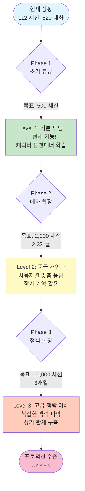

---

## 🎯 AI 학습 레벨별 요구사항

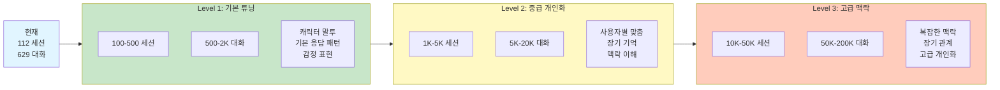

---

## 📅 데이터 수집 타임라인

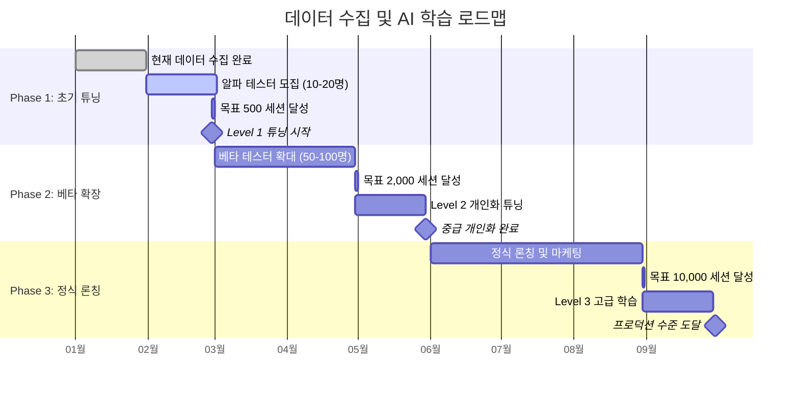

---

## 🔄 데이터 수집 전략

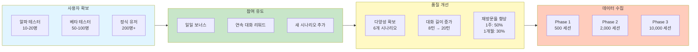

---

## 📊 현재 데이터 현황

### 기본 통계
```
전체 세션:        112개
전체 대화:        629개
평균 대화/세션:   8턴 (사용자 4턴 + AI 4턴)
```

### 데이터 구성
- **익명 세션**: 87개 (445개 대화)
- **사용자 세션**: 25개 (184개 대화)
- **시나리오**: 6개

---

## 🎯 AI 학습 단계별 필요 데이터 양

### Level 1: 기본 튜닝 (현재 가능)
**목표**: 기본 캐릭터 톤앤매너 학습

**필요 데이터**:
- ✅ 세션: 100~500개
- ✅ 대화: 500~2,000개
- 📈 **현재**: 112 세션, 629 대화

**학습 가능 항목**:
- 캐릭터별 말투
- 기본 응답 패턴
- 감정 표현

**결론**: ✅ **지금 바로 가능!**

---

### Level 2: 중급 개인화
**목표**: 사용자별 맞춤 응답, 장기 기억 활용

**필요 데이터**:
- 세션: 1,000~5,000개
- 대화: 5,000~20,000개
- 사용자별 평균 10회 이상 대화

**추가 필요량**:
- 📈 약 900개 세션 더 필요
- 📈 약 4,500개 대화 더 필요

**예상 수집 기간**:
- 10명 사용자 × 1일 1회 대화 = **3개월**
- 50명 사용자 × 1일 1회 대화 = **3주**

---

### Level 3: 고급 맥락 이해
**목표**: 복잡한 맥락 파악, 장기 관계 구축

**필요 데이터**:
- 세션: 10,000~50,000개
- 대화: 50,000~200,000개
- 사용자별 평균 50회 이상 대화

**추가 필요량**:
- 📈 약 10,000개 세션
- 📈 약 50,000개 대화

**예상 수집 기간**:
- 100명 사용자 × 1일 1회 = **3-4개월**
- 500명 사용자 × 1일 1회 = **3주**

---

## 📈 데이터 수집 로드맵

### Phase 1: 초기 튜닝 (현재)
```
목표 데이터: 500 세션, 2,500 대화
현재 진행: 112 세션 (22%)
남은 작업: 388 세션

예상 달성:
- 알파 테스터 10명 × 40회 = 400 세션 (1-2개월)
```

### Phase 2: 베타 확장
```
목표 데이터: 2,000 세션, 10,000 대화
예상 달성:
- 베타 유저 50명 × 40회 = 2,000 세션 (2-3개월)
```

### Phase 3: 정식 론칭
```
목표 데이터: 10,000 세션, 50,000 대화
예상 달성:
- 정식 유저 200명 × 50회 = 10,000 세션 (6개월)
```

---

## 🔬 학습 품질 vs 데이터 양

### 품질 점수 분류 기준

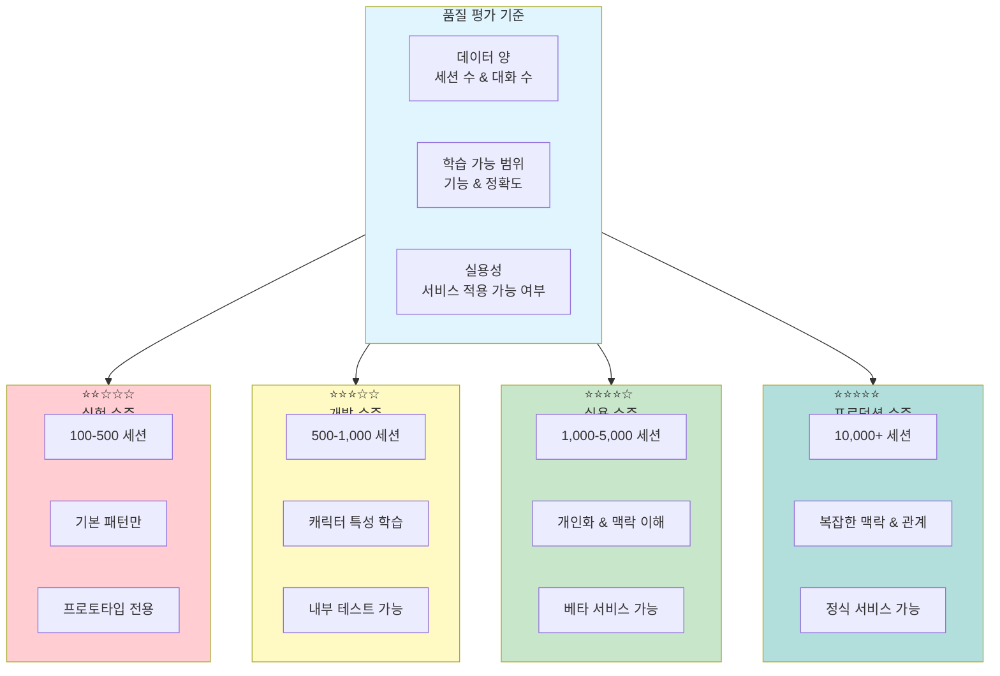

### 학습 항목별 점수 산정 방식

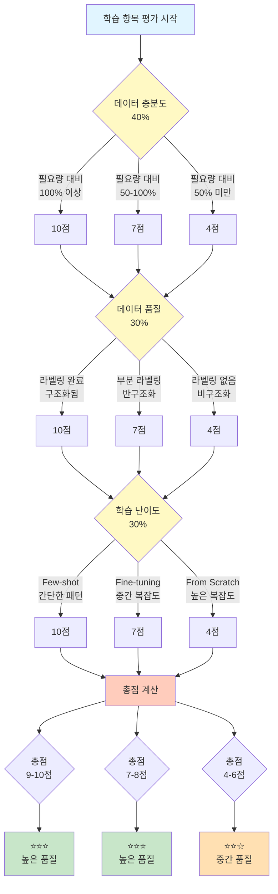

### 각 학습 항목별 점수 계산 상세

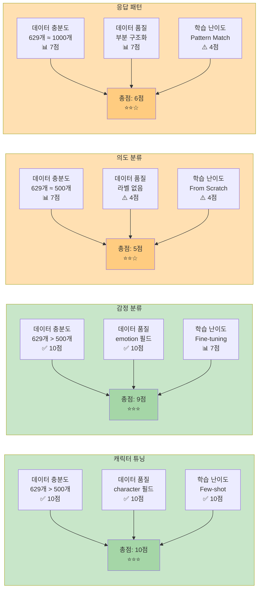

### 점수 계산 공식

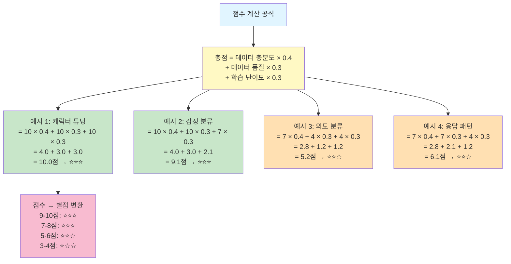

### 데이터 양과 품질의 상관관계

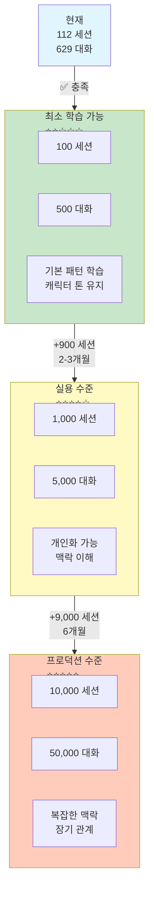

### 최소 학습 가능 데이터 (실험용)
```
세션:  100개
대화:  500개
결과:  기본 패턴 학습, 캐릭터 톤 유지
품질:  ⭐⭐☆☆☆
```

### 실용 수준 (서비스 가능)
```
세션:  1,000개
대화:  5,000개
결과:  개인화 가능, 맥락 이해
품질:  ⭐⭐⭐⭐☆
```

### 프로덕션 수준 (고품질)
```
세션:  10,000개
대화:  50,000개
결과:  복잡한 맥락, 장기 관계
품질:  ⭐⭐⭐⭐⭐
```

---

## 💡 데이터 품질 개선 전략

### 1. 다양성 확보

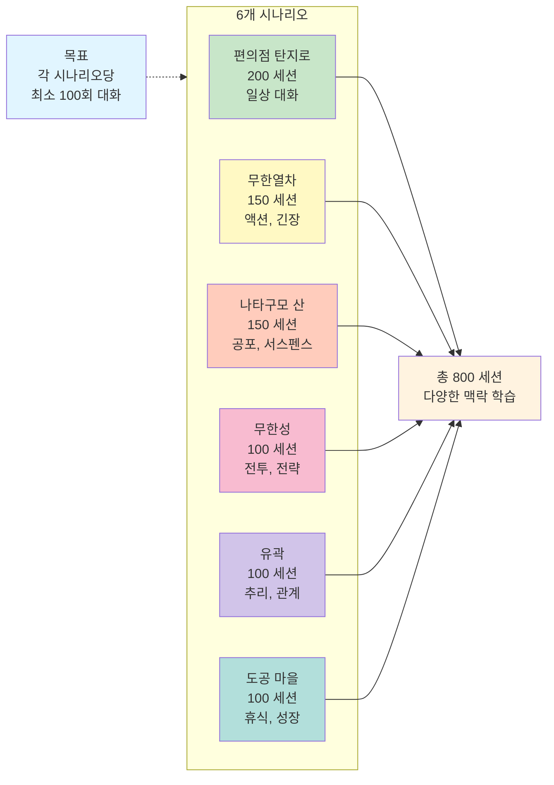

```
현재: 6개 시나리오
목표: 각 시나리오당 최소 100회 대화

시나리오별 목표:
- 편의점 탄지로:  200 세션 (일상 대화)
- 무한열차:        150 세션 (액션, 긴장)
- 나타구모 산:     150 세션 (공포, 서스펜스)
- 무한성:          100 세션 (전투, 전략)
- 유곽:            100 세션 (추리, 관계)
- 도공 마을:       100 세션 (휴식, 성장)
```

### 2. 대화 길이 증가
```
현재 평균: 8턴/세션
목표 평균: 20턴/세션

방법:
- 더 긴 시나리오 개발
- 사이드 퀘스트 추가
- 사용자 몰입도 향상
```

### 3. 사용자 유지율
```
목표: 1주일 내 재방문율 50%
     1개월 내 재방문율 30%

전략:
- 일일 보너스
- 연속 대화 리워드
- 새로운 시나리오 정기 추가
```

---

## 📊 데이터 수집 타임라인

### 1개월 차 (현재)
```
✅ 112 세션 수집 완료
목표: 500 세션
전략: 알파 테스터 모집 (10-20명)
```

### 2-3개월 차
```
목표: 2,000 세션
전략: 베타 테스터 확대 (50-100명)
학습: Level 2 개인화 튜닝 시작
```

### 6개월 차
```
목표: 10,000 세션
전략: 정식 론칭, 마케팅
학습: Level 3 고급 맥락 이해
```

---

## 🎯 즉시 실행 가능한 학습

### 현재 데이터로 할 수 있는 것

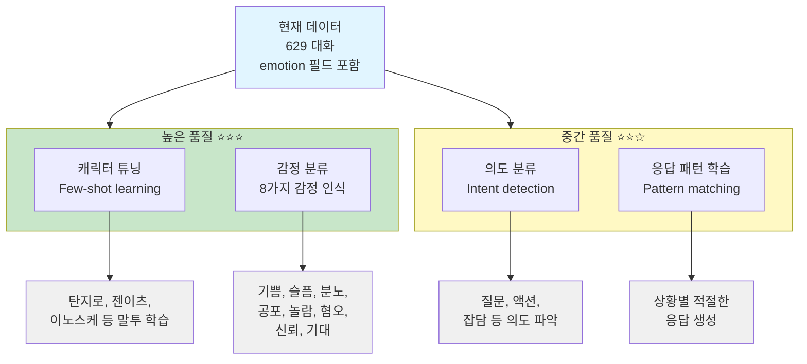

#### 1. 캐릭터 튜닝 (⭐⭐⭐)
```
데이터: 629 대화
방법: Few-shot learning
결과: 탄지로, 젠이츠, 이노스케 등 말투 학습
```

#### 2. 감정 분류 (⭐⭐⭐)
```
데이터: emotion 필드 (629개)
방법: 감정 분류 모델 학습
결과: 8가지 감정 인식 (기쁨, 슬픔, 분노, 공포, 놀람, 혐오, 신뢰, 기대)
```

#### 3. 의도 분류 (⭐⭐☆)
```
데이터: 629 대화
방법: Intent detection
결과: 사용자 의도 파악 (질문, 액션, 잡담 등)
```

#### 4. 응답 패턴 학습 (⭐⭐☆)
```
데이터: 629 대화
방법: Pattern matching
결과: 상황별 적절한 응답 생성
```

---

## 📝 권장 사항

### 단기 (1개월)
1. ✅ **현재 데이터로 Level 1 튜닝 시작**
2. 알파 테스터 10-20명 모집
3. 목표: 500 세션 달성

### 중기 (3개월)
1. 베타 테스터 50-100명 확대
2. Level 2 개인화 튜닝
3. 목표: 2,000 세션 달성

### 장기 (6개월)
1. 정식 론칭
2. Level 3 고급 학습
3. 목표: 10,000 세션 달성

---

## 🎯 결론

### 현재 상황: ✅ 학습 시작 가능!
```
보유 데이터: 112 세션, 629 대화
필요 데이터: 100 세션, 500 대화 (Level 1)
상태: 충족 ✅
```

### 다음 목표
```
Level 2 도달: 1,000 세션
현재 진행: 11%
필요 작업: 약 900 세션 추가 수집
예상 기간: 2-3개월 (50명 유저 기준)
```

### 추천
**지금 바로 Level 1 튜닝을 시작하고, 동시에 유저 모집을 진행하세요!**

---

**작성일**: 2025-11-03
**다음 검토**: 1개월 후 (500 세션 달성 시)
