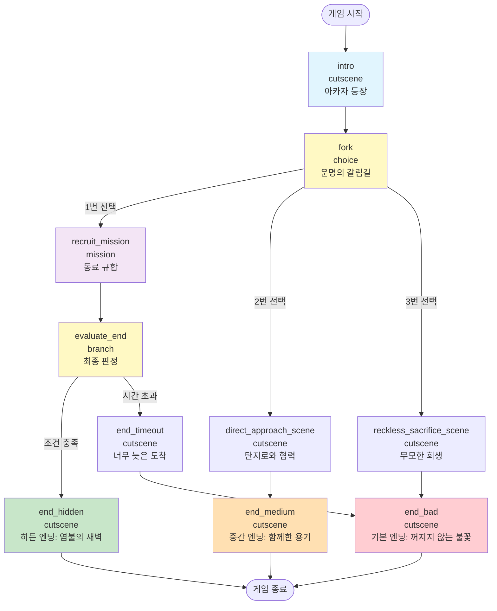

# 📊 JSON Scenario Schema 완전 분석

**대상 파일**: `cutscene5_akaza_encounter.json`
**분석 일시**: 2025-10-04
**목적**: 시나리오 JSON 구조 이해 및 스테이지 흐름 다이어그램 생성

---

## 🗂️ 최상위 구조

```json
{
  "scenario_id": "cutscene5_akaza",
  "title": "컷신5: 상현 삼의 등장",
  "description": "...",
  "stages": {
    "intro": {...},
    "fork": {...},
    "recruit_mission": {...},
    "evaluate_end": {...},
    "end_hidden": {...},
    "end_medium": {...},
    "end_bad": {...},
    ...
  }
}
```

**필드 설명**:
- `scenario_id`: 시나리오 고유 식별자
- `title`: 시나리오 제목
- `description`: 시나리오 설명
- `stages`: 모든 스테이지 정의 (key-value 딕셔너리)

---

## 🎬 Stage 타입별 스키마

### 1. cutscene (컷신 타입)

**용도**: 스토리 자동 진행, 대사만 출력

```json
{
  "type": "cutscene",
  "title": "찰나의 안도, 그리고 최악의 절망",
  "max_turns": 6,
  "dialogues": [
    {
      "turn": 0,
      "speaker": "system",
      "content": "...",
      "emotion": "neutral",
      "image": "scene5_crashed_train"
    },
    {
      "turn": 0,
      "speaker": "tanjiro",
      "content": "{{user}}!! 괜찮아?!",
      "emotion": "worried",
      "image": "tanjiro_worried"
    }
  ],
  "next_stage": "fork",
  "ending_type": "hidden",  // 엔딩 스테이지에만
  "achievement": "기적의 공조"  // 엔딩 스테이지에만
}
```

**필드 설명**:
- `type`: `"cutscene"` (고정)
- `title`: 컷신 제목
- `max_turns`: 최대 턴 수
- `dialogues`: 대사 배열
  - `turn`: 턴 번호 (0부터 시작, **같은 턴에 여러 대사 가능**)
  - `speaker`: 발화자 (system, tanjiro, rengoku, akaza, user 등)
  - `content`: 대사 내용 (`{{user}}`는 플레이어 이름으로 치환)
  - `emotion`: 감정 (neutral, worried, shocked, determined 등)
  - `image`: 이미지 파일명 (선택)
- `next_stage`: 다음 스테이지 ID
- `ending_type`: 엔딩 타입 (hidden, normal, medium)
- `achievement`: 업적명

**특징**:
- 한 턴에 여러 캐릭터 발화 가능 (멀티 화자 시스템)
- 자동 진행 (유저 입력은 "계속" 등으로 턴 넘김)

---

### 2. choice (선택지 타입)

**용도**: 유저에게 선택지 제공, 분기 처리

```json
{
  "type": "choice",
  "title": "운명의 갈림길",
  "context": "아카자가 자세를 낮추자...",
  "tanjiro_hint": "{{user}}, 빨리 결정해야 해!...",
  "pre_choice_dialogues": [
    {
      "speaker": "system",
      "content": "...",
      "emotion": "tense"
    },
    {
      "speaker": "tanjiro",
      "content": "{{user}}! 렌고쿠 씨가 위험해!",
      "emotion": "urgent"
    }
  ],
  "choices": [
    {
      "id": "recruit_allies",
      "text": "1) 동료들을 찾아 함께 싸운다",
      "description": "이노스케와 젠이츠를 찾아...",
      "preview": "🎯 최선의 선택 | ⏰ 시간 필요 | 👥 동료 모집 필수",
      "intent_keywords": ["동료", "함께", "모집", "찾", "이노스케", "젠이츠", "합류", "힘을 합", "팀", "1", "첫"],
      "next_stage": "recruit_mission",
      "affinity_changes": {
        "tanjiro": 10,
        "rengoku": 5
      },
      "flags_add": ["chose_teamwork", "strategic_decision"]
    },
    {
      "id": "direct_approach",
      "text": "2) 탄지로와 둘이서 바로 돕는다",
      "description": "...",
      "preview": "⚡ 빠른 선택 | ⚔️ 위험도 중간 | 💪 탄지로와 협력",
      "intent_keywords": ["탄지로", "둘", "같이", "바로", "즉시", "빨리", "2", "둘째"],
      "next_stage": "direct_approach_scene",
      "affinity_changes": {
        "tanjiro": 20,
        "rengoku": 10
      },
      "flags_add": ["chose_direct", "quick_decision"]
    }
  ]
}
```

**필드 설명**:
- `type`: `"choice"` (고정)
- `title`: 선택지 단계 제목
- `context`: 상황 설명
- `tanjiro_hint`: 탄지로 가이드 메시지
- `pre_choice_dialogues`: 선택지 제시 전 대화 (배열)
- `choices`: 선택지 배열
  - `id`: 선택지 고유 ID
  - `text`: 선택지 텍스트
  - `description`: 선택지 상세 설명
  - `preview`: 선택지 미리보기 (이모지 포함)
  - `intent_keywords`: 유저 입력 키워드 매칭용 (배열)
  - `next_stage`: 선택 시 이동할 스테이지 ID
  - `affinity_changes`: 친밀도 변화 (딕셔너리)
  - `flags_add`: 추가할 플래그 (배열)

**특징**:
- `intent_keywords`로 자연어 입력 매칭
- 친밀도 및 플래그 자동 업데이트

---

### 3. mission (미션 타입)

**용도**: 복잡한 다층 임무 (여러 캐릭터 순차 설득 등)

```json
{
  "type": "mission",
  "title": "동료 규합 (다층적 턴제 임무)",
  "max_turns": 6,
  "objective": "이노스케와 젠이츠를 순서대로 설득하여 합류시킨다",
  "hint_dialogues": [
    {
      "speaker": "tanjiro",
      "content": "앞쪽 칸에서는 거칠고 야생적인 냄새가...",
      "emotion": "urgent"
    }
  ],
  "characters": {
    "inosuke": {
      "location": "front_car",
      "description": "열차 앞쪽 칸, 이노스케가...",
      "conversation_stages": [
        {
          "stage": 0,
          "name": "first_encounter",
          "greeting": {
            "speaker": "inosuke",
            "content": "뭐야! 누구냐!",
            "emotion": "aggressive"
          },
          "required_keywords": ["이노스케", "앞", "돼지", "멧돼지"],
          "success_response": {
            "speaker": "inosuke",
            "content": "크하하! 나를 찾아온 건가!",
            "emotion": "excited"
          },
          "failure_response": {
            "speaker": "inosuke",
            "content": "뭐야! 말을 걸 거면 제대로 걸어!",
            "emotion": "annoyed"
          }
        },
        {
          "stage": 1,
          "name": "provocation",
          "required_keywords": ["약", "못", "겁쟁", "도망", "비겁", "지"],
          "success_response": {...},
          "tanjiro_support": {
            "speaker": "tanjiro",
            "content": "이노스케! 우린 지금 정말 네 힘이 필요해!",
            "emotion": "urgent"
          },
          "failure_response": {...}
        },
        {
          "stage": 2,
          "name": "final_persuasion",
          "required_keywords": ["함께", "싸우자", "도와", "필요", "강한", "증명"],
          "success_response": {
            "speaker": "inosuke",
            "content": "크아아악! 좋아! 이 몸의 힘을 보여주지!",
            "emotion": "determined"
          },
          "success_flag": "inosuke_recruited",
          "failure_response": {...}
        }
      ],
      "max_attempts": 5,
      "turn_cost": 1,
      "affinity_bonus": 30,
      "correct_order": 1
    },
    "zenitsu": {
      "location": "back_car",
      "description": "...",
      "conversation_stages": [...],
      "max_attempts": 5,
      "turn_cost": 1,
      "affinity_bonus": 30,
      "correct_order": 2
    }
  },
  "crisis_messages": [
    "멀리서 강철이 부딪히는 굉음이...",
    "땅이 크게 울리며, 렌고쿠의 고통스러운 신음 소리가...",
    "아카자의 광기 어린 웃음소리와 함께..."
  ],
  "next_stage": "evaluate_end"
}
```

**필드 설명**:
- `type`: `"mission"` (고정)
- `title`: 미션 제목
- `max_turns`: 최대 턴 제한
- `objective`: 미션 목표
- `hint_dialogues`: 미션 시작 시 힌트 대화
- `characters`: 설득 대상 캐릭터 딕셔너리
  - `location`: 캐릭터 위치
  - `description`: 상황 설명
  - `conversation_stages`: 대화 단계 배열 (0 → 1 → 2)
    - `stage`: 단계 번호
    - `name`: 단계 이름
    - `greeting`: 첫 만남 대사 (stage 0에만)
    - `required_keywords`: 성공 키워드
    - `success_response`: 성공 시 응답
    - `failure_response`: 실패 시 응답
    - `tanjiro_support`: 탄지로 지원 대사 (선택)
    - `success_flag`: 완료 플래그 (마지막 stage에만)
  - `max_attempts`: 최대 시도 횟수
  - `turn_cost`: 턴당 비용
  - `affinity_bonus`: 성공 시 친밀도 보너스
  - `correct_order`: 올바른 순서 (1, 2, ...)
- `crisis_messages`: 시간 경과 위기 메시지 (배열)
- `next_stage`: 다음 스테이지 ID

**특징**:
- 다층 대화 단계 (stage 0 → 1 → 2)
- 키워드 매칭으로 진행
- 순서대로 완료해야 히든 엔딩 가능

---

### 4. branch (분기 타입)

**용도**: 조건에 따라 다른 엔딩으로 분기

```json
{
  "type": "branch",
  "title": "최종 판정",
  "branches": [
    {
      "id": "hidden_ending",
      "description": "전체 6턴 내에 이노스케, 젠이츠 순서대로 모두 합류",
      "conditions": [
        "recruited_allies_in_order",
        "within_turns",
        "high_affinity_inosuke",
        "high_affinity_zenitsu"
      ],
      "next_stage": "end_hidden"
    },
    {
      "id": "timeout_ending",
      "description": "시간 초과 또는 순서 오류",
      "conditions": ["default"],
      "next_stage": "end_timeout"
    }
  ]
}
```

**필드 설명**:
- `type`: `"branch"` (고정)
- `title`: 분기 제목
- `branches`: 분기 조건 배열
  - `id`: 분기 ID
  - `description`: 분기 설명
  - `conditions`: 조건 배열 (AND 연산)
    - `recruited_allies_in_order`: 동료 순서대로 모집
    - `within_turns`: 턴 제한 내
    - `high_affinity_X`: X 캐릭터 친밀도 높음
    - `default`: 기본 조건 (항상 true)
  - `next_stage`: 조건 충족 시 이동 스테이지

**특징**:
- 위에서 아래로 조건 체크 (첫 매칭만 실행)
- `default`는 마지막에 배치 (else 역할)

---

## 🔄 스테이지 흐름 다이어그램



---

## 📋 스테이지 관계 테이블

| 스테이지 ID | 타입 | 다음 스테이지 | 조건 |
|------------|------|--------------|------|
| `intro` | cutscene | `fork` | 자동 (max_turns 도달) |
| `fork` | choice | `recruit_mission` / `direct_approach_scene` / `reckless_sacrifice_scene` | 선택지 |
| `recruit_mission` | mission | `evaluate_end` | 미션 완료 or 시간 초과 |
| `evaluate_end` | branch | `end_hidden` / `end_timeout` | 조건 분기 |
| `direct_approach_scene` | cutscene | `end_medium` | 자동 |
| `reckless_sacrifice_scene` | cutscene | `end_bad` | 자동 |
| `end_timeout` | cutscene | `end_bad` | 자동 |
| `end_hidden` | cutscene | (종료) | - |
| `end_medium` | cutscene | (종료) | - |
| `end_bad` | cutscene | (종료) | - |

---

## 🏆 엔딩 조건 정리

### 1. 히든 엔딩 (end_hidden)
**경로**: `intro → fork → recruit_mission → evaluate_end → end_hidden`

**조건**:
- ✅ `recruit_allies` 선택 (fork에서 1번)
- ✅ 6턴 이내에 이노스케, 젠이츠 순서대로 모두 설득
- ✅ 이노스케 친밀도 30+ (설득 성공 시 자동)
- ✅ 젠이츠 친밀도 30+ (설득 성공 시 자동)

**플래그**:
- `chose_teamwork`
- `strategic_decision`
- `inosuke_recruited`
- `zenitsu_recruited`

**업적**: "기적의 공조"

---

### 2. 중간 엔딩 (end_medium)
**경로**: `intro → fork → direct_approach_scene → end_medium`

**조건**:
- ✅ `direct_approach` 선택 (fork에서 2번)

**플래그**:
- `chose_direct`
- `quick_decision`

**업적**: "용기있는 협력"

---

### 3. 기본 엔딩 (end_bad)
**경로 1**: `intro → fork → reckless_sacrifice_scene → end_bad`
**경로 2**: `intro → fork → recruit_mission → evaluate_end → end_timeout → end_bad`

**조건**:
- ⚠️ `reckless_sacrifice` 선택 (fork에서 3번) OR
- ⚠️ 시간 초과 (6턴 내 미션 실패)

**플래그**:
- `chose_sacrifice` (경로 1)
- `reckless_courage` (경로 1)

**업적**: "꺼지지 않는 불꽃"

---

## 🎯 히든 엔딩 공략 가이드

### 1단계: fork 선택지
**입력**: `"동료들을 찾아 함께 싸운다"` or `"1"` or `"동료"` or `"함께"`

### 2단계: recruit_mission (턴 제한 6)
**턴 0**: "이노스케" 입력 → first_encounter
**턴 1**: "약한 녀석" 입력 → provocation
**턴 2**: "함께 싸우자 강한 녀석" 입력 → final_persuasion (inosuke_recruited)
**턴 3**: "젠이츠" 입력 → sleeping
**턴 4**: "네즈코 위험" 입력 → waking_up
**턴 5**: "함께 지키자" 입력 → final_persuasion (zenitsu_recruited)

### 3단계: evaluate_end
**자동 분기**: 조건 충족 → `end_hidden`

---

## 🔑 핵심 JSON 패턴 정리

### 패턴 1: 멀티 화자 (같은 턴에 여러 발화)
```json
"dialogues": [
  {"turn": 0, "speaker": "system", "content": "..."},
  {"turn": 0, "speaker": "tanjiro", "content": "..."},  // 같은 턴!
  {"turn": 1, "speaker": "rengoku", "content": "..."}
]
```

### 패턴 2: 키워드 매칭
```json
"intent_keywords": ["동료", "함께", "모집", "1"]
// 유저 입력에 하나라도 포함되면 매칭
```

### 패턴 3: 플래그 기반 조건
```json
"flags_add": ["chose_teamwork"],
"conditions": ["recruited_allies_in_order", "within_turns"]
```

### 패턴 4: 친밀도 변화
```json
"affinity_changes": {
  "tanjiro": 10,
  "rengoku": 5
}
```

---

## 📝 확장 시 주의사항

1. **next_stage 필수**: 모든 cutscene/choice/mission은 `next_stage` 지정 필요
2. **턴 번호 연속성**: dialogues의 turn은 0부터 시작, 연속적일 필요 없음
3. **키워드 중복 회피**: intent_keywords는 선택지별로 겹치지 않게
4. **플래그 명명**: 동사_명사 형식 (`chose_teamwork`, `inosuke_recruited`)
5. **조건 순서**: branch의 conditions는 위에서 아래로 체크 (default는 마지막)

---

**작성 완료**: 2025-10-04
**다음 단계**: 실전 기능 구현 (이모지 자동 삽입, 선택지 개선)
