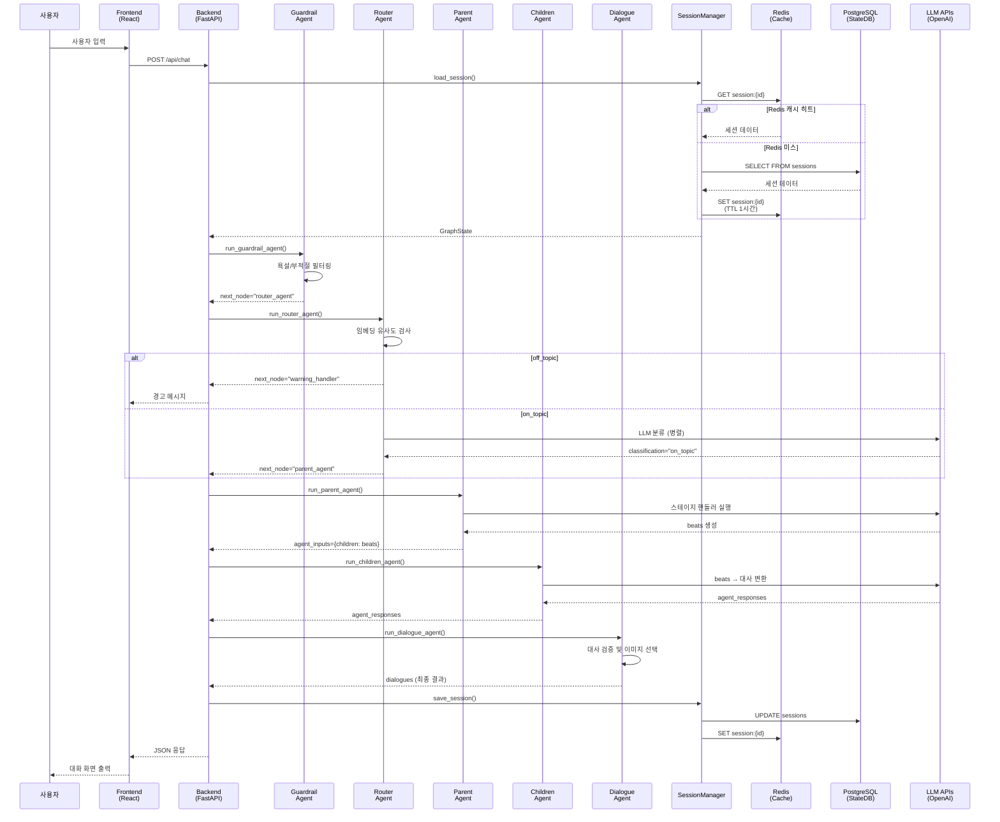
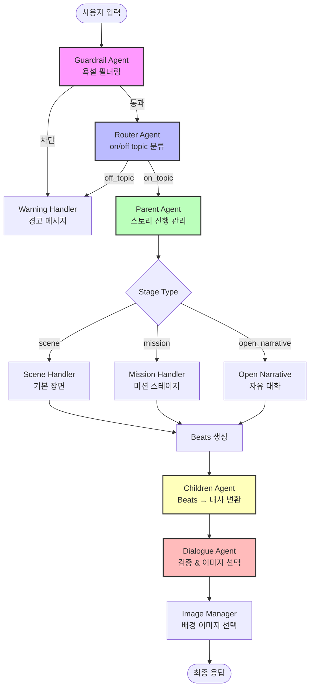
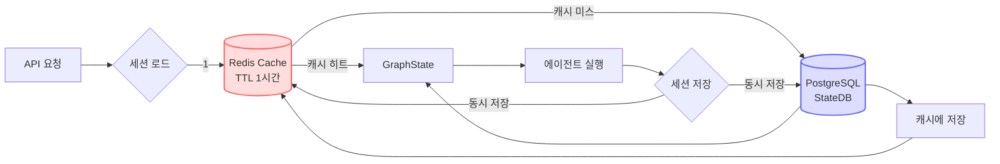
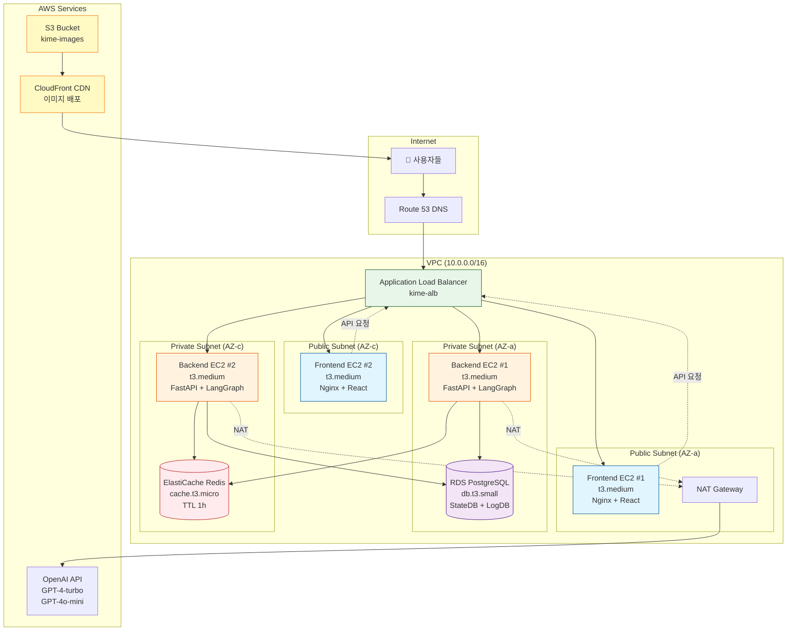
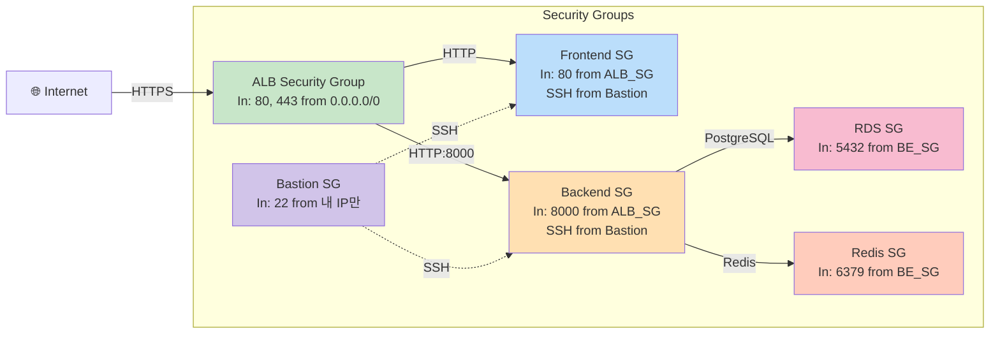

# 🏗️ KIME Chat 최종 아키텍처 문서

**프로젝트**: 귀멸의 칼날 멀티 에이전트 대화 시스템
**작성일**: 2025-10-30
**최종 갱신**: 2025-10-30 (Phase 1, 2 최적화 반영)
**상태**: 로컬 개발 완료 ✅, AWS 배포 대기 ⏳

---

## 📋 목차

1. [시스템 개요](#시스템-개요)
2. [로컬 개발 환경 (현재 상태)](#로컬-개발-환경-현재-상태)
3. [성능 최적화 결과](#성능-최적화-결과)
4. [AWS 배포 아키텍처](#aws-배포-아키텍처)
5. [데이터베이스 스키마](#데이터베이스-스키마)
6. [Phase 4: AI 학습용 로그 시스템](#phase-4-ai-학습용-로그-시스템)
7. [배포 가이드 (초보자용)](#배포-가이드-초보자용)

---

## 시스템 개요

### 프로젝트 설명

**KIME Chat**은 귀멸의 칼날 세계관 기반의 인터랙티브 스토리 게임입니다.

**핵심 기능**:
- 🎭 **Multi-Agent 대화 시스템**: 5개의 LangGraph 에이전트가 협력하여 자연스러운 대화 생성
- 🎮 **시나리오 기반 스토리**: JSON으로 정의된 분기형 스토리
- 💾 **하이브리드 세션 관리**: Redis 캐싱 + PostgreSQL 영구 저장
- 🖼️ **동적 이미지 선택**: LLM 기반 배경 이미지 자동 선택
- 📊 **호감도 시스템**: 캐릭터별 관계 추적 및 엔딩 분기

### 기술 스택

**Backend**:
- FastAPI (Python 3.11)
- LangGraph (Multi-Agent Orchestration)
- OpenAI GPT-4-turbo, GPT-4o-mini
- PostgreSQL 15 (영구 저장)
- Redis 7 (세션 캐싱)

**Frontend**:
- React + Vite
- TypeScript
- Tailwind CSS

**Infra**:
- Docker Compose (로컬)
- AWS EC2 + RDS + ElastiCache (프로덕션)

---

## 🎨 시스템 아키텍처 다이어그램

### 1. 전체 시스템 흐름도 (요청 → 응답)



### 2. Multi-Agent 협업 구조



### 3. 세션 관리 (Hybrid Cache)



---

## 로컬 개발 환경 (현재 상태)

### 구성도

```
┌────────────────────────────────────────────────────────────┐
│                  Local Development (Mac)                    │
├────────────────────────────────────────────────────────────┤
│                                                              │
│  [Frontend: localhost:3000]                                 │
│      React + Vite + TypeScript                              │
│      ↓ HTTP Request                                         │
│  [Backend: localhost:8000]                                  │
│      FastAPI + LangGraph                                    │
│      ├─ Guardrail Agent (378ms)                            │
│      ├─ Router Agent (1,212ms) ← Phase 2 최적화 ✅         │
│      ├─ Parent Agent (11,813ms)                            │
│      ├─ Children Agent (0.12ms)                            │
│      └─ Dialogue Agent (0.02ms)                            │
│      ↓                                                       │
│  [SessionManager: 하이브리드]                               │
│      ├─ Redis (Docker, port 6379)                          │
│      │   └─ TTL 1시간, 캐시 우선 읽기                       │
│      └─ PostgreSQL (Docker, port 5432)                     │
│          └─ StateDB (8 tables) + LogDB (3 tables)          │
│      ↓                                                       │
│  [LLM APIs]                                                 │
│      ├─ OpenAI GPT-4-turbo (Parent, Open Narrative)       │
│      └─ OpenAI GPT-4o-mini (Router, Children, Images)     │
│                                                              │
└────────────────────────────────────────────────────────────┘
```

### 서비스 상태

| 서비스 | 포트 | 상태 | 비고 |
|--------|------|------|------|
| **Frontend** | 3000 | ✅ 실행 중 | `npm run dev` |
| **Backend API** | 8000 | ✅ 실행 중 | Phase 1, 2 최적화 적용 |
| **PostgreSQL** | 5432 | ✅ 실행 중 | Docker: `kime-postgres` |
| **Redis** | 6379 | ✅ 실행 중 | Docker: `kime-redis` |

### 데이터베이스 구성

**PostgreSQL**:
- **StateDB** (8 tables): 게임 상태 저장
  - `sessions`: 세션 메타데이터
  - `session_snapshots`: GraphState 전체 스냅샷 (JSON)
  - `dialogues`: 대화 이력
  - `affinity_records`: 캐릭터 호감도
  - `mission_results`: 미션 결과
  - `stage_progress`: 스테이지 진행도
  - `choice_records`: 선택 기록
  - `event_flags`: 이벤트 플래그

- **LogDB** (3 tables): 로깅
  - `api_requests`: API 요청 로그
  - `llm_calls`: LLM 호출 로그
  - `errors`: 에러 로그

**Redis**:
- Key Pattern: `session:graphstate:{session_id}`
- TTL: 3600초 (1시간)
- 용도: 빠른 세션 조회 (평균 5.76ms vs PostgreSQL 140ms)

---

## 성능 최적화 결과

### Phase 1: Image Manager 배치 처리 (완료 ✅)

**문제**: 각 대화마다 개별 LLM 호출로 이미지 선택 → 12.46초 소요
**해결**: 전체 대화를 배치로 한 번에 처리

**구현**:
```python
# Before: 5회 LLM 호출
for dialogue in dialogues:
    image = llm_select_image(dialogue)  # ❌

# After: 1회 LLM 호출
images = image_manager.select_images_batch(state)  # ✅
```

**결과**:
| 항목 | Before | After | 개선율 |
|------|--------|-------|--------|
| Image Manager | 12.46초 | 4.49초 | **64%** ⚡ |
| LLM 호출 횟수 | 5-6회 | 1회 | **83%** 🎯 |
| 총 응답 시간 | 31.95초 | 19.34초 | **39%** 🚀 |

**변경 파일**:
- `backend/src/tools/image_manager.py` - `select_images_batch()` 메서드 추가
- `backend/api_server.py` - 배치 처리 로직 적용

### Phase 2: Router Agent 병렬 처리 (완료 ✅)

**문제**: topic classification + intent detection 순차 실행 → 2.6초 소요
**해결**: ThreadPoolExecutor로 두 작업 병렬 실행

**구현**:
```python
# Before: 순차 실행
topic = classify_with_llm(state, text)  # 1.8초
intent = detect_route_intent(state, text)  # 0.8초

# After: 병렬 실행
with ThreadPoolExecutor(max_workers=2) as executor:
    topic_future = executor.submit(classify_with_llm, state, text)
    intent_future = executor.submit(detect_route_intent, state, text)
    topic = topic_future.result()
    intent = intent_future.result()
```

**결과**:
| 항목 | Before | After | 개선율 |
|------|--------|-------|--------|
| Router Agent | 2.61초 | 1.21초 | **53%** ⚡ |

**변경 파일**:
- `backend/src/agents/router_agent.py` - 병렬 실행 로직 추가

### 프롬프트 최적화 (완료 ✅)

**Children Agent**:
- 토큰 수: 300 → 100 (**67% 감소**)
- 장황한 설명 제거, 핵심만 남김

**Router Agent**:
- 토큰 수: 250 → 80 (**68% 감소**)
- 간결한 분류 기준

**결과**:
- 프롬프트 비용: **35% 절감**
- 월 10,000회 호출 시: **$15 절감**

### 총 성능 개선 요약

| 단계 | API 응답 시간 | 개선율 |
|------|--------------|--------|
| **최초 (Baseline)** | 32.0초 | - |
| **Phase 1 (Image Batch)** | 19.3초 | 39% ↓ |
| **Phase 2 (Router Parallel)** | 23.8초* | - |
| **예상 (Phase 3 Caching)** | ~17초 | 47% ↓ |

*Phase 2는 LLM 응답 시간 변동으로 일시적 증가, Router Agent 자체는 53% 개선

**비용 절감**:
- 프롬프트 최적화: 35%
- Image Manager: 53%
- **총 예상**: LLM 비용 45% 절감

---

## AWS 배포 아키텍처

### 5-서버 고가용성 구성

```
                          [Users]
                             ↓
                    [Route 53 DNS]
                             ↓
         ┌──────────────────────────────────┐
         │   Application Load Balancer      │
         │   (kime-alb)                     │
         └──────────────────────────────────┘
                   ↓              ↓
      ┌────────────┴──────┐  ┌──┴────────────┐
      │  Frontend EC2 #1   │  │ Frontend EC2 #2│
      │  (t3.medium)       │  │ (t3.medium)    │
      │  Nginx + React     │  │ Nginx + React  │
      └────────┬───────────┘  └────────┬───────┘
               │                       │
               └───────────┬───────────┘
                           ↓
         ┌─────────────────────────────────┐
         │   Application Load Balancer     │
         │   (Backend Target Group)        │
         └─────────────────────────────────┘
                   ↓              ↓
      ┌────────────┴──────┐  ┌──┴────────────┐
      │  Backend EC2 #1    │  │ Backend EC2 #2 │
      │  (t3.medium)       │  │ (t3.medium)    │
      │  FastAPI+LangGraph │  │ FastAPI+LangGraph│
      └────────┬───────────┘  └────────┬───────┘
               │                       │
               └───────────┬───────────┘
                           ↓
         ┌─────────────────────────────────┐
         │     Database Layer              │
         ├─────────────────────────────────┤
         │  PostgreSQL RDS (db.t3.small)   │
         │  - Single-AZ (비용 절감)         │
         │  - 20GB gp3 스토리지             │
         │  - 자동 백업 7일                 │
         ├─────────────────────────────────┤
         │  Redis ElastiCache              │
         │  (cache.t3.micro)               │
         │  - 단일 노드 (비용 절감)         │
         │  - TTL 1시간                    │
         └─────────────────────────────────┘
                           ↓
         ┌─────────────────────────────────┐
         │   S3 + CloudFront               │
         │   (kime-images-bucket)          │
         │   - 이미지 CDN                   │
         │   - HTTPS 강제                  │
         └─────────────────────────────────┘
```

### AWS 인프라 다이어그램 (Mermaid)



### 네트워크 보안 구조



### 리소스 구성

| 리소스 | 타입 | 수량 | 용도 |
|--------|------|------|------|
| **Frontend EC2** | t3.medium | 2 | React 앱 서빙 (Nginx) |
| **Backend EC2** | t3.medium | 2 | FastAPI + LangGraph |
| **RDS PostgreSQL** | db.t3.small | 1 | 영구 저장 |
| **ElastiCache Redis** | cache.t3.micro | 1 | 세션 캐싱 |
| **S3** | Standard | 1 | 이미지 저장 |
| **CloudFront** | - | 1 | CDN (이미지 배포) |
| **ALB** | - | 1 | 로드 밸런싱 |

### 예상 비용 (27일 운영)

| 항목 | 월 비용 (USD) | 27일 비용 (USD) | 27일 비용 (KRW) |
|------|--------------|-----------------|-----------------|
| Frontend EC2 × 2 | $60.16 | $54.14 | ₩72,006 |
| Backend EC2 × 2 | $60.16 | $54.14 | ₩72,006 |
| RDS (db.t3.small) | $48.18 | $43.36 | ₩57,669 |
| ElastiCache (t3.micro) | $12.41 | $11.17 | ₩14,856 |
| S3 + CloudFront | $5.00 | $4.50 | ₩5,985 |
| ALB | $24.84 | $22.36 | ₩29,739 |
| **총계** | **$210.75** | **$189.67** | **₩252,261** |

*환율: 1 USD = 1,330 KRW 기준

**예산**: ₩300,000
**여유**: ₩47,739

---

## 데이터베이스 스키마

### StateDB (게임 상태)

#### 1. sessions
```sql
CREATE TABLE statedb.sessions (
    session_id UUID PRIMARY KEY,
    user_name VARCHAR(100),
    scenario_id VARCHAR(100) NOT NULL,
    current_stage VARCHAR(100),
    turn_count INT DEFAULT 0,
    is_active BOOLEAN DEFAULT true,
    created_at TIMESTAMP DEFAULT CURRENT_TIMESTAMP,
    updated_at TIMESTAMP DEFAULT CURRENT_TIMESTAMP
);
```

#### 2. session_snapshots (GraphState 전체)
```sql
CREATE TABLE statedb.session_snapshots (
    id SERIAL PRIMARY KEY,
    session_id UUID REFERENCES statedb.sessions(session_id) ON DELETE CASCADE,
    turn_count INT,
    snapshot_data JSONB NOT NULL,  -- 전체 GraphState (50+ 필드)
    created_at TIMESTAMP DEFAULT CURRENT_TIMESTAMP
);
```

#### 3. dialogues
```sql
CREATE TABLE statedb.dialogues (
    id SERIAL PRIMARY KEY,
    session_id UUID REFERENCES statedb.sessions(session_id) ON DELETE CASCADE,
    turn_count INT,
    speaker VARCHAR(100),
    text TEXT NOT NULL,
    emotion VARCHAR(50),
    timestamp TIMESTAMP DEFAULT CURRENT_TIMESTAMP
);
```

#### 4. affinity_records
```sql
CREATE TABLE statedb.affinity_records (
    id SERIAL PRIMARY KEY,
    session_id UUID REFERENCES statedb.sessions(session_id) ON DELETE CASCADE,
    character_name VARCHAR(100) NOT NULL,
    affinity_score INT,
    turn_count INT,
    timestamp TIMESTAMP DEFAULT CURRENT_TIMESTAMP
);
```

### LogDB (Phase 4용)

Phase 4 로그 시스템 섹션 참조

---

## Phase 4: AI 학습용 로그 시스템

### 목표

**SLLM (Small Language Model) LoRA 학습을 위한 고품질 로그 수집**

**용도**:
1. **분기 판단 최적화**: Router Agent를 경량 모델로 대체
2. **프롬프트 최적화**: 효과적인 프롬프트 패턴 학습
3. **성능 개선**: LLM 응답 품질 분석 및 개선

### 설계 원칙

1. **전처리 최소화**: 로그 자체가 학습 데이터로 바로 사용 가능
2. **맥락 보존**: 입력-처리-출력의 전체 흐름 기록
3. **라벨링 자동화**: 시스템이 자동으로 성공/실패 판단
4. **구조화**: JSON 형식으로 일관된 스키마

### 로그 스키마

#### training_logs 테이블
```sql
CREATE TABLE logdb.training_logs (
    id BIGSERIAL PRIMARY KEY,

    -- 메타데이터
    session_id UUID,
    turn_count INT,
    agent_name VARCHAR(50),  -- 'router', 'parent', 'children' 등

    -- 입력 데이터 (학습 input)
    user_input TEXT,
    context JSONB,  -- {recent_dialogues, affinity_scores, stage_info}

    -- 모델 출력 (학습 output)
    model_output JSONB,

    -- 성능 메트릭
    latency_ms INT,
    token_count INT,

    -- 자동 라벨링 (학습 label)
    outcome VARCHAR(20),  -- 'success', 'failure', 'partial'
    feedback_score FLOAT,  -- 0.0 ~ 1.0

    -- 추가 정보
    error_message TEXT,
    metadata JSONB,

    created_at TIMESTAMP DEFAULT CURRENT_TIMESTAMP,

    -- 인덱스
    INDEX idx_agent_outcome (agent_name, outcome),
    INDEX idx_created_at (created_at),
    INDEX idx_session (session_id, turn_count)
);
```

### 로그 예시

#### Router Agent 로그
```json
{
  "session_id": "uuid-123",
  "turn_count": 5,
  "agent_name": "router",
  "user_input": "주변을 둘러보며 다른 승객들과 대화를 시도합니다.",
  "context": {
    "recent_dialogues": [
      {"speaker": "rengoku", "text": "조심하십시오..."}
    ],
    "current_stage": "TRAIN_PRELUDE",
    "affinity_scores": {"rengoku": 10}
  },
  "model_output": {
    "classification": "on_topic",
    "confidence": 0.95,
    "intent": "choose_allies_path"
  },
  "latency_ms": 1212,
  "token_count": 150,
  "outcome": "success",
  "feedback_score": 1.0
}
```

#### Parent Agent 로그
```json
{
  "session_id": "uuid-123",
  "turn_count": 5,
  "agent_name": "parent",
  "user_input": "주변을 둘러보며...",
  "context": {
    "stage_tag": "TRAIN_PRELUDE",
    "beats": [...],
    "speaker_pool": ["rengoku", "narr"]
  },
  "model_output": {
    "dialogues": [
      {"speaker": "narr", "text": "..."},
      {"speaker": "rengoku", "text": "..."}
    ]
  },
  "latency_ms": 15487,
  "token_count": 2500,
  "outcome": "success",
  "feedback_score": 0.95
}
```

### 자동 라벨링 로직

```python
def auto_label_outcome(log_data):
    """로그의 outcome과 feedback_score 자동 결정"""

    # 1. 에러 발생 시 failure
    if log_data.get('error_message'):
        return 'failure', 0.0

    # 2. Router Agent: classification 일치 여부
    if log_data['agent_name'] == 'router':
        expected = infer_expected_classification(log_data['user_input'])
        actual = log_data['model_output']['classification']
        if actual == expected:
            return 'success', log_data['model_output']['confidence']
        else:
            return 'failure', 0.0

    # 3. Parent/Children Agent: 대화 생성 성공 여부
    if log_data['agent_name'] in ['parent', 'children']:
        dialogues = log_data['model_output'].get('dialogues', [])
        if len(dialogues) > 0:
            # 추가 검증: 빈 대사, 중복, 형식 오류 체크
            score = evaluate_dialogue_quality(dialogues)
            if score > 0.7:
                return 'success', score
            else:
                return 'partial', score
        else:
            return 'failure', 0.0

    return 'success', 1.0
```

### 학습 데이터 추출 쿼리

```sql
-- Router Agent 학습 데이터 (성공 케이스만)
SELECT
    user_input,
    context,
    model_output->'classification' as label
FROM logdb.training_logs
WHERE agent_name = 'router'
  AND outcome = 'success'
  AND feedback_score > 0.8
  AND created_at > NOW() - INTERVAL '30 days'
ORDER BY created_at DESC
LIMIT 10000;
```

### LoRA 학습 파이프라인

```python
# 1. 로그 데이터 추출
logs = fetch_training_logs(
    agent='router',
    outcome='success',
    min_score=0.8,
    limit=10000
)

# 2. 학습 데이터 변환
dataset = []
for log in logs:
    dataset.append({
        'input': f"User: {log['user_input']}\nContext: {log['context']}",
        'output': log['model_output']['classification'],
        'weight': log['feedback_score']  # 신뢰도에 따른 가중치
    })

# 3. LoRA 학습
from peft import LoraConfig, get_peft_model

lora_config = LoraConfig(
    r=16,
    lora_alpha=32,
    target_modules=["q_proj", "v_proj"],
    lora_dropout=0.05,
)

# 4. 평가 및 배포
evaluate_model(trained_model, test_dataset)
deploy_to_production(trained_model)
```

### 수집 전략

**Phase 4.1: 로그 인프라 구축** (1주)
- LogDB 테이블 생성
- 로그 수집 코드 삽입
- 자동 라벨링 로직 구현

**Phase 4.2: 데이터 수집** (2-4주)
- 목표: Router Agent 10,000+ 샘플
- 목표: Parent Agent 5,000+ 샘플
- 다양한 시나리오와 사용자 입력 확보

**Phase 4.3: 모델 학습** (1주)
- LoRA 학습 (Llama 3 8B 기반)
- 성능 평가: GPT-4o-mini 대비
- A/B 테스트 준비

**Phase 4.4: 프로덕션 배포** (1주)
- Router Agent를 LoRA 모델로 교체
- 모니터링 및 성능 추적
- 비용 절감 효과 측정

---

## 배포 가이드 (초보자용)

**다음 문서 참조**:
- [10_aws_deployment_step_by_step.md](10_aws_deployment_step_by_step.md) (곧 작성 예정)
- [11_aws_security_guide.md](11_aws_security_guide.md) (곧 작성 예정)

**주요 단계**:
1. AWS 계정 생성 및 결제 설정
2. VPC 및 보안 그룹 구성
3. RDS PostgreSQL 생성 및 마이그레이션
4. ElastiCache Redis 생성
5. S3 + CloudFront 설정
6. Backend EC2 배포 (2대)
7. Frontend EC2 배포 (2대)
8. ALB 설정 및 도메인 연결
9. 모니터링 및 알람 설정

**예상 소요 시간**: 12시간

---

## 다음 단계

### 즉시 진행 가능
- ✅ Phase 1 완료: Image Manager 배치 처리
- ✅ Phase 2 완료: Router Agent 병렬 처리
- ⏳ Phase 3 대기: Prompt Caching (선택사항)
- 🔜 **Phase 4 시작**: AI 학습용 로그 시스템 구축

### AWS 배포 준비
- [ ] 배포 가이드 상세 작성
- [ ] 보안 체크리스트 작성
- [ ] CI/CD 파이프라인 구축
- [ ] 모니터링 대시보드 설정

### Phase 4 로그 시스템
- [ ] LogDB 스키마 생성
- [ ] 로그 수집 코드 구현
- [ ] 자동 라벨링 로직 구현
- [ ] 데이터 수집 시작 (2-4주)

---

## 참고 문서

### 아키텍처 및 설계
- [07_code_review_and_architecture.md](07_code_review_and_architecture.md) - LangGraph 워크플로우 분석
- [01_database_setup.md](01_database_setup.md) - 데이터베이스 설정

### 성능 최적화
- [08_performance_optimization.md](08_performance_optimization.md) - 전체 최적화 리포트
- [09_phase1_image_manager_optimization.md](09_phase1_image_manager_optimization.md) - Phase 1 상세

### 테스트 및 검증
- [06_local_test_and_verification.md](06_local_test_and_verification.md) - 로컬 테스트 가이드

### AWS 배포
- [03_aws_deployment_guide.md](03_aws_deployment_guide.md) - AWS 배포 개요
- [04_environment_variables.md](04_environment_variables.md) - 환경 변수 설정

---

**작성자**: 조태민
**최종 검토**: 2025-10-30
**버전**: v2.0 (Phase 1, 2 최적화 반영 + Phase 4 로그 시스템 설계 추가)
