# [모델링 및 평가] 시스템 아키텍처

**SK Networks Family AI Camp 15기 - 데몬슬레이어팀**

---

## 📋 개요

| 항목 | 내용 |
|------|------|
| **산출물 단계** | 모델링 및 평가 |
| **평가 산출물** | 시스템 아키텍처 |
| **제출 일자** | 2025. 10. 01 |
| **깃허브 경로** | https://github.com/SKNETWORKS-FAMILY-AICAMP/SKN15-FINAL-TEAM |
| **작성 팀원** | [팀원 이름] |

---

## 1. LangGraph 에이전트 워크플로우

### 1-1. 전체 시스템 플로우

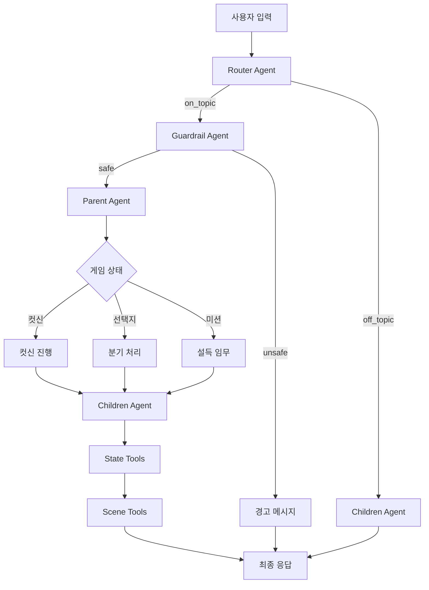

### 1-2. 구성 요소

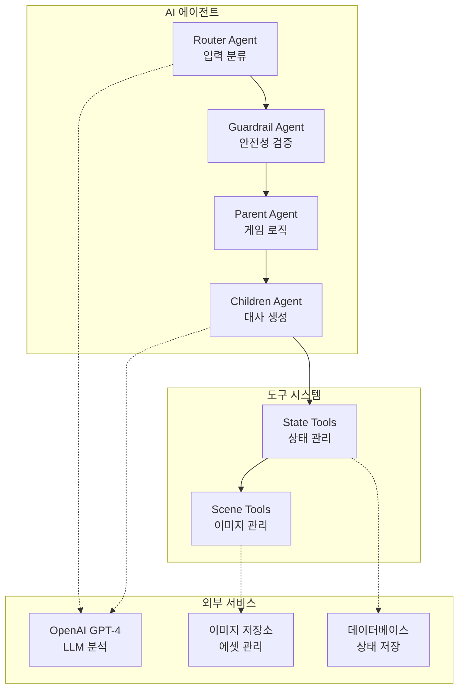

---

## 2. Router Agent 워크플로우

### 2-1. 입력 분류 프로세스

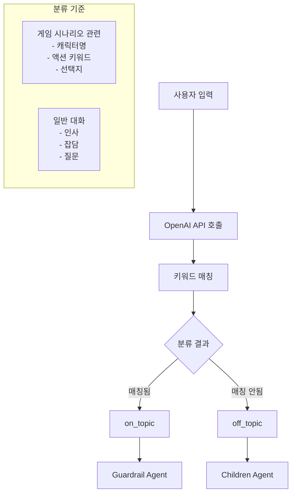

### 2-2. 처리 로직 테이블

| 분류 | 키워드 예시 | 다음 노드 | 처리 방식 |
|------|-------------|-----------|-----------|
| **on_topic** | 아카자, 렌고쿠, 전투, 구출 | Guardrail Agent | 게임 로직 처리 |
| **off_topic** | 안녕, 날씨, 취미, 일반대화 | Children Agent | 캐주얼 응답 |

---

## 3. Parent Agent 게임 로직

### 3-1. 컷신 관리 플로우

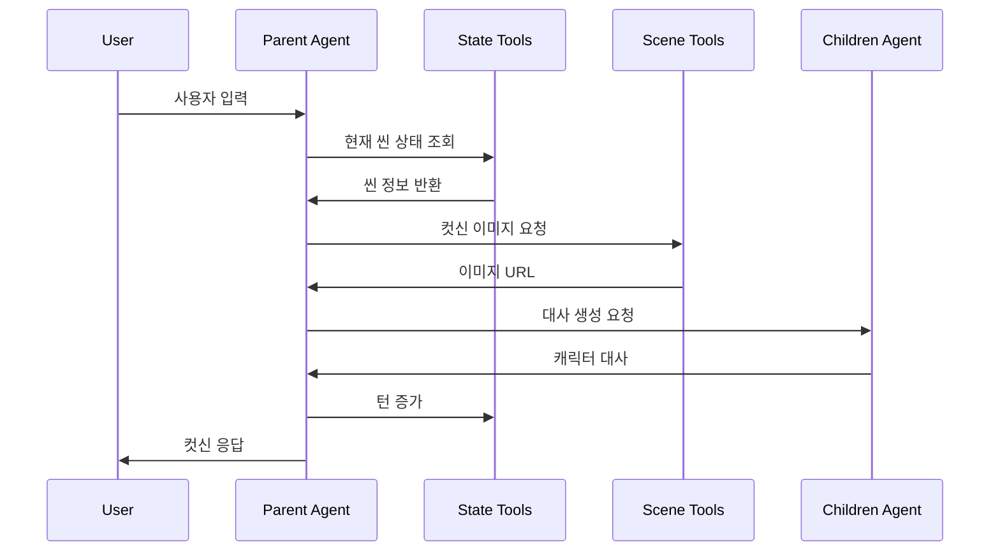

### 3-2. 설득 미션 처리

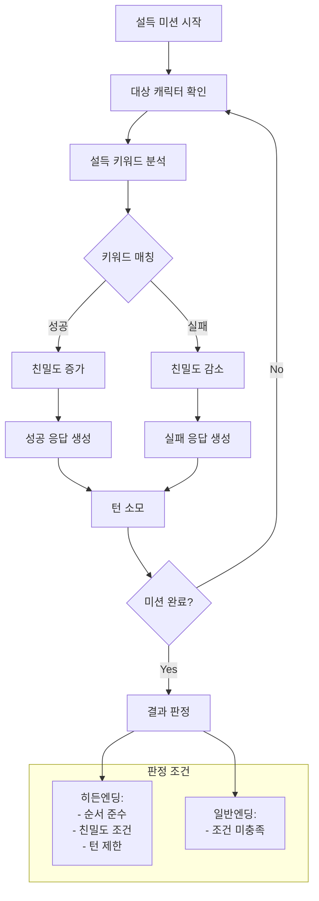

---

## 4. Children Agent 대화 생성

### 4-1. 친밀도 기반 응답 시스템

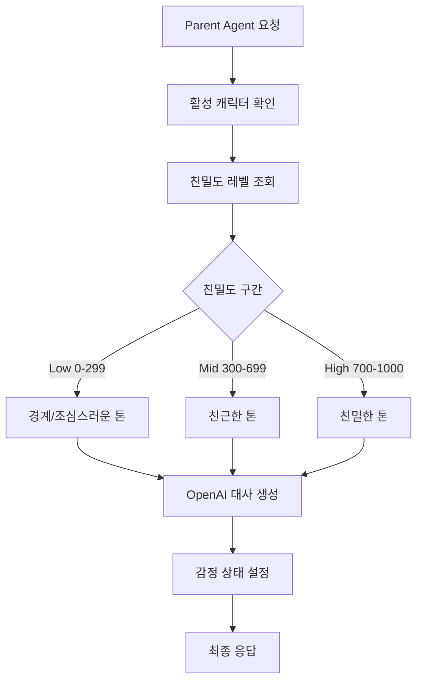

### 4-2. 캐릭터별 특성 테이블

| 캐릭터 | 성격 특징 | 친밀도별 말투 | 특별 반응 |
|--------|-----------|---------------|-----------|
| **탄지로** | 성실하고 따뜻함 | Low: 존댓말 Mid: 친근한 존댓말 High: 편안한 반말 | 네즈코 관련 시 열정적 |
| **이노스케** | 거칠고 자존심 강함 | Low: 적대적 Mid: 경계하는 태도 High: 인정하는 태도 | 도발에 즉시 반응 |
| **젠이츠** | 겁 많지만 의리 있음 | Low: 두려워함 Mid: 조심스러움 High: 의지하는 태도 | 네즈코 언급 시 각성 |
| **렌고쿠** | 열정적이고 의리 있음 | 항상 격려와 조언 | 후배 보호 본능 |

---

## 5. State Tools 상태 관리

### 5-1. 게임 상태 관리 플로우

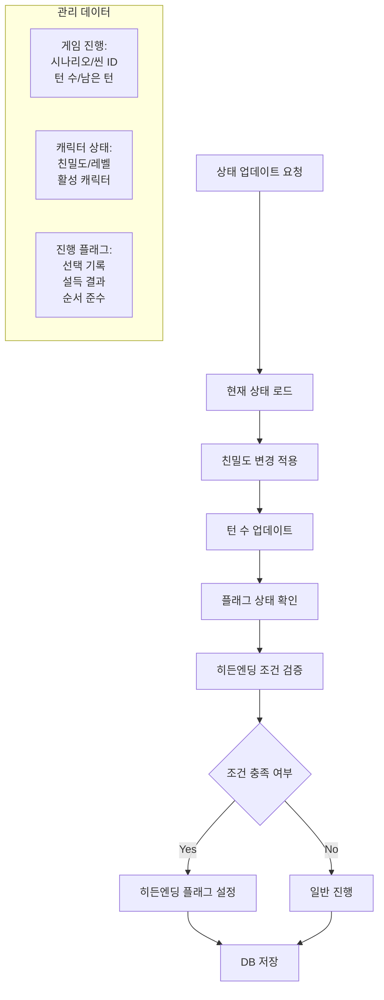

### 5-2. 히든엔딩 조건 테이블

| 조건 항목 | 요구사항 | 검증 시점 |
|-----------|----------|-----------|
| **순서 준수** | 이노스케 → 젠이츠 순서 | 설득 완료 시 |
| **친밀도 조건** | 이노스케 350+, 젠이츠 450+ | 미션 종료 시 |
| **턴 제한** | 전체 6턴 내 완료 | 매 턴 확인 |
| **설득 성공** | 두 캐릭터 모두 성공 | 미션 완료 시 |

---

## 6. Scene Tools 리소스 관리

### 6-1. 이미지 에셋 처리 플로우

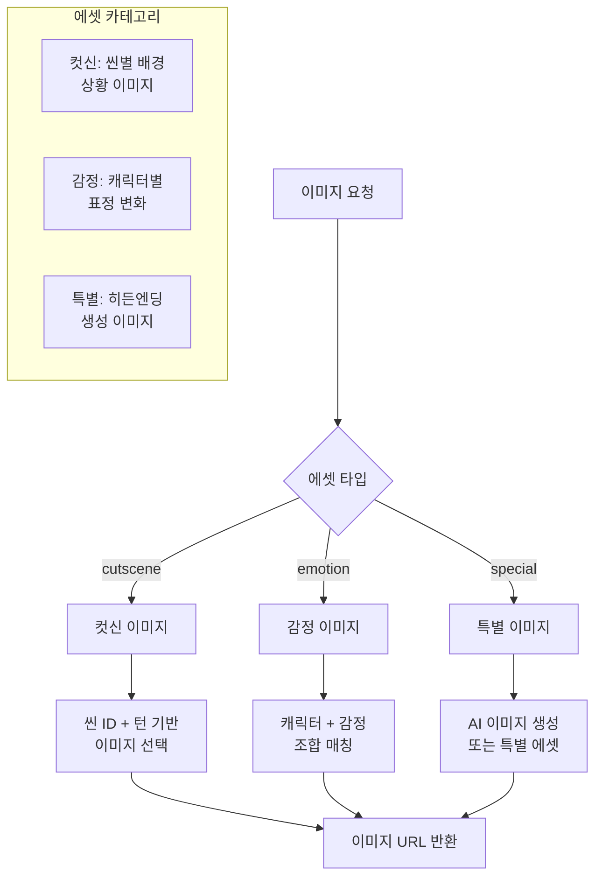

---

## 7. 시나리오 확장 시스템

### 7-1. JSON 기반 시나리오 로딩

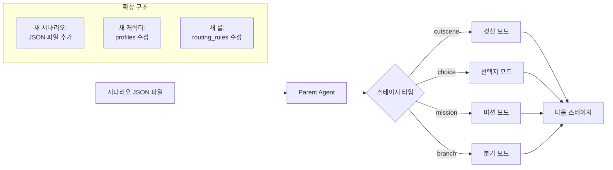

### 7-2. 시나리오 데이터 구조

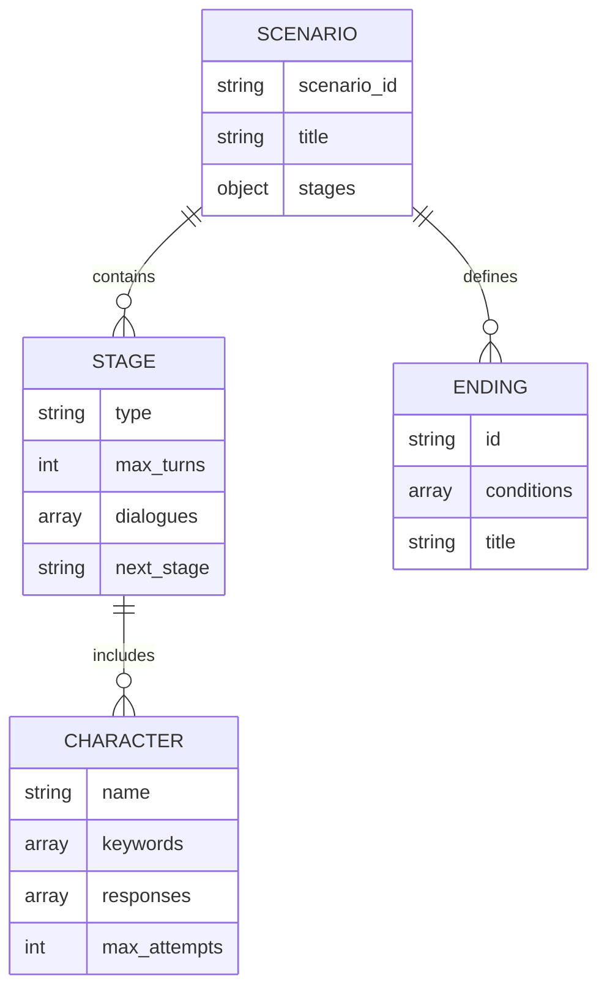

---

## 8. 전체 데이터 흐름 다이어그램

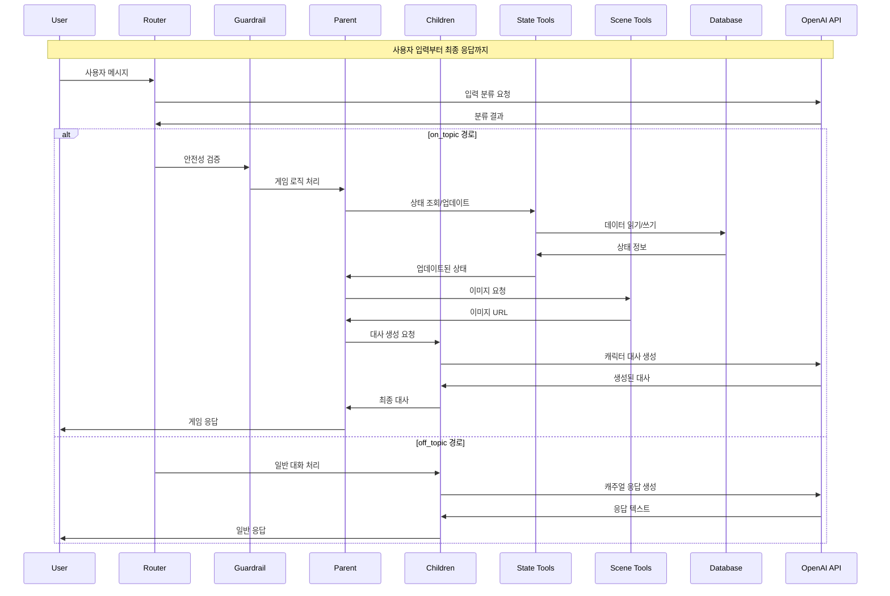

---

## 9. 기술 스택 및 성능 지표

### 9-1. 핵심 기술 스택

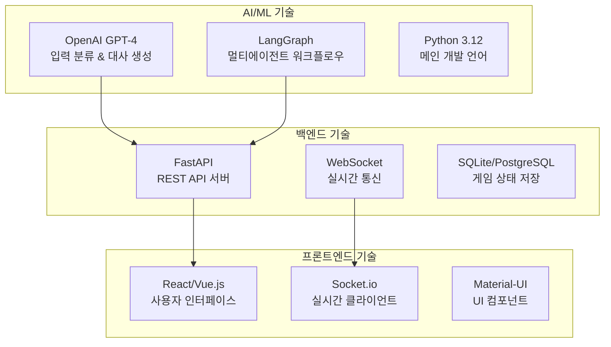

### 9-2. 성능 목표 및 지표

| 항목 | 목표 수치 | 측정 방법 |
|------|-----------|-----------|
| **Router Agent 응답시간** | < 1초 | API 모니터링 |
| **Parent Agent 처리시간** | < 2초 | 내부 로깅 |
| **Children Agent 생성시간** | < 3초 | OpenAI API 측정 |
| **전체 응답시간** | < 5초 | End-to-End 테스트 |
| **동시 접속 지원** | 100명+ | 부하 테스트 |
| **시스템 가용성** | 99.9% | 업타임 모니터링 |

---

## 🎯 시스템 특징 및 확장성

### 주요 특징
- **모듈화된 에이전트 구조**: 각 에이전트의 독립적 개발/테스트 가능
- **확장 가능한 시나리오 시스템**: JSON 파일 기반으로 코드 수정 없이 새 시나리오 추가
- **실시간 상태 동기화**: WebSocket 기반 멀티플레이어 지원 준비
- **AI 기반 자연어 처리**: OpenAI GPT-4를 활용한 정교한 입력 분석 및 응답 생성

### 확장성 고려사항
- **마이크로서비스 전환 준비**: 각 에이전트를 독립 서비스로 분리 가능
- **다중 시나리오 지원**: 데몬슬레이어 외 다른 테마 시나리오 추가 용이
- **다국어 지원**: 캐릭터 대사 및 UI 다국어 확장 구조
- **모바일 플랫폼 확장**: React Native/Flutter 기반 모바일 앱 개발 가능

이 시스템 아키텍처는 확장 가능하고 유지보수가 용이한 구조로 설계되어, 향후 새로운 기능 추가나 플랫폼 확장 시에도 안정적으로 대응할 수 있습니다.
