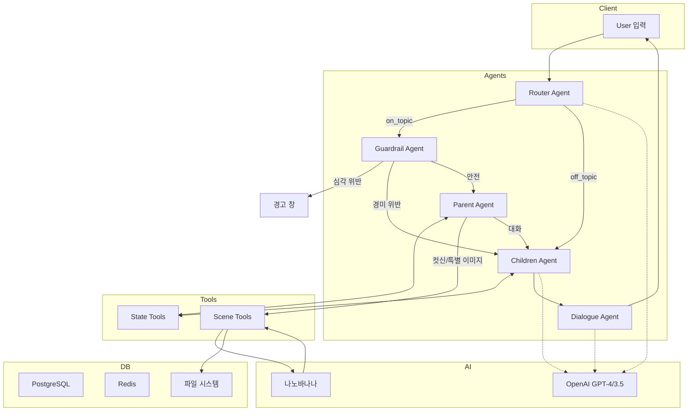
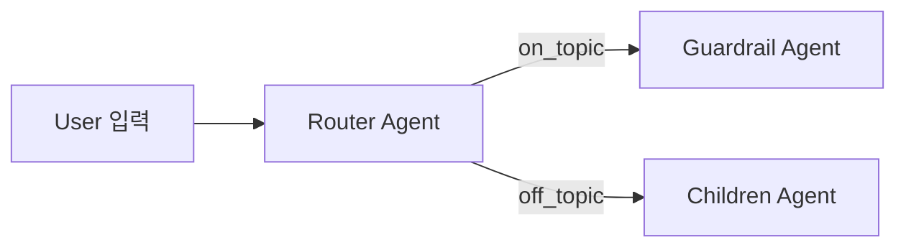
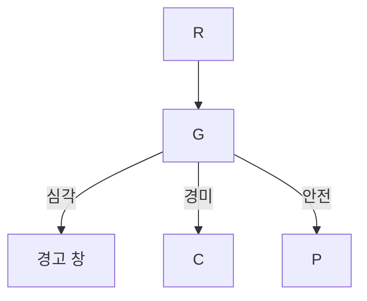
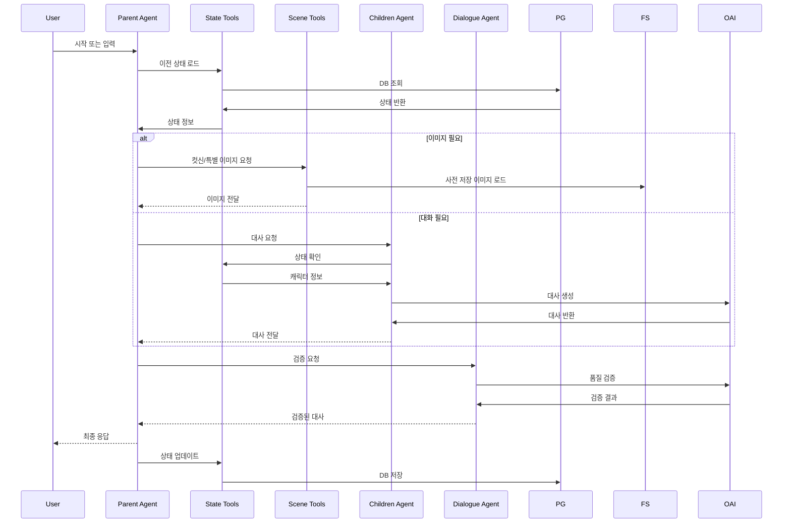
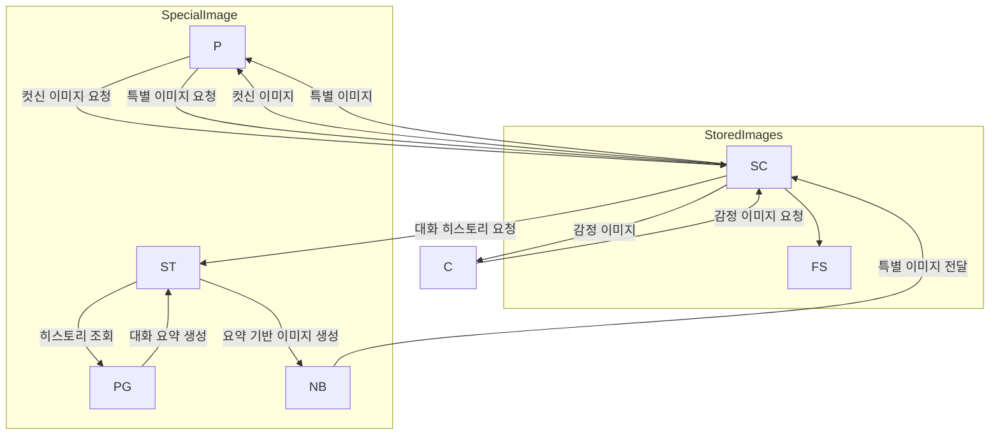
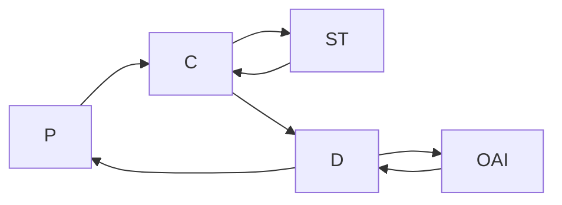
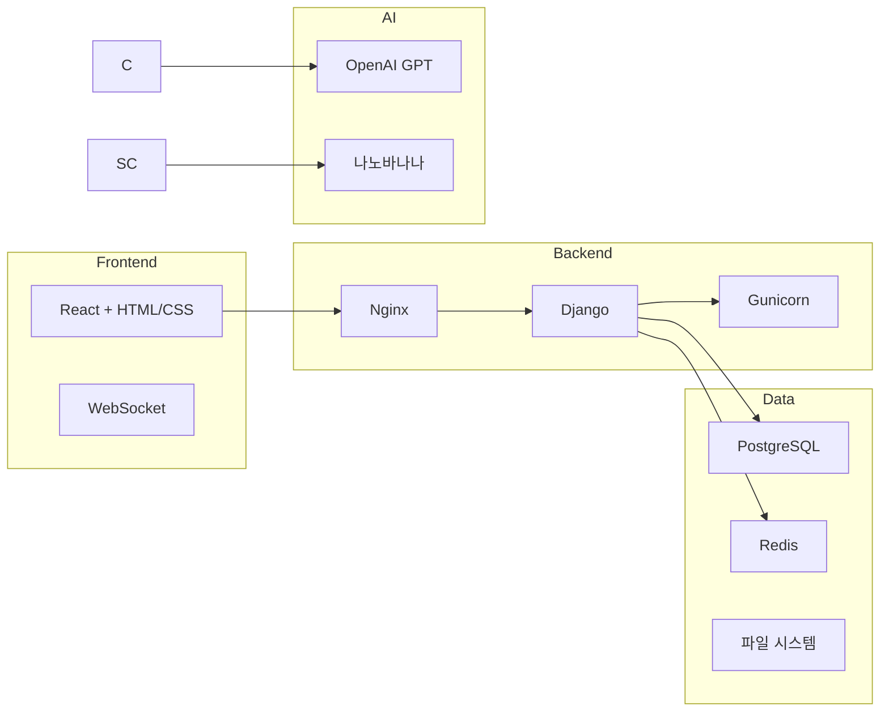

# [모델링 및 평가] 시스템 아키텍처

**SK Networks Family AI Camp 15기 - 데몬슬레이어팀**  
**GitHub**: https://github.com/SKNETWORKS-FAMILY-AICAMP/SKN15-FINAL-5TEAM  
**작성자**: 권도원, 이준원, 조태민  
**제출 일자**: 2025.10.01  

---

## 1. LangGraph 에이전트 워크플로우

---

## 2. Router Agent

| 분류     | 기준                     | 다음 노드       |
|----------|--------------------------|-----------------|
| on_topic | 시나리오 키워드 포함     | Guardrail Agent |
| off_topic| 일반 대화               | Children Agent  |

---

## 3. Guardrail Agent

---

## 4. Parent Agent & State Tools

---

## 5. Scene Tools & 이미지 처리

---

## 6. Children & Dialogue Agent

---

## 7. 기술 스택

---

## 8. 요약

- **on/off topic** 분류만 수행  
- **Guardrail**: 심각/경미/안전 대응  
- **Parent → Scene/Children → Dialogue** 에이전트 분리  
- **State Tools**: DB 상태 로드/업데이트  
- **Scene Tools**: 이미지 로드 및 실시간 생성  
- **나노바나나**: 특별 이미지 실시간 생성  
