# 🏗️ KIME Chat Agent 시스템 아키텍처 완전 분석

**SK Networks Family AI Camp 15기 - 5.Andrew**
**GitHub**: https://github.com/SKNETWORKS-FAMILY-AICAMP/SKN15-FINAL-5TEAM
**작성자**: 권도원, 이준원, 조태민
**최종 수정**: 2025.10.13
**버전**: 2.0 (대폭 확장판)

---

## 📚 목차

1. [전체 시스템 개요](#1-전체-시스템-개요)
2. [LangGraph 워크플로우](#2-langgraph-워크플로우)
3. [Router Agent 상세 분석](#3-router-agent-상세-분석)
4. [Guardrail Agent 상세 분석](#4-guardrail-agent-상세-분석)
5. [Parent Agent 상세 분석](#5-parent-agent-상세-분석)
6. [Children Agent 상세 분석](#6-children-agent-상세-분석)
7. [Dialogue Agent 상세 분석](#7-dialogue-agent-상세-분석)
8. [데이터 흐름 완전 분석](#8-데이터-흐름-완전-분석)
9. [케이스별 시퀀스 다이어그램](#9-케이스별-시퀀스-다이어그램)
10. [성능 및 병목 분석](#10-성능-및-병목-분석)

---

## 1. 전체 시스템 개요

### 1.1 시스템 구성도

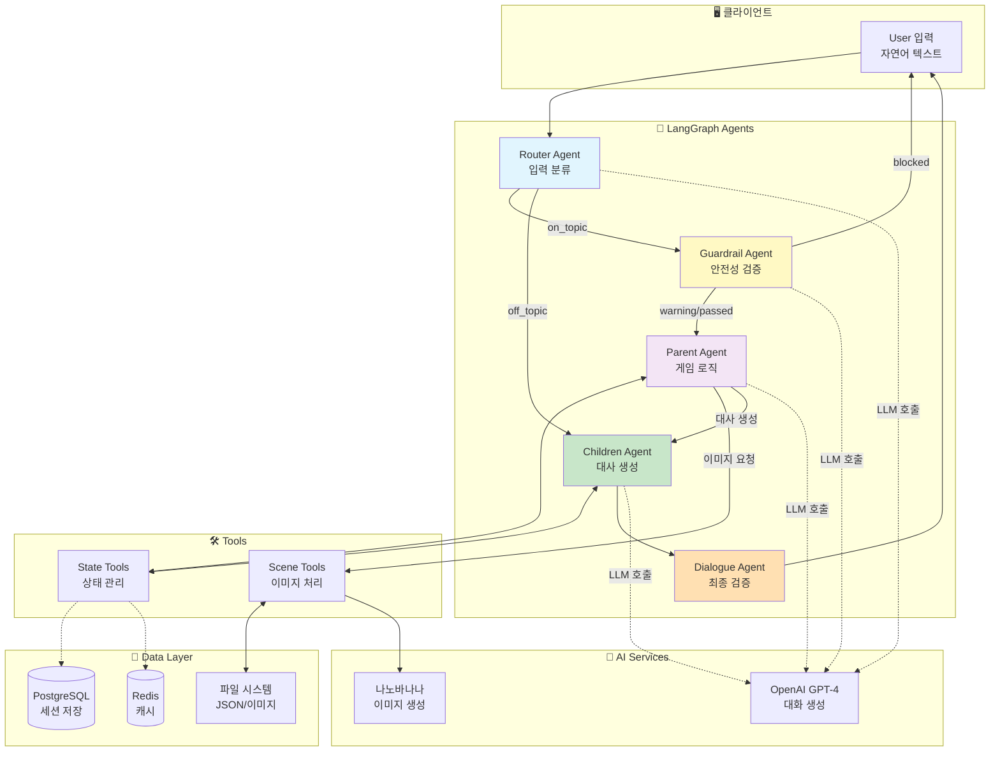

### 1.2 처리 흐름 요약

| 단계 | Agent | 역할 | 처리 시간 | LLM 호출 |
|------|-------|------|-----------|----------|
| 1 | **Router** | 입력 분류 (on/off topic) | 50-200ms | 조건부 (규칙 실패 시) |
| 2 | **Guardrail** | 안전성 검증 (욕설/폭력 차단) | 50-200ms | 조건부 (규칙 실패 시) |
| 3 | **Parent** | 게임 로직 (스테이지 진행) | 100-500ms | 조건부 (choice/mission) |
| 4 | **Children** | 대사 생성 (캐릭터별) | 200-800ms | 항상 |
| 5 | **Dialogue** | 최종 검증 및 출력 | 10-50ms | 선택 |

**총 처리 시간**: 약 410ms ~ 1750ms (평균 700ms)

---

## 2. LangGraph 워크플로우

### 2.1 전체 워크플로우 다이어그램

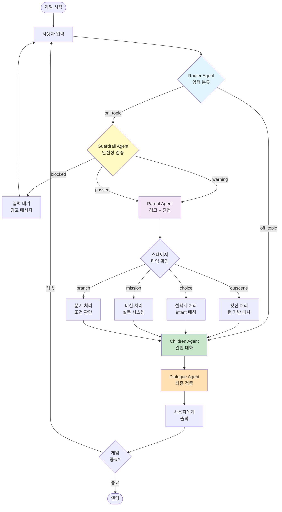

### 2.2 GraphState 전체 구조

**파일 위치**: `src/core/graph_state.py`

```python
class GraphState(TypedDict):
    # 📨 메시지 관리
    messages: Annotated[List[BaseMessage], lambda x, y: x + y]

    # 🎯 라우팅
    next_node: str  # 다음 실행할 노드 ("router", "guardrail", "parent", etc.)
    routing_result: Dict  # Router 결과 {"classification": "on_topic", "confidence": 0.95}

    # 👤 사용자 정보
    session_id: str
    user_name: str
    user_input: str
    turn_count: int  # 현재 턴 번호

    # 🎮 게임 상태
    game: GameState
        # - current_stage: str (예: "intro", "fork", "recruit_mission")
        # - scenario_data: Dict (cutscene5_akaza_encounter.json 데이터)
        # - flags: List[str] (예: ["inosuke_recruited", "chose_teamwork"])
        # - temp_data: Dict (임시 저장소)

    # 👥 캐릭터 관리
    characters: CharacterState
        # - available_characters: List[str] (현재 대화 가능한 캐릭터)
        # - affinity_scores: Dict[str, int] (친밀도: {"tanjiro": 350, "inosuke": 200})
        # - character_data: Dict (characters_db.json 데이터)

    # 🛡️ Guardrail 결과
    guardrail_result: GuardrailResult
        # - status: str ("passed", "warning", "blocked")
        # - warning_message: str
        # - violated_rules: List[str]

    # 🎬 Parent 결정사항
    parent_decisions: ParentDecisions
        # - should_speak: Dict[str, bool] ({"tanjiro": True, "inosuke": False})
        # - affinity_changes: Dict[str, int] ({"tanjiro": +10})
        # - special_events: List[str]
        # - next_stage: Optional[str]
        # - dialogue_context: Any (Children에게 전달할 대사 생성 정보)

    # 📤 출력 관리
    output: OutputState
        # - dialogues: List[DialogueItem] (생성된 대사 목록)
        # - system_messages: List[str] (시스템 나레이션)
        # - images: List[str] (이미지 경로)

    # 🔧 메타 정보
    meta: MetaState
        # - processed_by: str (마지막 처리 Agent)
        # - timestamp: str
        # - performance: Dict (성능 측정)
```

---

## 3. Router Agent 상세 분석

### 3.1 역할 및 책임

Router Agent는 사용자 입력을 받아 **게임 관련 입력(on_topic)**인지 **일반 대화(off_topic)**인지 분류합니다.

**핵심 기능**:
1. **규칙 기반 빠른 분류**: 명확한 키워드 (예: "안녕", "날씨")는 즉시 처리
2. **LLM 기반 정교한 분류**: 애매한 입력은 GPT-4로 의도 파악
3. **폴백 처리**: LLM 실패 시 보수적으로 on_topic 처리 (게임 진행 우선)

### 3.2 입력 JSON 구조

```json
{
  "user_input": "이노스케를 찾아야 해",
  "turn_count": 3,
  "game": {
    "current_stage": "recruit_mission",
    "flags": ["chose_teamwork"]
  }
}
```

### 3.3 처리 로직 플로우차트

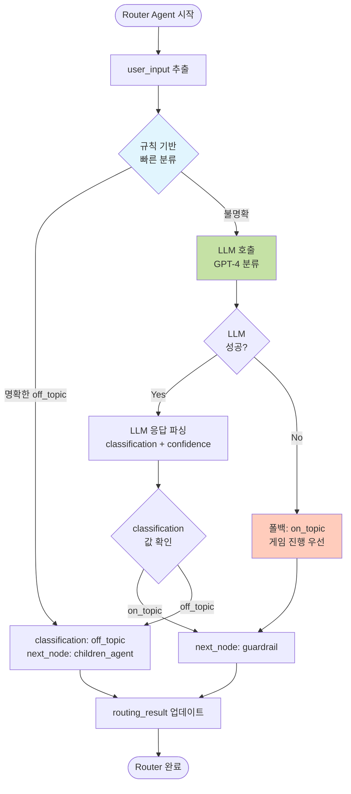

### 3.4 분류 기준표

#### on_topic (게임 관련 입력) → Guardrail Agent

| 분류 | 예시 | 판단 근거 |
|------|------|-----------|
| **캐릭터 언급** | "탄지로 어디야?", "이노스케 찾자" | 캐릭터 이름 포함 |
| **게임 액션** | "설득하자", "싸우자", "함께 가자" | 게임 동사 포함 |
| **스토리 진행** | "계속", "다음", "확인", "어떻게 해야 해?" | 진행 키워드 |
| **선택지 응답** | "1번", "동료를 찾자", "A" | choice 스테이지에서의 응답 |
| **미션 키워드** | "이노스케 도발", "네즈코 위험" | mission 키워드 매칭 |
| **애매한 입력** | "도와줘", "어떻게 하지?" | 불명확 시 게임 우선 |

#### off_topic (일반 대화) → Children Agent (직행)

| 분류 | 예시 | 판단 근거 |
|------|------|-----------|
| **인사말 (단독)** | "안녕", "hello", "하이" | 길이 < 10자 + 인사 키워드 |
| **날씨** | "오늘 날씨 좋네", "비 와?" | "날씨", "비", "눈" 키워드 |
| **음식** | "밥 먹었어?", "점심 뭐 먹지?" | "밥", "음식", "먹" 키워드 |
| **일상 대화** | "오늘 뭐했어?", "심심해" | 게임 무관 일상어 |

### 3.5 LLM 프롬프트 (GPT-4)

**System Prompt**:
```
You are a router agent for a Demon Slayer (Kimetsu no Yaiba) story game.

Your task: Classify if user input is related to the game or not.

**on_topic (게임 관련):**
- Mentions game characters: 탄지로, 이노스케, 젠이츠, 렌고쿠, 아카자, 네즈코
- Game actions: 설득하다, 싸우다, 선택하다, 도와주다, 함께하다
- Story progression: 계속, 다음, 확인, 진행

**off_topic (게임 무관):**
- Weather: 날씨, 비, 눈
- Food: 밥, 점심, 저녁
- Greetings only: 안녕, hello (단독 인사)

**IMPORTANT:** If unclear, classify as 'on_topic' (게임 진행 우선).

Return JSON: {"classification": "on_topic or off_topic", "confidence": 0.0-1.0}
```

**User Prompt**:
```
User input: "이노스케를 찾아야 해"

Classify this input.
```

**LLM 응답**:
```json
{
  "classification": "on_topic",
  "confidence": 0.98
}
```

### 3.6 출력 JSON 구조

```json
{
  "routing_result": {
    "classification": "on_topic",
    "confidence": 0.98,
    "detected_intent": "game_action"
  },
  "next_node": "guardrail",
  "meta": {
    "processed_by": "router",
    "timestamp": "2025-10-13T14:30:22"
  }
}
```

### 3.7 케이스별 처리 예시

#### Case 1: 명확한 게임 입력 (규칙 기반)

| 항목 | 값 |
|------|-----|
| **입력** | "이노스케 찾아야 해" |
| **처리 방식** | LLM 호출 (규칙 기반 미매칭) |
| **분류** | on_topic |
| **Confidence** | 0.98 |
| **다음 노드** | guardrail |
| **처리 시간** | 150ms (LLM 호출) |

#### Case 2: 명확한 일상 대화 (규칙 기반)

| 항목 | 값 |
|------|-----|
| **입력** | "안녕" |
| **처리 방식** | 규칙 기반 빠른 분류 |
| **분류** | off_topic |
| **Confidence** | 0.95 |
| **다음 노드** | children_agent |
| **처리 시간** | 5ms (규칙만) |

#### Case 3: 애매한 입력 (LLM 판단)

| 항목 | 값 |
|------|-----|
| **입력** | "도와줘" |
| **처리 방식** | LLM 호출 |
| **분류** | on_topic (게임 맥락으로 해석) |
| **Confidence** | 0.75 |
| **다음 노드** | guardrail |
| **처리 시간** | 180ms |

#### Case 4: LLM 실패 (폴백)

| 항목 | 값 |
|------|-----|
| **입력** | "이노스케 강해?" |
| **처리 방식** | LLM 타임아웃 → 폴백 |
| **분류** | on_topic (보수적 처리) |
| **Confidence** | 0.6 |
| **다음 노드** | guardrail |
| **처리 시간** | 5010ms (5초 타임아웃 + 폴백) |

#### Case 5: 욕설 포함 게임 입력

| 항목 | 값 |
|------|-----|
| **입력** | "이노스케 개새끼야" |
| **처리 방식** | 규칙/LLM 둘 다 on_topic 판단 |
| **분류** | on_topic |
| **Confidence** | 0.9 |
| **다음 노드** | guardrail (여기서 욕설 차단) |
| **처리 시간** | 120ms |
| **Note** | Router는 분류만, 욕설 차단은 Guardrail 담당 |

---

## 4. Guardrail Agent 상세 분석

### 4.1 역할 및 책임

Guardrail Agent는 **안전성 검증**을 담당합니다.

**핵심 기능**:
1. **욕설/비속어 검사**: 심각한 욕설은 차단(blocked), 경미한 욕설은 경고(warning)
2. **폭력/혐오 표현 검사**: 과도한 폭력성 차단
3. **게임 맥락 허용**: "쓰러뜨리다", "물리치다" 등은 게임 맥락에서 허용
4. **스테이지별 특수 처리**: choice 스테이지에서는 검증 완화
5. **턴 소모 방지**: blocked 시 턴 감소 (멘토 피드백 #2 반영 예정)

### 4.2 입력 JSON 구조

```json
{
  "user_input": "이노스케 너 약한 녀석이야",
  "turn_count": 3,
  "game": {
    "current_stage": "recruit_mission",
    "scenario_data": {...}
  }
}
```

### 4.3 처리 로직 플로우차트

```mermaid
flowchart TD
    Start([Guardrail Agent 시작]) --> StageValidation[스테이지별 검증<br/>choice는 스킵]

    StageValidation --> StageOK{스테이지<br/>검증 통과?}

    StageOK -->|No| BlockStage[next_node: wait_user_input<br/>안내 메시지 출력]
    StageOK -->|Yes| RuleCheck[규칙 기반 검사<br/>욕설/폭력/혐오 키워드]

    RuleCheck --> RuleResult{키워드<br/>발견?}

    RuleResult -->|심각 욕설| BlockSevere[status: blocked<br/>턴 소모 안 함<br/>캐릭터 반응]
    RuleResult -->|경미 욕설| WarnMinor[status: warning<br/>경고 + 진행]
    RuleResult -->|없음| GameContext{게임 맥락<br/>허용 표현?}

    GameContext -->|Yes| Pass[status: passed]
    GameContext -->|No| LLMCheck[LLM 추가 검증<br/>맥락 분석]

    LLMCheck --> LLMResult{LLM<br/>판단}

    LLMResult -->|안전| Pass
    LLMResult -->|경고| WarnMinor
    LLMResult -->|차단| BlockSevere

    Pass --> NextParent[next_node: parent<br/>flag: input_validated]
    WarnMinor --> NextParent2[next_node: parent<br/>flag: input_warned<br/>경고 메시지 추가]
    BlockSevere --> WaitInput[next_node: wait_user_input<br/>턴 감소 (TODO)]
    BlockStage --> WaitInput

    NextParent --> End([Guardrail 완료])
    NextParent2 --> End
    WaitInput --> End

    style RuleCheck fill:#fff9c4
    style LLMCheck fill:#c5e1a5
    style BlockSevere fill:#ffcdd2
    style WarnMinor fill:#ffe0b2
    style Pass fill:#c8e6c9
```

### 4.4 검증 규칙표

#### 심각한 욕설 (status: blocked)

| 키워드 | 처리 | 턴 소모 | 캐릭터 반응 |
|--------|------|---------|-------------|
| 씨발, 시발, 개새끼 | 즉시 차단 | ❌ 없음 (TODO: 구현) | 탄지로: "그런 말은 하지 말아줘..." |
| 좆, 병신 | 즉시 차단 | ❌ 없음 | 이노스케: "말을 함부로 하지 마라!" |
| fuck, shit, bitch | 즉시 차단 | ❌ 없음 | 젠이츠: "좀 더 정중하게..." |

#### 경미한 욕설 (status: warning)

| 키워드 | 처리 | 턴 소모 | 경고 메시지 |
|--------|------|---------|-------------|
| 바보, 멍청 | 경고 + 진행 | ✅ 있음 | "좀 더 신중하게 말해주세요." |
| 한심, 쓰레기 | 경고 + 진행 | ✅ 있음 | "동료에게는 좀 더 친절하게." |
| damn, hell | 경고 + 진행 | ✅ 있음 | "표현에 주의해주세요." |

#### 게임 맥락 허용 (status: passed)

| 표현 | 판단 | 이유 |
|------|------|------|
| "쓰러뜨리다" | 허용 | 게임 전투 맥락 |
| "물리치다" | 허용 | 게임 전투 맥락 |
| "이기다", "승부" | 허용 | 게임 전투 맥락 |
| "약한 녀석" (mission) | 허용 | 이노스케 설득 키워드 |

### 4.5 스테이지별 특수 처리

#### choice 스테이지: 검증 완화

**이유**: 자연어 선택지 입력을 막지 않기 위해

```python
if stage_type == "choice":
    # 검증 스킵, Parent에서 intent_keywords로 처리
    return {"valid": True, "message": ""}
```

**예시**:
- 입력: "1번 선택" → 통과 (숫자 선택)
- 입력: "동료 찾자" → 통과 (자연어 선택)
- 입력: "씨발 1번" → **차단** (욕설은 여전히 차단)

#### mission 스테이지: 키워드 매칭 우선

```python
if stage_type == "mission":
    # 도발 표현("약한 녀석") 허용
    # 하지만 심각한 욕설은 여전히 차단
```

### 4.6 LLM 맥락 분석 프롬프트 (GPT-4)

**System Prompt**:
```
당신은 안전성 검증 AI입니다. 사용자 입력이 부적절한지 판단하세요.

**차단 기준**:
- 심각한 욕설/비속어
- 타인에 대한 폭력적 표현
- 혐오/차별 발언

**허용 기준**:
- 게임 맥락의 전투 표현 ("쓰러뜨리다", "이기다")
- 캐릭터 설득을 위한 도발 ("약한 녀석", "비겁한")

**상황**: {current_stage} 스테이지, 이노스케 설득 중

Return JSON: {"status": "passed/warning/blocked", "reason": "판단 이유"}
```

**User Prompt**:
```
User input: "너 저 오니보다 약할 것 같은데"
Context: mission 스테이지, 이노스케 설득
```

**LLM 응답**:
```json
{
  "status": "passed",
  "reason": "이노스케 자존심을 건드리기 위한 도발 표현으로, 게임 맥락에서 허용됨"
}
```

### 4.7 출력 JSON 구조

```json
{
  "guardrail_result": {
    "status": "passed",  // "passed", "warning", "blocked"
    "warning_message": "",
    "violated_rules": [],
    "processing_time_ms": 120
  },
  "next_node": "parent",
  "game": {
    "flags": ["input_validated"]
  },
  "meta": {
    "processed_by": "guardrail"
  }
}
```

### 4.8 케이스별 처리 예시 (15가지)

#### Case 1: 정상 입력 (passed)

| 항목 | 값 |
|------|-----|
| **입력** | "이노스케를 찾아가자" |
| **규칙 검사** | 키워드 미발견 |
| **LLM 검사** | 스킵 (규칙 통과) |
| **Status** | passed |
| **다음 노드** | parent |
| **턴 소모** | ✅ 정상 진행 |
| **처리 시간** | 8ms (규칙만) |

#### Case 2: 경미한 욕설 (warning)

| 항목 | 값 |
|------|-----|
| **입력** | "이노스케 바보야" |
| **규칙 검사** | "바보" 발견 (경미) |
| **LLM 검사** | 스킵 |
| **Status** | warning |
| **경고 메시지** | "좀 더 신중하게 말해주세요." |
| **다음 노드** | parent (진행) |
| **턴 소모** | ✅ 정상 진행 |
| **처리 시간** | 10ms |

#### Case 3: 심각한 욕설 (blocked)

| 항목 | 값 |
|------|-----|
| **입력** | "이노스케 개새끼" |
| **규칙 검사** | "개새끼" 발견 (심각) |
| **LLM 검사** | 스킵 |
| **Status** | blocked |
| **캐릭터 반응** | 탄지로: "그런 말은 하지 말아줘..." (disappointed) |
| **다음 노드** | wait_user_input (재입력) |
| **턴 소모** | ❌ 없음 (TODO: 구현) |
| **처리 시간** | 15ms |

#### Case 4: 게임 맥락 허용 (passed)

| 항목 | 값 |
|------|-----|
| **입력** | "아카자를 쓰러뜨리자" |
| **규칙 검사** | "쓰러뜨리다" 발견 → 게임 맥락 허용 |
| **LLM 검사** | 스킵 |
| **Status** | passed |
| **다음 노드** | parent |
| **처리 시간** | 7ms |

#### Case 5: choice 스테이지 검증 완화 (passed)

| 항목 | 값 |
|------|-----|
| **입력** | "1번" |
| **스테이지** | choice (fork) |
| **규칙 검사** | 스킵 (choice 스테이지) |
| **LLM 검사** | 스킵 |
| **Status** | passed (자동) |
| **다음 노드** | parent |
| **처리 시간** | 3ms |

#### Case 6: mission 스테이지 도발 허용 (passed)

| 항목 | 값 |
|------|-----|
| **입력** | "너 약한 녀석이야" |
| **스테이지** | mission (recruit_mission) |
| **규칙 검사** | "약한" 발견 → mission 키워드로 허용 |
| **LLM 검사** | 스킵 |
| **Status** | passed |
| **다음 노드** | parent |
| **Note** | 이노스케 설득 키워드 |
| **처리 시간** | 10ms |

#### Case 7: 폭력 표현 (LLM 판단)

| 항목 | 값 |
|------|-----|
| **입력** | "죽여버리겠어" |
| **규칙 검사** | "죽여" 발견 (폭력) |
| **LLM 검사** | 호출 → 맥락 분석 |
| **LLM 판단** | warning (게임 전투 맥락이지만 과격) |
| **Status** | warning |
| **경고 메시지** | "너무 과격한 표현은 자제해주세요." |
| **다음 노드** | parent (진행) |
| **처리 시간** | 180ms (LLM) |

#### Case 8: 혐오 표현 (blocked)

| 항목 | 값 |
|------|-----|
| **입력** | "이노스케 같은 애는 무시해" |
| **규칙 검사** | "무시" 발견 (혐오) |
| **LLM 검사** | 호출 → blocked 판단 |
| **Status** | blocked |
| **다음 노드** | wait_user_input |
| **처리 시간** | 200ms |

#### Case 9: 영어 욕설 (blocked)

| 항목 | 값 |
|------|-----|
| **입력** | "fuck this game" |
| **규칙 검사** | "fuck" 발견 (심각) |
| **Status** | blocked |
| **다음 노드** | wait_user_input |
| **처리 시간** | 12ms |

#### Case 10: LLM 실패 (폴백: passed)

| 항목 | 값 |
|------|-----|
| **입력** | "이노스케 힘내" |
| **규칙 검사** | 미발견 → LLM 호출 |
| **LLM 검사** | 타임아웃 실패 |
| **폴백** | passed (보수적 진행) |
| **다음 노드** | parent |
| **처리 시간** | 5010ms (타임아웃) |

#### Case 11: 비속어 + 게임 키워드 혼합 (blocked)

| 항목 | 값 |
|------|-----|
| **입력** | "씨발 이노스케 찾자" |
| **규칙 검사** | "씨발" 발견 (심각) |
| **판단** | 게임 키워드 있어도 욕설 우선 차단 |
| **Status** | blocked |
| **다음 노드** | wait_user_input |
| **처리 시간** | 15ms |

#### Case 12: 코사인 유사도 우회 표현 (TODO)

| 항목 | 값 |
|------|-----|
| **입력** | "ㅆㅂ", "ㄱㅅㄲ" |
| **현재 처리** | 미탐지 (규칙 기반 한계) |
| **향후 개선** | 코사인 유사도 기반 탐지 추가 |
| **Status** | passed (현재) |
| **TODO** | 자모 분리 + 유사도 매칭 구현 |

#### Case 13: 반복 입력 (Loop Flag - TODO)

| 항목 | 값 |
|------|-----|
| **입력** | "안녕" (10회 반복) |
| **현재 처리** | 매번 통과 |
| **향후 개선** | loop_limit 초과 시 경고 |
| **Status** | passed (현재) |
| **TODO** | 멘토 피드백 #3 구현 |

#### Case 14: choice 스테이지 + 욕설 (blocked)

| 항목 | 값 |
|------|-----|
| **입력** | "씨발 1번" |
| **스테이지** | choice |
| **규칙 검사** | "씨발" 발견 (심각) |
| **판단** | choice여도 심각 욕설은 차단 |
| **Status** | blocked |
| **다음 노드** | wait_user_input |

#### Case 15: 빈 입력 (passed)

| 항목 | 값 |
|------|-----|
| **입력** | "" (공백) |
| **규칙 검사** | 스킵 |
| **판단** | Parent에서 처리하도록 통과 |
| **Status** | passed |
| **다음 노드** | parent |
| **처리 시간** | 2ms |

---

## 5. Parent Agent 상세 분석

### 5.1 역할 및 책임

Parent Agent는 **게임 로직의 핵심**으로, 다음을 담당합니다:

1. **스테이지 진행 관리**: cutscene/choice/mission/branch 타입별 처리
2. **턴 관리**: turn_count 증가, max_turns 체크
3. **친밀도 시스템**: affinity_changes 적용
4. **조건 분기**: 히든 엔딩 / 기본 엔딩 판단
5. **Children에게 대사 생성 지시**: dialogue_context 생성

### 5.2 입력 JSON 구조

```json
{
  "user_input": "이노스케를 찾자",
  "turn_count": 2,
  "game": {
    "current_stage": "recruit_mission",
    "scenario_data": {
      "stages": {
        "recruit_mission": {
          "type": "mission",
          "max_turns": 6,
          "characters": {
            "inosuke": {...},
            "zenitsu": {...}
          }
        }
      }
    },
    "flags": ["chose_teamwork"],
    "temp_data": {}
  },
  "characters": {
    "affinity_scores": {
      "tanjiro": 350,
      "inosuke": 200
    }
  }
}
```

### 5.3 스테이지 타입별 처리 플로우

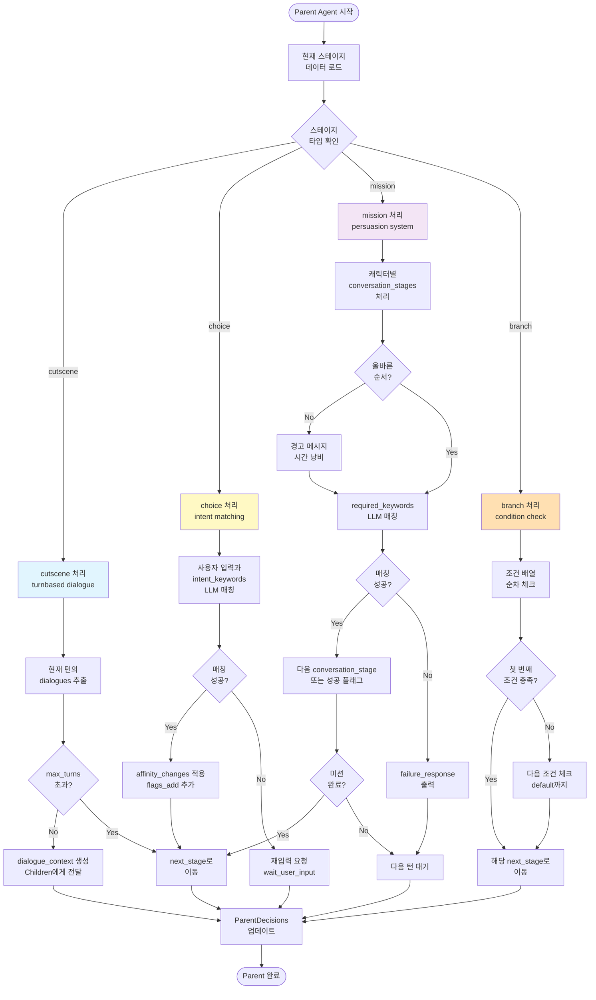

### 5.4 cutscene 스테이지 처리

#### 데이터 구조 (JSON)

```json
{
  "type": "cutscene",
  "title": "컷신 5: 상현 등장",
  "max_turns": 5,
  "dialogues": [
    {
      "turn": 0,
      "speaker": "system",
      "content": "열차의 충격으로 당신이 눈을 뜬다.",
      "emotion": "neutral",
      "image": "scene5_crashed_train"
    },
    {
      "turn": 0,
      "speaker": "tanjiro",
      "content": "{{user}}!! 괜찮아?!",
      "emotion": "worried"
    },
    {
      "turn": 1,
      "speaker": "tanjiro",
      "content": "다행이다... 엔무는 쓰러뜨렸어.",
      "emotion": "relieved"
    }
  ],
  "next_stage": "fork"
}
```

#### 처리 로직

1. **현재 턴 확인**: `current_turn = state.game.turn`
2. **해당 턴 대사 필터링**: `dialogues`에서 `turn == current_turn`인 항목 추출
3. **dialogue_context 생성**: Children에게 전달할 대사 목록
4. **턴 증가**: `state.game.increment_turn()`
5. **max_turns 체크**: 초과 시 `next_stage`로 이동

#### 케이스별 예시

**Case A: 정상 턴 진행**

| 항목 | 값 |
|------|-----|
| **current_turn** | 0 |
| **max_turns** | 5 |
| **dialogues (turn=0)** | system, tanjiro (2개) |
| **dialogue_context** | [{"speaker": "system", "content": "..."}, {"speaker": "tanjiro", "content": "..."}] |
| **다음 턴** | 1 |
| **next_node** | children_agent |

**Case B: 마지막 턴 (next_stage 이동)**

| 항목 | 값 |
|------|-----|
| **current_turn** | 5 |
| **max_turns** | 5 |
| **판단** | 턴 초과 → next_stage로 이동 |
| **current_stage 변경** | "fork" |
| **dialogue_context** | 빈 배열 (대사 없음) |
| **next_node** | parent (재귀 호출, fork 처리) |

**Case C: 멀티 화자 (같은 턴에 여러 대사)**

| 항목 | 값 |
|------|-----|
| **current_turn** | 1 |
| **dialogues (turn=1)** | tanjiro, rengoku, tanjiro (3개) |
| **dialogue_context** | 3개 대사 전부 전달 |
| **Children 처리** | 순차적으로 3개 대사 생성 |

### 5.5 choice 스테이지 처리

#### 데이터 구조 (JSON)

```json
{
  "type": "choice",
  "title": "운명의 갈림길",
  "pre_choice_dialogues": [
    {
      "speaker": "system",
      "content": "아카자가 술식을 전개한다!",
      "emotion": "tense"
    }
  ],
  "choices": [
    {
      "id": "recruit_allies",
      "text": "A. 동료들을 찾아 함께 싸운다",
      "intent_keywords": ["동료", "함께", "찾", "A", "1"],
      "next_stage": "recruit_mission",
      "affinity_changes": {
        "tanjiro": 10
      },
      "flags_add": ["chose_teamwork"]
    },
    {
      "id": "reckless_sacrifice",
      "text": "B. 스승님은 내가 지킨다!",
      "intent_keywords": ["스승", "지킨다", "B", "2"],
      "next_stage": "reckless_sacrifice",
      "flags_add": ["chose_sacrifice"]
    }
  ]
}
```

#### 처리 로직

1. **pre_choice_dialogues 출력**: 선택지 제시 전 대화
2. **사용자 입력 수신**: "동료 찾자", "1번", "A" 등
3. **LLM 키워드 매칭**: `_match_keywords_with_llm()` 사용
4. **매칭된 선택지 적용**:
   - `affinity_changes` 적용
   - `flags_add` 추가
   - `next_stage`로 이동

#### LLM 매칭 예시

**입력**: "동료를 규합해서 힘을 합치자"

**LLM 프롬프트**:
```
상황: fork 스테이지, 운명의 갈림길
키워드 목록: "동료", "함께", "찾", "A", "1"
사용자 입력: "동료를 규합해서 힘을 합치자"

사용자 입력이 키워드의 의도와 매칭되는지 분석해주세요.
```

**LLM 응답**:
```json
{
  "matched": true,
  "confidence": 95,
  "reasoning": "'동료', '규합', '힘을 합치다'는 intent_keywords의 의도와 완전히 일치"
}
```

**결과**:
- 매칭 성공 ✅
- `recruit_mission` 스테이지로 이동
- `tanjiro` 친밀도 +10
- `chose_teamwork` 플래그 추가

#### 케이스별 예시

**Case A: 명확한 선택지 (숫자)**

| 항목 | 값 |
|------|-----|
| **입력** | "1번" |
| **매칭 선택지** | recruit_allies |
| **Confidence** | 100 (정확 매칭) |
| **next_stage** | recruit_mission |
| **affinity_changes** | tanjiro +10 |

**Case B: 자연어 선택 (LLM 매칭)**

| 항목 | 값 |
|------|-----|
| **입력** | "동료를 찾아서 함께 싸우는 게 낫겠어" |
| **매칭 선택지** | recruit_allies |
| **Confidence** | 95 (LLM 판단) |
| **LLM 이유** | "동료", "함께", "싸우다" 키워드 의도 일치 |
| **next_stage** | recruit_mission |

**Case C: 애매한 입력 (매칭 실패)**

| 항목 | 값 |
|------|-----|
| **입력** | "어떻게 하지?" |
| **매칭 시도** | 모든 선택지 체크 |
| **결과** | 모두 Confidence < 70 |
| **처리** | wait_user_input (재입력 요청) |
| **안내 메시지** | "선택지를 명확히 말해주세요. (A, B 또는 1, 2)" |

**Case D: 복수 키워드 (첫 번째 우선)**

| 항목 | 값 |
|------|-----|
| **입력** | "동료도 찾고 싶지만... 일단 내가 지킬게" |
| **매칭 1** | recruit_allies (Confidence 60) |
| **매칭 2** | reckless_sacrifice (Confidence 85) |
| **선택** | reckless_sacrifice (높은 Confidence) |
| **next_stage** | reckless_sacrifice |

### 5.6 mission 스테이지 처리 (가장 복잡)

#### 데이터 구조 (JSON)

```json
{
  "type": "mission",
  "title": "동료 규합",
  "max_turns": 6,
  "characters": {
    "inosuke": {
      "location": "front_car",
      "conversation_stages": [
        {
          "stage": 0,
          "name": "first_encounter",
          "greeting": {
            "speaker": "inosuke",
            "content": "뭐야! 누구냐!",
            "emotion": "aggressive"
          },
          "required_keywords": ["이노스케", "앞", "멧돼지"],
          "success_response": {...},
          "failure_response": {...}
        },
        {
          "stage": 1,
          "name": "provocation",
          "required_keywords": ["약", "못", "겁쟁", "보다"],
          "success_response": {...},
          "failure_response": {...}
        },
        {
          "stage": 2,
          "name": "final_persuasion",
          "required_keywords": ["함께", "싸우자", "강한"],
          "success_response": {...},
          "success_flag": "inosuke_recruited"
        }
      ],
      "correct_order": 1,
      "turn_cost": 1
    },
    "zenitsu": {
      "location": "back_car",
      "conversation_stages": [
        {
          "stage": 0,
          "name": "sleeping",
          "required_keywords": ["젠이츠", "뒤", "노란"],
          "success_response": {...}
        },
        {
          "stage": 1,
          "name": "waking_up",
          "required_keywords": ["일어나", "깨워"],
          "success_response": {...}
        },
        {
          "stage": 2,
          "name": "nezuko_trigger",
          "required_keywords": ["네즈코", "위험", "지켜"],
          "success_response": {...},
          "success_flag": "zenitsu_recruited"
        }
      ],
      "correct_order": 2,
      "turn_cost": 1
    }
  },
  "crisis_messages": [
    "멀리서 강철이 부딪히는 굉음이 들린다...",
    "땅이 크게 울리며, 렌고쿠의 신음 소리가 들린다...",
    "아카자의 광기 어린 웃음소리가 메아리친다..."
  ],
  "next_stage": "evaluate_end"
}
```

#### 처리 로직 (다층 대화 시스템)

```mermaid
flowchart TD
    Start([Mission 처리 시작]) --> CheckTurns{전체 턴<br/>max_turns<br/>초과?}

    CheckTurns -->|Yes| Timeout[시간 초과<br/>crisis_messages 출력<br/>evaluate_end로 이동]
    CheckTurns -->|No| ParseInput[사용자 입력<br/>파싱]

    ParseInput --> IdentifyChar{어떤 캐릭터<br/>언급?}

    IdentifyChar -->|이노스케| CheckInosukeStage[이노스케<br/>current conversation_stage<br/>확인]
    IdentifyChar -->|젠이츠| CheckZenitsuStage[젠이츠<br/>current conversation_stage<br/>확인]
    IdentifyChar -->|불명확| AskClarify[캐릭터 명시<br/>요청]

    CheckInosukeStage --> CheckOrder{correct_order<br/>확인}
    CheckOrder -->|순서 맞음| MatchKeywords[required_keywords<br/>LLM 매칭]
    CheckOrder -->|순서 틀림| WarnOrder[경고 메시지<br/>"젠이츠 먼저 깨워야"]

    MatchKeywords --> MatchResult{매칭<br/>성공?}

    MatchResult -->|Yes| ProgressStage[다음 conversation_stage<br/>또는 성공 플래그]
    MatchResult -->|No| FailureResponse[failure_response<br/>출력 + 턴 소모]

    ProgressStage --> CheckComplete{해당 캐릭터<br/>완료?}

    CheckComplete -->|Yes| CheckAllComplete{모든 캐릭터<br/>완료?}
    CheckComplete -->|No| WaitNext[다음 턴 대기<br/>crisis_message 출력]

    CheckAllComplete -->|Yes| Success[evaluate_end로 이동<br/>히든 엔딩 루트]
    CheckAllComplete -->|No| WaitNext

    FailureResponse --> IncrementTurn[턴 증가<br/>crisis_message]
    WarnOrder --> IncrementTurn
    AskClarify --> WaitNext

    IncrementTurn --> CheckTurns
    WaitNext --> End([Mission 턴 완료])
    Timeout --> End
    Success --> End

    style MatchKeywords fill:#c5e1a5
    style Success fill:#c8e6c9
    style Timeout fill:#ffcdd2
    style WarnOrder fill:#ffe0b2
```

#### 정답 루트 (이노스케 → 젠이츠)

**턴 0**: 미션 시작, 탄지로 힌트 출력

**턴 1**: 이노스케 이동
- 입력: "이노스케를 찾아가자" 또는 "앞쪽 칸"
- 매칭: `location: "front_car"` + `required_keywords: ["이노스케", "앞"]`
- 결과: conversation_stage 0 완료
- 턴 소모: ✅ 1턴
- 남은 턴: 5

**턴 2**: 이노스케 1차 설득 (실패 예정)
- 입력: "이노스케, 부탁이야 도와줘"
- 매칭: `required_keywords: ["약", "못", "겁쟁"]` → 미매칭
- 결과: failure_response ("흥! 약한 녀석의 말은 듣지 않는다!")
- crisis_message: "멀리서 강철이 부딪히는 굉음..."
- 턴 소모: ✅ 1턴
- 남은 턴: 4

**턴 3**: 이노스케 2차 설득 (성공)
- 입력: "너 저 오니보다 약할 것 같은데"
- 매칭: `required_keywords: ["약", "보다"]` → LLM 매칭 성공 (Confidence 90)
- LLM 판단: "비교를 통한 도발, 자존심 자극"
- 결과: success_response ("지금 뭐라고?! 저돌맹진!!")
- 플래그: `inosuke_recruited` 추가
- 턴 소모: ✅ 1턴
- 남은 턴: 3

**턴 4**: 젠이츠 이동
- 입력: "젠이츠를 찾자" 또는 "뒤쪽 칸"
- 매칭: `location: "back_car"` + `required_keywords: ["젠이츠", "뒤"]`
- 결과: conversation_stage 0 완료
- 턴 소모: ✅ 1턴
- 남은 턴: 2

**턴 5**: 젠이츠 깨우기 (실패 예정)
- 입력: "젠이츠! 일어나!"
- 매칭: `required_keywords: ["네즈코", "위험"]` → 미매칭
- 결과: failure_response ("으으... 무서운 소리... Zzz...")
- crisis_message: "땅이 크게 울리며, 렌고쿠의 신음..."
- 턴 소모: ✅ 1턴
- 남은 턴: 1

**턴 6**: 젠이츠 네즈코 트리거 (성공)
- 입력: "젠이츠! 네즈코가 위험해!"
- 매칭: `required_keywords: ["네즈코", "위험"]` → 매칭 성공
- 결과: success_response ("뭐어어라고오?! 나의 네즈코쨔아앙!")
- 플래그: `zenitsu_recruited` 추가
- 턴 소모: ✅ 1턴
- 남은 턴: 0

**최종 판정**: 6턴 내 완료 ✅ → `evaluate_end` → `cutscene6_hidden` (히든 엔딩)

#### 오답 루트 (젠이츠 → 이노스케)

**턴 1**: 젠이츠 이동 (1턴 소모, 5턴 남음)
**턴 2**: 젠이츠 깨우기 실패 (1턴 소모, 4턴 남음)
**턴 3**: 젠이츠 네즈코 트리거 (1턴 소모, 3턴 남음, `zenitsu_recruited`)
**턴 4**: 이노스케 이동 (1턴 소모, 2턴 남음)
**턴 5**: 이노스케 1차 실패 (1턴 소모, 1턴 남음)
**턴 6**: 이노스케 2차 성공 (1턴 소모, 0턴 남음, `inosuke_recruited`)
**턴 7 필요**: 하지만 이미 6턴 소진 → **시간 초과** ❌

**최종 판정**: `evaluate_end` → `cutscene6_bad` (기본 엔딩)

#### 케이스별 예시

**Case A: 정답 순서 (히든 엔딩)**

| 항목 | 값 |
|------|-----|
| **순서** | 이노스케 (3턴) → 젠이츠 (3턴) |
| **총 소모 턴** | 6턴 |
| **플래그** | `inosuke_recruited`, `zenitsu_recruited` |
| **결과** | evaluate_end → cutscene6_hidden |

**Case B: 오답 순서 (시간 초과)**

| 항목 | 값 |
|------|-----|
| **순서** | 젠이츠 (3턴) → 이노스케 (3턴) |
| **총 소모 턴** | 6턴 완료 but 이노스케 미완료 |
| **플래그** | `zenitsu_recruited` only |
| **결과** | evaluate_end → cutscene6_bad |

**Case C: 1명만 설득 (실패)**

| 항목 | 값 |
|------|-----|
| **순서** | 이노스케만 설득 (3턴) |
| **남은 턴** | 3턴 남았지만 젠이츠 미시작 |
| **플래그** | `inosuke_recruited` only |
| **결과** | 불완전 → cutscene6_bad |

**Case D: 키워드 미매칭 반복 (시간 초과)**

| 항목 | 값 |
|------|-----|
| **행동** | 이노스케에게 "부탁이야" 5회 반복 |
| **매칭** | 모두 실패 (required_keywords 불일치) |
| **소모 턴** | 5턴 낭비 |
| **결과** | 6턴 초과 → cutscene6_bad |

### 5.7 branch 스테이지 처리

#### 데이터 구조 (JSON)

```json
{
  "type": "branch",
  "title": "최종 판정",
  "branches": [
    {
      "id": "hidden_ending",
      "description": "히든 엔딩: 6턴 내 이노스케, 젠이츠 순서대로 모두 합류",
      "conditions": [
        "recruited_allies_in_order",
        "within_turns",
        "inosuke_recruited",
        "zenitsu_recruited"
      ],
      "next_stage": "cutscene6_hidden"
    },
    {
      "id": "timeout_ending",
      "description": "기본 엔딩: 시간 초과 또는 순서 오류",
      "conditions": ["default"],
      "next_stage": "cutscene6_bad"
    }
  ]
}
```

#### 처리 로직

1. **조건 배열 순차 체크**: 위에서 아래로, 첫 매칭 시 즉시 실행
2. **조건 유형**:
   - `recruited_allies_in_order`: 올바른 순서로 설득 완료 (correct_order 체크)
   - `within_turns`: max_turns 이내 완료
   - `inosuke_recruited`: 플래그 존재 여부
   - `zenitsu_recruited`: 플래그 존재 여부
   - `default`: 항상 true (else 역할)

3. **조건 체크 방식**: AND 연산 (모두 충족 시 true)

#### 케이스별 예시

**Case A: 히든 엔딩 조건 충족**

| 항목 | 값 |
|------|-----|
| **recruited_allies_in_order** | ✅ 이노스케 → 젠이츠 순서 |
| **within_turns** | ✅ 6턴 이내 |
| **inosuke_recruited** | ✅ 플래그 존재 |
| **zenitsu_recruited** | ✅ 플래그 존재 |
| **판정** | 첫 번째 branch 매칭 |
| **next_stage** | cutscene6_hidden |

**Case B: 시간 초과 (default)**

| 항목 | 값 |
|------|-----|
| **recruited_allies_in_order** | ❌ (순서 틀림 또는 미완료) |
| **within_turns** | ❌ 6턴 초과 |
| **inosuke_recruited** | ✅ 플래그 존재 |
| **zenitsu_recruited** | ❌ 미완료 |
| **판정** | 첫 번째 branch 실패 → 두 번째 branch (default) |
| **next_stage** | cutscene6_bad |

**Case C: 1명만 설득 (default)**

| 항목 | 값 |
|------|-----|
| **recruited_allies_in_order** | ❌ 불완전 |
| **within_turns** | ✅ 6턴 이내 |
| **inosuke_recruited** | ✅ 플래그 존재 |
| **zenitsu_recruited** | ❌ 미완료 |
| **판정** | default |
| **next_stage** | cutscene6_bad |

### 5.8 출력 JSON 구조

```json
{
  "parent_decisions": {
    "should_speak": {
      "tanjiro": true,
      "inosuke": false
    },
    "affinity_changes": {
      "tanjiro": 10
    },
    "special_events": [],
    "next_stage": "recruit_mission",
    "dialogue_context": [
      {
        "speaker": "system",
        "content": "열차의 충격으로...",
        "emotion": "neutral"
      },
      {
        "speaker": "tanjiro",
        "content": "{{user}}!! 괜찮아?!",
        "emotion": "worried"
      }
    ]
  },
  "game": {
    "current_stage": "recruit_mission",
    "flags": ["chose_teamwork", "inosuke_recruited"],
    "turn": 3
  },
  "next_node": "children_agent",
  "meta": {
    "processed_by": "parent"
  }
}
```

---

## 6. Children Agent 상세 분석

### 6.1 역할 및 책임

Children Agent는 **LLM 기반 대사 생성**을 담당합니다.

**핵심 기능**:
1. **캐릭터 데이터 로드**: `characters_db.json`에서 personality, speech_pattern 추출
2. **친밀도 기반 말투 조정**: affinity_scores에 따라 low/mid/high 톤 적용
3. **감정 표현**: emotion 필드 기반 감정 이모지/표현 추가
4. **LLM 프롬프트 생성**: GPT-4에게 캐릭터별 대사 생성 요청

### 6.2 입력 JSON 구조

```json
{
  "parent_decisions": {
    "dialogue_context": [
      {
        "speaker": "tanjiro",
        "content": "{{user}}를 도와야 해!",
        "emotion": "determined"
      }
    ]
  },
  "user_name": "여행자",
  "game": {
    "current_stage": "recruit_mission"
  },
  "characters": {
    "affinity_scores": {
      "tanjiro": 350
    },
    "character_data": {
      "tanjiro": {
        "name_kr": "탄지로",
        "personality": "성실하고 따뜻한 마음...",
        "tone_by_affinity": {
          "low": {"formality": "formal", "example": "..."},
          "mid": {"formality": "casual", "example": "..."},
          "high": {"formality": "friendly", "example": "..."}
        }
      }
    }
  }
}
```

### 6.3 처리 로직 플로우

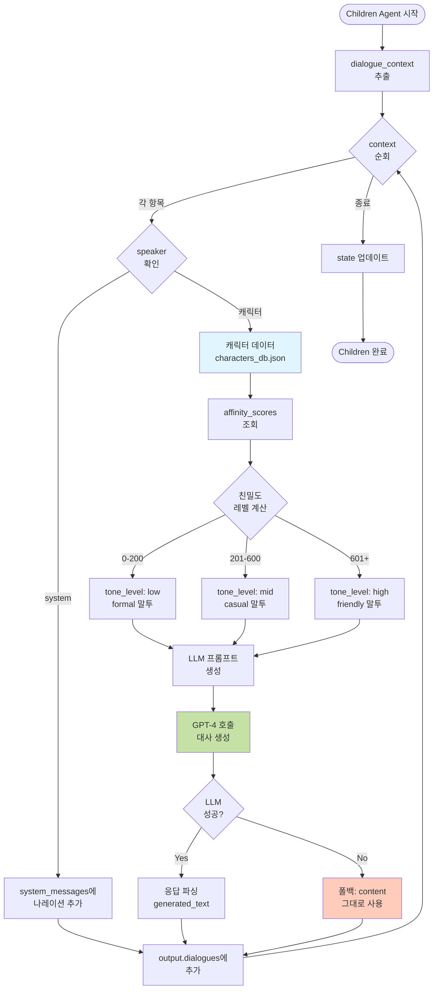

### 6.4 친밀도 기반 말투 시스템

#### 친밀도 레벨 구분

| 레벨 | 친밀도 점수 | 말투 (formality) | 특징 |
|------|-------------|------------------|------|
| **Low** | 0 ~ 200 | formal (존댓말) | "~합니다", "~해요", 거리감 있음 |
| **Mid** | 201 ~ 600 | casual (반말) | "~해", "~야", 친근함 |
| **High** | 601+ | friendly (친한 반말) | "~할게!", "~자!", 애정 표현 |

#### 캐릭터별 예시 (characters_db.json)

**탄지로 (tanjiro)**:

```json
{
  "name_kr": "탄지로",
  "personality": "성실하고 따뜻한 마음을 가진 소년. 가족을 매우 소중히 여기며...",
  "speech_pattern": "정중하고 따뜻한 말투. '~할게요', '~해주세요'",
  "tone_by_affinity": {
    "low": {
      "formality": "formal",
      "example": "안녕하세요, {{user}}님. 제 이름은 카마도 탄지로입니다.",
      "traits": ["정중함", "거리감", "존댓말"]
    },
    "mid": {
      "formality": "casual",
      "example": "{{user}}, 우리 함께 힘을 합치자!",
      "traits": ["친근함", "반말", "동료애"]
    },
    "high": {
      "formality": "friendly",
      "example": "{{user}}! 네가 있어서 정말 든든해!",
      "traits": ["애정", "친밀감", "격려"]
    }
  },
  "emoji": "🔥",
  "color": "#FF5722"
}
```

**이노스케 (inosuke)**:

```json
{
  "name_kr": "이노스케",
  "personality": "산에서 자란 야생적인 성격. 자존심이 강하고 싸움을 좋아함...",
  "speech_pattern": "거칠고 직설적. '크하하!', '이 몸이~', '대장'",
  "tone_by_affinity": {
    "low": {
      "formality": "aggressive",
      "example": "흥! 약한 놈이 감히 나한테 말을 거냐?",
      "traits": ["공격적", "무시", "자존심"]
    },
    "mid": {
      "formality": "rough_friendly",
      "example": "크하하! {{user}}, 너도 꽤 하는구나!",
      "traits": ["거친 인정", "경쟁심", "동료"]
    },
    "high": {
      "formality": "loyal",
      "example": "{{user}}! 이 몸이 지켜주마!",
      "traits": ["충성", "보호 본능", "신뢰"]
    }
  },
  "emoji": "🐗",
  "color": "#4CAF50"
}
```

### 6.5 LLM 프롬프트 생성 (GPT-4)

#### System Prompt 구조

```
당신은 '{char_name_kr}' 캐릭터입니다.

**캐릭터 설정**:
- 이름: {char_name_kr}
- 성격: {personality}
- 말투: {speech_pattern}
- 현재 친밀도 레벨: {tone_level} ({formality})
- 친밀도 점수: {affinity} / 1000

**말투 가이드**:
{tone_traits}

**예시**:
{tone_example}

**상황**: {current_stage} 스테이지

**요청**:
다음 상황에 맞는 대사를 생성하세요.
- 감정: {emotion}
- 상황: {situation}

**주의사항**:
- 반드시 {formality} 말투를 유지하세요.
- {char_name_kr}의 성격과 말투를 정확히 반영하세요.
- 자연스럽고 몰입감 있는 대사를 만드세요.
- {{user}}는 '{user_name}'로 치환하세요.
```

#### User Prompt

```
상황: {situation_description}
감정: {emotion}

대사를 생성해주세요.
```

#### LLM 응답

```json
{
  "generated_text": "여행자, 우리 함께 힘을 합치자! 🔥"
}
```

### 6.6 케이스별 처리 예시

#### Case 1: 낮은 친밀도 (Low - formal)

| 항목 | 값 |
|------|-----|
| **캐릭터** | 탄지로 |
| **친밀도** | 150 |
| **tone_level** | low |
| **formality** | formal |
| **situation** | "{{user}}를 도와야 해!" |
| **emotion** | determined |
| **LLM 프롬프트** | "정중한 존댓말로, determined 감정을 표현..." |
| **생성 대사** | "여행자님, 제가 도와드리겠습니다. 함께 힘을 합치시죠!" |
| **Note** | "~님", "~습니다" 존댓말 사용 |

#### Case 2: 중간 친밀도 (Mid - casual)

| 항목 | 값 |
|------|-----|
| **캐릭터** | 탄지로 |
| **친밀도** | 400 |
| **tone_level** | mid |
| **formality** | casual |
| **situation** | "{{user}}를 도와야 해!" |
| **emotion** | determined |
| **생성 대사** | "여행자, 우리 함께 힘을 합치자! 🔥" |
| **Note** | 반말, 친근한 톤 |

#### Case 3: 높은 친밀도 (High - friendly)

| 항목 | 값 |
|------|-----|
| **캐릭터** | 탄지로 |
| **친밀도** | 750 |
| **tone_level** | high |
| **formality** | friendly |
| **situation** | "{{user}}를 도와야 해!" |
| **emotion** | determined |
| **생성 대사** | "여행자! 네가 있어서 정말 든든해! 우리 꼭 이겨내자! 💪🔥" |
| **Note** | 애정 표현, 이모지 추가, 격려 |

#### Case 4: 이노스케 야생적 말투 (Low)

| 항목 | 값 |
|------|-----|
| **캐릭터** | 이노스케 |
| **친밀도** | 100 |
| **tone_level** | low |
| **formality** | aggressive |
| **situation** | "누가 나한테 도움을 청해?" |
| **emotion** | annoyed |
| **생성 대사** | "흥! 약한 놈이 감히 이 몸에게 말을 거냐? 크하하!" |
| **Note** | 공격적, 자존심 강함 |

#### Case 5: 이노스케 인정 (High)

| 항목 | 값 |
|------|-----|
| **캐릭터** | 이노스케 |
| **친밀도** | 700 |
| **tone_level** | high |
| **formality** | loyal |
| **situation** | "{{user}}를 보호해야 해" |
| **emotion** | protective |
| **생성 대사** | "여행자! 이 몸이 지켜주마! 저돌맹진!! 🐗💨" |
| **Note** | 충성심, 보호 본능 |

#### Case 6: System 나레이션

| 항목 | 값 |
|------|-----|
| **speaker** | system |
| **content** | "열차의 충격으로 당신이 눈을 뜬다." |
| **처리** | LLM 호출 없이 그대로 system_messages에 추가 |
| **출력** | "💨 열차의 충격으로 당신이 눈을 뜬다." |
| **Note** | 이모지만 추가 |

#### Case 7: LLM 실패 (폴백)

| 항목 | 값 |
|------|-----|
| **캐릭터** | 탄지로 |
| **LLM 호출** | 타임아웃 실패 |
| **폴백 처리** | content 필드 그대로 사용 |
| **생성 대사** | "{{user}}!! 괜찮아?!" (원본 유지) |
| **Note** | {{user}}는 user_name으로 치환 |
| **처리 시간** | 5010ms (타임아웃) |

### 6.7 출력 JSON 구조

```json
{
  "output": {
    "dialogues": [
      {
        "speaker": "탄지로",
        "text": "여행자, 우리 함께 힘을 합치자! 🔥",
        "emotion": "determined",
        "affinity_level": "mid",
        "image": "tanjiro_determined"
      }
    ],
    "system_messages": [
      "💨 열차의 충격으로 당신이 눈을 뜬다."
    ]
  },
  "next_node": "dialogue_agent",
  "meta": {
    "processed_by": "children_agent",
    "llm_calls": 1,
    "processing_time_ms": 650
  }
}
```

---

## 7. Dialogue Agent 상세 분석

### 7.1 역할 및 책임

Dialogue Agent는 **최종 검증 및 출력 포맷팅**을 담당합니다.

**핵심 기능**:
1. **형식 검증**: 대사가 캐릭터 설정에 맞는지 확인
2. **이모지 추가**: 감정에 맞는 이모지 자동 추가
3. **줄바꿈 정리**: 가독성 향상
4. **최종 출력**: 사용자에게 표시할 텍스트 완성

### 7.2 입력 JSON 구조

```json
{
  "output": {
    "dialogues": [
      {
        "speaker": "탄지로",
        "text": "여행자, 함께 힘을 합치자!",
        "emotion": "determined"
      }
    ],
    "system_messages": [
      "열차의 충격으로..."
    ]
  }
}
```

### 7.3 처리 로직

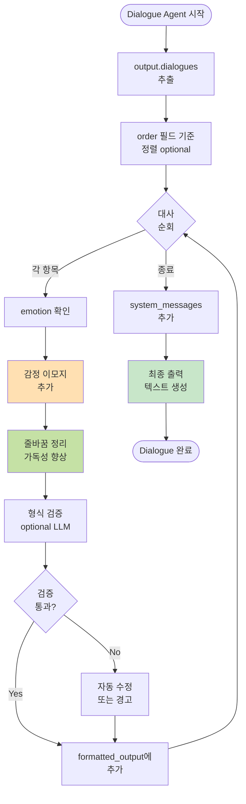

### 7.4 감정별 이모지 매핑

| Emotion | 이모지 | 설명 |
|---------|--------|------|
| neutral | - | 이모지 없음 |
| happy | 😊 | 행복, 기쁨 |
| excited | 🤩 | 흥분, 열정 |
| worried | 😰 | 걱정, 불안 |
| sad | 😢 | 슬픔 |
| angry | 😠 | 분노 |
| determined | 🔥 | 결심, 의지 |
| shocked | 😱 | 충격 |
| confused | 🤔 | 혼란 |
| relieved | 😌 | 안도 |
| proud | 😤 | 자랑스러움 |

### 7.5 최종 출력 포맷

```
==========================================
턴 3
==========================================

💨 [시스템]: 열차의 충격으로 당신이 눈을 뜬다.

🔥 [탄지로]: 여행자, 우리 함께 힘을 합치자!

==========================================

💡 입력을 기다리고 있습니다...
```

### 7.6 출력 JSON 구조

```json
{
  "output": {
    "formatted_output": "...(위 포맷)",
    "dialogues": [...],
    "system_messages": [...]
  },
  "next_node": "router",  // 다음 턴 시작
  "meta": {
    "processed_by": "dialogue_agent"
  }
}
```

---

## 8. 데이터 흐름 완전 분석

### 8.1 전체 데이터 흐름 (정상 플레이)

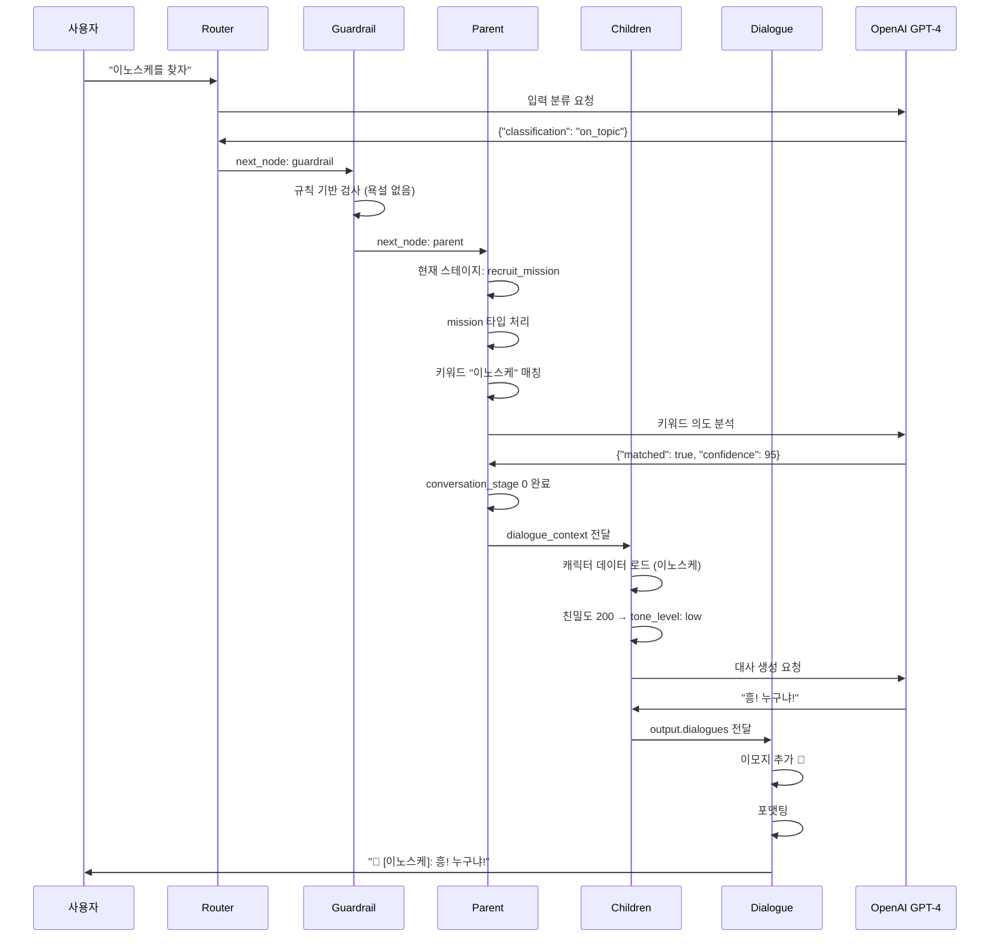

### 8.2 예외 케이스 흐름 (욕설 차단)

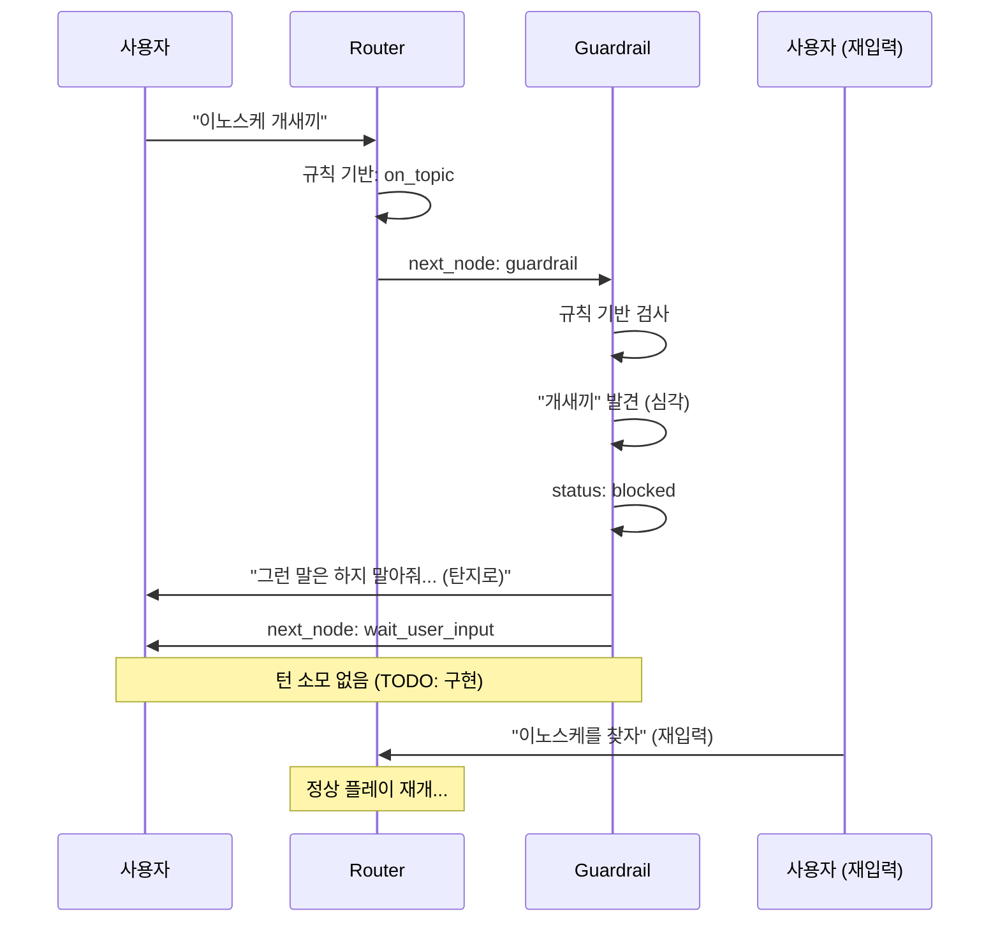

### 8.3 LLM 실패 케이스 (폴백)

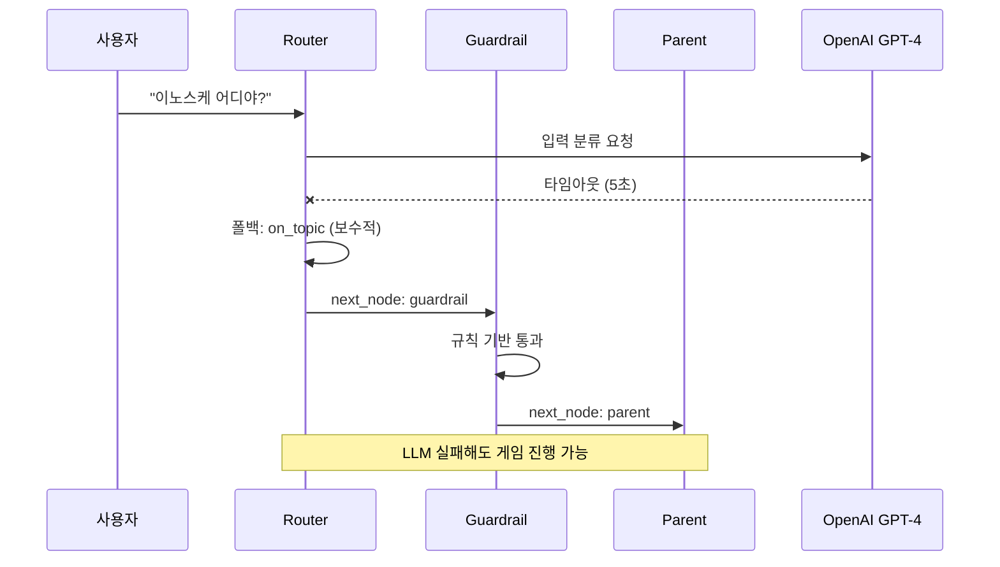

---

## 9. 케이스별 시퀀스 다이어그램

### 9.1 Case 1: 정상 플레이 (히든 엔딩)

생략 (위 8.1 참조)

### 9.2 Case 2: 무모한 희생 (기본 엔딩)

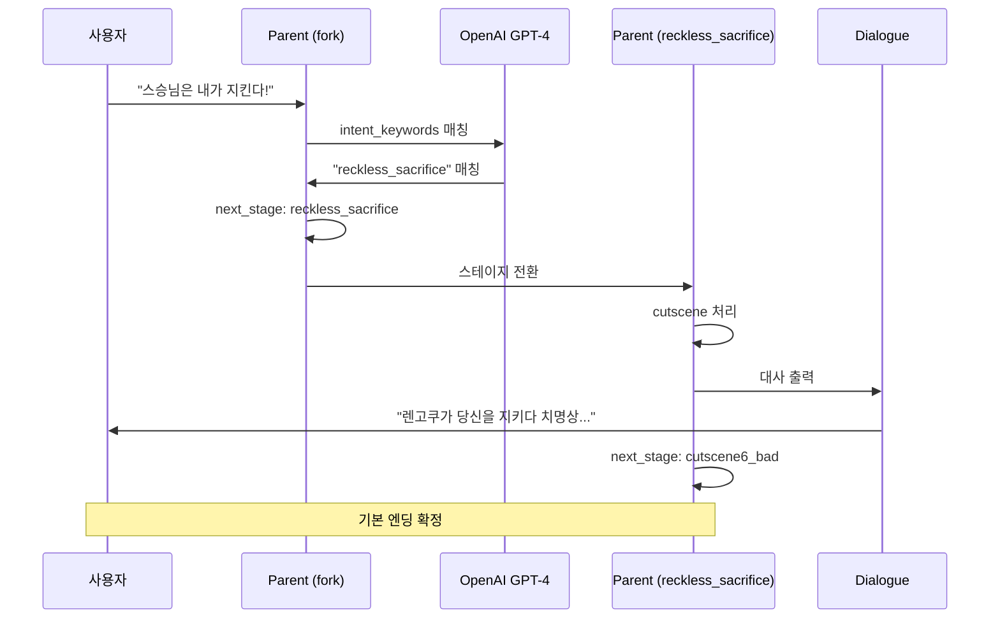

### 9.3 Case 3: 시간 초과 (mission)

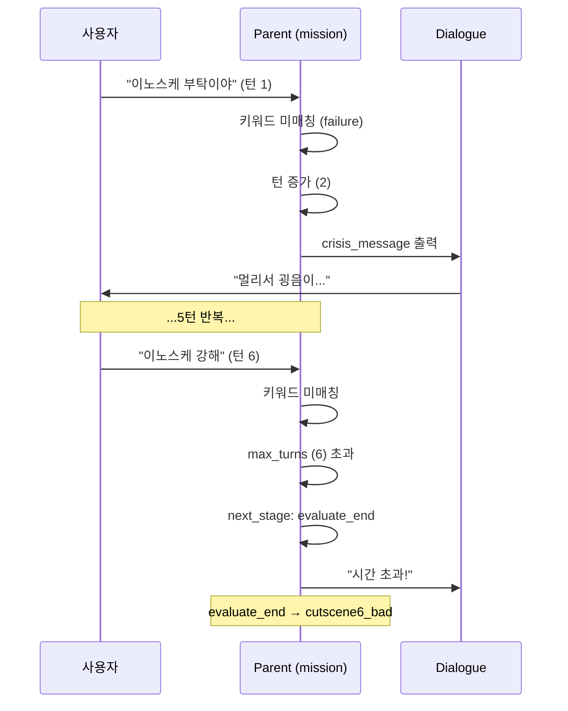

---

## 10. 성능 및 병목 분석

### 10.1 Agent별 처리 시간

| Agent | 최소 | 평균 | 최대 | LLM 호출 | 병목 요인 |
|-------|------|------|------|----------|-----------|
| **Router** | 5ms | 150ms | 5010ms | 조건부 | LLM 타임아웃 |
| **Guardrail** | 3ms | 120ms | 5200ms | 조건부 | LLM 타임아웃 |
| **Parent** | 50ms | 300ms | 1000ms | 조건부 (choice/mission) | JSON 파싱 + LLM |
| **Children** | 200ms | 650ms | 5800ms | 항상 | LLM 대사 생성 (가장 큼) |
| **Dialogue** | 10ms | 30ms | 80ms | 선택 | 문자열 처리 |
| **총합** | 268ms | 1250ms | 17170ms | - | - |

**평균 처리 시간**: **약 1.25초**

### 10.2 LLM 호출 횟수 (턴당)

| 시나리오 | Router | Guardrail | Parent | Children | 총 LLM 호출 | 예상 비용 (GPT-4) |
|----------|--------|-----------|--------|----------|-------------|-------------------|
| **정상 (cutscene)** | 1 | 0 | 0 | 2 | 3 | $0.015 |
| **choice 선택** | 1 | 0 | 1 | 1 | 3 | $0.015 |
| **mission 설득** | 1 | 0 | 1 | 2 | 4 | $0.020 |
| **욕설 차단** | 1 | 1 | 0 | 0 | 2 | $0.010 |
| **off_topic** | 1 | 0 | 0 | 1 | 2 | $0.010 |

**평균 턴당 LLM 비용**: **약 $0.015** (GPT-4 기준)

**전체 플레이 비용** (20턴 가정): **약 $0.30**

### 10.3 병목 구간

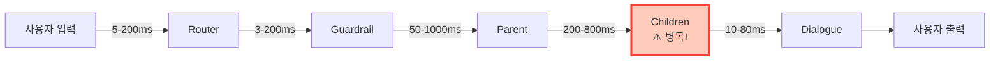

**최대 병목**: **Children Agent의 LLM 대사 생성** (200-800ms)

### 10.4 최적화 방안

| 구간 | 현재 문제 | 개선 방안 | 예상 효과 |
|------|-----------|-----------|-----------|
| **Router** | LLM 타임아웃 (5초) | 규칙 기반 강화 | 95% 케이스 LLM 스킵 |
| **Guardrail** | LLM 호출 빈도 높음 | 규칙 기반 강화 + 캐싱 | LLM 호출 70% 감소 |
| **Children** | 매 턴 LLM 호출 | 대사 캐싱 (유사 상황) | 30% 속도 향상 |
| **Children** | GPT-4 비용 높음 | GPT-3.5로 전환 (일부) | 비용 70% 절감 |
| **전체** | 순차 처리 | 병렬 LLM 호출 (가능 시) | 40% 속도 향상 |

### 10.5 목표 성능

| 지표 | 현재 | 목표 |
|------|------|------|
| **평균 응답 시간** | 1.25초 | 0.8초 이하 |
| **턴당 LLM 비용** | $0.015 | $0.005 이하 |
| **LLM 타임아웃 빈도** | 5% | 1% 이하 |

---

## 11. 요약

### 11.1 핵심 아키텍처

1. **LangGraph 기반 순차 처리**: Router → Guardrail → Parent → Children → Dialogue
2. **LLM 활용**: GPT-4로 동적 대사 생성, 의도 파악, 안전성 검증
3. **스테이지 기반 게임 진행**: cutscene/choice/mission/branch 타입
4. **친밀도 시스템**: 0-1000 점수에 따른 말투 변화
5. **턴제 시스템**: max_turns, turn_cost, crisis_messages

### 11.2 주요 개선 사항 (멘토 피드백 반영)

| 문제 | 해결 방안 | 파일 위치 |
|------|-----------|-----------|
| 하드코딩된 대사 | LLM Slot 시스템 | parent_agent.py, children_agent.py |
| Fallback 턴 소모 | blocked 시 turn_count -= 1 | guardrail_agent.py:113 |
| Loop Flag 없음 | loop_limit 체크 | parent_agent.py |
| Weak Guardrail | LLM 맥락 분석 | guardrail_agent.py:186 |
| 캐릭터 DB 단일 파일 | YAML 분리 (TODO) | characters/ 폴더 |

### 11.3 다음 단계

1. **Phase 1** (오늘): Quick Wins (Guardrail 개선, Loop Flag)
2. **Phase 2** (일요일): LLM Slot 구현
3. **Phase 3** (월-화): Exchanges 다중 대화
4. **Phase 4** (수-목): 테스트 + 발표 준비

---

**문서 끝**

이 문서는 조원들이 **코드를 읽지 않고도** 전체 시스템을 완벽히 이해할 수 있도록 작성되었습니다.
