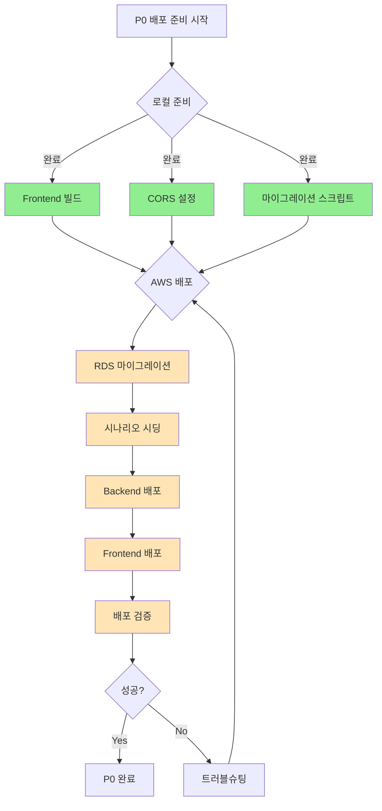

# 19. AWS 배포 준비 작업 (P0 완료)

**작업일**: 2025-11-03
**브랜치**: `cloud-full-stack-setup`
**커밋**: `8bbdaa9`
**상태**: P0 로컬 준비 완료, AWS 배포 대기

---

## 📋 작업 개요

AWS RDS와 EC2 환경에 KIME Chat 서비스를 배포하기 위한 P0(Critical) 준비 작업을 완료했습니다. 로컬 환경에서 할 수 있는 모든 설정과 빌드를 완료했으며, AWS에서 실행할 배포 스크립트와 가이드를 작성했습니다.

---

## ✅ 완료된 작업

### 1. Frontend 프로덕션 빌드

**위치**: `front/dist/`

**빌드 결과**:
```bash
✓ built in 924ms

dist/index.html                   0.54 kB │ gzip:   0.38 kB
dist/assets/index-zTGyuh8a.css   49.23 kB │ gzip:   8.19 kB
dist/assets/index-xtd3mz-K.js   323.02 kB │ gzip: 101.26 kB
dist/images/                      30개 파일
```

**환경변수 설정**: `front/.env.production`
```bash
VITE_API_URL=http://kime-alb-1043119388.ap-northeast-2.elb.amazonaws.com
VITE_ENVIRONMENT=production
```

### 2. Backend CORS 설정 완료

**파일**: `backend/api_server.py` (Line 86-92)

**변경사항**:
```python
app.add_middleware(
    CORSMiddleware,
    allow_origins=[
        "http://localhost:3000",
        "http://localhost:3001",
        "http://localhost:5173",
        # AWS ALB 엔드포인트 추가 (프로덕션)
        "http://kime-alb-1043119388.ap-northeast-2.elb.amazonaws.com",
    ],
    allow_credentials=True,
    allow_methods=["*"],
    allow_headers=["*"],
)
```

### 3. RDS 마이그레이션 스크립트 준비

**파일**: `backend/scripts/run_migrations.sh`

**기능**:
- 11개의 마이그레이션 파일을 순서대로 실행
- `.env.production` 환경변수 로드
- RDS 연결 정보 자동 설정
- 실행 로그 출력

**실행 명령어**:
```bash
cd backend/scripts
./run_migrations.sh production
```

**마이그레이션 파일 목록**:
1. `001_initial_schema.sql` - 기본 스키마 및 테이블
2. `002_logdb_training_logs.sql` - 학습 로그 시스템
3. `003_users_table.sql` - 사용자 테이블
4. `004_password_reset_tokens.sql` - 비밀번호 재설정
5. `005_conversation_summary.sql` - 대화 요약
6. `006_user_memories.sql` - 사용자 장기 기억
7. `007_install_pgvector.sql` - pgvector 확장
8. `008_graph_rag_schema.sql` - Graph RAG 스키마
9. `009_user_credits.sql` - 사용자 크레딧 시스템
10. `012_user_progression.sql` - 사용자 진행도 시스템
11. `013_scenarios_system.sql` - 시나리오 시스템

### 4. 시나리오 시딩 스크립트 개선

**파일**: `backend/scripts/seed_scenarios.py`

**변경사항**:
```python
# 환경별 실행 지원
python seed_scenarios.py              # Local (5433 포트)
python seed_scenarios.py production   # RDS (5432 포트)
```

**시딩 데이터**:
- 기차역 (train)
- 나타구모 산 (natagumo)
- 무한성 (infinity)
- 유곽 (red_light)
- 도공 마을 (swordsmith)
- 무한 열차 (mugen_train)

### 5. 배포 가이드 문서 작성

#### P0_DEPLOYMENT_GUIDE.md
**위치**: 프로젝트 루트
**내용**:
- RDS 마이그레이션 실행 방법
- 시나리오 데이터 시딩
- Backend 배포 (EC2)
- Frontend 배포 (EC2 Nginx 또는 S3 + CloudFront)
- 배포 후 검증 체크리스트
- 트러블슈팅 가이드

#### RDS_DBEAVER_SETUP.md
**위치**: 프로젝트 루트
**내용**:
- DBeaver로 RDS 연결 설정
- AWS 보안 그룹 설정 방법
- 데이터 모니터링 쿼리
- 9개의 데모 쿼리 파일 사용법
- 실시간 모니터링 설정
- 트러블슈팅

### 6. 데모 쿼리 파일 추가

**위치**: `backend/demo_queries/`

**파일 목록**:
1. `01_session_check.sql` - 세션 확인
2. `02_dialogues_check.sql` - 대화 기록 확인
3. `03_training_logs_check.sql` - 학습 로그 확인
4. `04_entities_check.sql` - 엔티티 확인
5. `05_entity_mentions_check.sql` - 엔티티 멘션 확인
6. `06_conversation_summary_check.sql` - 대화 요약 확인
7. `07_overall_stats.sql` - 전체 통계
8. `08_performance_analysis.sql` - 성능 분석
9. `09_user_memories.sql` - 사용자 기억 확인
10. `README.md` - 쿼리 사용 가이드

### 7. Git 커밋 및 보안 확인

**커밋 ID**: `8bbdaa9`
**커밋 메시지**: "feat: Add AWS deployment infrastructure and P0 preparation"

**변경 파일**:
- 22개 파일
- 3,331 줄 추가
- 142 줄 삭제

**보안 확인**:
- ✅ `.env` 파일이 `.gitignore`에 포함됨
- ✅ `.env` 파일이 Git 히스토리에 없음
- ✅ API 키가 Git에 노출되지 않음

---

## 🏗️ AWS 인프라 정보

### RDS PostgreSQL
```
Endpoint: kime-db.c1q6k80aex9v.ap-northeast-2.rds.amazonaws.com
Port:     5432
Database: kimedb
User:     kime
Password: jnhzlsyihvxwfhvz (환경변수에서만 관리)
```

### Application Load Balancer (ALB)
```
DNS: http://kime-alb-1043119388.ap-northeast-2.elb.amazonaws.com
```

### EC2 인스턴스
```
Backend-1:  (IP 미정)
Backend-2:  (IP 미정)
Frontend-1: 54.180.234.223
Frontend-2: 3.39.251.70
```

### ElastiCache Redis
```
Endpoint: clustercfg.kime-redis-subnet-group.yp94db.apn2.cache.amazonaws.com
Port:     6379
```

---

## ⏳ 대기 중인 작업 (AWS 실행 필요)

### 1. RDS 마이그레이션 실행 (30-60분)

**EC2에서 실행**:
```bash
ssh -i ~/.ssh/kime-keypair.pem ubuntu@<backend-ec2-ip>
cd ~/workspace/backend/scripts
./run_migrations.sh production
```

**예상 결과**:
- 11개 마이그레이션 파일 실행
- 16개 테이블 생성
- 5개 뷰 생성
- 3개 트리거 생성

### 2. 시나리오 데이터 시딩 (5-10분)

**EC2에서 실행**:
```bash
cd ~/workspace/backend
python scripts/seed_scenarios.py production
```

**예상 결과**:
- 6개 시나리오 삽입
- 각 시나리오의 씬 데이터 삽입

### 3. Backend 배포 (30분)

**방법 1: 배포 스크립트 사용**:
```bash
cd backend
./deploy_to_aws.sh backend-1
./deploy_to_aws.sh backend-2
```

**방법 2: 수동 배포**:
```bash
# 로컬에서 파일 전송
tar -czf backend.tar.gz backend/
scp -i ~/.ssh/kime-keypair.pem backend.tar.gz ubuntu@<backend-ip>:~/

# EC2에서 실행
ssh -i ~/.ssh/kime-keypair.pem ubuntu@<backend-ip>
tar -xzf backend.tar.gz
cd backend
pip install -r requirements.txt
python api_server.py
```

### 4. Frontend 배포 (30분)

**방법 1: Nginx (EC2)**:
```bash
cd front
scp -i ~/.ssh/kime-keypair.pem -r dist/* ubuntu@54.180.234.223:/var/www/html/
scp -i ~/.ssh/kime-keypair.pem -r dist/* ubuntu@3.39.251.70:/var/www/html/
```

**방법 2: S3 + CloudFront (권장)**:
```bash
aws s3 sync dist/ s3://kime-frontend-bucket/ --acl public-read
aws cloudfront create-invalidation --distribution-id <dist-id> --paths "/*"
```

### 5. 배포 후 검증 (10분)

**ALB Health Check**:
```bash
curl http://kime-alb-1043119388.ap-northeast-2.elb.amazonaws.com/api/health
```

**API 테스트**:
```bash
# 시나리오 목록
curl http://kime-alb-1043119388.ap-northeast-2.elb.amazonaws.com/api/scenarios

# 회원가입
curl -X POST http://kime-alb-1043119388.ap-northeast-2.elb.amazonaws.com/api/auth/register \
  -H "Content-Type: application/json" \
  -d '{"username":"test","password":"test123","email":"test@example.com"}'
```

---

## 🚨 알려진 이슈 (Known Issues)

### 우선순위: P1 (배포 전 해결 권장)

### 1. DB 테이블 불일치 (Critical!)

**상태**: 🔴 **미해결** (RDS 마이그레이션 전 해결 필요)

**문제**:
- `db_manager.py:1640-1675`의 `initialize_user_progression()` 함수가 존재하지 않는 구버전 테이블을 참조

**코드가 사용하는 테이블** (구버전 - 존재하지 않음):
```python
# db_manager.py Line 1646-1665
statedb.user_progression_ranks       ❌ 존재하지 않음
statedb.user_progression_stats       ❌ 존재하지 않음
statedb.user_progression_equipment   ❌ 존재하지 않음
```

**마이그레이션의 실제 테이블** (신버전 - 012_user_progression.sql):
```sql
statedb.user_progression    ✅ 통합 테이블 (rank, level, XP, stats 포함)
statedb.user_equipment      ✅ 장비 테이블 (sword, uniform, crow)
statedb.xp_transactions     ✅ 경험치 거래 내역
```

**영향**:
- 회원가입 시 progression 초기화 실패
- 경고 메시지 출력: `⚠️ Warning: Failed to initialize progression for user`
- **그러나 회원가입 자체는 성공** (users 테이블에 정상 삽입)
- Trigger가 자동으로 progression 초기화함 (마이그레이션 파일의 `create_user_progression()` 함수)

**해결 방법**:
```python
# backend/src/database/db_manager.py:1640-1675 수정 필요

# 기존 코드 (구버전 테이블 참조)
def initialize_user_progression(self, user_id: str) -> bool:
    cur.execute("""
        INSERT INTO statedb.user_progression_ranks (user_id, rank_code, level, experience_points)
        VALUES (%s, 'trainee', 1, 0)
    """, (user_id,))
    # ... 이하 생략

# 수정된 코드 (신버전 테이블 사용)
def initialize_user_progression(self, user_id: str) -> bool:
    """
    주의: 이 함수는 더 이상 필요하지 않을 수 있음
    왜냐하면 012_user_progression.sql의 Trigger가 자동으로 초기화하기 때문
    """
    try:
        with self.get_connection() as conn:
            with conn.cursor() as cur:
                # 1. user_progression 초기화
                cur.execute("""
                    INSERT INTO statedb.user_progression (user_id, rank_code, experience_points, level)
                    VALUES (%s, 'novice', 0, 1)
                    ON CONFLICT (user_id) DO NOTHING
                """, (user_id,))

                # 2. user_equipment 초기화
                cur.execute("""
                    INSERT INTO statedb.user_equipment (user_id, sword_status, uniform_status, crow_status)
                    VALUES (%s, 'good', 'worn', 'waiting')
                    ON CONFLICT (user_id) DO NOTHING
                """, (user_id,))

        return True
    except Exception as e:
        print(f"⚠️ Warning: Failed to initialize progression for user {user_id}: {e}")
        return False
```

**우선순위**: P1 (High)
**예상 소요 시간**: 15분

---

### 2. HybridSessionManager 초기화 오류

**상태**: 🟡 **경고** (서비스 작동에는 영향 없음)

**오류 메시지**:
```
[INFO] [CHILDREN] session_manager_init_failed
(error=HybridSessionManager.__init__() missing 1 required positional argument: 'cache_manager')
[INFO] [ROUTER] session_manager_init_failed
```

**영향**:
- CHILDREN 에이전트와 ROUTER 에이전트가 HybridSessionManager를 사용하지 못함
- **하지만 기본 SessionManager로 폴백되어 서비스는 정상 작동**
- Redis 캐싱 기능만 비활성화됨

**원인**:
- `src/agents/children_agent.py`와 `src/agents/router_agent.py`에서 HybridSessionManager를 초기화할 때 `cache_manager` 파라미터 누락

**해결 방법**:
```python
# 두 파일에서 동일하게 수정
# src/agents/children_agent.py
# src/agents/router_agent.py

# 기존 코드
self.session_manager = HybridSessionManager(self.db_manager)

# 수정된 코드
from src.cache.cache_manager import CacheManager
cache_manager = CacheManager()
self.session_manager = HybridSessionManager(self.db_manager, cache_manager)
```

**우선순위**: P2 (Medium)
**예상 소요 시간**: 10분

---

### 3. 로컬 DB 마이그레이션 미실행

**상태**: 🟡 **경고** (개발 환경에만 영향)

**문제**:
- 로컬 PostgreSQL (5433 포트)에 마이그레이션이 실행되지 않음
- RDS (5432 포트)만 마이그레이션 예정

**영향**:
- 로컬 개발 환경에서 user_progression 관련 기능 오류 발생
- RDS 배포 후에는 문제없음

**해결 방법**:
```bash
# 로컬 DB 마이그레이션 실행 (선택사항)
cd backend/scripts
./run_migrations.sh local    # 또는 환경변수 없이 실행
```

**우선순위**: P3 (Low) - RDS만 사용할 경우 무시 가능

---

## 📊 배포 체크리스트



**체크리스트**:

**로컬 준비 (완료)**:
- [x] Frontend 빌드 완료
- [x] Frontend 환경변수 설정 (.env.production)
- [x] Backend CORS 설정 완료
- [x] RDS 마이그레이션 스크립트 준비
- [x] 시나리오 시딩 스크립트 준비
- [x] 배포 가이드 문서 작성
- [x] Git 커밋 완료

**AWS 배포 (대기 중)**:
- [ ] AWS 보안 그룹 설정 (RDS, EC2)
- [ ] RDS 마이그레이션 실행
- [ ] 시나리오 데이터 시딩
- [ ] Backend-1 배포
- [ ] Backend-2 배포
- [ ] Frontend-1 배포
- [ ] Frontend-2 배포
- [ ] ALB Health Check 통과
- [ ] Frontend 페이지 로드 확인
- [ ] 로그인/회원가입 테스트
- [ ] 시나리오 목록 로드 테스트
- [ ] Chat 기능 테스트

---

## 📁 생성된 파일

### 문서
- `P0_DEPLOYMENT_GUIDE.md` - P0 배포 가이드
- `RDS_DBEAVER_SETUP.md` - DBeaver RDS 연결 가이드
- `README.md` - 프로젝트 README

### 스크립트
- `backend/scripts/run_migrations.sh` - RDS 마이그레이션 스크립트
- `backend/deploy_to_aws.sh` - AWS 배포 스크립트 (템플릿)

### 빌드 산출물
- `front/dist/` - Frontend 프로덕션 빌드
  - `index.html`
  - `assets/index-zTGyuh8a.css`
  - `assets/index-xtd3mz-K.js`
  - `images/` (30개 파일)

### 쿼리 파일
- `backend/demo_queries/` (10개 파일)

### 테스트 스크립트
- `backend/test_data_flow.py` - 데이터 플로우 테스트
- `backend/test_summary_generation.py` - 요약 생성 테스트

---

## 🔐 보안 설정 확인

### .gitignore 설정 ✅
```
.env
.env.local
.env.development
.env.production
.env.*.local
```

### Git 히스토리 확인 ✅
- `.env` 파일이 과거에도 커밋된 적 없음
- API 키가 Git에 노출되지 않음

### 환경변수 관리 원칙
1. ✅ `.env` 파일에 실제 API 키 저장 (로컬)
2. ✅ `.gitignore`로 Git 커밋 방지
3. ✅ AWS에서는 Systems Manager Parameter Store 또는 Secrets Manager 사용 권장

---

## 🔄 다음 단계

### 즉시 실행 (P0 완료)
1. AWS 보안 그룹 설정
2. RDS 마이그레이션 실행
3. 시나리오 데이터 시딩
4. Backend/Frontend 배포
5. 배포 검증

### 단기 (P1 - 1주일 내)
1. JWT Secret 강화
2. DB Password 강화
3. SSH 접근 제한
4. CloudWatch Logs 설정
5. Health Check Alerts 설정

### 중기 (P2 - 1개월 내)
1. HTTPS 설정 (ALB + ACM)
2. CloudFront CDN 설정
3. S3 백업 자동화
4. 모니터링 대시보드 구축

---

## 📊 프로젝트 현황

### 데이터베이스 스키마
```
statedb (메인)
├── users (사용자)
├── user_progression (진행도)
├── user_equipment (장비)
├── user_memories (장기 기억)
├── user_credits (크레딧)
├── chat_sessions (세션)
├── dialogues (대화)
├── conversation_summaries (대화 요약)
├── scenarios (시나리오)
├── scenes (씬)
├── scene_dialogues (씬 대화)
├── password_reset_tokens (비밀번호 재설정)
├── xp_transactions (경험치 거래)
├── entities (Graph RAG 엔티티)
├── entity_relationships (엔티티 관계)
└── entity_mentions (엔티티 멘션)

logdb (로깅)
└── training_logs (학습 로그)
```

### API 엔드포인트
```
/api/health           - Health Check
/api/scenarios        - 시나리오 목록
/api/chat             - Chat API
/api/auth/*           - 인증 (회원가입, 로그인, OAuth)
/api/users/*          - 사용자 관리
/api/users/me/memories/* - 사용자 기억 CRUD
/api/progression/*    - 진행도 조회/업데이트
```

---

## 💡 참고 자료

### 관련 문서
- [15_advanced_authentication_system.md](./15_advanced_authentication_system.md) - 인증 시스템
- [16_complete_authentication_system.md](./16_complete_authentication_system.md) - 완전한 인증
- [17_database_structure_audit.md](./17_database_structure_audit.md) - DB 구조 감사
- [18_long_term_memory_user_issue.md](./18_long_term_memory_user_issue.md) - 장기 기억 이슈

### 외부 가이드
- [P0_DEPLOYMENT_GUIDE.md](../P0_DEPLOYMENT_GUIDE.md) - 배포 가이드
- [RDS_DBEAVER_SETUP.md](../RDS_DBEAVER_SETUP.md) - DBeaver 설정
- [backend/demo_queries/README.md](../backend/demo_queries/README.md) - 쿼리 가이드

---

## ✍️ 작성자 노트

이번 작업으로 AWS 배포를 위한 모든 로컬 준비를 완료했습니다.

**주요 성과**:
1. Frontend 프로덕션 빌드 완료 (924ms)
2. 11개 마이그레이션 파일 준비
3. 포괄적인 배포 가이드 작성
4. DBeaver 모니터링 환경 구축
5. 9개의 데모 쿼리로 데이터 분석 지원

**남은 작업**:
- AWS 콘솔에서 보안 그룹 설정
- EC2에 접속하여 마이그레이션 실행
- Backend/Frontend 배포
- 배포 검증

**예상 소요 시간**: 1.5-2시간

모든 스크립트와 가이드가 준비되어 있어, AWS 접근 권한만 있으면 즉시 배포를 시작할 수 있습니다.

---

**작성일**: 2025-11-03
**마지막 업데이트**: 2025-11-03
**Git 커밋**: 8bbdaa9
**브랜치**: cloud-full-stack-setup
