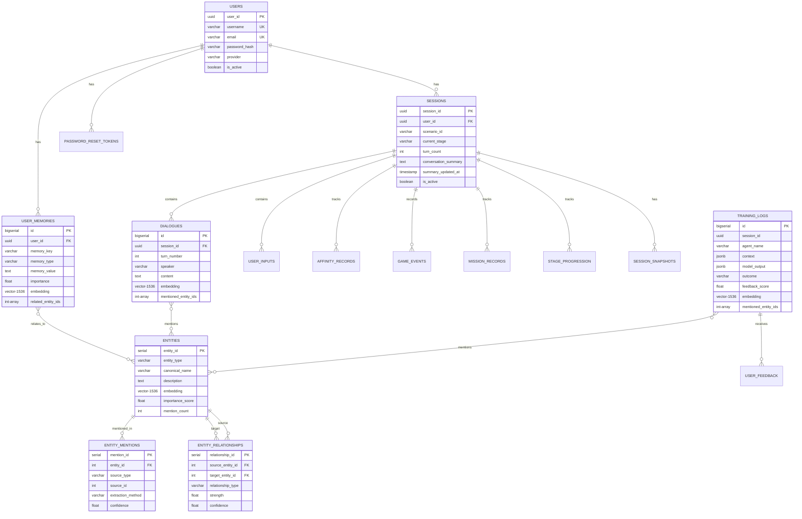

# KIME Chat Database 전체 구조 문서

**버전**: 1.0
**마지막 업데이트**: 2025-10-31
**PostgreSQL**: 15 with pgvector 0.8.1
**총 테이블 수**: 19개
**총 크기**: ~7.5 MB

---

## 📋 목차

1. [개요](#개요)
2. [스키마 구조](#스키마-구조)
3. [테이블 상세 설명](#테이블-상세-설명)
4. [ERD 다이어그램](#erd-다이어그램)
5. [외래키 관계](#외래키-관계)
6. [인덱스 전략](#인덱스-전략)
7. [데이터 통계](#데이터-통계)
8. [마이그레이션 이력](#마이그레이션-이력)

---

## 📊 개요

KIME Chat의 데이터베이스는 3개의 주요 스키마로 구성되어 있습니다:

- **statedb** (14 테이블): 게임 상태, 사용자, Graph RAG
- **public** (2 테이블): AI 훈련 데이터
- **logdb** (3 테이블): 시스템 로깅

### 주요 기능

1. **세션 관리**: 사용자 세션, 대화 기록, 스냅샷
2. **사용자 인증**: 사용자 계정, 비밀번호 재설정
3. **Graph RAG**: 엔티티 추출, 임베딩, 관계 매핑
4. **장기 기억**: 사용자별 기억 저장
5. **로깅 시스템**: 일반/에러/성능 로그
6. **AI 훈련**: Auto-labeling, 피드백

---

## 🗂️ 스키마 구조

### statedb (게임 상태 & Graph RAG)

| 테이블 | 크기 | 용도 |
|--------|------|------|
| **sessions** | 96 kB | 세션 정보 (대화 요약 포함) |
| **users** | 144 kB | 사용자 계정 |
| **entities** | 2224 kB | Graph RAG 엔티티 (캐릭터, 장소, 스킬 등) |
| **entity_mentions** | 80 kB | 엔티티 멘션 (출처 추적) |
| **entity_relationships** | 112 kB | 엔티티 간 관계 |
| **dialogues** | 136 kB | 대화 기록 |
| **user_inputs** | 64 kB | 사용자 입력 |
| **user_memories** | 208 kB | 장기 기억 |
| **affinity_records** | 72 kB | 캐릭터 호감도 |
| **game_events** | 88 kB | 게임 이벤트 |
| **mission_records** | 72 kB | 미션 기록 |
| **stage_progression** | 72 kB | 스테이지 진행도 |
| **session_snapshots** | 2184 kB | 세션 스냅샷 (Redis 백업) |
| **password_reset_tokens** | 40 kB | 비밀번호 재설정 토큰 |

### public (AI 훈련 데이터)

| 테이블 | 크기 | 용도 |
|--------|------|------|
| **training_logs** | 1152 kB | AI 훈련 로그 (auto-labeling 포함) |
| **user_feedback** | 32 kB | 사용자 피드백 |

### logdb (시스템 로깅)

| 테이블 | 크기 | 용도 |
|--------|------|------|
| **logs** | 136 kB | 일반 로그 (INFO, DEBUG, WARNING) |
| **error_logs** | 40 kB | 에러 로그 |
| **performance_metrics** | 88 kB | 성능 메트릭 |

---

## 📝 테이블 상세 설명

### 1. statedb.sessions

**용도**: 사용자 세션 관리 (대화 진행 상태)

**주요 컬럼**:
```
session_id (UUID, PK)           - 세션 고유 ID
scenario_id (VARCHAR)           - 시나리오 ID
user_name (VARCHAR)             - 사용자 이름
user_id (UUID, FK)              - 사용자 ID (users 테이블 참조)
current_stage (VARCHAR)         - 현재 스테이지
turn_count (INT)                - 총 대화 턴 수
conversation_summary (TEXT)     - 대화 요약 (장기기억용)
summary_updated_at (TIMESTAMP)  - 마지막 요약 시간
summary_turn_count (INT)        - 요약에 포함된 턴 수
is_active (BOOL)                - 활성 여부
```

**인덱스**:
- `sessions_pkey`: PRIMARY KEY (session_id)
- `idx_sessions_user`: user_id
- `idx_sessions_scenario`: scenario_id
- `idx_sessions_active`: is_active WHERE is_active = true
- `idx_sessions_created`: created_at DESC

**외래키**:
- `user_id` → `statedb.users(user_id)` ON DELETE SET NULL

**참조되는 곳** (CASCADE DELETE):
- affinity_records, dialogues, game_events, mission_records
- session_snapshots, stage_progression, user_inputs

---

### 2. statedb.users

**용도**: 사용자 계정 관리

**주요 컬럼**:
```
user_id (UUID, PK)              - 사용자 고유 ID
username (VARCHAR, UNIQUE)      - 사용자명
email (VARCHAR, UNIQUE)         - 이메일
password_hash (VARCHAR)         - 비밀번호 해시
provider (VARCHAR)              - 인증 제공자 ('email', 'google' 등)
display_name (VARCHAR)          - 표시 이름
last_login (TIMESTAMP)          - 마지막 로그인 시간
is_active (BOOL)                - 활성 여부
```

**인덱스**:
- `users_pkey`: PRIMARY KEY (user_id)
- `users_username_key`: UNIQUE (username)
- `users_email_key`: UNIQUE (email)
- `idx_users_username`, `idx_users_email`: 검색용
- `idx_users_provider`: provider
- `idx_users_active`: is_active WHERE is_active = true

**참조되는 곳**:
- sessions, user_memories, password_reset_tokens

---

### 3. statedb.entities (Graph RAG 핵심)

**용도**: Graph RAG 엔티티 저장 (캐릭터, 장소, 이벤트, 아이템, 스킬)

**주요 컬럼**:
```
entity_id (SERIAL, PK)          - 엔티티 ID
entity_type (VARCHAR)           - 타입 (character, location, event, item, skill)
entity_name (VARCHAR)           - 엔티티 이름
canonical_name (VARCHAR)        - 정규화된 이름 (중복 제거용)
description (TEXT)              - 설명
properties (JSONB)              - 추가 속성
embedding (vector(1536))        - 임베딩 벡터 (text-embedding-3-small)
importance_score (FLOAT)        - 중요도 (0.0 ~ 1.0)
community_id (INT)              - 커뮤니티 ID (향후 클러스터링용)
mention_count (INT)             - 언급 횟수
```

**제약조건**:
- `UNIQUE (entity_type, canonical_name)`: 타입+정규명 조합 유일
- `CHECK (entity_type IN ('character', 'location', 'event', 'item', 'skill'))`
- `CHECK (importance_score BETWEEN 0.0 AND 1.0)`

**인덱스**:
- `entities_pkey`: PRIMARY KEY (entity_id)
- `entities_entity_type_canonical_name_key`: UNIQUE (entity_type, canonical_name)
- `idx_entities_embedding`: IVFFlat (embedding vector_cosine_ops) - **벡터 검색**
- `idx_entities_type`: entity_type
- `idx_entities_importance`: importance_score DESC
- `idx_entities_mention_count`: mention_count DESC
- `idx_entities_canonical_name`: canonical_name
- `idx_entities_community`: community_id WHERE community_id IS NOT NULL

**참조되는 곳**:
- entity_mentions, entity_relationships (source/target)

**현재 데이터**: 8개 엔티티 (염의 호흡, 렌고쿠, 탄지로, 무한열차 등)

---

### 4. statedb.entity_mentions

**용도**: 엔티티가 언급된 출처 추적

**주요 컬럼**:
```
mention_id (SERIAL, PK)         - 멘션 ID
entity_id (INT, FK)             - 엔티티 ID
source_type (VARCHAR)           - 출처 타입 (training_log, dialogue, user_memory)
source_id (INT)                 - 출처 ID
session_id (VARCHAR)            - 세션 ID
turn_number (INT)               - 턴 번호
mention_context (TEXT)          - 멘션 컨텍스트
extraction_method (VARCHAR)     - 추출 방법 (rule, llm, manual)
confidence (FLOAT)              - 신뢰도 (0.0 ~ 1.0)
```

**제약조건**:
- `CHECK (source_type IN ('training_log', 'dialogue', 'user_memory'))`
- `CHECK (extraction_method IN ('rule', 'llm', 'manual'))`
- `CHECK (confidence BETWEEN 0.0 AND 1.0)`

**인덱스**:
- `entity_mentions_pkey`: PRIMARY KEY (mention_id)
- `idx_mentions_entity`: entity_id
- `idx_mentions_source`: (source_type, source_id)
- `idx_mentions_session`: session_id WHERE session_id IS NOT NULL

**외래키**:
- `entity_id` → `statedb.entities(entity_id)` ON DELETE CASCADE

**현재 데이터**: 29개 멘션

---

### 5. statedb.entity_relationships

**용도**: 엔티티 간 관계 매핑

**주요 컬럼**:
```
relationship_id (SERIAL, PK)    - 관계 ID
source_entity_id (INT, FK)      - 출발 엔티티
target_entity_id (INT, FK)      - 도착 엔티티
relationship_type (VARCHAR)     - 관계 타입 (TRAINS_WITH, LOCATED_IN 등)
strength (FLOAT)                - 관계 강도 (0.0 ~ 1.0)
confidence (FLOAT)              - 신뢰도 (0.0 ~ 1.0)
properties (JSONB)              - 추가 속성
evidence_count (INT)            - 증거 횟수
first_observed_at (TIMESTAMP)   - 첫 관찰 시간
last_observed_at (TIMESTAMP)    - 마지막 관찰 시간
provenance (TEXT)               - 출처 정보
```

**제약조건**:
- `UNIQUE (source_entity_id, target_entity_id, relationship_type)`
- `CHECK (source_entity_id != target_entity_id)`: self-loop 방지
- `CHECK (strength BETWEEN 0.0 AND 1.0)`
- `CHECK (confidence BETWEEN 0.0 AND 1.0)`

**인덱스**:
- `entity_relationships_pkey`: PRIMARY KEY (relationship_id)
- `idx_relationships_source`: source_entity_id
- `idx_relationships_target`: target_entity_id
- `idx_relationships_type`: relationship_type
- `idx_relationships_strength`: strength DESC

**외래키**:
- `source_entity_id` → `statedb.entities(entity_id)` ON DELETE CASCADE
- `target_entity_id` → `statedb.entities(entity_id)` ON DELETE CASCADE

**현재 데이터**: 2개 관계
- 렌고쿠 → 무한열차 (LOCATED_IN, 강도 0.90)
- 렌고쿠 → 탄지로 (TRAINS_WITH, 강도 0.80)

---

### 6. statedb.dialogues

**용도**: 대화 기록 저장 (엔티티 연결 포함)

**주요 컬럼**:
```
id (BIGSERIAL, PK)              - 대화 ID
session_id (UUID, FK)           - 세션 ID
turn_number (INT)               - 턴 번호
speaker (VARCHAR)               - 화자 (narr, 렌고쿠, 탄지로 등)
content (TEXT)                  - 대화 내용
emotion (VARCHAR)               - 감정
emotion_intensity (VARCHAR)     - 감정 강도
order_index (INT)               - 순서
embedding (vector(1536))        - 대화 임베딩
mentioned_entity_ids (INT[])    - 언급된 엔티티 ID 배열
```

**인덱스**:
- `dialogues_pkey`: PRIMARY KEY (id)
- `idx_dialogues_session`: (session_id, turn_number, order_index)
- `idx_dialogues_speaker`: speaker
- `idx_dialogues_timestamp`: timestamp DESC
- `idx_dialogues_entities`: GIN (mentioned_entity_ids) - **배열 검색**

**외래키**:
- `session_id` → `statedb.sessions(session_id)` ON DELETE CASCADE

---

### 7. statedb.user_memories (장기 기억)

**용도**: 사용자별 장기 기억 저장

**주요 컬럼**:
```
id (BIGSERIAL, PK)              - 기억 ID
user_id (UUID, FK)              - 사용자 ID
memory_key (VARCHAR)            - 기억 키 (UNIQUE per user)
memory_type (VARCHAR)           - 타입 (fact, preference, relationship 등)
memory_value (TEXT)             - 기억 내용
context (JSONB)                 - 컨텍스트 정보
importance (FLOAT)              - 중요도 (0.0 ~ 1.0)
access_count (INT)              - 접근 횟수
last_accessed_at (TIMESTAMP)    - 마지막 접근 시간
source_session_id (UUID)        - 출처 세션
related_session_ids (UUID[])    - 관련 세션들
tags (VARCHAR[])                - 태그 배열
confidence (FLOAT)              - 신뢰도
embedding (vector(1536))        - 기억 임베딩
related_entity_ids (INT[])      - 관련 엔티티 ID 배열
is_active (BOOL)                - 활성 여부
expires_at (TIMESTAMP)          - 만료 시간
```

**제약조건**:
- `UNIQUE (user_id, memory_key)`
- `CHECK (importance BETWEEN 0.0 AND 1.0)`
- `CHECK (confidence BETWEEN 0.0 AND 1.0)`

**인덱스**:
- `user_memories_pkey`: PRIMARY KEY (id)
- `unique_user_memory_key`: UNIQUE (user_id, memory_key)
- `idx_user_memories_user_id`: user_id
- `idx_user_memories_user_importance`: (user_id, importance DESC) WHERE is_active
- `idx_user_memories_active_recent`: (user_id, last_accessed_at DESC) WHERE is_active
- `idx_user_memories_memory_type`: memory_type
- `idx_user_memories_source_session`: source_session_id
- `idx_user_memories_tags_gin`: GIN (tags)
- `idx_user_memories_context_gin`: GIN (context)
- `idx_user_memories_entities`: GIN (related_entity_ids)
- `idx_user_memories_importance`: importance DESC WHERE is_active

**외래키**:
- `user_id` → `statedb.users(user_id)` ON DELETE CASCADE

**트리거**:
- `trigger_user_memories_updated_at`: updated_at 자동 갱신

---

### 8. statedb.affinity_records

**용도**: 캐릭터 호감도 기록

**주요 컬럼**:
```
id (BIGSERIAL, PK)              - 기록 ID
session_id (UUID, FK)           - 세션 ID
turn_number (INT)               - 턴 번호
character_name (VARCHAR)        - 캐릭터 이름
affinity_score (INT)            - 호감도 점수
change_amount (INT)             - 변화량
```

**인덱스**:
- `affinity_records_pkey`: PRIMARY KEY (id)
- `idx_affinity_session`: (session_id, character_name)
- `idx_affinity_character`: character_name
- `idx_affinity_timestamp`: timestamp DESC

**외래키**:
- `session_id` → `statedb.sessions(session_id)` ON DELETE CASCADE

---

### 9. public.training_logs (AI 훈련)

**용도**: AI 훈련 데이터 수집 및 auto-labeling

**주요 컬럼**:
```
id (BIGSERIAL, PK)              - 로그 ID
session_id (UUID)               - 세션 ID
turn_count (INT)                - 턴 수
scenario_id (VARCHAR)           - 시나리오 ID
current_stage (VARCHAR)         - 현재 스테이지
agent_name (VARCHAR)            - 에이전트 이름 (router, parent, children 등)
user_input (TEXT)               - 사용자 입력
context (JSONB)                 - 컨텍스트
model_output (JSONB)            - 모델 출력
latency_ms (INT)                - 응답 시간 (ms)
token_count (INT)               - 토큰 수
llm_model (VARCHAR)             - LLM 모델
outcome (VARCHAR)               - 평가 결과 (success, failure, partial)
outcome_reason (TEXT)           - 평가 이유
feedback_score (FLOAT)          - 피드백 점수 (0.0 ~ 1.0)
is_error (BOOL)                 - 에러 여부
error_message (TEXT)            - 에러 메시지
embedding (vector(1536))        - 로그 임베딩 (Graph RAG용)
mentioned_entity_ids (INT[])    - 언급된 엔티티 ID 배열 (Graph RAG용)
```

**제약조건**:
- `CHECK (feedback_score BETWEEN 0.0 AND 1.0)`

**인덱스**:
- `training_logs_pkey`: PRIMARY KEY (id)
- `idx_training_logs_session_id`: session_id
- `idx_training_logs_agent_name`: agent_name
- `idx_training_logs_created_at`: created_at DESC
- `idx_training_logs_outcome`: outcome WHERE outcome IS NOT NULL
- `idx_training_logs_agent_outcome_time`: (agent_name, outcome, created_at DESC)
- `idx_training_logs_context_gin`: GIN (context)
- `idx_training_logs_model_output_gin`: GIN (model_output)
- `idx_training_logs_entities`: GIN (mentioned_entity_ids) - **Graph RAG 연결**

**참조되는 곳**:
- user_feedback (training_log_id)

**현재 데이터**: 74개 로그, 100% 임베딩 완료, 8개 로그에 엔티티 연결

---

### 10. logdb.logs (일반 로그)

**용도**: 시스템 일반 로그 수집

**주요 컬럼**:
```
id (BIGSERIAL, PK)              - 로그 ID
session_id (UUID)               - 세션 ID
log_level (VARCHAR)             - 로그 레벨 (INFO, DEBUG, WARNING, ERROR)
stage_name (VARCHAR)            - 스테이지 이름
agent_name (VARCHAR)            - 에이전트 이름
message (TEXT)                  - 로그 메시지
context_data (JSONB)            - 컨텍스트 데이터
duration_ms (INT)               - 처리 시간 (ms)
```

**인덱스**:
- `logs_pkey`: PRIMARY KEY (id)
- `idx_logs_session_id`: session_id
- `idx_logs_level`: log_level
- `idx_logs_created_at`: created_at DESC
- `idx_logs_agent_name`: agent_name
- `idx_logs_context_gin`: GIN (context_data)

---

### 11. logdb.error_logs (에러 로그)

**용도**: 에러 추적 및 디버깅

**주요 컬럼**:
```
id (BIGSERIAL, PK)              - 로그 ID
session_id (UUID)               - 세션 ID
error_type (VARCHAR)            - 에러 타입
error_message (TEXT)            - 에러 메시지
stack_trace (TEXT)              - 스택 트레이스
context_data (JSONB)            - 컨텍스트 데이터
resolved (BOOL)                 - 해결 여부
```

**인덱스**:
- `error_logs_pkey`: PRIMARY KEY (id)
- `idx_error_logs_session_id`: session_id
- `idx_error_logs_type`: error_type
- `idx_error_logs_created_at`: created_at DESC
- `idx_error_logs_resolved`: resolved WHERE NOT resolved

---

### 12. logdb.performance_metrics (성능 메트릭)

**용도**: 시스템 성능 모니터링

**주요 컬럼**:
```
id (BIGSERIAL, PK)              - 메트릭 ID
session_id (UUID)               - 세션 ID
metric_name (VARCHAR)           - 메트릭 이름 (workflow_time, agent_time 등)
metric_value (FLOAT)            - 메트릭 값
tags (JSONB)                    - 태그 (agent, stage 등)
```

**인덱스**:
- `performance_metrics_pkey`: PRIMARY KEY (id)
- `idx_performance_metrics_session_id`: session_id
- `idx_performance_metrics_metric_name`: metric_name
- `idx_performance_metrics_created_at`: created_at DESC
- `idx_performance_metrics_tags_gin`: GIN (tags)

---

## 🔗 ERD 다이어그램

### 핵심 관계 (Mermaid)



---

## 🔑 외래키 관계

### statedb 스키마

```
sessions
  └─ user_id → users(user_id) [SET NULL]

affinity_records
  └─ session_id → sessions(session_id) [CASCADE]

dialogues
  └─ session_id → sessions(session_id) [CASCADE]

game_events
  └─ session_id → sessions(session_id) [CASCADE]

mission_records
  └─ session_id → sessions(session_id) [CASCADE]

session_snapshots
  └─ session_id → sessions(session_id) [CASCADE]

stage_progression
  └─ session_id → sessions(session_id) [CASCADE]

user_inputs
  └─ session_id → sessions(session_id) [CASCADE]

user_memories
  └─ user_id → users(user_id) [CASCADE]

password_reset_tokens
  └─ user_id → users(user_id) [CASCADE]

entity_mentions
  └─ entity_id → entities(entity_id) [CASCADE]

entity_relationships
  ├─ source_entity_id → entities(entity_id) [CASCADE]
  └─ target_entity_id → entities(entity_id) [CASCADE]
```

### public 스키마

```
user_feedback
  └─ training_log_id → training_logs(id) [CASCADE]
```

**CASCADE 정책**: 세션 삭제 시 관련 데이터 자동 삭제
**SET NULL 정책**: 사용자 삭제 시 세션은 유지, user_id만 NULL

---

## 📈 인덱스 전략

### 1. 기본 키 인덱스 (모든 테이블)
- B-tree 인덱스 자동 생성
- 빠른 ID 기반 조회

### 2. 외래 키 인덱스
- 조인 성능 최적화
- 예: `idx_sessions_user`, `idx_dialogues_session`

### 3. 시간 기반 인덱스
- 최신 데이터 조회 최적화
- DESC 정렬로 최근 데이터 우선
- 예: `idx_sessions_created`, `idx_logs_created_at`

### 4. 복합 인덱스
- 여러 컬럼 조합 검색
- 예: `idx_dialogues_session` (session_id, turn_number, order_index)

### 5. 조건부 인덱스 (Partial Index)
- 특정 조건만 인덱싱 (공간 절약)
- 예: `idx_sessions_active WHERE is_active = true`

### 6. GIN 인덱스 (JSONB & Array)
- JSONB 컬럼 검색
- 배열 포함 검색
- 예: `idx_training_logs_context_gin`, `idx_dialogues_entities`

### 7. 벡터 인덱스 (IVFFlat)
- pgvector 전용
- 코사인 유사도 검색
- 예: `idx_entities_embedding` (lists=100)

---

## 📊 데이터 통계

### 현재 저장된 데이터

| 테이블 | 레코드 수 | 상태 |
|--------|----------|------|
| **sessions** | 2 | 테스트 세션 |
| **users** | 0 | 미사용 (익명 모드) |
| **entities** | 8 | 엔티티 증가 중 |
| **entity_mentions** | 29 | 자동 추적 중 |
| **entity_relationships** | 2 | 관계 매핑 시작 |
| **training_logs** | 74 | AI 훈련 데이터 수집 중 |
| **dialogues** | 4 | 대화 기록 |
| **logs** | 1 | 일반 로그 |
| **error_logs** | 0 | 에러 없음 ✅ |
| **performance_metrics** | 0 | 메트릭 수집 준비 |

### Graph RAG 상태

**엔티티 분포**:
- character: 5개 (렌고쿠, 탄지로, test_char 등)
- location: 1개 (무한열차)
- skill: 1개 (염의 호흡)
- event: 1개 (귀신들과의 전투)

**가장 많이 언급된 엔티티**:
1. 염의 호흡 (skill) - 9회
2. 렌고쿠 (character) - 9회
3. 탄지로 (character) - 9회
4. 무한열차 (location) - 5회

**관계**:
- 렌고쿠 → 무한열차 (LOCATED_IN, 강도 0.90)
- 렌고쿠 → 탄지로 (TRAINS_WITH, 강도 0.80)

### 임베딩 벡터 현황

| 테이블 | 임베딩 컬럼 | 완료율 |
|--------|------------|-------|
| **entities** | embedding | 50% (4/8) |
| **training_logs** | embedding | 100% (74/74) ✅ |
| **dialogues** | embedding | 0% |
| **user_memories** | embedding | 0% |

---

## 🔄 마이그레이션 이력

### 실행된 마이그레이션

| # | 파일명 | 설명 | 날짜 |
|---|--------|------|------|
| 001 | initial_schema.sql | 초기 스키마 (sessions, dialogues 등) | 2025-10-30 |
| 002 | logdb_training_logs.sql | 로깅 시스템 (logdb, training_logs) | 2025-10-30 |
| 003 | users_table.sql | 사용자 인증 (users) | 2025-10-30 |
| 004 | password_reset_tokens.sql | 비밀번호 재설정 | 2025-10-30 |
| 005 | conversation_summary.sql | 대화 요약 컬럼 추가 | 2025-10-30 |
| 006 | user_memories.sql | 장기 기억 | 2025-10-31 |
| 007 | install_pgvector.sql | pgvector 확장 설치 | 2025-10-31 |
| 008 | graph_rag_schema.sql | Graph RAG (entities, mentions, relationships) | 2025-10-31 |

**총 마이그레이션**: 8개
**실패한 마이그레이션**: 0개
**마이그레이션 디렉토리**: `backend/database/migrations/`

---

## 🚀 향후 확장 계획

### 1. 단기 (즉시 가능)
- ✅ 엔티티 자동 추출: 구현 완료
- ✅ 임베딩 생성: 구현 완료
- ✅ 벡터 유사도 검색: 구현 완료
- ⏳ 관계 자동 추출: 더 많은 데이터 필요

### 2. 중기 (데이터 축적 후)
- 📊 entity_communities 테이블 추가 (엔티티 100개 이상 시)
- 🔍 Multi-hop RAG 구현 (multi_hop_queries 테이블)
- 📈 LLM 평가 캐시 (llm_evaluation_cache 테이블)

### 3. 장기 (프로덕션)
- 🗜️ 파티셔닝 (training_logs, dialogues를 월별로)
- 🔄 아카이빙 (오래된 세션 cold storage로 이동)
- 📊 분석 테이블 (집계 데이터 저장)

---

## 🛠️ 유지보수 가이드

### 정기 점검 항목

1. **인덱스 사용률**:
   ```sql
   SELECT schemaname, tablename, indexname, idx_scan
   FROM pg_stat_user_indexes
   WHERE schemaname IN ('statedb', 'public', 'logdb')
   ORDER BY idx_scan DESC;
   ```

2. **테이블 크기 모니터링**:
   ```sql
   SELECT schemaname, tablename,
          pg_size_pretty(pg_total_relation_size(schemaname||'.'||tablename)) as size
   FROM pg_tables
   WHERE schemaname IN ('statedb', 'public', 'logdb')
   ORDER BY pg_total_relation_size(schemaname||'.'||tablename) DESC;
   ```

3. **데드 튜플 확인**:
   ```sql
   SELECT schemaname, tablename, n_dead_tup, n_live_tup,
          round(n_dead_tup::numeric / NULLIF(n_live_tup, 0) * 100, 2) as dead_pct
   FROM pg_stat_user_tables
   WHERE schemaname IN ('statedb', 'public', 'logdb')
   ORDER BY n_dead_tup DESC;
   ```

4. **VACUUM 및 ANALYZE**:
   ```sql
   VACUUM ANALYZE statedb.entities;
   VACUUM ANALYZE public.training_logs;
   VACUUM ANALYZE logdb.logs;
   ```

---

## 📚 참고 자료

- [PostgreSQL 15 Documentation](https://www.postgresql.org/docs/15/)
- [pgvector Extension](https://github.com/pgvector/pgvector)
- [Graph RAG Implementation](./29_graph_rag_system_implementation.md)
- [Database Port Fix](./30_graph_rag_database_port_fix.md)
- [System Integration Status](./31_system_integration_status.md)

---

**문서 끝** - 최종 업데이트: 2025-10-31
