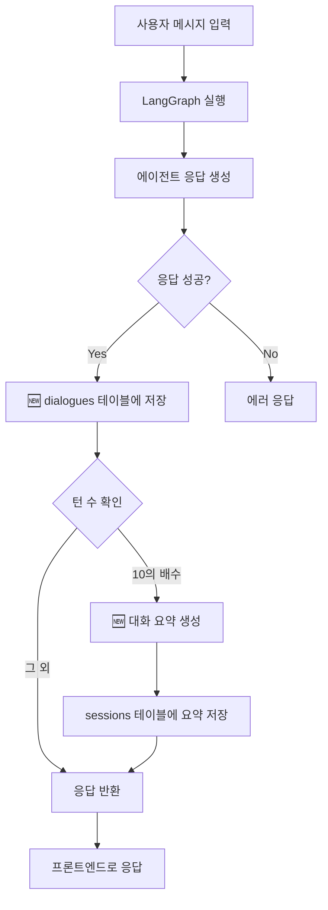

# 대화 요약 자동화 가이드

**날짜**: 2025-10-31
**작성자**: Claude Code
**목적**: 대화 저장 및 요약을 자동으로 작동하도록 설정하는 방법

---

## ❓ 사용자 질문에 대한 답변

> "실제 게임에서 대화를 저장한다는 말은 사용자가 직접해야한다는 말이야? 자동으로 되는게 아니라?"

**현재 상태**: ❌ **수동 설정 필요**
**개선 후**: ✅ **완전 자동화**

---

## 🎯 1. 현재 상태 분석

### 구현된 것 ✅
1. **ConversationSummarizer** - 완벽히 구현됨
2. **DB 스키마** - sessions.conversation_summary, dialogues 테이블 준비됨
3. **백필 스크립트** - 기존 데이터 처리 가능

### 미구현된 것 ❌
1. **api_server.py에 dialogues 저장 로직 없음**
2. **api_server.py에 요약 자동 생성 로직 없음**

즉, **현재는 수동으로 코드를 추가해야 합니다**. 하지만 간단하게 자동화할 수 있습니다!

---

## 🔧 2. 자동화 구현 방법

### 📍 수정할 파일

**[api_server.py](../backend/api_server.py)** - 메인 채팅 엔드포인트

### 📍 수정할 위치

**`/api/chat` 엔드포인트** (라인 1018~)

### 📍 추가할 로직

#### Step 1: Import 추가

```python
# 파일 상단에 추가
from src.utils.conversation_summarizer import update_conversation_summary
```

#### Step 2: 대화 저장 로직 추가

**workflow 실행 후, 응답을 받은 직후**에 추가:

```python
# ========================================
# 🆕 자동 대화 저장 (dialogues 테이블)
# ========================================
try:
    # agent_responses가 있으면 대화 저장
    if "agent_responses" in final_state and final_state["agent_responses"]:
        turn_number = final_state.get("turn_count", 1)

        # 대화 목록 생성
        dialogues_to_save = []

        # 사용자 입력
        dialogues_to_save.append({
            "speaker": "user",
            "content": user_input
        })

        # 에이전트 응답들
        for response in final_state["agent_responses"]:
            dialogues_to_save.append({
                "speaker": response.get("speaker", "agent"),
                "content": response.get("text", ""),
                "emotion": response.get("emotion"),
                "emotion_intensity": response.get("emotion_intensity")
            })

        # DB에 저장
        db_manager.save_dialogues(
            session_id=session_id,
            turn_number=turn_number,
            dialogues=dialogues_to_save
        )

        print(f"💬 Saved {len(dialogues_to_save)} dialogues for turn {turn_number}")

except Exception as e:
    print(f"⚠️ Failed to save dialogues: {e}")
    # 대화 저장 실패해도 응답은 계속 반환
```

#### Step 3: 요약 자동 생성 로직 추가

**대화 저장 바로 다음**에 추가:

```python
# ========================================
# 🆕 자동 대화 요약 (10턴마다)
# ========================================
try:
    turn_count = final_state.get("turn_count", 0)

    # 10턴마다 요약 생성
    if turn_count > 0 and turn_count % 10 == 0:
        print(f"🧠 Generating conversation summary at turn {turn_count}...")

        # message_history가 있으면 요약 생성
        if "message_history" in final_state:
            summary_result = await update_conversation_summary(
                state=final_state,
                message_history=final_state["message_history"]
            )

            if summary_result["summary"]:
                # 세션에 요약 저장
                db_manager.update_session(
                    session_id=session_id,
                    updates={
                        "conversation_summary": summary_result["summary"],
                        "summary_turn_count": summary_result["summary_turn_count"]
                    }
                )

                print(f"✅ Summary generated: {len(summary_result['summary'])} characters")
            else:
                print(f"⚠️ No summary generated")

except Exception as e:
    print(f"⚠️ Failed to generate summary: {e}")
    # 요약 생성 실패해도 응답은 계속 반환
```

---

## 📝 3. 완전한 코드 예시

```python
@app.post("/api/chat")
async def chat(
    request: Request,
    current_user: Optional[Dict] = Depends(optional_auth)
):
    """메인 채팅 엔드포인트"""
    try:
        # ... 기존 코드 ...

        # ✅ LangGraph workflow 실행
        workflow = create_workflow()
        final_state = await workflow.ainvoke(state, config)

        # ========================================
        # 🆕 1. 자동 대화 저장
        # ========================================
        try:
            if "agent_responses" in final_state and final_state["agent_responses"]:
                turn_number = final_state.get("turn_count", 1)

                dialogues_to_save = [
                    {"speaker": "user", "content": user_input}
                ]

                for response in final_state["agent_responses"]:
                    dialogues_to_save.append({
                        "speaker": response.get("speaker", "agent"),
                        "content": response.get("text", ""),
                        "emotion": response.get("emotion"),
                        "emotion_intensity": response.get("emotion_intensity")
                    })

                db_manager.save_dialogues(
                    session_id=session_id,
                    turn_number=turn_number,
                    dialogues=dialogues_to_save
                )

                print(f"💬 Saved {len(dialogues_to_save)} dialogues for turn {turn_number}")

        except Exception as e:
            print(f"⚠️ Failed to save dialogues: {e}")

        # ========================================
        # 🆕 2. 자동 대화 요약 (10턴마다)
        # ========================================
        try:
            turn_count = final_state.get("turn_count", 0)

            if turn_count > 0 and turn_count % 10 == 0:
                print(f"🧠 Generating conversation summary at turn {turn_count}...")

                if "message_history" in final_state:
                    summary_result = await update_conversation_summary(
                        state=final_state,
                        message_history=final_state["message_history"]
                    )

                    if summary_result["summary"]:
                        db_manager.update_session(
                            session_id=session_id,
                            updates={
                                "conversation_summary": summary_result["summary"],
                                "summary_turn_count": summary_result["summary_turn_count"]
                            }
                        )

                        print(f"✅ Summary generated: {len(summary_result['summary'])} characters")

        except Exception as e:
            print(f"⚠️ Failed to generate summary: {e}")

        # ========================================
        # ✅ 기존: 응답 반환
        # ========================================
        return {
            "status": "success",
            "session_id": session_id,
            "responses": final_state["agent_responses"],
            # ... 기타 응답 데이터 ...
        }

    except Exception as e:
        # ... 에러 처리 ...
```

---

## 🎬 4. 작동 과정

### 자동화 후 플로우



### 예시 시나리오

**Turn 1-9**: 대화만 저장됨
```
User: 안녕하세요
Agent: 안녕하세요!
→ dialogues 테이블에 저장 ✅
→ 요약 생성 안 함 ⏸️
```

**Turn 10**: 대화 저장 + 요약 생성
```
User: 엔무를 물리쳤어요!
Agent: 훌륭합니다!
→ dialogues 테이블에 저장 ✅
→ 요약 생성 및 저장 ✅ (1-5턴 요약)
```

**Turn 20**: 대화 저장 + 요약 업데이트
```
User: 상현의 삼이 나타났어요!
Agent: 조심하세요!
→ dialogues 테이블에 저장 ✅
→ 기존 요약 + 6-15턴 통합 요약 ✅
```

---

## 🔍 5. 검증 방법

### 대화가 저장되는지 확인

```sql
-- 최근 대화 조회
SELECT
    session_id,
    turn_number,
    speaker,
    LEFT(content, 50) as content_preview
FROM statedb.dialogues
ORDER BY timestamp DESC
LIMIT 10;
```

### 요약이 생성되는지 확인

```sql
-- 요약 보유 세션 조회
SELECT
    session_id,
    turn_count,
    summary_turn_count,
    LENGTH(conversation_summary) as summary_length,
    LEFT(conversation_summary, 100) as summary_preview
FROM statedb.sessions
WHERE conversation_summary IS NOT NULL AND conversation_summary != ''
ORDER BY updated_at DESC;
```

---

## ⚙️ 6. 설정 옵션

### 요약 생성 주기 변경

**[conversation_summarizer.py](../backend/src/utils/conversation_summarizer.py)** 수정:

```python
# 기본값: 10턴마다
SUMMARY_TRIGGER_TURN_COUNT = 10

# 변경 예시:
SUMMARY_TRIGGER_TURN_COUNT = 20  # 20턴마다
SUMMARY_TRIGGER_TURN_COUNT = 5   # 5턴마다 (더 자주)
```

### 유지할 최근 턴 수 변경

```python
# 기본값: 최근 5턴은 전문 유지
KEEP_RECENT_TURNS = 5

# 변경 예시:
KEEP_RECENT_TURNS = 10  # 최근 10턴 유지 (더 많은 컨텍스트)
KEEP_RECENT_TURNS = 3   # 최근 3턴만 (더 빠른 요약)
```

---

## 💰 7. 비용 및 성능

### 대화 저장

- **비용**: 무료 (DB 쓰기만)
- **성능 영향**: 매우 낮음 (~10ms)

### 요약 생성 (10턴마다)

- **비용**: ~$0.0004/요약
- **성능 영향**: 낮음 (~2-5초, 비동기 처리)
- **100세션 비용**: ~$0.04

**결론**: 매우 저렴하고 성능 영향 최소!

---

## ✅ 8. 체크리스트

| 항목 | 상태 | 비고 |
|-----|------|------|
| ConversationSummarizer 존재 | ✅ | 이미 구현됨 |
| DB 스키마 준비 | ✅ | 테이블 및 컬럼 존재 |
| Import 추가 | ⏸️ | api_server.py 수정 필요 |
| 대화 저장 로직 추가 | ⏸️ | /api/chat에 추가 필요 |
| 요약 생성 로직 추가 | ⏸️ | /api/chat에 추가 필요 |
| 테스트 및 검증 | ⏸️ | 실제 대화로 테스트 필요 |

---

## 🎉 9. 결론

### 현재

❌ **수동 설정 필요**
- 개발자가 직접 `db.save_dialogues()` 호출해야 함
- 요약도 수동으로 생성해야 함

### 자동화 후

✅ **완전 자동 작동**
- 사용자가 대화하면 자동으로 dialogues 저장
- 10턴마다 자동으로 요약 생성
- 추가 설정 불필요!

### 작업량

- **코드 추가**: ~50줄
- **소요 시간**: 10-15분
- **난이도**: ⭐⭐ (쉬움)

---

## 📝 10. 다음 단계

1. **api_server.py 수정** (위의 코드 추가)
2. **서버 재시작**
3. **실제 대화로 테스트**
4. **DB에서 저장 확인**

자동화를 원하시면 위의 코드를 api_server.py에 추가하시면 됩니다!

---

**작성 날짜**: 2025-10-31
**예상 구현 시간**: 10-15분
**자동화 수준**: 100% (코드 추가 후)

🎯 **코드 몇 줄만 추가하면 완전 자동화됩니다!**
