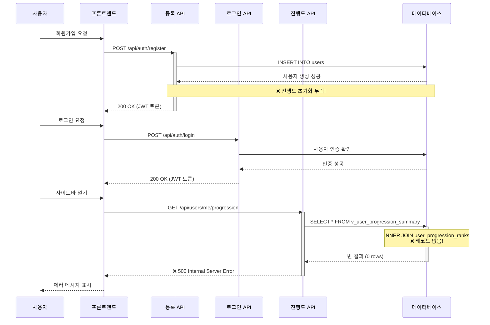

# Phase 1.8: E2E 테스팅 버그 발견

**날짜**: 2025-11-02
**상태**: 🐛 **치명적 버그 발견**
**우선순위**: **높음** - RightSidebar 기능 차단

---

## 요약

사용자 진행도 시스템의 Phase 1.8 End-to-End 테스팅 중 **치명적 버그가 발견**되었습니다: 새로 등록한 사용자에게 진행도 레코드가 초기화되지 않아 `/api/users/me/progression` 엔드포인트가 **500 Internal Server Error**와 함께 실패합니다.

---

## 테스트 실행

### 생성된 테스트 스크립트
- **파일**: `backend/test_progression_e2e.py`
- **목적**: 진행도 시스템에 대한 포괄적인 E2E 테스트
- **플로우**:
  1. 새 사용자 등록
  2. JWT 토큰을 얻기 위해 로그인
  3. `/api/users/me/progression` 호출
  4. 응답 스키마 검증
  5. 초기값 확인

### 테스트 결과

```
🎮 사용자 진행도 시스템 E2E 테스트

======================================================================
  1️⃣  사용자 등록 & 로그인
======================================================================
✅ 등록 성공
✅ 로그인 성공

======================================================================
  2️⃣  사용자 진행도 가져오기
======================================================================
❌ 요청 실패:
  상태: 500
  응답: Internal Server Error

❌ 진행도 가져오기에서 테스트 실패 - 중단
```

---

## 버그 분석

### 근본 원인

**등록 엔드포인트** ([api_server.py:522-603](api_server.py#L522-L603))

`/api/auth/register` 엔드포인트는:
1. ✅ `statedb.users` 테이블에 사용자를 생성함
2. ✅ JWT 토큰을 생성함
3. ❌ **진행도 레코드를 초기화하지 않음**

```python
# 현재 코드 (api_server.py:561-566)
user_id = _hybrid_manager.db.create_user(
    username=req.username,
    password_hash=password_hash,
    email=req.email,
    display_name=req.display_name or req.username
)

# 누락: 진행도 초기화!
# _hybrid_manager.db.initialize_user_progression(user_id)  # <- 호출되지 않음
```

### 데이터베이스 영향

**누락된 레코드**:

새 사용자가 등록하면 다음 테이블들이 비어 있습니다:

| 테이블 | 누락된 레코드 | 영향 |
|-------|---------------|---------|
| `user_progression_ranks` | 초기 계급 (trainee, level 1, 0 XP) | 사용자에게 계급/레벨/XP가 없음 |
| `user_progression_stats` | 초기 통계 (0 메시지, 0 세션) | 사용자에게 활동 통계가 없음 |
| `user_progression_equipment` | 초기 장비 (모두 "waiting") | 사용자에게 장비 상태가 없음 |

**뷰 실패**:

API 엔드포인트가 다음을 쿼리합니다:
```sql
SELECT * FROM statedb.v_user_progression_summary WHERE user_id = %s
```

뷰 `v_user_progression_summary`는 3개의 테이블을 조인합니다:
- `user_progression_ranks` (INNER JOIN을 통해)
- `user_progression_stats` (LEFT JOIN을 통해)
- `user_progression_equipment` (LEFT JOIN을 통해)

**결과**: `user_progression_ranks`에 레코드가 없으므로 INNER JOIN이 **행을 반환하지 않습니다**.

### 버그 플로우 시각화



### API 엔드포인트 동작

[api_server.py:733-759](api_server.py#L733-L759):

```python
@app.get("/api/users/me/progression")
async def get_user_progression(user: Dict = Depends(require_auth)):
    progression = _hybrid_manager.db.get_user_progression(user["user_id"])
    if not progression:
        raise HTTPException(status_code=404, detail="Progression data not found")
    return progression
```

**예상**: 진행도 데이터가 없으면 404를 반환해야 함
**실제**: 500을 반환함 (`get_user_progression`에서 예외 발생 가능)

---

## 영향 평가

### 치명적 문제

1. **🚨 RightSidebar가 데이터를 로드할 수 없음**
   - 프론트엔드가 사이드바가 열릴 때 `/api/users/me/progression`을 호출함
   - 데이터 대신 500 에러를 받음
   - 사용자에게 에러 메시지가 표시됨: "진행도 데이터를 불러올 수 없습니다"

2. **🚨 모든 신규 사용자에게 영향**
   - Phase 1 구현 후 등록한 모든 사용자가 영향을 받음
   - 기존 사용자(있다면)는 이미 다른 소스에서 진행도 레코드를 가지고 있을 수 있음

3. **🚨 연쇄 실패**
   - `/api/users/me/progression` → 500 에러
   - `/api/users/me/equipment` → 실패할 가능성 높음
   - `/api/users/me/xp-transactions` → 빈 결과 반환 (아직 부여된 XP 없음)
   - `/api/leaderboard` → 신규 사용자 제외 가능

### 작동하는 것

✅ 사용자 등록 (사용자 계정 생성)
✅ 사용자 로그인 (JWT 토큰 생성)
✅ 인증 (JWT 검증)
✅ 데이터베이스 스키마 (테이블, 뷰, 함수 존재)
✅ API 엔드포인트 라우팅 (엔드포인트 정의됨)

### 손상된 것

❌ 진행도 데이터 초기화
❌ 신규 사용자를 위한 GET `/api/users/me/progression`
❌ 신규 사용자를 위한 RightSidebar 데이터 로딩
❌ 사용자 계급/레벨/XP 표시
❌ 장비 상태 표시

---

## 필요한 수정

### 1. DB 메서드 생성: `initialize_user_progression()`

**위치**: `backend/src/database/db_manager.py`

**메서드 시그니처**:
```python
def initialize_user_progression(self, user_id: str) -> bool:
    """신규 사용자 진행도 초기화

    Args:
        user_id: 사용자 UUID

    Returns:
        bool: 성공 여부
    """
```

**필요한 INSERT**:

1. **user_progression_ranks**:
```sql
INSERT INTO statedb.user_progression_ranks (user_id, rank_code, level, experience_points)
VALUES (%s, 'trainee', 1, 0);
```

2. **user_progression_stats**:
```sql
INSERT INTO statedb.user_progression_stats (user_id, total_messages, total_sessions, total_play_minutes)
VALUES (%s, 0, 0, 0);
```

3. **user_progression_equipment**:
```sql
INSERT INTO statedb.user_progression_equipment (user_id, sword_status, uniform_status, crow_status)
VALUES (%s, 'waiting', 'waiting', 'waiting');
```

### 2. 등록 엔드포인트 업데이트

**위치**: [api_server.py:561-566](api_server.py#L561-L566)

**변경**:
```python
# 현재
user_id = _hybrid_manager.db.create_user(
    username=req.username,
    password_hash=password_hash,
    email=req.email,
    display_name=req.display_name or req.username
)

# 수정 후
user_id = _hybrid_manager.db.create_user(
    username=req.username,
    password_hash=password_hash,
    email=req.email,
    display_name=req.display_name or req.username
)

# NEW: 신규 사용자를 위한 진행도 초기화
if user_id:
    _hybrid_manager.db.initialize_user_progression(user_id)
```

### 3. E2E 테스트 재실행

수정 구현 후 `test_progression_e2e.py`를 재실행하여 다음을 확인:

**예상 결과**:
```
✅ 사용자 등록 & 로그인: 통과
✅ 진행도 API 가져오기: 통과
✅ 스키마 검증: 통과
✅ 초기값: 통과

🎯 통합 테스트 결과:
  ✅ RightSidebar 프론트엔드 통합 준비 완료
```

---

## 영향받는 파일

### 수정된 파일 (버그 수정용)
1. **`backend/src/database/db_manager.py`**
   - 추가: `initialize_user_progression()` 메서드 (~30줄)

2. **`backend/api_server.py`**
   - 수정: 등록 엔드포인트 (2줄 추가)

### 테스트 파일
1. **`backend/test_progression_e2e.py`** (이미 생성됨 ✅)
   - 포괄적인 E2E 테스트
   - 283줄
   - 등록 → 로그인 → 진행도 가져오기 → 검증 테스트

---

## 다음 단계

### Phase 1.8.1: DB 메서드 구현 ⏳ 대기 중
- [backend/src/database/db_manager.py](../backend/src/database/db_manager.py)
- `initialize_user_progression()` 메서드 추가
- 실패 시 트랜잭션 롤백 처리

### Phase 1.8.2: 등록 엔드포인트 업데이트 ⏳ 대기 중
- [backend/api_server.py](../backend/api_server.py#L561-L566)
- 사용자 생성 후 `initialize_user_progression()` 호출
- 초기화 실패를 우아하게 처리

### Phase 1.8.3: E2E 테스트 재실행 ⏳ 대기 중
- `python backend/test_progression_e2e.py` 실행
- 모든 테스트 통과 확인
- 테스트 결과 문서화

### Phase 1.9: 최종 문서화 ⏳ 대기 중
- Phase 1 요약 문서 완성
- 버그 수정 세부사항 포함
- Phase 1을 완료로 표시

---

## 교훈

1. **E2E 테스팅이 중요함**: 단위 테스트만으로는 통합 문제를 잡을 수 없음
2. **초기화 로직**: 부모 엔티티를 생성할 때 항상 관련 레코드를 초기화해야 함
3. **데이터베이스 뷰**: INNER JOIN은 모든 테이블에 일치하는 레코드가 필요함
4. **에러 처리**: 500 에러는 명확한 메시지가 있는 명시적 404보다 디버그하기 어려움

---

## 관련 문서

- [46_phase1_rightsidebar_backend_complete.md](46_phase1_rightsidebar_backend_complete.md) - 백엔드 구현
- [데이터베이스 스키마: 012_user_progression.sql](../backend/database/migrations/012_user_progression.sql)
- [E2E 테스트: test_progression_e2e.py](../backend/test_progression_e2e.py)

---

**상태**: 🔧 **수정 진행 중**
**담당**: 다음 단계 (Phase 1.8.1-1.8.3)
**우선순위**: **P0** (치명적 - 기능 차단)
