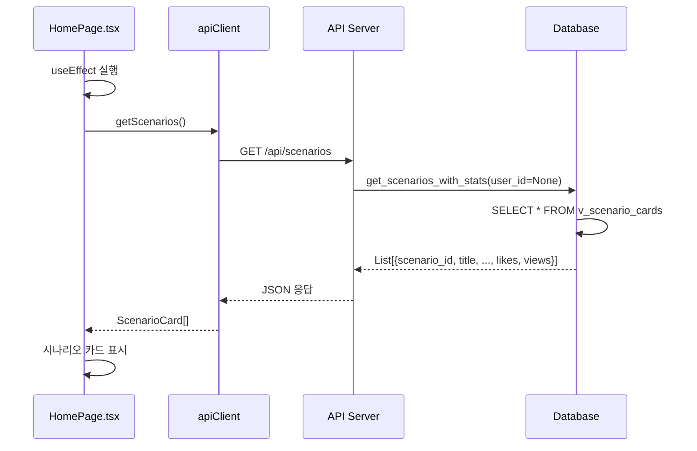
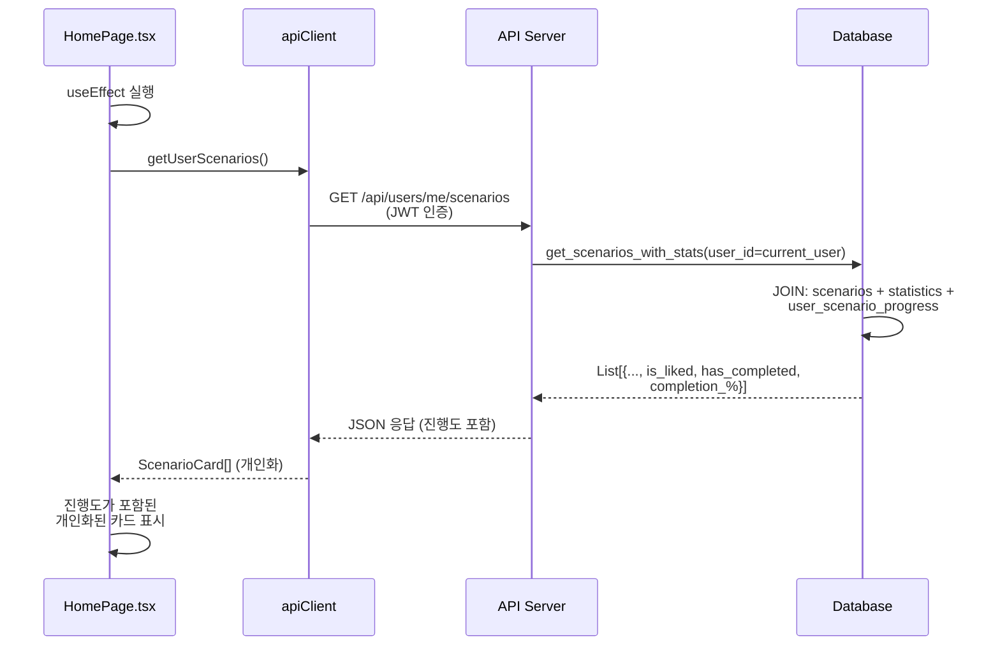
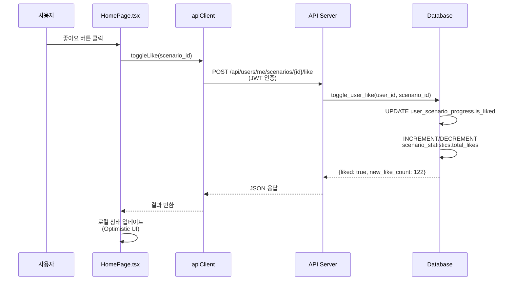

# Phase 2: 홈페이지 동적화 - 구현 계획

**프로젝트**: 시나리오 관리 시스템 - 풀스택 통합
**단계**: 2 of 2 (홈페이지 시나리오)
**작성일**: 2025-11-02
**상태**: 📋 **계획 수립**

---

## 요약

Phase 2는 HomePage 컴포넌트를 하드코딩된 시나리오 데이터에서 백엔드 API를 통해 동적으로 로딩하는 방식으로 전환합니다. 이를 통해:

- ✅ 동적 시나리오 관리 (코드 변경 없이 추가/편집/삭제)
- ✅ 실시간 통계 (좋아요, 댓글, 조회수)
- ✅ 사용자별 진행도 추적
- ✅ 필터링, 정렬, 검색 기능
- ✅ 확장 가능한 콘텐츠 관리

---

## 현재 상태 분석

### 하드코딩된 데이터 위치

**파일**: [front/src/pages/HomePage.tsx](../front/src/pages/HomePage.tsx#L30-L103)

```typescript
const characters: CharacterCard[] = [
  {
    id: 'tanjiro',
    title: '편의점 알바생 탄지로',
    description: '탄지로와 함께하는 편의점 일상 체험',
    image: `${CDN_URL}/편의점탄지로.png`,
    likes: 121,
    comments: 45,
    views: 1200,
    tags: ['#편의점', '#일상', '#탄지로'],
    size: 'normal',
    link: '/chat/tanjiro'
  },
  // ... 5개 더 (train, infinity-castle, ending, counseling, idol)
]
```

### 현재 CharacterCard 인터페이스

```typescript
interface CharacterCard {
  id: string;
  title: string;
  description: string;
  image: string;
  likes: number;
  comments: number;
  views: number;
  tags: string[];
  size: 'large' | 'normal';
  link: string;
}
```

### 현재 기능

1. **표시**: 캐러셀/그리드에 6개 시나리오 카드
2. **검색**: 제목/설명/태그로 시나리오 필터링
3. **상호작용**: 좋아요 버튼 (클라이언트 측만, 저장 안 됨)
4. **내비게이션**: 클릭하여 시나리오로 이동

### 현재 구현의 문제점

❌ **정적 콘텐츠**: 코드 배포 없이 새 시나리오 추가 불가
❌ **가짜 통계**: likes/comments/views가 하드코딩된 숫자
❌ **사용자 데이터 없음**: 사용자가 완료한 시나리오 추적 불가
❌ **영속성 없음**: 좋아요가 데이터베이스에 저장되지 않음
❌ **관리 도구 없음**: 시나리오 목록 수정하려면 개발자 필요

---

## Phase 2 목표

### 주요 목적

1. **데이터베이스 스키마**: PostgreSQL에 시나리오 메타데이터 저장
2. **API 엔드포인트**: 시나리오 CRUD 작업
3. **프론트엔드 통합**: HomePage에서 동적으로 시나리오 가져오기
4. **사용자 진행도**: 시나리오별 사용자 완료/진행 추적
5. **통계**: 데이터베이스에서 가져온 실제 좋아요/댓글/조회수

### 성공 기준

✅ HomePage가 API에서 시나리오 로드 (하드코딩 배열 아님)
✅ 데이터베이스를 통해 새 시나리오 추가 가능 (코드 변경 없음)
✅ 사용자가 시나리오별 완료 상태 확인 가능
✅ 좋아요/조회수가 데이터베이스에 저장됨
✅ 검색/필터가 API 데이터와 작동
✅ E2E 테스트 통과

---

## Phase 2 작업 분류

### Phase 2.1: 데이터베이스 스키마 설계 🗂️

**목표**: 시나리오 메타데이터와 사용자 진행도를 위한 테이블 생성

**생성할 테이블**:

1. **`scenarios`** (메인 시나리오 메타데이터)
```sql
CREATE TABLE statedb.scenarios (
    scenario_id VARCHAR(50) PRIMARY KEY,  -- 예: 'tanjiro', 'train'
    title VARCHAR(200) NOT NULL,
    description TEXT,
    image_url VARCHAR(500),
    thumbnail_url VARCHAR(500),
    tags TEXT[],  -- 태그 배열
    card_size VARCHAR(20) DEFAULT 'normal',  -- 'large' 또는 'normal'
    route_path VARCHAR(200),  -- 예: '/chat/tanjiro'
    display_order INT DEFAULT 0,
    is_active BOOLEAN DEFAULT true,
    created_at TIMESTAMP DEFAULT NOW(),
    updated_at TIMESTAMP DEFAULT NOW()
);
```

2. **`scenario_statistics`** (집계 통계)
```sql
CREATE TABLE statedb.scenario_statistics (
    scenario_id VARCHAR(50) PRIMARY KEY REFERENCES statedb.scenarios(scenario_id),
    total_likes INT DEFAULT 0,
    total_comments INT DEFAULT 0,
    total_views INT DEFAULT 0,
    total_completions INT DEFAULT 0,
    avg_session_duration INT DEFAULT 0,  -- 분 단위
    updated_at TIMESTAMP DEFAULT NOW()
);
```

3. **`user_scenario_progress`** (사용자별 진행도)
```sql
CREATE TABLE statedb.user_scenario_progress (
    user_id UUID REFERENCES statedb.users(user_id),
    scenario_id VARCHAR(50) REFERENCES statedb.scenarios(scenario_id),
    has_started BOOLEAN DEFAULT false,
    has_completed BOOLEAN DEFAULT false,
    completion_percentage INT DEFAULT 0,
    last_session_id VARCHAR(100),
    last_played_at TIMESTAMP,
    total_messages INT DEFAULT 0,
    total_play_time INT DEFAULT 0,  -- 분 단위
    is_liked BOOLEAN DEFAULT false,
    created_at TIMESTAMP DEFAULT NOW(),
    updated_at TIMESTAMP DEFAULT NOW(),
    PRIMARY KEY (user_id, scenario_id)
);
```

4. **`scenario_views`** (조회 추적)
```sql
CREATE TABLE statedb.scenario_views (
    view_id UUID PRIMARY KEY DEFAULT gen_random_uuid(),
    scenario_id VARCHAR(50) REFERENCES statedb.scenarios(scenario_id),
    user_id UUID REFERENCES statedb.users(user_id),  -- 익명은 NULL
    viewed_at TIMESTAMP DEFAULT NOW()
);
```

**뷰**: 프론트엔드를 위한 데이터 결합
```sql
CREATE VIEW statedb.v_scenario_cards AS
SELECT
    s.scenario_id,
    s.title,
    s.description,
    s.image_url,
    s.tags,
    s.card_size,
    s.route_path,
    s.display_order,
    COALESCE(ss.total_likes, 0) as likes,
    COALESCE(ss.total_comments, 0) as comments,
    COALESCE(ss.total_views, 0) as views,
    s.is_active
FROM statedb.scenarios s
LEFT JOIN statedb.scenario_statistics ss ON s.scenario_id = ss.scenario_id
WHERE s.is_active = true
ORDER BY s.display_order, s.created_at DESC;
```

**마이그레이션 파일**: `backend/database/migrations/013_scenarios_system.sql`

---

### Phase 2.2: 기존 시나리오 시드 🌱

**목표**: 현재 6개 시나리오로 데이터베이스 채우기

**시드 스크립트**: `backend/scripts/seed_scenarios.py`

```python
scenarios = [
    {
        'scenario_id': 'tanjiro',
        'title': '편의점 알바생 탄지로',
        'description': '탄지로와 함께하는 편의점 일상 체험',
        'image_url': '/images/편의점탄지로.png',
        'tags': ['편의점', '일상', '탄지로'],
        'card_size': 'normal',
        'route_path': '/chat/tanjiro',
        'display_order': 1
    },
    # ... 5개 더
]

# 통계와 함께 데이터베이스에 삽입
for scenario in scenarios:
    db.insert_scenario(scenario)
    db.initialize_scenario_statistics(scenario['scenario_id'])
```

**초기 통계**:
- 현재 하드코딩된 값을 기준으로 사용
- 이후 실제 사용자 상호작용이 이 값들을 업데이트

---

### Phase 2.3: DB Manager 메서드 🔧

**목표**: 시나리오 CRUD 작업을 위한 Python 메서드 추가

**파일**: `backend/src/database/db_manager.py`

**추가할 메서드**:

```python
# 시나리오 CRUD
def get_all_scenarios(self, include_inactive: bool = False) -> List[Dict]
def get_scenario_by_id(self, scenario_id: str) -> Optional[Dict]
def create_scenario(self, scenario_data: Dict) -> bool
def update_scenario(self, scenario_id: str, updates: Dict) -> bool
def delete_scenario(self, scenario_id: str) -> bool  # 소프트 삭제 (is_active=false 설정)

# 통계
def get_scenario_statistics(self, scenario_id: str) -> Dict
def increment_scenario_views(self, scenario_id: str, user_id: Optional[str] = None) -> bool
def increment_scenario_likes(self, scenario_id: str) -> bool
def decrement_scenario_likes(self, scenario_id: str) -> bool

# 사용자 진행도
def get_user_scenario_progress(self, user_id: str, scenario_id: str) -> Optional[Dict]
def get_all_user_progress(self, user_id: str) -> List[Dict]
def update_user_progress(self, user_id: str, scenario_id: str, progress_data: Dict) -> bool
def toggle_user_like(self, user_id: str, scenario_id: str) -> bool  # 좋아요/취소

# 결합 뷰
def get_scenarios_with_stats(self, user_id: Optional[str] = None) -> List[Dict]
    """
    통계와 함께 시나리오 반환, 선택적으로 사용자별 진행도 포함
    user_id 제공 시 포함: has_completed, is_liked, completion_percentage
    """
```

**예상**: ~300줄의 코드

---

### Phase 2.4: API 엔드포인트 🌐

**목표**: 시나리오 작업을 위한 REST API 생성

**파일**: `backend/api_server.py`

**추가할 엔드포인트**:

```python
# 공개 엔드포인트 (인증 불필요)
@app.get("/api/scenarios")
async def get_scenarios(include_inactive: bool = False):
    """
    통계와 함께 모든 시나리오 가져오기
    쿼리 파라미터:
        - include_inactive: bool (기본값: false)
    반환: List[ScenarioCard]
    """

@app.get("/api/scenarios/{scenario_id}")
async def get_scenario(scenario_id: str):
    """
    단일 시나리오 세부 정보 가져오기
    반환: 전체 세부 정보가 있는 ScenarioCard
    """

@app.post("/api/scenarios/{scenario_id}/view")
async def record_view(scenario_id: str, user: Optional[Dict] = Depends(optional_auth)):
    """
    시나리오 조회 기록 (조회수 증가)
    인증: 선택적 (로그인 시 사용자 추적)
    """

# 인증된 엔드포인트
@app.get("/api/users/me/scenarios")
async def get_user_scenarios(user: Dict = Depends(require_auth)):
    """
    사용자별 진행도와 함께 시나리오 가져오기
    반환: List[ScenarioCard + UserProgress]
    """

@app.post("/api/users/me/scenarios/{scenario_id}/like")
async def toggle_like(scenario_id: str, user: Dict = Depends(require_auth)):
    """
    시나리오 좋아요 토글
    반환: { liked: bool, new_like_count: int }
    """

@app.get("/api/users/me/scenarios/{scenario_id}/progress")
async def get_progress(scenario_id: str, user: Dict = Depends(require_auth)):
    """
    특정 시나리오의 사용자 진행도 가져오기
    반환: UserScenarioProgress
    """

@app.put("/api/users/me/scenarios/{scenario_id}/progress")
async def update_progress(
    scenario_id: str,
    progress_data: Dict,
    user: Dict = Depends(require_auth)
):
    """
    사용자 진행도 업데이트 (예: 세션 완료 후)
    본문: { completion_percentage, has_completed, ... }
    """

# 관리자 엔드포인트 (향후 - Phase 2 선택사항)
@app.post("/api/admin/scenarios")
async def create_scenario(scenario_data: Dict, user: Dict = Depends(require_admin)):
    """새 시나리오 생성 (관리자 전용)"""

@app.put("/api/admin/scenarios/{scenario_id}")
async def update_scenario(scenario_id: str, updates: Dict, user: Dict = Depends(require_admin)):
    """시나리오 업데이트 (관리자 전용)"""

@app.delete("/api/admin/scenarios/{scenario_id}")
async def delete_scenario(scenario_id: str, user: Dict = Depends(require_admin)):
    """시나리오 소프트 삭제 (관리자 전용)"""
```

**예상**: ~250줄의 코드

---

### Phase 2.5: 프론트엔드 API 클라이언트 & HomePage 업데이트 💻

**목표**: 프론트엔드를 동적 API 데이터 사용하도록 업데이트

#### 파트 A: API 클라이언트 메서드

**파일**: `front/src/services/api.ts`

**인터페이스**:
```typescript
export interface ScenarioCard {
  scenario_id: string
  title: string
  description: string
  image_url: string
  tags: string[]
  card_size: 'large' | 'normal'
  route_path: string
  likes: number
  comments: number
  views: number
  // 사용자별 (인증된 경우)
  is_liked?: boolean
  has_completed?: boolean
  completion_percentage?: number
}

export interface UserScenarioProgress {
  scenario_id: string
  has_started: boolean
  has_completed: boolean
  completion_percentage: number
  last_played_at?: string
  total_messages: number
  total_play_time: number
  is_liked: boolean
}
```

**메서드**:
```typescript
async getScenarios(): Promise<ScenarioCard[]>
async getScenario(scenarioId: string): Promise<ScenarioCard>
async recordView(scenarioId: string): Promise<void>
async getUserScenarios(): Promise<ScenarioCard[]>  // 사용자 진행도 포함
async toggleLike(scenarioId: string): Promise<{ liked: boolean, new_like_count: number }>
async getUserProgress(scenarioId: string): Promise<UserScenarioProgress>
async updateUserProgress(scenarioId: string, progress: Partial<UserScenarioProgress>): Promise<void>
```

#### 파트 B: HomePage 컴포넌트 업데이트

**파일**: `front/src/pages/HomePage.tsx`

**변경사항**:

1. **하드코딩 배열 제거** (30-103줄)
```typescript
// 이전
const characters: CharacterCard[] = [ ... ]  // ❌ 삭제

// 이후
const [scenarios, setScenarios] = useState<ScenarioCard[]>([])
const [loading, setLoading] = useState(true)
const [error, setError] = useState<string | null>(null)
```

2. **데이터 로딩 추가**
```typescript
useEffect(() => {
  const loadScenarios = async () => {
    setLoading(true)
    try {
      const data = currentUser
        ? await apiClient.getUserScenarios()  // 진행도 포함
        : await apiClient.getScenarios()  // 공개
      setScenarios(data)
    } catch (err) {
      setError('시나리오를 불러올 수 없습니다')
    } finally {
      setLoading(false)
    }
  }
  loadScenarios()
}, [currentUser])
```

3. **좋아요 핸들러 업데이트**
```typescript
const handleLike = async (scenarioId: string) => {
  if (!currentUser) {
    // 로그인 모달 표시
    return
  }

  try {
    const result = await apiClient.toggleLike(scenarioId)
    // 로컬 상태 업데이트
    setScenarios(prev => prev.map(s =>
      s.scenario_id === scenarioId
        ? { ...s, is_liked: result.liked, likes: result.new_like_count }
        : s
    ))
  } catch (err) {
    console.error('Failed to toggle like:', err)
  }
}
```

4. **로딩/에러 상태 추가**
```tsx
if (loading) {
  return <LoadingSpinner message="시나리오 불러오는 중..." />
}

if (error) {
  return <ErrorMessage message={error} onRetry={loadScenarios} />
}
```

5. **인터페이스 매핑 업데이트**
```typescript
// API 응답을 컴포넌트 형식으로 매핑
const characterCards: CharacterCard[] = scenarios.map(s => ({
  id: s.scenario_id,
  title: s.title,
  description: s.description,
  image: s.image_url,
  likes: s.likes,
  comments: s.comments,
  views: s.views,
  tags: s.tags.map(tag => `#${tag}`),
  size: s.card_size,
  link: s.route_path
}))
```

**예상**: ~150줄 변경

---

### Phase 2.6: E2E 테스팅 🧪

**목표**: 시나리오 시스템의 종합 테스트

**테스트 파일**: `backend/test_scenarios_e2e.py`

**테스트 시나리오**:

1. **공개 API 테스트**
   - GET /api/scenarios (익명 사용자)
   - GET /api/scenarios/{id}
   - POST /api/scenarios/{id}/view

2. **인증된 API 테스트**
   - GET /api/users/me/scenarios (진행도 포함)
   - POST /api/users/me/scenarios/{id}/like
   - GET /api/users/me/scenarios/{id}/progress

3. **프론트엔드 통합 테스트**
   - HomePage가 시나리오 로드
   - 검색/필터 작동
   - 좋아요 버튼 저장
   - 조회수 증가

4. **데이터 일관성 테스트**
   - 시나리오 통계가 데이터베이스와 일치
   - 사용자 진행도가 올바르게 추적됨
   - 좋아요가 올바르게 증가/감소

**예상**: ~400줄의 코드

---

### Phase 2.7: 문서화 📖

**목표**: Phase 2의 완전한 문서화

**생성할 문서**:

1. **50_phase2_scenarios_backend_complete.md**
   - 데이터베이스 스키마 세부사항
   - API 엔드포인트 문서
   - DB Manager 메서드 참조

2. **51_phase2_scenarios_frontend_complete.md**
   - 프론트엔드 통합 가이드
   - 컴포넌트 변경사항
   - API 클라이언트 사용법

3. **52_phase2_complete_summary.md**
   - 전체 Phase 2 요약
   - 이전/이후 비교
   - E2E 테스트 결과
   - 다음 단계

---

## 데이터 흐름 아키텍처

### 1. 공개 사용자 (로그인하지 않음)



### 2. 인증된 사용자



### 3. 좋아요 액션



---

## 하드코딩에서 동적으로 마이그레이션

### 이전 (현재)

```typescript
// HomePage.tsx
const characters = [
  { id: 'tanjiro', title: '...', likes: 121, ... },  // ❌ 하드코딩
  { id: 'train', title: '...', likes: 98, ... },
  // ...
]
```

**문제점**:
- 시나리오 추가하려면 코드 배포 필요
- 통계 (likes/views)가 절대 변하지 않음
- 사용자별 데이터 없음

### 이후 (Phase 2)

```typescript
// HomePage.tsx
useEffect(() => {
  const data = await apiClient.getUserScenarios()  // ✅ API 호출
  setScenarios(data)
}, [])

// scenarios = [
//   { scenario_id: 'tanjiro', likes: 245, is_liked: true, ... },  // ✅ 실제 데이터
//   { scenario_id: 'train', likes: 183, has_completed: true, ... },
// ]
```

**이점**:
- 데이터베이스를 통해 시나리오 추가 (배포 불필요)
- 실시간 통계
- 사용자별 진행도 추적
- 확장 가능한 콘텐츠 관리

---

## 타임라인 예상

| 단계 | 작업 | 예상 시간 | 상태 |
|------|------|-----------|------|
| 2.0 | 분석 & 계획 | 1시간 | ✅ 현재 |
| 2.1 | 데이터베이스 스키마 | 2시간 | ⏳ 대기 |
| 2.2 | 시나리오 시드 | 1시간 | ⏳ 대기 |
| 2.3 | DB Manager 메서드 | 3시간 | ⏳ 대기 |
| 2.4 | API 엔드포인트 | 2시간 | ⏳ 대기 |
| 2.5 | 프론트엔드 통합 | 2시간 | ⏳ 대기 |
| 2.6 | E2E 테스팅 | 2시간 | ⏳ 대기 |
| 2.7 | 문서화 | 1시간 | ⏳ 대기 |
| **전체** | **8개 단계** | **~14시간** | **0% 완료** |

---

## 리스크 평가

### 낮은 리스크 ✅

- 데이터베이스 스키마 (직관적인 테이블들)
- API 엔드포인트 (Phase 1과 유사)
- 프론트엔드 fetch 로직 (표준 패턴)

### 중간 리스크 ⚠️

- 데이터 마이그레이션 (하드코딩 → 데이터베이스)
- 통계 계산 (정확성 보장)
- 검색 기능 (새 API와 작동 필요)

### 완화 전략

1. **신중한 시딩**: 시딩 전 모든 6개 시나리오 검증
2. **점진적 테스팅**: 다음 단계로 넘어가기 전 각 단계 테스트
3. **하위 호환성**: API 검증까지 하드코딩 데이터 유지
4. **E2E 커버리지**: 모든 시나리오에 대한 종합 테스트

---

## 성공 지표

### Phase 2 완료 시점:

✅ 데이터베이스에 통계와 함께 6개 시나리오 모두 있음
✅ API 엔드포인트가 올바른 시나리오 데이터 반환
✅ HomePage가 API에서 시나리오 로드 (하드코딩 아님)
✅ 인증된 사용자가 개인화된 데이터 확인
✅ 좋아요/조회수가 데이터베이스에 저장됨
✅ 검색/필터가 API 데이터와 작동
✅ E2E 테스트 통과 (모든 시나리오)
✅ 문서화 완료

---

## 다음 단계

**즉시**:
- Phase 2.1: 데이터베이스 스키마 설계 및 생성
- 마이그레이션 파일 생성: `013_scenarios_system.sql`

**이후**:
- Phase 2.2: 시드 스크립트 작성
- Phase 2.3: DB Manager 메서드 구현

**사용자 승인 필요**:
- 스키마 설계 검토
- 추적할 필드 확인
- 관리자 기능 결정 (선택사항)

---

**Phase 2 상태**: 📋 **계획 완료**
**시작 준비**: Phase 2.1 - 데이터베이스 스키마
**예상 완료**: 전체 단계 (~14시간 총 작업)
