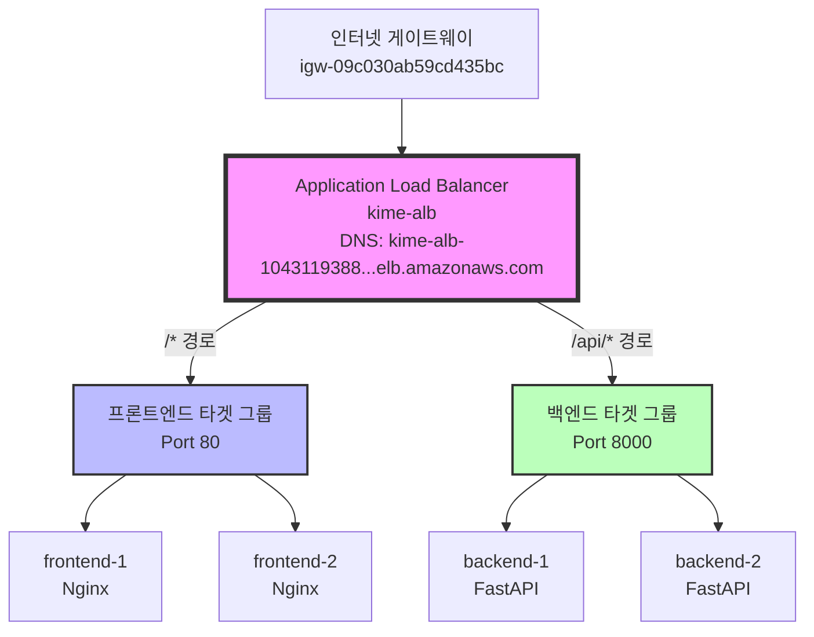
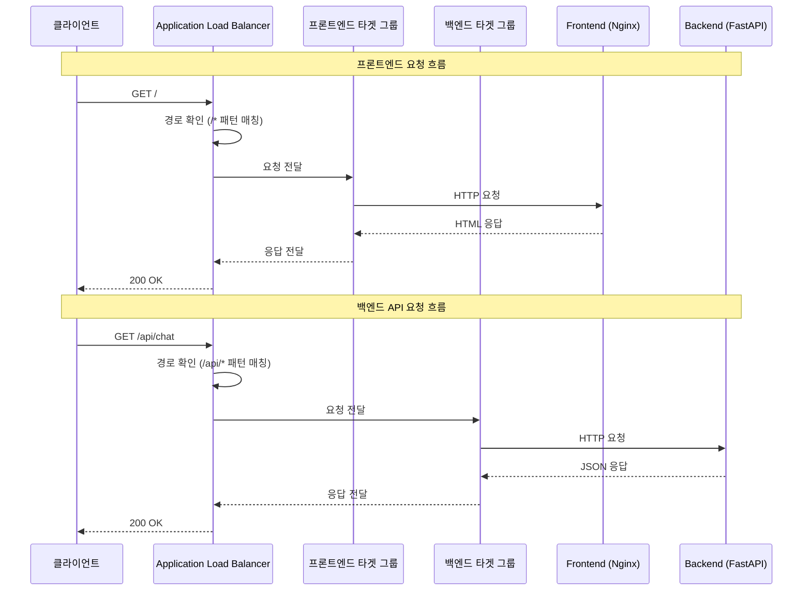
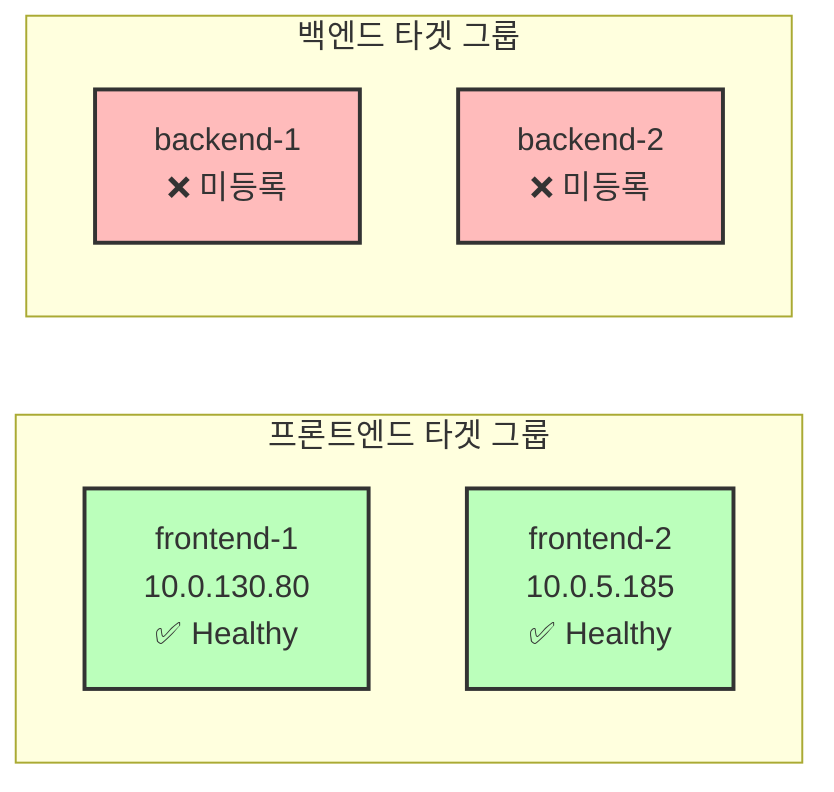
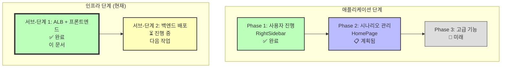

# AWS Application Load Balancer 설정 - 완전 문서화

**프로젝트**: KIME 시나리오 관리 시스템 - 클라우드 인프라
**단계**: 클라우드 인프라 (독립적인 단계)
**날짜**: 2025-11-03
**상태**: ✅ **Phase 1 (ALB + 프론트엔드) 완료** | ⏳ **Phase 2 (백엔드) 진행 중**

---

## 요약

이 문서는 AWS Application Load Balancer(ALB) 구성의 전체 설정 프로세스를 기록합니다. 네트워크 인프라, EC2 인스턴스, 타겟 그룹, 라우팅 규칙을 포함합니다. 이는 다음을 가능하게 하는 중요한 인프라 단계입니다:

- ✅ 다중 가용 영역에 걸친 고가용성
- ✅ 경로 기반 라우팅 (/api/* → 백엔드, /* → 프론트엔드)
- ✅ 헬스 모니터링 및 자동 장애 조치
- ✅ 프로덕션 배포를 위한 확장 가능한 아키텍처

---

## 전체 프로젝트 단계 구조

### **완료된 프로젝트 단계**:

```
Phase 1: 사용자 진행 시스템 (RightSidebar)
├─ 상태: ✅ 완료
├─ 문서화: 46_phase1_rightsidebar_backend_complete.md
└─ 요약: 48_phase1_complete_final_summary.md

Phase 2: 시나리오 관리 시스템 (HomePage)
├─ 상태: 📋 계획됨
└─ 문서화: 49_phase2_homepage_plan.md

📍 현재 단계: AWS 클라우드 인프라 설정
├─ 상태: ⏳ 진행 중 (50% 완료)
├─ 서브-단계 1: ALB + 프론트엔드 ✅ 완료
└─ 서브-단계 2: 백엔드 배포 ⏳ 진행 중

향후 Phase 3: 고급 기능
└─ 상태: 🔮 시작 안 됨
```

---

## 클라우드 인프라 단계 세부 분석

### 서브-단계 1: ALB + 프론트엔드 설정 ✅ 완료

**타임라인**: 2025-11-03 (오늘 완료)
**소요 시간**: ~4시간

#### 완료된 작업:

1. ✅ 네트워크 인프라 설정
2. ✅ ALB 생성
3. ✅ 프론트엔드 타겟 그룹 구성
4. ✅ 프론트엔드 EC2 인스턴스 (Nginx)
5. ✅ 리스너 규칙 (경로 기반 라우팅)

---

### 서브-단계 2: 백엔드 설정 ⏳ 진행 중

**상태**: 곧 시작
**현재 작업**: 백엔드 보안 그룹 SSH 액세스

#### 남은 작업:

1. 🔲 백엔드 보안 그룹 SSH 구성
2. 🔲 Backend-1 애플리케이션 배포
3. 🔲 Backend-2 애플리케이션 배포
4. 🔲 백엔드 타겟 그룹 헬스 검증
5. 🔲 엔드-투-엔드 ALB 테스트

---

## 아키텍처 개요

### 네트워크 토폴로지



### VPC 구성

**VPC**: vpc-0f1758ec3255c775e (kime-vpc)
**CIDR**: 10.0.0.0/16

#### 생성/수정된 서브넷:

| 이름 | 서브넷 ID | AZ | CIDR | 유형 | 라우팅 |
|------|-----------|-----|------|------|---------|
| kime-vpc-public-2a | subnet-050b9ba63467686a9 | ap-northeast-2a | 10.0.128.0/20 | Public | IGW ✅ |
| kime-vpc-public-2b | subnet-xxxxx | ap-northeast-2b | 10.0.32.0/20 | Public | IGW ✅ |
| kime-vpc-public-2c | subnet-02cefda6b247fb402 | ap-northeast-2c | 10.0.0.0/20 | Public | IGW ✅ |
| kime-vpc-private-2a | subnet-06b76bc75f2098809 | ap-northeast-2a | 10.0.144.0/20 | Private | NAT |
| kime-vpc-private-2c | subnet-0565b53d0cb9b9998 | ap-northeast-2c | 10.0.160.0/20 | Private | local |

---

## 상세 설정 프로세스

### 단계 1: 네트워크 인프라 문제 해결

#### 문제 1: 퍼블릭 서브넷 부족

**초기 상태**:
- IGW 라우팅이 있는 퍼블릭 서브넷 1개만 존재
- ALB는 서로 다른 AZ에 걸친 2개 이상의 서브넷 필요

**취한 조치**:

1. **기존 서브넷 확인**:
   - subnet-050b9ba63467686a9 (2a): NAT 라우팅 보유 ❌
   - subnet-02cefda6b247fb402 (2c): IGW 라우팅 보유 ✅

2. **라우팅 테이블 수정** (rtb-058094707bf1ae62c):
   - 변경 전: 0.0.0.0/0 → nat-0515e8c7d1d084a01 ❌
   - 변경 후: 0.0.0.0/0 → igw-09c030ab59cd435bc ✅
   - 결과: subnet-050b9ba63467686a9가 이제 퍼블릭

3. **새 퍼블릭 서브넷 생성**:
   - 이름: kime-vpc-public-ap-northeast-2b
   - AZ: ap-northeast-2b
   - CIDR: 10.0.32.0/20
   - IGW 라우팅 테이블과 연결됨 (rtb-0d6735f365b7ce8b9)

**결과**: ALB를 위한 2개 AZ에 걸친 2개 퍼블릭 서브넷 준비 완료

---

### 단계 2: Application Load Balancer 생성

**콘솔 경로**: EC2 → Load Balancers → Create Application Load Balancer

#### 구성:

**기본 설정**:
```
이름: kime-alb
스킴: Internet-facing (인터넷 연결형)
IP 주소 유형: IPv4
```

**네트워크 매핑**:
```
VPC: vpc-0f1758ec3255c775e (kime-vpc)

서브넷:
✅ ap-northeast-2a: subnet-050b9ba63467686a9 (10.0.128.0/20)
✅ ap-northeast-2b: subnet-xxxxx (10.0.32.0/20)
```

**보안 그룹**:
```
보안 그룹: kime-alb-sg (sg-038e0f3ec7c87ae78)

인바운드 규칙:
- HTTP (80): 0.0.0.0/0
- HTTPS (443): 0.0.0.0/0

아웃바운드 규칙:
- 모든 트래픽: 0.0.0.0/0
```

**리스너**:
```
프로토콜: HTTP
포트: 80
기본 작업: kime-frontend-tg로 전달
```

**결과**:
- ALB 생성됨: kime-alb
- DNS: kime-alb-1043119388.ap-northeast-2.elb.amazonaws.com
- 상태: 활성 ✅

---

### 단계 3: 타겟 그룹 구성

#### 프론트엔드 타겟 그룹

**이름**: kime-frontend-tg
**타겟 유형**: 인스턴스
**프로토콜**: HTTP
**포트**: 80
**VPC**: vpc-0f1758ec3255c775e

**헬스 체크 설정**:
```
프로토콜: HTTP
경로: /  (/health에서 /로 변경)
포트: 트래픽 포트
정상 임계값: 2
비정상 임계값: 2
타임아웃: 5초
간격: 30초
성공 코드: 200
```

**등록된 타겟**:
```
✅ frontend-1 (i-0b3225858ee7f9c9): Healthy (정상)
✅ frontend-2 (i-098af6291612ba884): Healthy (정상)
```

#### 백엔드 타겟 그룹

**이름**: kime-backend-tg
**타겟 유형**: 인스턴스
**프로토콜**: HTTP
**포트**: 8000
**VPC**: vpc-0f1758ec3255c775e

**헬스 체크 설정**:
```
프로토콜: HTTP
경로: /health
포트: 트래픽 포트
정상 임계값: 2
비정상 임계값: 2
타임아웃: 5초
간격: 30초
성공 코드: 200
```

**등록된 타겟** (보류 중):
```
🔲 backend-1 (i-009367f6c01ea2fc3): 설정 보류 중
🔲 backend-2 (i-091042c7d0748615a): 설정 보류 중
```

---

### 단계 4: 프론트엔드 EC2 인스턴스 설정

#### 보안 그룹 구성

**보안 그룹**: kime-frontend-sg (sg-09999fd2227594c01)

**인바운드 규칙**:
```
1. ALB로부터의 HTTP
   - 유형: HTTP
   - 포트: 80
   - 소스: sg-038e0f3ec7c87ae78 (kime-alb-sg)
   - 설명: ALB로부터의 HTTP 허용

2. 관리를 위한 SSH
   - 유형: SSH
   - 포트: 22
   - 소스: 0.0.0.0/0 (또는 보안을 위해 My IP)
   - 설명: 디버깅을 위한 SSH 액세스
```

#### 인스턴스 1: frontend-1

**인스턴스 ID**: i-0b3225858ee7f9c9
**퍼블릭 IP**: 54.180.234.223
**프라이빗 IP**: 10.0.130.80
**AZ**: ap-northeast-2a
**서브넷**: subnet-050b9ba63467686a9

**소프트웨어 설정**:
```bash
# SSH 액세스
ssh -i .ssh/kime-keypair.pem ubuntu@54.180.234.223

# Nginx 설치
sudo apt update
sudo apt install -y nginx
sudo systemctl start nginx
sudo systemctl enable nginx

# 검증
curl http://localhost:80
# 응답: "Welcome to nginx!" ✅
```

**헬스 체크**: ✅ Healthy (정상)

#### 인스턴스 2: frontend-2

**인스턴스 ID**: i-098af6291612ba884
**퍼블릭 IP**: 3.39.251.70
**AZ**: ap-northeast-2a

**소프트웨어 설정**: frontend-1과 동일
**헬스 체크**: ✅ Healthy (정상)

---

### 단계 5: 리스너 규칙 (경로 기반 라우팅)

**콘솔 경로**: EC2 → Load Balancers → kime-alb → Listeners and rules

#### HTTP:80 리스너 규칙:



**규칙 1** (우선순위: 1):
```
조건:
  - 경로 패턴: /api/*

작업:
  - 전달 대상: kime-backend-tg
  - 가중치: 100%

상태: 활성 ✅
```

**규칙 2** (우선순위: 마지막 - 기본값):
```
조건:
  - 기본값 (다른 모든 경로)

작업:
  - 전달 대상: kime-frontend-tg
  - 가중치: 100%

상태: 활성 ✅
```

#### 트래픽 흐름:

```
http://kime-alb-xxx.amazonaws.com/           → frontend-tg → Nginx ✅
http://kime-alb-xxx.amazonaws.com/about      → frontend-tg → Nginx ✅
http://kime-alb-xxx.amazonaws.com/api/chat   → backend-tg → (보류 중)
http://kime-alb-xxx.amazonaws.com/api/users  → backend-tg → (보류 중)
```

---

## 트러블슈팅 로그

### 문제 1: 타겟 그룹 비정상 (404 오류)

**증상**:
```
헬스 상태: Unhealthy (비정상)
이유: 다음 코드로 헬스 체크 실패: [404]
```

**근본 원인**:
- 헬스 체크 경로가 `/health`였음
- Nginx 기본 설치는 `/` 경로만 서비스함
- `/health` 엔드포인트가 존재하지 않음 → 404 오류

**해결책**:
1. 헬스 체크 경로를 `/health`에서 `/`로 변경
2. Target Group → Health checks 탭 → Edit
3. Path: `/health` → `/`
4. 변경사항 저장

**결과**: 두 프론트엔드 인스턴스 모두 1-2분 내에 Healthy(정상) 상태가 됨 ✅

---

### 문제 2: Nginx 구성 오류

**증상**:
```bash
nginx: [emerg] "location" directive is not allowed here
nginx: configuration file /etc/nginx/nginx.conf test failed
```

**근본 원인**:
- `server` 블록 외부에 `location /health` 블록 추가 시도
- 잘못된 파일 구조

**해결책**:
1. 사용자 지정 Nginx 구성 제거
2. 깨끗한 상태로 Nginx 재설치:
   ```bash
   sudo apt remove --purge nginx nginx-common -y
   sudo apt install nginx -y
   ```
3. 기본 Nginx 구성 사용 (성공적으로 `/` 서비스)
4. 기본 경로와 일치하도록 ALB 헬스 체크 변경

**결과**: Nginx가 기본 구성으로 정상 작동 ✅

---

### 문제 3: SSH 권한 거부

**증상**:
```bash
ssh -i kime-keypair.pem ec2-user@54.180.234.223
Permission denied (publickey)
```

**근본 원인**:
- 잘못된 사용자명 사용: `ec2-user` (Amazon Linux용)
- 실제 AMI: Ubuntu (필요한 사용자명: `ubuntu`)

**해결책**:
```bash
ssh -i .ssh/kime-keypair.pem ubuntu@54.180.234.223
```

**결과**: SSH 연결 성공 ✅

---

## 현재 상태 (서브-단계 1 종료)

### ✅ 완료된 구성요소

1. **네트워크 인프라**:
   - ✅ IGW 라우팅이 있는 2개 퍼블릭 서브넷
   - ✅ 라우트 테이블 구성됨
   - ✅ 인터넷 게이트웨이 연결됨

2. **Application Load Balancer**:
   - ✅ ALB 생성 및 활성화
   - ✅ DNS 이름: kime-alb-1043119388.ap-northeast-2.elb.amazonaws.com
   - ✅ 보안 그룹: kime-alb-sg
   - ✅ 리스너: HTTP:80
   - ✅ 경로 기반 라우팅 규칙 구성됨

3. **프론트엔드 인프라**:
   - ✅ 타겟 그룹: kime-frontend-tg
   - ✅ Nginx가 설치된 2개 EC2 인스턴스
   - ✅ 두 인스턴스: Healthy (정상)
   - ✅ 보안 그룹: kime-frontend-sg
   - ✅ ALB가 프론트엔드로 트래픽을 성공적으로 라우팅

4. **라우팅 구성**:
   - ✅ `/` → frontend-tg ✅ 작동 중
   - ✅ `/api/*` → backend-tg ⏳ 백엔드 설정 대기 중

---

## 테스트 결과 (서브-단계 1)

### ALB 엔드포인트 테스트

```bash
curl http://kime-alb-1043119388.ap-northeast-2.elb.amazonaws.com
```

**응답**:
```html
<!DOCTYPE html>
<html>
<head>
<title>Welcome to nginx!</title>
...
</html>
```

**상태**: ✅ SUCCESS (성공)

### 헬스 체크 상태



**프론트엔드 타겟 그룹**:
```
✅ frontend-1 (10.0.130.80): Healthy (정상)
✅ frontend-2 (10.0.5.185): Healthy (정상)

총계: 정상 2개, 비정상 0개
```

**백엔드 타겟 그룹**:
```
❌ backend-1: 아직 등록 안 됨
❌ backend-2: 아직 등록 안 됨

총계: 정상 0개, 비정상 0개
```

---

## 다음 단계 (서브-단계 2: 백엔드 설정)

### 즉시 수행할 작업:

#### 작업 1: 백엔드 보안 그룹 구성 ⏳ 진행 중

**현재 상태**: SSH 액세스 구성 예정

**필요한 조치**:
1. 이동: EC2 → Security Groups
2. 찾기: kime-backend-sg
3. 인바운드 규칙 추가:
   ```
   유형: SSH
   포트: 22
   소스: My IP (또는 테스트를 위해 0.0.0.0/0)
   설명: 백엔드 설정을 위한 SSH 액세스
   ```
4. 규칙 저장

---

#### 작업 2: 백엔드 애플리케이션 배포

**Backend-1** (i-009367f6c01ea2fc3):
1. SSH 액세스: `ssh -i .ssh/kime-keypair.pem ubuntu@<backend-1-ip>`
2. 의존성 설치 (Python, FastAPI 등)
3. 백엔드 애플리케이션 배포
4. 포트 8000에서 수신하도록 애플리케이션 구성
5. 자동 시작을 위한 systemd 서비스 설정
6. 검증: `curl http://localhost:8000/health`

**Backend-2** (i-091042c7d0748615a):
1. backend-1과 동일한 단계 반복
2. 인스턴스 간 일관성 확보

---

#### 작업 3: 백엔드 타겟 그룹 검증

**목표**: 두 백엔드 인스턴스 모두 "Healthy(정상)" 상태 표시

**검증**:
1. EC2 → Target Groups → kime-backend-tg
2. Targets 탭
3. 헬스 상태 확인
4. 예상: backend-1 및 backend-2 모두 = Healthy ✅

---

#### 작업 4: 엔드-투-엔드 테스트

**프론트엔드 테스트**:
```bash
curl http://kime-alb-1043119388.ap-northeast-2.elb.amazonaws.com/
# 예상: Nginx 환영 페이지 ✅
```

**백엔드 API 테스트**:
```bash
curl http://kime-alb-1043119388.ap-northeast-2.elb.amazonaws.com/api/health
# 예상: 백엔드 헬스 체크 응답
```

**경로 라우팅 테스트**:
```bash
# 다양한 API 엔드포인트 테스트
curl http://kime-alb-1043119388.ap-northeast-2.elb.amazonaws.com/api/scenarios
curl http://kime-alb-1043119388.ap-northeast-2.elb.amazonaws.com/api/users/me

# 프론트엔드 경로 테스트
curl http://kime-alb-1043119388.ap-northeast-2.elb.amazonaws.com/about
curl http://kime-alb-1043119388.ap-northeast-2.elb.amazonaws.com/chat
```

---

## 주요 학습 사항

### 1. ALB는 여러 AZ에 걸친 2개 이상의 서브넷 필요

**교훈**: 단일 서브넷 또는 동일 AZ의 서브넷으로는 ALB를 생성할 수 없음
**해결책**: 처음부터 다중 AZ 배포를 계획

### 2. 헬스 체크 경로는 애플리케이션과 일치해야 함

**교훈**: 기본 Nginx는 `/health`가 아닌 `/`를 서비스함
**옵션**:
- 옵션 A: 앱과 일치하도록 헬스 체크 경로 변경
- 옵션 B: 애플리케이션에 헬스 엔드포인트 추가
- 우리의 선택: 옵션 A (테스트를 위해 더 간단함)

### 3. 보안 그룹 의존성

**교훈**: 프론트엔드 SG는 0.0.0.0/0이 아닌 ALB SG로부터의 트래픽을 허용해야 함
**모범 사례**: IP 범위가 아닌 보안 그룹 참조 사용

### 4. 트러블슈팅 우선순위

**순서**:
1. 네트워크/라우팅 (트래픽이 인스턴스에 도달할 수 있는가?)
2. 보안 그룹 (트래픽이 허용되는가?)
3. 애플리케이션 (앱이 올바른 포트에서 실행되고 있는가?)
4. 헬스 체크 (헬스 엔드포인트가 200을 반환하는가?)

---

## 보안 고려사항

### 현재 보안 상태

**ALB**:
- ✅ 퍼블릭 연결형 (인터넷 액세스에 필요)
- ✅ HTTPS 준비 (포트 443 열림, 인증서 보류 중)

**프론트엔드 EC2**:
- ✅ 퍼블릭 서브넷에 위치 (NAT/IGW 액세스에 필요)
- ⚠️ 0.0.0.0/0에서 SSH (특정 IP로 제한해야 함)
- ✅ ALB 보안 그룹에서만 HTTP

**백엔드 EC2**:
- ✅ 프라이빗 서브넷에 위치 (모범 사례)
- 🔲 SSH 액세스: 구성 예정
- 🔲 애플리케이션 포트 (8000): ALB SG에서만

### 프로덕션 권장사항

1. **SSH 액세스**: 배스천 호스트 또는 VPN으로 제한
2. **SSL/TLS**: HTTPS를 위해 ALB에 인증서 추가
3. **WAF**: 애플리케이션 보호를 위해 AWS WAF 고려
4. **모니터링**: 헬스 체크를 위한 CloudWatch 알람 활성화
5. **백업**: 구성된 인스턴스의 정기적인 AMI 스냅샷

---

## 리소스 요약

### 생성/수정된 AWS 리소스

| 리소스 유형 | 이름 | ID | 상태 |
|---------------|------|-----|--------|
| VPC | kime-vpc | vpc-0f1758ec3255c775e | 기존 |
| Subnet | kime-vpc-public-2b | subnet-xxxxx | 생성됨 ✅ |
| Route Table | (public-2a) | rtb-058094707bf1ae62c | 수정됨 ✅ |
| Load Balancer | kime-alb | kime-alb-1043119388 | 생성됨 ✅ |
| Target Group | kime-frontend-tg | - | 생성됨 ✅ |
| Target Group | kime-backend-tg | - | 생성됨 ✅ |
| Security Group | kime-alb-sg | sg-038e0f3ec7c87ae78 | 생성됨 ✅ |
| Security Group | kime-frontend-sg | sg-09999fd2227594c01 | 수정됨 ✅ |
| EC2 Instance | frontend-1 | i-0b3225858ee7f9c9 | 구성됨 ✅ |
| EC2 Instance | frontend-2 | i-098af6291612ba884 | 구성됨 ✅ |
| EC2 Instance | backend-1 | i-009367f6c01ea2fc3 | 보류 중 🔲 |
| EC2 Instance | backend-2 | i-091042c7d0748615a | 보류 중 🔲 |

---

## 비용 추정 (월간)

**Application Load Balancer**:
- ALB 시간: $16.20 (730시간 × $0.0225/시간)
- LCU 사용량: ~$5-10 (트래픽에 따라 다름)

**EC2 인스턴스** (4 × t3.small):
- 인스턴스 시간: $60.32 (4 × 730시간 × $0.0208/시간)
- 데이터 전송: 가변적

**예상 총계**: ~$80-90/월

---

## 문서화 상태

### 관련 문서

1. **Phase 1 백엔드**: [46_phase1_rightsidebar_backend_complete.md](46_phase1_rightsidebar_backend_complete.md)
2. **Phase 1 요약**: [48_phase1_complete_final_summary.md](48_phase1_complete_final_summary.md)
3. **Phase 2 계획**: [49_phase2_homepage_plan.md](49_phase2_homepage_plan.md)
4. **현재**: 50_aws_alb_setup_complete.md (이 문서)

### 다음 문서 (서브-단계 2 완료 후)

**51_aws_alb_backend_deployment_complete.md**:
- 백엔드 애플리케이션 배포 프로세스
- 백엔드 헬스 체크 검증
- 완전한 엔드-투-엔드 테스트 결과
- 최종 아키텍처 다이어그램

---

## 타임라인

**서브-단계 1** (ALB + 프론트엔드):
- 시작: 2025-11-03 08:00
- 종료: 2025-11-03 12:00
- 소요 시간: ~4시간
- 상태: ✅ 완료

**서브-단계 2** (백엔드 배포):
- 시작: 2025-11-03 12:00
- 예상 종료: 2025-11-03 14:00
- 예상 소요 시간: ~2시간
- 상태: ⏳ 진행 중 (0% 완료)

**전체 인프라 단계**: ~6시간 예상

---

## 서브-단계 1 성공 기준

✅ ALB 생성 및 DNS를 통해 액세스 가능
✅ 2개 AZ에 걸친 2개 퍼블릭 서브넷 구성됨
✅ 2개의 정상 인스턴스를 가진 프론트엔드 타겟 그룹
✅ 경로 기반 라우팅 규칙 구성됨
✅ 보안 그룹 적절히 구성됨
✅ ALB DNS를 통해 프론트엔드 액세스 가능
✅ 헬스 체크 통과
✅ 문서화 완료

**서브-단계 1 상태**: ✅ **100% 완료**

---

## 전체 프로젝트에서의 현재 위치



**현재 작업**: 백엔드 보안 그룹 SSH 액세스 구성

---

**문서 상태**: ✅ 완료 (서브-단계 1)
**다음 단계**: 백엔드 보안 그룹 구성 (작업 2.1)
**진행 준비**: 예 - 백엔드 배포 단계
