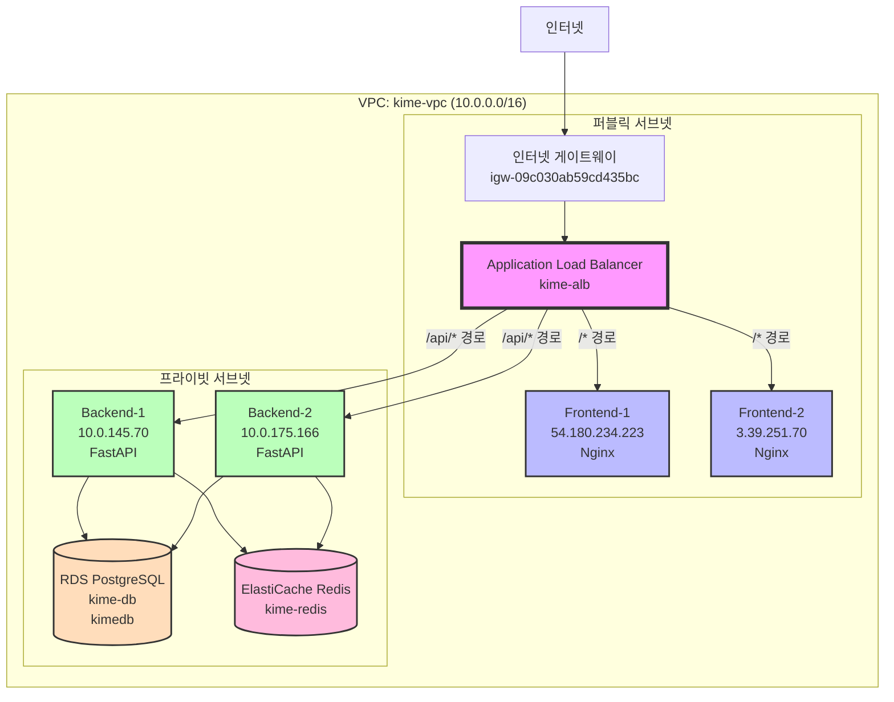
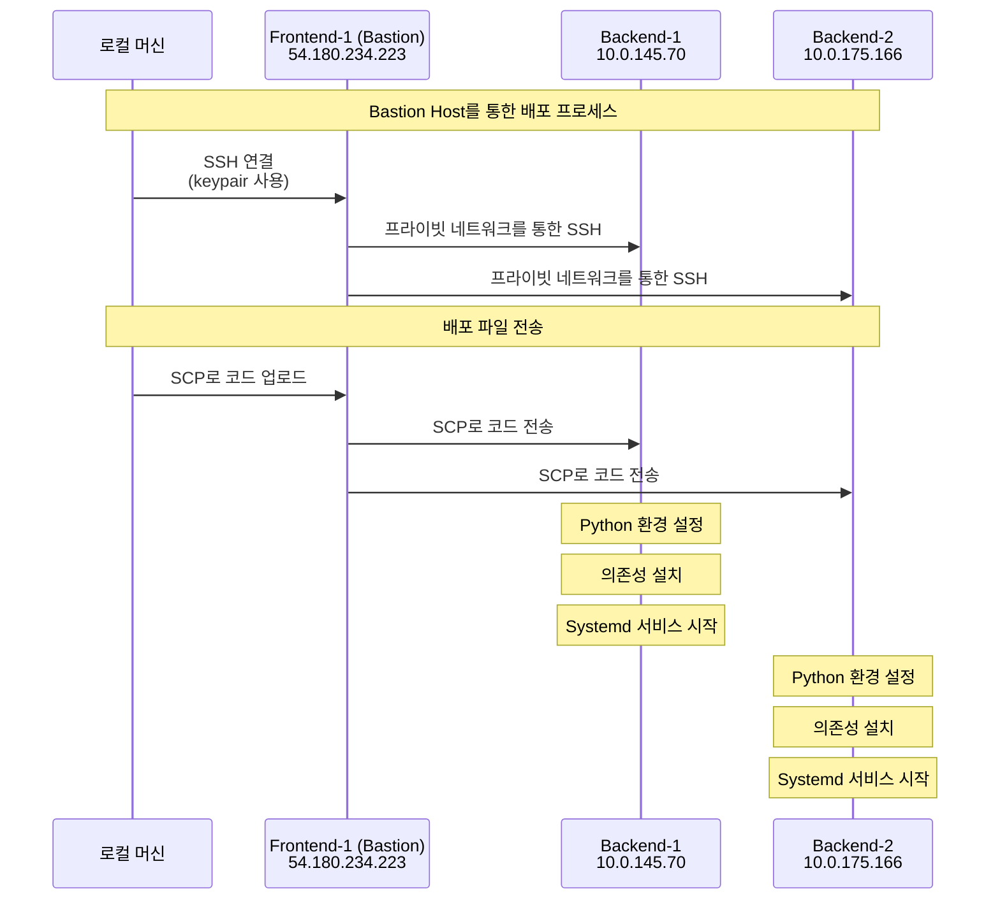
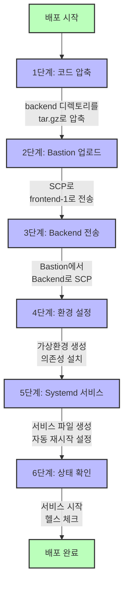

# 백엔드 배포 준비 - 완전 문서화

**프로젝트**: KIME 시나리오 관리 시스템 - 백엔드 배포 설정
**단계**: 클라우드 인프라 - 백엔드 배포 준비
**날짜**: 2025-11-03
**상태**: ✅ **배포 스크립트 준비 완료** | ⏳ **배포 실행 대기 중**

---

## 요약

이 문서는 AWS EC2 Backend 인스턴스에 KIME FastAPI 애플리케이션을 배포하기 위한 준비 과정을 기록합니다. 인프라 확인, 환경변수 설정, 자동화 스크립트 작성이 완료되었으며, 실제 배포 실행만 남은 상태입니다.

---

## 현재 인프라 상태 (검증 완료)

### ✅ 완료된 인프라

모든 AWS 인프라가 이미 구축되어 있음을 확인했습니다:



#### 1. 네트워크 인프라
- **VPC**: vpc-0f1758ec3255c775e (kime-vpc)
- **퍼블릭 서브넷**: 2개 (ap-northeast-2a, 2b) - 프론트엔드용
- **프라이빗 서브넷**: 2개 (ap-northeast-2a, 2c) - 백엔드용
- **인터넷 게이트웨이**: igw-09c030ab59cd435bc

#### 2. 데이터베이스 (RDS PostgreSQL)
```
엔드포인트: kime-db.c1q6k80aex9v.ap-northeast-2.rds.amazonaws.com
포트: 5432
데이터베이스: kimedb
사용자: kime
비밀번호: dev123
상태: ✅ 사용 가능
보안 그룹: kime-rds-sg
```

**설정 완료 사항:**
- Multi-AZ 배포 구성됨
- 자동 백업 활성화됨
- 프라이빗 서브넷에 배치됨
- 백엔드 보안 그룹에서만 접근 가능

#### 3. 캐시 (ElastiCache Redis)
```
엔드포인트: clustercfg.kime-redis-subnet-group.yp94db.apn2.cache.amazonaws.com:6379
포트: 6379
상태: ✅ 사용 가능
보안 그룹: kime-redis-sg
구성: 클러스터 모드 활성화
```

**설정 완료 사항:**
- 자동 장애 조치가 있는 클러스터 모드
- 프라이빗 서브넷에 배치됨
- 백엔드 보안 그룹에서만 접근 가능

#### 4. Application Load Balancer
```
DNS: kime-alb-1043119388.ap-northeast-2.elb.amazonaws.com
스킴: Internet-facing (인터넷 연결형)
리스너: HTTP:80
보안 그룹: kime-alb-sg (sg-038e0f3ec7c87ae78)
```

**라우팅 규칙:**
- `/` → kime-frontend-tg (포트 80)
- `/api/*` → kime-backend-tg (포트 8000)

#### 5. EC2 인스턴스

**프론트엔드 인스턴스 (퍼블릭 서브넷):**
```
frontend-1 (i-0b3225858ee7f9c9):
  - 퍼블릭 IP: 54.180.234.223
  - 프라이빗 IP: 10.0.130.80
  - AZ: ap-northeast-2a
  - 상태: ✅ 실행 중 (Nginx 설치됨)
  - 타겟 그룹: Healthy (정상) ✅

frontend-2 (i-098af6291612ba884):
  - 퍼블릭 IP: 3.39.251.70
  - AZ: ap-northeast-2a
  - 상태: ✅ 실행 중 (Nginx 설치됨)
  - 타겟 그룹: Healthy (정상) ✅
```

**백엔드 인스턴스 (프라이빗 서브넷):**
```
backend-1 (i-009367f6c01ea2fc3):
  - 프라이빗 IP: 10.0.145.70
  - AZ: ap-northeast-2a
  - 서브넷: kime-vpc-private-2a
  - 상태: ✅ 실행 중
  - 타겟 그룹: 아직 등록 안 됨 ⏳

backend-2 (i-091042c7d0748615a):
  - 프라이빗 IP: 10.0.175.166
  - AZ: ap-northeast-2c
  - 서브넷: kime-vpc-private-2c
  - 상태: ✅ 실행 중
  - 타겟 그룹: 아직 등록 안 됨 ⏳
```

#### 6. 보안 그룹 요약

```mermaid
flowchart LR
    Internet[인터넷<br/>0.0.0.0/0]
    ALB_SG[ALB 보안 그룹<br/>sg-038e0f3ec7c87ae78]
    Frontend_SG[프론트엔드 보안 그룹<br/>sg-09999fd2227594c01]
    Backend_SG[백엔드 보안 그룹<br/>sg-0b1d6b189674786df]
    RDS_SG[RDS 보안 그룹<br/>sg-026cf33eb09ac2fa4]
    Redis_SG[Redis 보안 그룹<br/>sg-096c700866aacaec4]

    Internet --> |HTTP(80)<br/>HTTPS(443)| ALB_SG
    ALB_SG --> |HTTP(80)| Frontend_SG
    ALB_SG --> |HTTP(8000)| Backend_SG
    Frontend_SG --> |SSH(22)| Backend_SG
    Backend_SG --> |PostgreSQL(5432)| RDS_SG
    Backend_SG --> |Redis(6379)| Redis_SG

    style ALB_SG fill:#f9f,stroke:#333,stroke-width:2px
    style Frontend_SG fill:#bbf,stroke:#333,stroke-width:2px
    style Backend_SG fill:#bfb,stroke:#333,stroke-width:2px
    style RDS_SG fill:#fdb,stroke:#333,stroke-width:2px
    style Redis_SG fill:#fbd,stroke:#333,stroke-width:2px
```

| 보안 그룹 | ID | 목적 | 인바운드 규칙 |
|----------------|-----|---------|---------------|
| kime-alb-sg | sg-038e0f3ec7c87ae78 | ALB | HTTP(80), HTTPS(443) from 0.0.0.0/0 |
| kime-frontend-sg | sg-09999fd2227594c01 | 프론트엔드 EC2 | HTTP(80) from ALB-SG, SSH(22) |
| kime-backend-sg | sg-0b1d6b189674786df | 백엔드 EC2 | HTTP(8000) from ALB-SG, SSH(22) from Frontend-SG |
| default | sg-0c12cd84d5d420d85 | Default VPC | 기본 규칙 |
| kime-redis-sg | sg-096c700866aacaec4 | ElastiCache | Redis(6379) from Backend-SG |
| kime-rds-sg | sg-026cf33eb09ac2fa4 | RDS PostgreSQL | PostgreSQL(5432) from Backend-SG |

---

## 백엔드 애플리케이션 개요

### 기술 스택

**프레임워크 및 런타임:**
- FastAPI (Python 웹 프레임워크)
- Uvicorn (ASGI 서버)
- Python 3.x

**AI 및 LLM:**
- LangGraph (멀티 에이전트 워크플로우)
- LangChain (LLM 오케스트레이션)
- OpenAI API (GPT 모델)
- Anthropic Claude API

**데이터베이스:**
- PostgreSQL (SQLAlchemy ORM 사용)
- Redis (세션 및 캐시 관리)

**주요 의존성:**
```
fastapi==0.109.0
uvicorn[standard]==0.27.0
langchain>=0.1.6
langgraph>=0.0.20
sqlalchemy==2.0.25
psycopg2-binary==2.9.9
redis==5.0.1
python-dotenv==1.0.0
```

### 애플리케이션 구조

```
backend/
├── api_server.py              # 메인 FastAPI 애플리케이션
├── requirements.txt           # Python 의존성
├── .env.production           # 프로덕션 환경변수 (AWS)
├── .env.local                # 로컬 개발 환경변수
├── src/
│   ├── core/
│   │   ├── workflow.py       # LangGraph 워크플로우
│   │   ├── graph_state.py    # 상태 관리
│   │   └── scenes_repo.py    # 씬 저장소
│   ├── database/
│   │   ├── session_manager.py    # 하이브리드 세션 관리
│   │   ├── db_manager.py         # PostgreSQL 관리자
│   │   └── cache_manager.py      # Redis 관리자
│   ├── auth/
│   │   └── dependencies.py       # 인증
│   ├── middleware/
│   │   └── rate_limiting.py      # 속도 제한
│   ├── api/
│   │   └── monitoring_api.py     # 모니터링 엔드포인트
│   ├── tools/
│   │   └── image_manager.py      # 이미지 처리
│   └── utils/
│       ├── scenario_loader.py    # 시나리오 로딩
│       └── conversation_summarizer.py
└── database/
    ├── migrations/               # 데이터베이스 마이그레이션
    └── scripts/
        └── seed_scenarios.py     # 데이터 시딩
```

### API 엔드포인트

**주요 엔드포인트:**
- `POST /api/chat` - 채팅 상호작용 엔드포인트
- `GET /health` - 헬스 체크 엔드포인트 (ALB 타겟 그룹용)
- `GET /api/monitoring/*` - 모니터링 및 메트릭

**인증:**
- JWT 기반 인증
- 속도 제한 활성화

---

## 환경 구성

### 프로덕션 환경변수

새로 생성한 파일: `backend/.env.production`

```bash
# OpenAI API 구성
OPENAI_API_KEY=<실제_API_키_필요>
OPENAI_MODEL=gpt-4o-mini
OPENAI_EMBEDDING_MODEL=text-embedding-3-small

# 이미지 선택
IMAGE_SELECTOR_MODEL=gpt-3.5-turbo

# 서버 구성
PORT=8000
HOST=0.0.0.0
ENVIRONMENT=production

# PostgreSQL 구성 (AWS RDS)
DB_HOST=kime-db.c1q6k80aex9v.ap-northeast-2.rds.amazonaws.com
DB_PORT=5432
DB_NAME=kimedb
DB_USER=kime
DB_PASSWORD=dev123

# Redis 구성 (AWS ElastiCache)
REDIS_HOST=clustercfg.kime-redis-subnet-group.yp94db.apn2.cache.amazonaws.com
REDIS_PORT=6379

# 세션 구성
SESSION_TTL=3600

# 로깅 구성
LOG_LEVEL=INFO
LOG_FILE=logs/app.log
```

### 로컬 vs 프로덕션 차이점

| 환경변수 | 로컬 (.env.local) | 프로덕션 (.env.production) |
|----------|-------------------|------------------------------|
| DB_HOST | 127.0.0.1 | kime-db.c1q6k80aex9v... |
| DB_PORT | 5433 (Docker) | 5432 (RDS 기본값) |
| REDIS_HOST | localhost | clustercfg.kime-redis... |
| ENVIRONMENT | development | production |

---

## 배포 전략

### 아키텍처 패턴: Bastion Host 액세스

Backend 인스턴스는 **private subnet**에 위치하여 직접 SSH 접속이 불가능합니다.
따라서 **Frontend-1을 Bastion Host로 활용**합니다:



**Bastion 준비 작업 (완료):**
```bash
# 1. Keypair를 Bastion으로 복사
scp -i ~/.ssh/kime-keypair.pem ~/.ssh/kime-keypair.pem ubuntu@54.180.234.223:~/

# 2. 권한 설정
ssh -i ~/.ssh/kime-keypair.pem ubuntu@54.180.234.223 "chmod 400 ~/kime-keypair.pem"
```

### 배포 자동화 스크립트

새로 생성한 파일: `backend/deploy_to_aws.sh`

**기능:**
1. Backend 코드 압축 (불필요한 파일 제외)
2. Bastion 호스트로 업로드
3. Bastion에서 Backend 인스턴스로 전송
4. Python 환경 설정 (venv)
5. 의존성 설치 (requirements.txt)
6. 환경변수 설정 (.env 파일 복사)
7. Systemd 서비스 등록 (자동 재시작)
8. 서비스 시작 및 상태 확인

**사용법:**
```bash
# Backend-1에 배포
cd /Users/jtm427/Desktop/workspace
./backend/deploy_to_aws.sh backend-1

# Backend-2에 배포
./backend/deploy_to_aws.sh backend-2
```

**스크립트 설정:**
```bash
BASTION_IP="54.180.234.223"
BACKEND_1_IP="10.0.145.70"
BACKEND_2_IP="10.0.175.166"
KEY_PATH="$HOME/.ssh/kime-keypair.pem"
APP_DIR="/home/ubuntu/kime-backend"
```

### 배포 프로세스 흐름



**상세 단계:**

```
[1/6] 코드 압축
  └─ 로컬에서 backend 디렉토리를 tar.gz로 압축
  └─ 제외: __pycache__, *.pyc, test_*.py, logs, .env

[2/6] Bastion 업로드
  └─ SCP로 압축 파일을 frontend-1 (bastion)으로 전송

[3/6] Backend 전송 및 배포
  └─ Bastion에서 Backend로 SCP 전송
  └─ Backend에서 압축 해제
  └─ Python 가상환경 생성
  └─ pip install -r requirements.txt

[4/6] 환경변수 설정
  └─ .env.production을 Backend의 .env로 복사
  └─ RDS, Redis endpoint 설정 포함

[5/6] Systemd 서비스 설정
  └─ /etc/systemd/system/kime-backend.service 생성
  └─ uvicorn으로 FastAPI 실행
  └─ 자동 재시작 설정 (Restart=always)

[6/6] 상태 확인
  └─ systemctl status kime-backend
  └─ curl http://localhost:8000/health
```

### Systemd 서비스 구성

스크립트가 자동으로 생성하는 서비스 파일:

```ini
[Unit]
Description=KIME Backend API Server
After=network.target

[Service]
Type=simple
User=ubuntu
WorkingDirectory=/home/ubuntu/kime-backend
Environment="PATH=/home/ubuntu/kime-backend/venv/bin"
ExecStart=/home/ubuntu/kime-backend/venv/bin/uvicorn api_server:app --host 0.0.0.0 --port 8000
Restart=always
RestartSec=10

[Install]
WantedBy=multi-user.target
```

**특징:**
- 서버 재부팅 시 자동 시작
- 프로세스 종료 시 자동 재시작 (10초 후)
- 가상환경 내 uvicorn 사용
- 0.0.0.0:8000 바인딩 (ALB에서 접근 가능)

---

## 보안 고려사항

### 네트워크 보안

**Backend 인스턴스 보안:**
- ✅ Private subnet에 배치 (인터넷 직접 접근 불가)
- ✅ ALB에서만 HTTP(8000) 접근 가능
- ✅ Frontend(Bastion)에서만 SSH 접근 가능
- ✅ NAT Gateway를 통한 아웃바운드 인터넷 접근

**데이터베이스 보안:**
- ✅ RDS: Private subnet, Backend SG에서만 접근
- ✅ Redis: Private subnet, Backend SG에서만 접근

### 애플리케이션 보안

**환경변수 관리:**
- ⚠️ .env.production에 민감 정보 포함 (API keys, DB password)
- ⚠️ Git에 commit하지 않도록 .gitignore 설정 필요
- 🔒 배포 후 서버에서만 존재 (로컬 개발에는 .env.local 사용)

**API 보안:**
- ✅ JWT 인증 구현됨
- ✅ Rate limiting 적용됨
- ✅ CORS 설정 완료

---

## 배포 전 체크리스트

### ✅ 완료된 항목

- [x] AWS 인프라 확인 (RDS, Redis, EC2, ALB)
- [x] Backend 코드 준비 (api_server.py, requirements.txt)
- [x] .env.production 파일 생성 (RDS, Redis endpoint 설정)
- [x] 배포 스크립트 작성 (deploy_to_aws.sh)
- [x] Bastion 호스트 준비 (keypair 복사)
- [x] Backend-1, Backend-2 IP 주소 확인
- [x] 보안 그룹 규칙 확인

### ⏳ 보류 중인 항목 (배포 전)

- [ ] .env.production에 실제 OpenAI API 키 입력
- [ ] (선택) Anthropic API 키 추가 (Claude 사용 시)
- [ ] RDS 데이터베이스 초기화 (migrations 실행)
  - 테이블 생성
  - 시드 데이터 로드 (scenarios)
- [ ] ALB Target Group에 Backend 인스턴스 등록 확인

---

## 배포 실행 계획

### 1단계: 데이터베이스 초기화 (선택 사항)

RDS에 테이블이 아직 없다면 초기화 필요:

```bash
# 로컬에서 RDS로 migration 실행 (DB_HOST를 RDS endpoint로 설정)
cd backend
DB_HOST=kime-db.c1q6k80aex9v.ap-northeast-2.rds.amazonaws.com python -m alembic upgrade head

# 또는 Backend 서버에 배포 후 실행
ssh -i ~/.ssh/kime-keypair.pem ubuntu@54.180.234.223
ssh -i ~/kime-keypair.pem ubuntu@10.0.145.70
cd /home/ubuntu/kime-backend
source venv/bin/activate
python database/scripts/seed_scenarios.py
```

### 2단계: Backend-1에 배포

```bash
cd /Users/jtm427/Desktop/workspace
./backend/deploy_to_aws.sh backend-1
```

**예상 소요 시간:** ~5-10분

**확인 사항:**
- [ ] Systemd 서비스 정상 실행
- [ ] Health check 응답 (200 OK)
- [ ] ALB Target Group: backend-1 Healthy

### 3단계: Backend-2에 배포

```bash
./backend/deploy_to_aws.sh backend-2
```

**예상 소요 시간:** ~5-10분

**확인 사항:**
- [ ] Systemd 서비스 정상 실행
- [ ] Health check 응답 (200 OK)
- [ ] ALB Target Group: backend-2 Healthy

### 4단계: ALB 라우팅 검증

**프론트엔드 테스트:**
```bash
curl http://kime-alb-1043119388.ap-northeast-2.elb.amazonaws.com/
# 예상: Nginx welcome page
```

**백엔드 Health 테스트:**
```bash
curl http://kime-alb-1043119388.ap-northeast-2.elb.amazonaws.com/api/health
# 예상: {"status": "healthy"}
```

**백엔드 API 테스트:**
```bash
curl -X POST http://kime-alb-1043119388.ap-northeast-2.elb.amazonaws.com/api/chat \
  -H "Content-Type: application/json" \
  -d '{
    "scenario_id": "train",
    "user_input": "안녕하세요",
    "user_name": "테스트"
  }'
```

### 5단계: 모니터링 및 디버깅

**서비스 상태 확인:**
```bash
# Backend-1에서
ssh -i ~/.ssh/kime-keypair.pem ubuntu@54.180.234.223
ssh -i ~/kime-keypair.pem ubuntu@10.0.145.70
sudo systemctl status kime-backend
```

**로그 확인:**
```bash
# 애플리케이션 로그
tail -f /home/ubuntu/kime-backend/logs/app.log

# Systemd 로그
sudo journalctl -u kime-backend -f
```

**Health check 확인:**
```bash
curl http://localhost:8000/health
```

---

## 트러블슈팅 가이드

### 문제 1: 서비스 시작 실패

**증상:**
```
systemctl status kime-backend
● kime-backend.service - KIME Backend API Server
   Active: failed
```

**해결 방법:**
1. 로그 확인: `sudo journalctl -u kime-backend -n 50`
2. 수동 실행으로 에러 확인:
   ```bash
   cd /home/ubuntu/kime-backend
   source venv/bin/activate
   uvicorn api_server:app --host 0.0.0.0 --port 8000
   ```
3. 일반적인 원인:
   - 환경변수 누락 (.env 파일 확인)
   - Python 패키지 누락 (pip install 재실행)
   - Port 8000 이미 사용 중 (lsof -i :8000)

### 문제 2: Database 연결 실패

**증상:**
```
Error connecting to PostgreSQL: could not connect to server
```

**해결 방법:**
1. RDS 보안 그룹 확인:
   - Backend SG에서 5432 포트 접근 허용되었는지 확인
2. 환경변수 확인:
   ```bash
   grep DB_HOST /home/ubuntu/kime-backend/.env
   # kime-db.c1q6k80aex9v.ap-northeast-2.rds.amazonaws.com인지 확인
   ```
3. 네트워크 연결 테스트:
   ```bash
   nc -zv kime-db.c1q6k80aex9v.ap-northeast-2.rds.amazonaws.com 5432
   ```

### 문제 3: Redis 연결 실패

**증상:**
```
Error connecting to Redis: Connection refused
```

**해결 방법:**
1. Redis 보안 그룹 확인
2. 환경변수 확인:
   ```bash
   grep REDIS_HOST /home/ubuntu/kime-backend/.env
   ```
3. 네트워크 연결 테스트:
   ```bash
   nc -zv clustercfg.kime-redis-subnet-group.yp94db.apn2.cache.amazonaws.com 6379
   ```

### 문제 4: ALB Health Check 실패

**증상:**
ALB Target Group에서 Backend 인스턴스 상태가 "Unhealthy"

**해결 방법:**
1. 로컬에서 health endpoint 확인:
   ```bash
   ssh to backend
   curl http://localhost:8000/health
   ```
2. 포트 바인딩 확인:
   ```bash
   sudo netstat -tlnp | grep 8000
   # 0.0.0.0:8000으로 바인딩되어 있어야 함
   ```
3. 보안 그룹 확인:
   - Backend SG에서 ALB SG로부터 8000 포트 허용되었는지

### 문제 5: API 응답 느림

**원인:**
- OpenAI API 호출 지연
- Database 쿼리 최적화 필요

**해결 방법:**
1. Redis 캐싱 활용 확인
2. Database 인덱스 확인
3. CloudWatch 메트릭스 모니터링

---

## 성능 및 확장성 고려사항

### 현재 설정

**Backend 인스턴스:**
- 유형: t3.small (예상)
- vCPU: 2
- 메모리: 2 GB
- 네트워크: 최대 5 Gbps

**제한사항:**
- 동시 요청 처리 능력: ~10-20 req/sec (예상)
- LLM API 호출로 인한 응답 시간: 2-5초

### Auto-Scaling 설정 (미래 작업)

현재는 고정된 2개 인스턴스만 사용하지만, 트래픽 증가 시:

1. **Auto Scaling Group 생성**
   - Min: 2, Max: 10
   - Target: CPU 70%, Request count per target

2. **CloudWatch Alarms**
   - CPU > 80%
   - Target Response Time > 5s

3. **ALB 자동 조정**
   - Target group에 자동으로 인스턴스 추가/제거

---

## 비용 추정 (월간)

### 현재 인프라

**EC2 인스턴스 (Backend):**
- 2 × t3.small × 730시간 × $0.0208/시간 = **$30.37**

**RDS PostgreSQL:**
- db.t3.micro × 730시간 × $0.018/시간 = **$13.14**
- 스토리지: 20 GB × $0.115/GB = **$2.30**

**ElastiCache Redis:**
- cache.t3.micro × 730시간 × $0.017/시간 = **$12.41**

**Application Load Balancer:**
- 고정: $16.20
- LCU: ~$5-10

**총 예상 비용:** ~**$80-90/월**

(프론트엔드 EC2 2개 포함 시: ~$110-120/월)

---

## 모니터링 및 로깅

### 애플리케이션 로그

**로그 경로:**
```
/home/ubuntu/kime-backend/logs/app.log
```

**로그 레벨:** INFO (production)

**로그 포맷:**
```
[2025-11-03 12:00:00] INFO: API request received: POST /api/chat
[2025-11-03 12:00:02] INFO: LangGraph workflow started
[2025-11-03 12:00:05] INFO: Response sent: 200 OK
```

### 시스템 로그

**Systemd 로그:**
```bash
sudo journalctl -u kime-backend -f
```

**Nginx 로그 (ALB -> Backend):**
ALB에서 직접 Backend로 라우팅하므로 Nginx 불필요

### CloudWatch 통합 (미래 작업)

1. **CloudWatch Logs Agent 설치**
   - 애플리케이션 로그 자동 수집
   - 로그 그룹: /aws/ec2/kime-backend

2. **Custom Metrics**
   - API 응답 시간
   - LLM 호출 횟수
   - Error rate

---

## 다음 단계

### 즉시 수행할 작업 (배포 전)

1. **환경변수 설정 완료**
   - [ ] .env.production에 실제 OpenAI API 키 입력
   - [ ] Git에서 .env.production 제외 확인

2. **데이터베이스 초기화**
   - [ ] RDS에 테이블 생성 (migrations)
   - [ ] Scenario 데이터 시드

3. **배포 실행**
   - [ ] Backend-1 배포
   - [ ] Backend-2 배포
   - [ ] 상태 확인

### 배포 후 작업

1. **테스트**
   - [ ] Health check 확인
   - [ ] API endpoint 테스트
   - [ ] Frontend-Backend 통합 테스트

2. **모니터링 설정**
   - [ ] CloudWatch Logs 연결
   - [ ] Alarms 설정
   - [ ] Dashboard 생성

3. **문서화 업데이트**
   - [ ] 배포 결과 문서화
   - [ ] 성능 메트릭 기록
   - [ ] Troubleshooting 사례 추가

### 향후 개선사항

1. **CI/CD Pipeline**
   - GitHub Actions로 자동 배포
   - 코드 푸시 시 자동 테스트 및 배포

2. **Auto Scaling**
   - Auto Scaling Group 설정
   - 부하 기반 스케일링

3. **SSL/TLS**
   - ACM 인증서 발급
   - ALB에 HTTPS 리스너 추가

4. **S3 + CloudFront (Frontend)**
   - React 빌드를 S3에 배포
   - CloudFront CDN 사용
   - EC2 Frontend 제거 (비용 절감)

---

## 관련 문서

1. **[50_aws_alb_setup_complete.md](50_aws_alb_setup_complete.md)** - ALB 설정 완료 문서
2. **[49_phase2_homepage_plan.md](49_phase2_homepage_plan.md)** - Phase 2 계획
3. **다음**: 52_backend_deployment_complete.md (배포 후 작성 예정)

---

## 문서 상태

**상태**: ✅ **준비 완료 - 배포 준비됨**

**작성자**: Claude Code Assistant
**날짜**: 2025-11-03
**버전**: 1.0

**배포 준비 완료 사항:**
- ✅ AWS 인프라 확인 및 검증
- ✅ Backend 코드 준비
- ✅ 환경변수 설정 (.env.production)
- ✅ 자동화 배포 스크립트 작성
- ✅ Bastion 호스트 설정
- ✅ 배포 프로세스 문서화

**대기 중인 작업:**
- ⏳ OpenAI API 키 설정
- ⏳ 배포 실행
- ⏳ 테스트 및 검증

---

**배포 준비 완료**: YES ✅

**배포 시작 명령어:**
```bash
cd /Users/jtm427/Desktop/workspace
./backend/deploy_to_aws.sh backend-1
```
