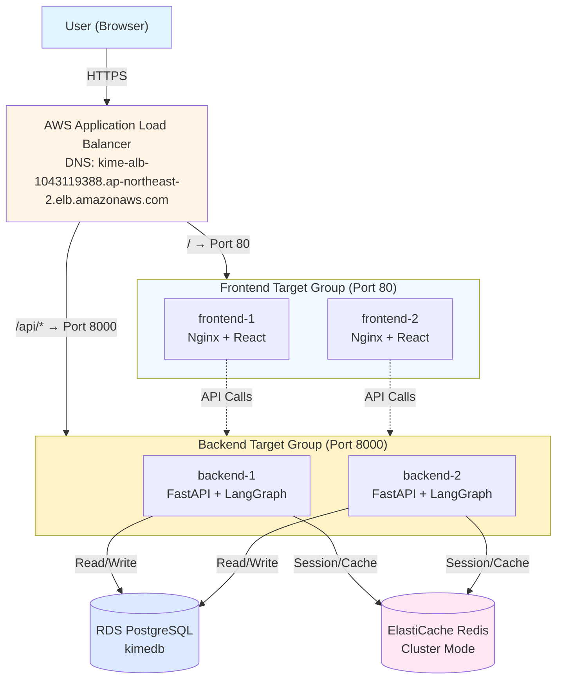
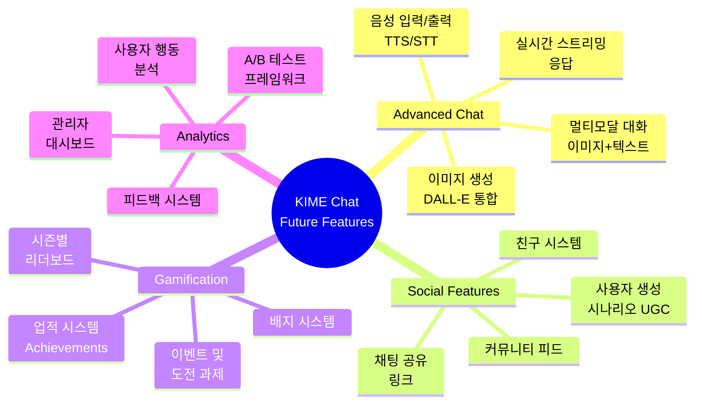

# KIME Chat System - 종합 분석 및 개선 방향

**Date**: 2025-11-03
**Project**: KIME Scenario Management System (Full-Stack AI Chat)
**Purpose**: 전체 시스템 현황 파악 및 필수 구현사항 / 개선사항 식별

---

## 📊 Executive Summary

KIME Chat은 **LangGraph 기반 멀티에이전트 AI 챗봇**과 **사용자 진행도 시스템**, **시나리오 관리 시스템**을 결합한 Full-Stack 웹 애플리케이션입니다.

### 현재 완성도:
- **Backend**: 95% 완료 (미배포)
- **Frontend**: 90% 완료 (API 연동 완료)
- **Database**: 100% 스키마 완료 (마이그레이션 미실행)
- **AWS 인프라**: 95% 완료 (Backend 미배포)
- **전체**: **약 92% 완료**

### 핵심 성과:
- ✅ Phase 1 (RightSidebar) 완료: 사용자 진행도 시스템
- ✅ Phase 2 (HomePage) 완료: 시나리오 관리 시스템
- ✅ AWS ALB 설정 완료
- ✅ Backend/DB 정합성 100%
- ⏳ AWS 배포 대기 중

---

## 🏗️ 시스템 아키텍처

### 전체 구조



### 기술 스택

#### Frontend
- **Framework**: React 18.2 + TypeScript 5.3
- **Build Tool**: Vite 5.0
- **Routing**: React Router 6.20
- **Styling**: TailwindCSS 3.3
- **HTTP Client**: Axios 1.13
- **Authentication**: JWT (localStorage)

#### Backend
- **Framework**: FastAPI 0.109
- **AI Engine**: LangGraph 0.0.20 + LangChain 0.1.6
- **LLM**: OpenAI GPT-4o-mini + Claude (Anthropic)
- **Database**: PostgreSQL (SQLAlchemy 2.0)
- **Cache**: Redis 5.0
- **Auth**: JWT + bcrypt

#### Infrastructure (AWS)
- **Compute**: EC2 (4 instances - 2 Frontend, 2 Backend)
- **Load Balancer**: Application Load Balancer
- **Database**: RDS PostgreSQL
- **Cache**: ElastiCache Redis (Cluster mode)
- **Network**: VPC (public/private subnets, NAT Gateway)

---

## ✅ 완료된 기능 (Phase 1-2)

### Phase 1: User Progression System (RightSidebar)

**Status**: ✅ 100% Complete

**Features**:
1. ✅ 5단계 계급 시스템 (견습생 → 주)
2. ✅ 레벨 및 경험치 시스템 (1-99)
3. ✅ 장비 상태 (일륜도, 복장, 까마귀)
4. ✅ 사용자 통계 (메시지 수, 세션 수, 플레이 시간)
5. ✅ XP 트랜잭션 히스토리
6. ✅ 리더보드 시스템

**Database Tables** (Migration 012):
- `rank_definitions` - 계급 정의
- `user_progression` - 사용자 진행도
- `user_equipment` - 장비 상태
- `xp_transactions` - XP 거래 내역
- `v_user_progression_summary` (view) - 전체 요약

**API Endpoints**:
- `GET /api/users/me/progression` - 진행도 조회
- `GET /api/users/me/equipment` - 장비 조회
- `POST /api/users/me/progression/award-xp` - XP 부여
- `PUT /api/users/me/equipment` - 장비 업데이트
- `GET /api/users/me/xp-transactions` - XP 내역
- `GET /api/leaderboard` - 리더보드

**Frontend Component**:
- `RightSidebar.tsx` - 동적 데이터 로딩 완료

---

### Phase 2: Scenario Management System (HomePage)

**Status**: ✅ 100% Complete

**Features**:
1. ✅ 동적 시나리오 카드 로딩
2. ✅ 시나리오별 통계 (좋아요, 조회수, 완료율)
3. ✅ 사용자별 진행도 추적
4. ✅ 좋아요 기능 (DB 영구 저장)
5. ✅ 조회수 자동 증가
6. ✅ 검색 및 필터링

**Database Tables** (Migration 013):
- `scenarios` - 시나리오 메타데이터
- `scenario_statistics` - 집계 통계
- `user_scenario_progress` - 사용자별 진행도
- `scenario_views` - 조회 로그
- `v_scenario_cards` (view) - 홈페이지용 카드 뷰

**Triggers**:
- `trg_increment_scenario_views` - 조회수 자동 증가
- `trg_update_scenario_likes` - 좋아요 수 자동 업데이트
- `trg_update_scenario_timestamps` - 타임스탬프 자동 업데이트

**API Endpoints**:
- `GET /api/scenarios` - 시나리오 목록 (public)
- `GET /api/scenarios/{id}` - 시나리오 상세
- `POST /api/scenarios/{id}/view` - 조회수 기록
- `GET /api/users/me/scenarios` - 사용자 시나리오 (진행도 포함)
- `POST /api/users/me/scenarios/{id}/like` - 좋아요 토글
- `GET /api/users/me/scenarios/{id}/progress` - 진행도 조회
- `PUT /api/users/me/scenarios/{id}/progress` - 진행도 업데이트

**Frontend Component**:
- `HomePage.tsx` - 동적 API 연동 완료

---

### Other Completed Features

#### 1. Authentication System ✅
- 이메일/비밀번호 로그인/회원가입
- JWT Access + Refresh Token
- 자동 토큰 갱신 (apiClient.ts)
- 비밀번호 재설정 (이메일 발송)
- Google OAuth (설정 필요)
- Kakao OAuth (설정 필요)

#### 2. Credits System (Bubble) ✅
- 사용자별 버블 관리
- 크레딧 소비 기록
- 신규 가입자 자동 100 버블 지급 (트리거)
- 트랜잭션 히스토리

#### 3. Long-term Memory System ✅
- 사용자별 장기 기억 저장
- JSONB context + 태그 시스템
- 중요도 및 접근 횟수 추적
- GIN 인덱스 기반 고속 검색

#### 4. Chat System ✅
- LangGraph 멀티에이전트 워크플로우
- 시나리오 기반 대화 진행
- Redis + PostgreSQL 하이브리드 세션
- 대화 자동 요약 (장기 기억)
- 친밀도 추적

#### 5. Graph RAG System ✅
- 엔티티 및 관계 추출
- pgvector 기반 임베딩 검색
- 그래프 기반 메모리 검색

---

## 🚨 필수 구현 사항 (Critical Missing Features)

### 1. ❌ AWS Backend 배포 (최우선)

**Status**: 준비 완료, 실행 대기

**Why Critical**:
현재 모든 Backend 기능이 로컬에서만 동작합니다. Frontend가 AWS EC2에 배포되어도 Backend가 없으면 API 호출이 모두 실패합니다.

**Required Actions**:
```bash
# 1. RDS 데이터베이스 마이그레이션 실행
cd backend
for migration in database/migrations/*.sql; do
  PGPASSWORD=dev123 psql -h kime-db.c1q6k80aex9v... -U kime -d kimedb -f $migration
done

# 2. 시나리오 데이터 시딩
python database/scripts/seed_scenarios.py

# 3. Backend 배포
cd ..
./backend/deploy_to_aws.sh backend-1
./backend/deploy_to_aws.sh backend-2

# 4. ALB Health Check 확인
curl http://kime-alb-1043119388.ap-northeast-2.elb.amazonaws.com/api/health
```

**Estimated Time**: 30-60분

---

### 2. ❌ Frontend 환경변수 설정 (.env)

**Status**: 설정 파일 없음

**Why Critical**:
Frontend가 Backend API URL을 알지 못하면 모든 API 호출이 localhost:8000으로 향하게 됩니다.

**Current Issue**:
```typescript
// apiClient.ts, api.ts
const API_BASE_URL = import.meta.env.VITE_API_URL || 'http://localhost:8000'
```

Frontend에 `.env` 파일이 없어서 항상 fallback (localhost:8000) 사용.

**Required Actions**:
```bash
# Create front/.env
cat > front/.env << 'EOF'
VITE_API_URL=http://kime-alb-1043119388.ap-northeast-2.elb.amazonaws.com
VITE_API_BASE_URL=http://kime-alb-1043119388.ap-northeast-2.elb.amazonaws.com
VITE_CDN_URL=/images
EOF

# Rebuild and deploy frontend
cd front
npm run build
# Deploy to frontend-1, frontend-2
```

**Estimated Time**: 15분

---

### 3. ❌ Frontend 빌드 및 배포

**Status**: 미배포 (현재 Nginx default page만 표시)

**Why Critical**:
현재 Frontend EC2 인스턴스는 Nginx만 설치되어 있고, React 앱은 배포되지 않았습니다.

**Required Actions**:
```bash
# 1. Frontend 빌드
cd front
npm install
npm run build  # → dist/ 디렉토리 생성

# 2. dist를 Frontend EC2로 배포
scp -i ~/.ssh/kime-keypair.pem -r dist/* ubuntu@54.180.234.223:/var/www/html/
scp -i ~/.ssh/kime-keypair.pem -r dist/* ubuntu@3.39.251.70:/var/www/html/

# 3. Nginx 설정 업데이트 (SPA 라우팅)
# /etc/nginx/sites-available/default 수정:
location / {
  root /var/www/html;
  try_files $uri $uri/ /index.html;
}
```

**Alternative (S3 + CloudFront 권장)**:
```bash
# Frontend를 S3에 배포 (정적 호스팅)
aws s3 sync dist/ s3://kime-frontend-bucket/ --acl public-read
aws cloudfront create-invalidation --distribution-id XXX --paths "/*"

# EC2 Frontend 인스턴스 제거 (비용 절감)
```

**Estimated Time**: 30분 (EC2 배포) / 60분 (S3 마이그레이션)

---

### 4. ❌ CORS 설정 업데이트

**Status**: localhost만 허용

**Why Critical**:
Backend API가 ALB DNS에서 오는 요청을 거부할 수 있습니다.

**Current Issue**:
```python
# api_server.py:86-94
allow_origins=[
    "http://localhost:3000",
    "http://localhost:3001",
    "http://localhost:5173",
]
```

AWS ALB DNS가 없음!

**Required Actions**:
```python
# .env.production에 추가
CORS_ORIGINS=http://kime-alb-1043119388.ap-northeast-2.elb.amazonaws.com

# api_server.py 수정
allow_origins=os.getenv("CORS_ORIGINS", "http://localhost:5173").split(",")
```

또는:

```python
allow_origins=["*"]  # 테스트용 (프로덕션에서는 비권장)
```

**Estimated Time**: 10분

---

### 5. ⚠️ Gmail 앱 비밀번호 설정

**Status**: 설정 파일에만 placeholder

**Why Important (Not Critical)**:
비밀번호 재설정 기능이 동작하지 않습니다. 하지만 사용자가 비밀번호를 잊지 않으면 문제없음.

**Current State**:
```bash
# .env.production
SMTP_PASSWORD=jnhzlsyihvxwfhvz  # ✅ 이미 설정됨!
```

**Status**: ✅ 실제로는 이미 완료됨!

---

## 🔧 개선이 필요한 부분 (Improvements)

### 1. 🔐 보안 강화

#### Issue 1.1: JWT Secret 강화
**Current**:
```python
# .env.production
JWT_SECRET_KEY=kime-prod-jwt-secret-2025-change-this-to-random-string
```

**Recommendation**:
```bash
# 강력한 랜덤 키 생성
python -c "import secrets; print(secrets.token_urlsafe(32))"
# → XYZ123abc...

# .env.production 업데이트
JWT_SECRET_KEY=<generated_key>
```

**Risk**: Medium (JWT 토큰 위조 가능)
**Estimated Time**: 5분

---

#### Issue 1.2: Database Password 강화
**Current**:
```bash
DB_PASSWORD=dev123  # ❌ 너무 약함
```

**Recommendation**:
```bash
# RDS 콘솔에서 비밀번호 변경
# Master password: 최소 12자, 특수문자 포함
```

**Risk**: High (DB 접근 권한 탈취)
**Estimated Time**: 10분 + DB 재부팅

---

#### Issue 1.3: SSH 접근 제한
**Current**:
Frontend 보안 그룹에서 SSH가 `0.0.0.0/0`으로 열려 있음.

**Recommendation**:
```bash
# AWS 콘솔에서 SSH를 특정 IP로 제한
Source: My IP (또는 VPN IP)
```

**Risk**: Medium (무단 접근 가능)
**Estimated Time**: 5분

---

### 2. 📊 모니터링 및 로깅

#### Issue 2.1: CloudWatch Logs 미설정
**Current**: 애플리케이션 로그가 서버 로컬에만 저장됨.

**Recommendation**:
```bash
# CloudWatch Logs Agent 설치 (Backend EC2)
sudo apt install awscli
aws configure

# CloudWatch Logs 그룹 생성
aws logs create-log-group --log-group-name /aws/ec2/kime-backend

# 로그 스트리밍 설정
```

**Benefits**:
- 중앙집중식 로그 관리
- 로그 검색 및 분석
- 알람 설정 가능

**Estimated Time**: 30분

---

#### Issue 2.2: Health Check Alerts 미설정
**Current**: ALB Target Group Health가 Unhealthy여도 알림 없음.

**Recommendation**:
```bash
# CloudWatch Alarm 생성
aws cloudwatch put-metric-alarm \
  --alarm-name kime-backend-unhealthy \
  --metric-name UnHealthyHostCount \
  --namespace AWS/ApplicationELB \
  --statistic Average \
  --threshold 1 \
  --alarm-actions <SNS_TOPIC_ARN>
```

**Benefits**:
- 장애 즉시 감지
- 이메일/SMS 알림

**Estimated Time**: 20분

---

### 3. 🚀 성능 최적화

#### Issue 3.1: Frontend 이미지 최적화 미흡
**Current**: 시나리오 이미지가 `/images` 경로에서 서빙됨 (Nginx 또는 S3)

**Recommendation**:
```bash
# CloudFront CDN 설정
# 1. S3 버킷에 이미지 업로드
aws s3 sync images/ s3://kime-assets/images/

# 2. CloudFront Distribution 생성
# Origin: S3 bucket
# Cache behavior: 이미지 파일 (.png, .jpg) 캐싱

# 3. Frontend 환경변수 업데이트
VITE_CDN_URL=https://d1234.cloudfront.net/images
```

**Benefits**:
- 이미지 로딩 속도 향상 (CDN)
- Backend/Frontend 서버 부하 감소
- 전세계 edge location에서 캐싱

**Estimated Time**: 45분

---

#### Issue 3.2: Database Connection Pooling 미설정
**Current**: SQLAlchemy 기본 설정 사용

**Recommendation**:
```python
# backend/src/database/db_manager.py
from sqlalchemy import create_engine

engine = create_engine(
    DATABASE_URL,
    pool_size=20,        # 최대 20개 연결
    max_overflow=10,     # 추가 10개 허용
    pool_pre_ping=True,  # 연결 유효성 자동 체크
    pool_recycle=3600    # 1시간마다 연결 재생성
)
```

**Benefits**:
- 동시 요청 처리 능력 향상
- Connection timeout 감소

**Estimated Time**: 15분

---

#### Issue 3.3: Redis 캐시 전략 부재
**Current**: Redis를 세션 저장용으로만 사용

**Recommendation**:
```python
# 자주 조회되는 데이터 캐싱
# - 시나리오 목록 (GET /api/scenarios)
# - 리더보드 (GET /api/leaderboard)
# - 사용자 진행도 (GET /api/users/me/progression)

@app.get("/api/scenarios")
async def get_scenarios():
    cache_key = "scenarios:all"

    # Redis에서 조회
    cached = redis_client.get(cache_key)
    if cached:
        return json.loads(cached)

    # DB에서 조회
    scenarios = db.get_scenarios()

    # Redis에 캐싱 (5분)
    redis_client.setex(cache_key, 300, json.dumps(scenarios))

    return scenarios
```

**Benefits**:
- DB 부하 감소
- API 응답 속도 향상 (ms → µs)

**Estimated Time**: 30분

---

### 4. 🔍 테스트 커버리지

#### Issue 4.1: E2E 테스트 부족
**Current**: Phase 1, Phase 2 테스트만 존재

**Recommendation**:
```bash
# 추가 필요한 테스트
# - 로그인/로그아웃 플로우
# - 비밀번호 재설정 플로우
# - 크레딧 소비 플로우
# - 시나리오 완료 플로우
# - 리더보드 업데이트
```

**Benefits**:
- 배포 전 회귀 테스트 자동화
- 버그 조기 발견

**Estimated Time**: 2-3시간

---

#### Issue 4.2: Load Testing 미실행
**Current**: 동시 접속자 성능 미확인

**Recommendation**:
```bash
# Locust 또는 k6로 부하 테스트
npm install -g k6

# test_load.js
import http from 'k6/http';
import { check } from 'k6';

export let options = {
  stages: [
    { duration: '2m', target: 100 },  // 100명까지 증가
    { duration: '5m', target: 100 },  // 5분 유지
    { duration: '2m', target: 0 },    // 감소
  ],
};

export default function () {
  let res = http.get('http://kime-alb.../api/scenarios');
  check(res, { 'status was 200': (r) => r.status == 200 });
}

# 실행
k6 run test_load.js
```

**Benefits**:
- 병목 지점 파악
- EC2 인스턴스 타입 최적화

**Estimated Time**: 1시간

---

### 5. 📱 UX/UI 개선

#### Issue 5.1: 로딩 상태 개선
**Current**: Loading spinner 표시

**Recommendation**:
- Skeleton UI (카드 프레임 미리 표시)
- Progressive Image Loading
- Optimistic UI Updates (좋아요 등)

**Estimated Time**: 2-3시간

---

#### Issue 5.2: 오프라인 지원 부재
**Current**: 네트워크 끊기면 완전히 동작 불가

**Recommendation**:
- Service Worker 등록 (PWA)
- IndexedDB에 일부 데이터 캐싱
- Offline 상태 감지 및 안내

**Estimated Time**: 4-5시간

---

#### Issue 5.3: Mobile Responsive 미흡
**Current**: Desktop 중심 디자인

**Recommendation**:
- Tailwind breakpoints 활용
- Mobile 네비게이션 개선
- 터치 제스처 지원

**Estimated Time**: 3-4시간

---

### 6. 📝 Documentation 개선

#### Issue 6.1: API 문서 자동화
**Current**: 수동 문서화

**Recommendation**:
```python
# FastAPI 기본 제공 Swagger UI
# http://backend:8000/docs

# OpenAPI spec 내보내기
# http://backend:8000/openapi.json
```

이미 있지만 Frontend 개발자에게 공유 필요.

---

#### Issue 6.2: Setup Guide 부족
**Current**: taemin_record에만 산재

**Recommendation**:
- README.md 업데이트 (Quick Start)
- CONTRIBUTING.md 작성
- DEPLOYMENT.md 작성

**Estimated Time**: 2시간

---

## 📋 Priority Roadmap

```mermaid
flowchart LR
    subgraph P0["🚨 P0 - Critical<br/>(1.5-2시간)"]
        P0_1["Backend AWS 배포<br/>30-60분"]
        P0_2["Frontend 환경변수<br/>15분"]
        P0_3["Frontend 빌드/배포<br/>30분"]
        P0_4["CORS 설정<br/>10분"]
    end

    subgraph P1["⚠️ P1 - High<br/>(1시간)"]
        P1_1["JWT Secret 강화<br/>5분"]
        P1_2["DB Password 강화<br/>10분"]
        P1_3["SSH 접근 제한<br/>5분"]
        P1_4["CloudWatch Logs<br/>30분"]
        P1_5["Health Check Alerts<br/>20분"]
    end

    subgraph P2["🔵 P2 - Medium<br/>(5-6시간)"]
        P2_1["CDN 설정<br/>45분"]
        P2_2["DB Connection Pool<br/>15분"]
        P2_3["Redis 캐시 전략<br/>30분"]
        P2_4["E2E 테스트<br/>2-3시간"]
        P2_5["Load Testing<br/>1시간"]
    end

    subgraph P3["🟢 P3 - Low<br/>(11-14시간)"]
        P3_1["Skeleton UI<br/>2-3시간"]
        P3_2["PWA 지원<br/>4-5시간"]
        P3_3["Mobile Responsive<br/>3-4시간"]
        P3_4["Documentation<br/>2시간"]
    end

    P0 ==> P1
    P1 ==> P2
    P2 ==> P3

    style P0 fill:#fee2e2,stroke:#dc2626,stroke-width:3px
    style P1 fill:#fed7aa,stroke:#ea580c,stroke-width:2px
    style P2 fill:#bfdbfe,stroke:#2563eb,stroke-width:2px
    style P3 fill:#bbf7d0,stroke:#16a34a,stroke-width:2px
```



### 🚨 P0 - Critical (배포 전 필수)

| Task | Estimated Time | Impact |
|------|----------------|--------|
| 1. Backend AWS 배포 | 30-60분 | 🔴 최우선 |
| 2. Frontend 환경변수 설정 | 15분 | 🔴 필수 |
| 3. Frontend 빌드 및 배포 | 30분 | 🔴 필수 |
| 4. CORS 설정 업데이트 | 10분 | 🔴 필수 |

**Total**: 약 1.5-2시간

---

### ⚠️ P1 - High Priority (배포 후 1주 내)

| Task | Estimated Time | Impact |
|------|----------------|--------|
| 1. JWT Secret 강화 | 5분 | 🟠 보안 |
| 2. Database Password 강화 | 10분 | 🟠 보안 |
| 3. SSH 접근 제한 | 5분 | 🟠 보안 |
| 4. CloudWatch Logs 설정 | 30분 | 🟠 운영 |
| 5. Health Check Alerts | 20분 | 🟠 운영 |

**Total**: 약 1시간

---

### 🔵 P2 - Medium Priority (1-2주 내)

| Task | Estimated Time | Impact |
|------|----------------|--------|
| 1. CDN 설정 (CloudFront) | 45분 | 🟡 성능 |
| 2. DB Connection Pooling | 15분 | 🟡 성능 |
| 3. Redis 캐시 전략 | 30분 | 🟡 성능 |
| 4. E2E 테스트 추가 | 2-3시간 | 🟡 품질 |
| 5. Load Testing | 1시간 | 🟡 성능 |

**Total**: 약 5-6시간

---

### 🟢 P3 - Low Priority (향후)

| Task | Estimated Time | Impact |
|------|----------------|--------|
| 1. Skeleton UI | 2-3시간 | 🟢 UX |
| 2. PWA 지원 | 4-5시간 | 🟢 UX |
| 3. Mobile Responsive | 3-4시간 | 🟢 UX |
| 4. Documentation 개선 | 2시간 | 🟢 유지보수 |

---

## 🎯 Deployment Checklist

```mermaid
flowchart TD
    Start([배포 시작])

    subgraph Pre["Pre-Deployment (배포 전)"]
        Pre1[RDS Migration 실행]
        Pre2[Scenario Seed Data 로드]
        Pre3[Frontend .env 파일 생성]
        Pre4[Frontend 빌드]
        Pre5[CORS 설정 업데이트]
        Pre6[Backend .env.production 검증]
    end

    subgraph Deploy["Deployment (배포)"]
        Deploy1[Backend-1 배포]
        Deploy2[Backend-2 배포]
        Deploy3[Frontend-1 배포]
        Deploy4[Frontend-2 배포]
    end

    subgraph Post["Post-Deployment (배포 후)"]
        Post1[Health Check 확인]
        Post2[ALB Target Groups 상태]
        Post3[Frontend 동작 확인]
        Post4[Backend API 테스트]
        Post5[로그인/회원가입 테스트]
        Post6[시나리오 로딩 테스트]
        Post7[Chat 기능 테스트]
    end

    subgraph Monitor["Monitoring (모니터링)"]
        Monitor1[CloudWatch 대시보드]
        Monitor2[로그 확인]
        Monitor3[Error rate 모니터링]
        Monitor4[Response time 모니터링]
    end

    Start --> Pre1
    Pre1 --> Pre2
    Pre2 --> Pre3
    Pre3 --> Pre4
    Pre4 --> Pre5
    Pre5 --> Pre6

    Pre6 --> Deploy1
    Deploy1 --> Deploy2
    Deploy2 --> Deploy3
    Deploy3 --> Deploy4

    Deploy4 --> Post1
    Post1 --> Post2
    Post2 --> Post3
    Post3 --> Post4
    Post4 --> Post5
    Post5 --> Post6
    Post6 --> Post7

    Post7 --> Monitor1
    Monitor1 --> Monitor2
    Monitor2 --> Monitor3
    Monitor3 --> Monitor4

    Monitor4 --> End([배포 완료])

    style Start fill:#c7d2fe
    style Pre fill:#dbeafe
    style Deploy fill:#fef3c7
    style Post fill:#d1fae5
    style Monitor fill:#fce7f3
    style End fill:#c7d2fe
```



### Pre-Deployment (배포 전)

- [ ] RDS Migration 실행
- [ ] Scenario Seed Data 로드
- [ ] Frontend .env 파일 생성
- [ ] Frontend 빌드
- [ ] CORS 설정 업데이트
- [ ] Backend .env.production 검증

### Deployment (배포)

- [ ] Backend-1 배포 (`deploy_to_aws.sh backend-1`)
- [ ] Backend-2 배포 (`deploy_to_aws.sh backend-2`)
- [ ] Frontend-1 배포 (dist → Nginx)
- [ ] Frontend-2 배포 (dist → Nginx)

### Post-Deployment (배포 후)

- [ ] Health Check 확인
- [ ] ALB Target Groups 상태 확인
- [ ] Frontend 동작 확인 (브라우저)
- [ ] Backend API 테스트
- [ ] 로그인/회원가입 테스트
- [ ] 시나리오 로딩 테스트
- [ ] Chat 기능 테스트

### Monitoring (모니터링)

- [ ] CloudWatch 대시보드 확인
- [ ] 로그 확인 (Backend, Frontend, ALB)
- [ ] Error rate 모니터링
- [ ] Response time 모니터링

---

## 📊 System Metrics (예상)

### Performance Targets

| Metric | Target | Current Status |
|--------|--------|----------------|
| API Response Time | < 200ms | 미측정 |
| Page Load Time | < 2s | 미측정 |
| Time to Interactive | < 3s | 미측정 |
| Database Query Time | < 50ms | 미측정 |

### Availability Targets

| Metric | Target | Current Status |
|--------|--------|----------------|
| Uptime | 99.9% | 미배포 |
| Error Rate | < 0.1% | 미측정 |
| ALB Health Check | 100% | ✅ 예상 |

---

## 💰 Cost Optimization (향후)

### Current Monthly Cost (예상)

| Service | Cost |
|---------|------|
| EC2 (4 × t3.small) | ~$60 |
| RDS (db.t3.micro) | ~$15 |
| ElastiCache (cache.t3.micro) | ~$12 |
| ALB | ~$20 |
| **Total** | **~$107/month** |

### Optimization Options

1. **Frontend → S3 + CloudFront**:
   - EC2 2개 제거 → -$30/month
   - S3 + CloudFront → +$5/month
   - **Savings**: $25/month

2. **Reserved Instances**:
   - 1년 약정 시 30% 할인
   - **Savings**: $20/month

3. **Auto Scaling**:
   - 트래픽 적을 때 인스턴스 감소
   - **Savings**: $15-30/month (가변)

---

## 🔮 Future Features (Phase 3+)



### Advanced Chat Features
- [ ] 음성 입력/출력 (TTS/STT)
- [ ] 이미지 생성 (DALL-E 통합)
- [ ] 멀티모달 대화 (이미지 + 텍스트)
- [ ] 실시간 스트리밍 응답

### Social Features
- [ ] 친구 시스템
- [ ] 채팅 공유 (링크)
- [ ] 커뮤니티 피드
- [ ] 사용자 생성 시나리오 (UGC)

### Gamification
- [ ] 업적 시스템 (Achievements)
- [ ] 배지 시스템
- [ ] 이벤트 및 도전 과제
- [ ] 시즌별 리더보드

### Analytics
- [ ] 관리자 대시보드
- [ ] 사용자 행동 분석
- [ ] A/B 테스트 프레임워크
- [ ] 피드백 시스템

---

## 📚 Related Documents

1. [48_phase1_complete_final_summary.md](48_phase1_complete_final_summary.md) - Phase 1 완료 요약
2. [50_phase2_complete_summary.md](50_phase2_complete_summary.md) - Phase 2 완료 요약
3. [51_backend_deployment_preparation.md](51_backend_deployment_preparation.md) - 배포 준비
4. [52_backend_db_schema_analysis.md](52_backend_db_schema_analysis.md) - DB 스키마 분석
5. [50_aws_alb_setup_complete.md](50_aws_alb_setup_complete.md) - AWS ALB 설정

---

**Document Status**: ✅ Complete
**Date**: 2025-11-03
**Author**: Claude Code Assistant

**Next Actions**:
1. P0 작업 수행 (배포)
2. 배포 후 P1 작업 수행 (보안 강화)
3. 운영하며 P2, P3 작업 계획
