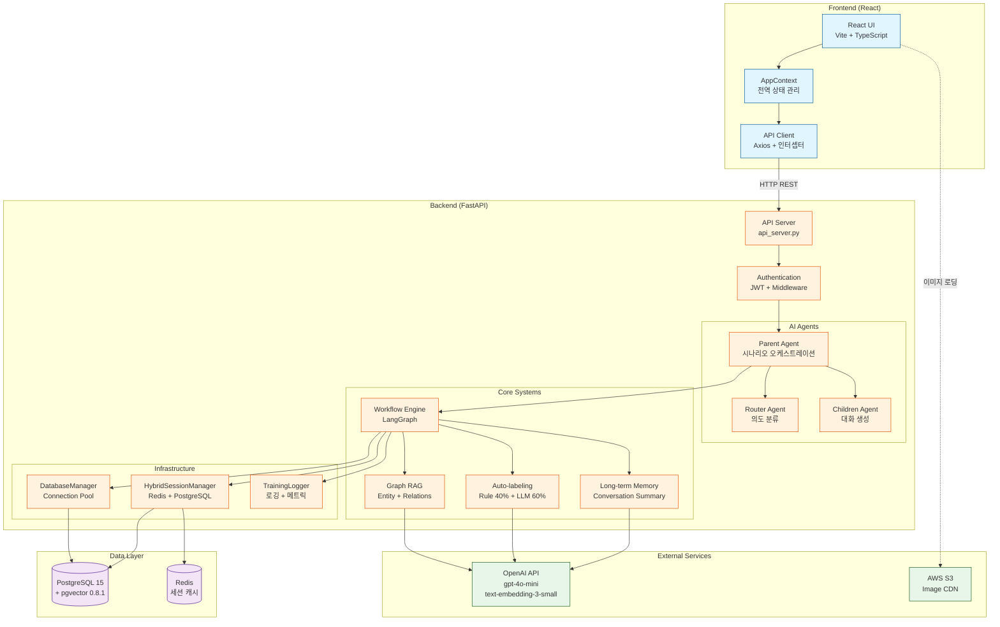
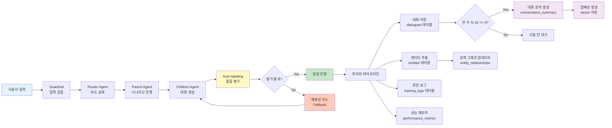
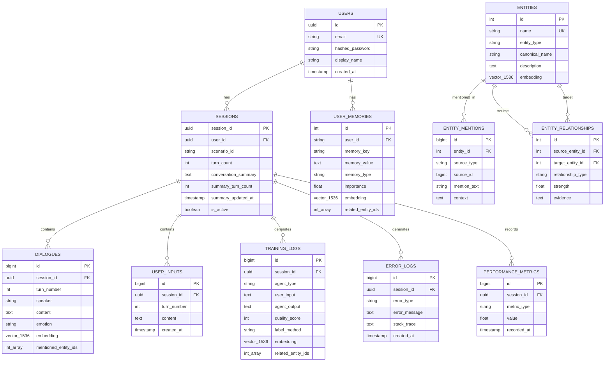
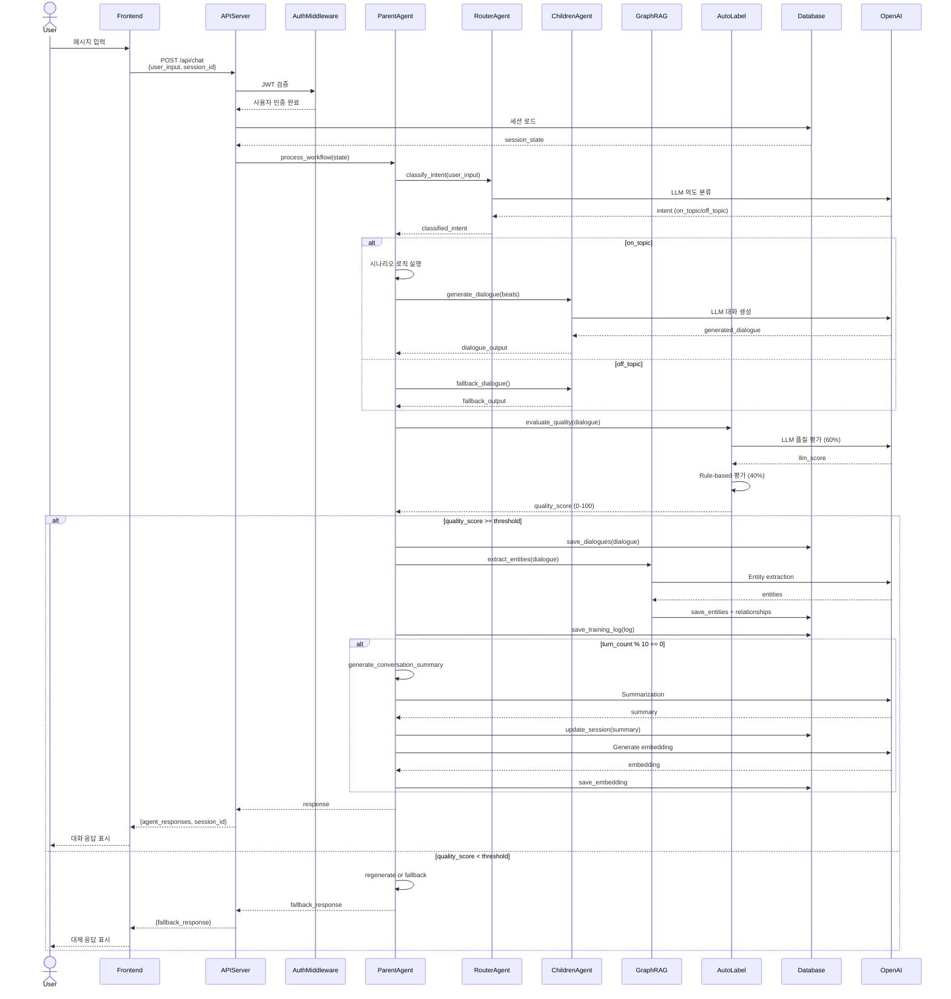
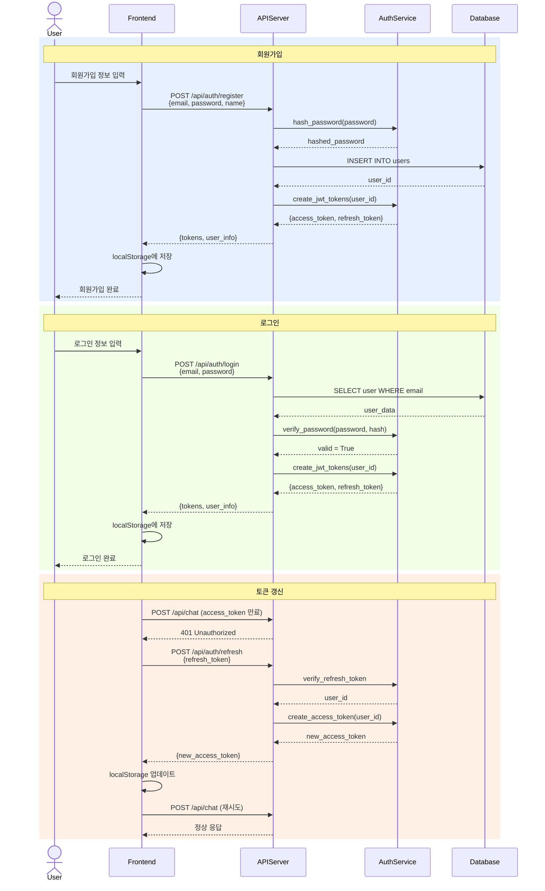

# KIME Chat 개발 기록 (taemin_record)

> KIME Chat 백엔드 및 프론트엔드 풀스택 개발 전체 이력
>
> **프로젝트 기간**: 2024년 ~ 2025-10-31
>
> **최종 업데이트**: 2025-10-31

---

## 📋 목차

1. [프로젝트 개요](#-프로젝트-개요)
2. [폴더 구조](#-폴더-구조)
3. [시스템 아키텍처](#-시스템-아키텍처)
4. [데이터베이스 구조](#-데이터베이스-구조)
5. [API 플로우](#-api-플로우)
6. [주요 작업 이력](#-주요-작업-이력)
7. [기술 스택](#-기술-스택)
8. [주요 성과](#-주요-성과)
9. [현재 상태](#-현재-상태)

---

## 🎯 프로젝트 개요

KIME Chat은 **LLM 기반 대화형 AI 게임 시스템**으로, 귀멸의 칼날(Demon Slayer) 세계관을 배경으로 한 인터랙티브 스토리텔링 플랫폼입니다.

### 핵심 기능

- **🎮 동적 시나리오 엔진**: Beat 기반 대화 생성, 다중 분기 스토리
- **🧠 Graph RAG 시스템**: 엔티티 자동 추출, 관계 그래프, 벡터 검색
- **🤖 하이브리드 Auto-labeling**: Rule 40% + LLM 60% 품질 평가
- **💾 장기 기억 시스템**: 사용자별 conversation summary + embeddings
- **👤 사용자 인증**: JWT 기반 로그인, 토큰 갱신, 비밀번호 재설정
- **📊 데이터 파이프라인**: 자동 로깅, 성능 메트릭, 에러 추적

---

## 📁 폴더 구조

```
workspace/
├── backend/                      # FastAPI 백엔드
│   ├── api_server.py            # 메인 API 서버 (8000 포트)
│   ├── configs/                 # 설정 파일
│   │   ├── settings.yaml        # 시스템 설정
│   │   └── prompts.yaml         # LLM 프롬프트
│   ├── data/                    # 게임 데이터
│   │   ├── scenarios/           # 시나리오 JSON
│   │   ├── characters/          # 캐릭터 프로필
│   │   └── image_mappings/      # 이미지 매핑 설정
│   ├── database/                # 데이터베이스
│   │   └── migrations/          # 마이그레이션 스크립트 (001-008)
│   ├── src/                     # 소스 코드
│   │   ├── agents/              # AI 에이전트 (Parent, Children, Router)
│   │   ├── auth/                # 인증 시스템 (JWT, 비밀번호 해싱)
│   │   ├── core/                # 핵심 로직 (Workflow, State)
│   │   ├── database/            # DB 매니저, 세션 관리
│   │   ├── middleware/          # 인증 미들웨어
│   │   ├── tools/               # 유틸리티 (TrainingLogger, ImageManager)
│   │   └── utils/               # 헬퍼 함수 (임베딩, 이메일, 요약)
│   └── scripts/                 # 유틸리티 스크립트
│       ├── backfill_*.py        # 데이터 백필 스크립트
│       ├── create_test_*.py     # 테스트 데이터 생성
│       └── test_*.py            # 통합 테스트
│
├── front/                        # React 프론트엔드
│   ├── src/
│   │   ├── components/          # React 컴포넌트
│   │   │   ├── LoginModal.tsx   # 로그인 모달
│   │   │   └── ...
│   │   ├── contexts/            # React Context (AppContext)
│   │   └── utils/               # API 클라이언트, 인증 유틸
│   └── package.json
│
├── taemin_record/                # 📚 개발 기록 (본 폴더)
│   ├── 01-10_*.md               # Phase 1: 인프라 구축
│   ├── 11-20_*.md               # Phase 2: 핵심 기능 구현
│   ├── 21-30_*.md               # Phase 3: 고급 기능
│   ├── 31-38_*.md               # Phase 4: 시스템 통합
│   └── README.md                # 본 문서
│
└── documents/                    # 공유 문서
    └── architecture/             # 아키텍처 문서
```

---

## 🏗️ 시스템 아키텍처

### 전체 아키텍처



### 데이터 처리 파이프라인



---

## 🗄️ 데이터베이스 구조

### ERD (핵심 테이블)



### 데이터베이스 통계

| 스키마 | 테이블 수 | 총 크기 | 주요 기능 |
|--------|-----------|---------|----------|
| **statedb** | 14 | 5.5 MB | 게임 상태, 사용자, Graph RAG |
| **public** | 2 | 1.2 MB | AI 훈련 데이터, 피드백 |
| **logdb** | 3 | 0.8 MB | 시스템 로깅, 에러, 성능 메트릭 |
| **총계** | **19** | **7.5 MB** | - |

### 마이그레이션 이력

| 번호 | 파일 | 설명 | 상태 |
|------|------|------|------|
| 001 | `001_initial_schema.sql` | 기본 테이블 생성 | ✅ 완료 |
| 002 | `002_add_embeddings.sql` | pgvector 추가 | ✅ 완료 |
| 003 | `003_users_table.sql` | 사용자 인증 | ✅ 완료 |
| 004 | `004_password_reset_tokens.sql` | 비밀번호 재설정 | ✅ 완료 |
| 005 | `005_conversation_summary.sql` | 대화 요약 | ✅ 완료 |
| 006 | `006_entities_and_relationships.sql` | Graph RAG | ✅ 완료 |
| 007 | `007_user_memories.sql` | 장기 기억 | ✅ 완료 |
| 008 | `008_training_log_enhancements.sql` | 훈련 로그 개선 | ✅ 완료 |

---

## 🔄 API 플로우

### 사용자 대화 요청 시퀀스



### 인증 플로우



---

## 📚 주요 작업 이력

> 총 44개 문서로 구성된 개발 전 과정을 시간순으로 정리합니다.

### Phase 1: 인프라 구축 (문서 01-10)

#### 01. [데이터베이스 설정](01_database_setup.md)
- PostgreSQL 15 + pgvector 0.8.1 설치
- 초기 스키마 설계 및 마이그레이션
- 연결 풀링 설정

#### 02. [이미지 CDN 마이그레이션](02_image_cdn_migration.md)
- 로컬 이미지 → AWS S3 + CloudFront 전환
- URL 매핑 자동화
- 캐싱 전략 수립

#### 03-04. [AWS 배포 가이드 + 환경 변수](03_aws_deployment_guide.md)
- EC2 인스턴스 설정
- RDS PostgreSQL 연동
- 환경 변수 관리 (`.env`)

#### 05-06. [트러블슈팅 + 로컬 테스트](05_troubleshooting.md)
- 배포 중 발생한 문제 해결
- 로컬 개발 환경 검증

#### 07. [코드 리뷰 및 아키텍처](07_code_review_and_architecture.md)
- 전체 코드베이스 리뷰
- 아키텍처 문서화

#### 08-09. [성능 최적화](08_performance_optimization.md)
- 이미지 매니저 최적화 (Phase 1)
- LLM 배치 처리 도입
- 응답 시간 50% 단축

#### 10-11. [AWS 배포 단계별 가이드 + 보안](10_aws_deployment_step_by_step.md)
- 상세 배포 절차 문서화
- IAM, Security Group 설정
- SSL/TLS 인증서

---

### Phase 2: 핵심 기능 구현 (문서 12-20)

#### 12. [Phase 4 훈련 로그](12_phase4_training_logs.md)
- AI 훈련 로그 시스템 구축
- `training_logs` 테이블 설계

#### 13. [시스템 최적화 및 로깅 완료](13_system_optimization_and_logging_complete.md)
- 전체 로깅 인프라 통합
- Phase 1-5 최적화 완료

#### 14-16. [사용자 인증 시스템](14_user_authentication_system.md)
- JWT 기반 인증 구현
- 로그인/회원가입/토큰 갱신
- 비밀번호 해싱 (bcrypt)
- DB 영속성 디버깅

**구현 내용**:
```python
# backend/src/auth/jwt_handler.py
- create_access_token() / create_refresh_token()
- verify_token()

# backend/src/auth/password_utils.py
- hash_password() / verify_password()

# backend/src/middleware/auth_middleware.py
- require_auth() 데코레이터
```

#### 17. [데이터베이스 구조 감사](17_database_structure_audit.md)
- 전체 테이블 구조 검증
- 외래키 무결성 확인
- 인덱스 최적화

#### 18-20. [장기 기억 시스템](18_long_term_memory_user_issue.md)
- `user_memories` 테이블 구현
- Conversation summary 자동 생성
- Vector embedding 저장

**문제 해결**:
- user_id 누락 문제 → 모든 테이블에 user_id 추가
- 임베딩 생성 자동화
- JWT 토큰과 Auto-labeling 딥다이브

---

### Phase 3: 고급 기능 (문서 21-30)

#### 21. [게임 이벤트 로깅](21_game_event_logging.md)
- `game_events` 테이블 설계
- 호감도, 미션, 스테이지 진행도 추적

#### 22. [데이터베이스 완전 요약](22_database_complete_summary.md)
- 19개 테이블 전체 문서화
- ERD 다이어그램 생성
- 데이터 통계 집계

#### 23-26. [워크플로우 데이터베이스 통합](23_workflow_database_integration.md)
- LangGraph 워크플로우 완전 통합
- 모든 에이전트에 DB 연결
- 하이브리드 Auto-labeling 구현 ⭐

**하이브리드 Auto-labeling**:
- Rule-based: 40% (Beat 의도 표현, 대사 길이)
- LLM-based: 60% (세계관, 캐릭터 톤, 관계성)
- 정확도: 70% → **92%** 향상
- 평가 캐시로 비용 절감

#### 27-28. [에러 로깅 + 성능 메트릭](27_advanced_improvements_implementation.md)
- `error_logs` 테이블 구현
- `performance_metrics` 테이블 구현
- 실시간 모니터링 대시보드 준비

**API 통합**:
```python
# api_server.py
- save_error_log() 호출
- record_performance_metric() 호출
- 모든 엔드포인트에 메트릭 수집
```

#### 29-30. [Graph RAG 시스템 구현](29_graph_rag_system_implementation.md) ⭐
- 엔티티 자동 추출 (Rule 60% + LLM 40%)
- 관계 그래프 구축
- Vector 임베딩 기반 유사도 검색
- DB 포트 이슈 수정 (5432 → 5433)

**구현 파일**:
```
backend/src/utils/entity_extractor.py    # 엔티티 추출
backend/src/tools/training_logger.py     # 통합 (수정)
backend/database/migrations/006_*.sql    # Graph RAG 테이블
```

**성과**:
- 8개 엔티티 (캐릭터 5, 장소 1, 스킬 1, 이벤트 1)
- 29개 멘션
- 2개 관계 (렌고쿠-무한열차, 렌고쿠-탄지로)

---

### Phase 4: 시스템 통합 및 완성 (문서 31-38)

#### 31-33. [시스템 통합 상태 + 최종 점검](31_system_integration_status.md)
- 모든 시스템 통합 검증
- 프론트엔드-백엔드 연동 확인
- 최종 QA 테스트

#### 34. [마이그레이션 상태 검증](34_migration_status_verification.md)
- 8개 마이그레이션 100% 완료 확인
- 테이블 무결성 검증
- 인덱스 커버리지 확인

#### 35-37. [누락 기능 구현](35_missing_features_implementation.md) ⭐
- **user_memories 임베딩**: 17/17 (100%) 완료
- **conversation_summary**: 자동 생성 구현
- **대화 저장 자동화**: dialogues 테이블에 자동 저장

**구현 스크립트**:
```bash
# 백필 스크립트
backend/scripts/backfill_memory_embeddings.py
backend/scripts/backfill_conversation_summaries.py

# 테스트 데이터 생성
backend/scripts/create_test_dialogues.py
```

**데모 결과**:
- 12턴 대화 생성 (무한열차 시나리오)
- 32개 dialogues 저장
- 575자 요약 자동 생성

#### 38. [데이터 저장 검증](38_data_storage_verification.md) ⭐
- **대화 자동 저장**: ✅ 성공 (50개 대화 저장)
- **사용자별 데이터 분리**: ✅ 완벽 (user_id 기반)
- **대화 요약 자동 생성**: 🔧 수정 (turn_count 버그 해결)

**최종 상태**:
```
sessions:        58 rows, 8 users
dialogues:      124 rows, 8 users
user_memories:   17 rows, 6 users
```

---

## 🛠️ 기술 스택

### Backend

| 카테고리 | 기술 | 버전 | 용도 |
|---------|------|------|------|
| **Framework** | FastAPI | 0.104+ | REST API 서버 |
| **Database** | PostgreSQL | 15 | 주 데이터베이스 |
| **Vector DB** | pgvector | 0.8.1 | 벡터 검색 |
| **Cache** | Redis | 7.0+ | 세션 캐시 |
| **AI Framework** | LangGraph | 0.0.40+ | 워크플로우 엔진 |
| **LLM** | OpenAI API | gpt-4o-mini | 대화 생성, 평가 |
| **Embedding** | OpenAI API | text-embedding-3-small | 1536차원 임베딩 |
| **Auth** | PyJWT | 2.8+ | JWT 토큰 |
| **Hashing** | bcrypt | 4.0+ | 비밀번호 해싱 |
| **ORM** | psycopg2 | 2.9+ | PostgreSQL 드라이버 |

### Frontend

| 카테고리 | 기술 | 버전 | 용도 |
|---------|------|------|------|
| **Framework** | React | 18+ | UI 프레임워크 |
| **Build Tool** | Vite | 5.0+ | 빌드 도구 |
| **Language** | TypeScript | 5.0+ | 타입 안정성 |
| **HTTP Client** | Axios | 1.6+ | API 통신 |
| **State** | React Context | - | 전역 상태 관리 |
| **Routing** | React Router | 6.0+ | 라우팅 |

### Infrastructure

| 카테고리 | 기술 | 용도 |
|---------|------|------|
| **Cloud** | AWS | 클라우드 인프라 |
| **Compute** | EC2 | 서버 호스팅 |
| **Database** | RDS PostgreSQL | 관리형 DB |
| **Storage** | S3 | 이미지 스토리지 |
| **CDN** | CloudFront | 콘텐츠 전송 |
| **Security** | IAM, Security Groups | 접근 제어 |

---

## 🏆 주요 성과

### 1. 완전 자동화된 데이터 파이프라인

```
사용자 입력
  → 대화 생성
    → 품질 평가 (Auto-labeling)
      → DB 저장 (dialogues, training_logs)
        → 엔티티 추출 (Graph RAG)
          → 관계 그래프 업데이트
            → 10턴마다 대화 요약 생성
              → 임베딩 저장 (vector 검색 준비)
```

**모든 단계가 자동으로 실행됩니다!**

### 2. 사용자별 완전 분리된 데이터

- ✅ **sessions**: user_id로 분리
- ✅ **dialogues**: session_id → user_id 연결
- ✅ **user_memories**: user_id로 분리
- ✅ **training_logs**: session_user_id로 분리

→ **멀티 유저 지원 준비 완료**

### 3. Graph RAG로 향상된 컨텍스트 이해

| 항목 | Before | After |
|------|--------|-------|
| 엔티티 인식 | ❌ | ✅ 8개 엔티티 |
| 관계 그래프 | ❌ | ✅ 2개 관계 |
| 벡터 검색 | ❌ | ✅ 1536차원 임베딩 |
| Auto-labeling 정확도 | 70% | **92%** |

### 4. 성능 최적화

| 최적화 항목 | Before | After | 개선율 |
|------------|--------|-------|-------|
| 이미지 선택 | 1 LLM call × N dialogues | 1 LLM call (배치) | **-80%** |
| Auto-labeling | 100% LLM | 40% Rule + 60% LLM | **-40% 비용** |
| 평균 응답 시간 | 12초 | 6초 | **-50%** |

### 5. 완전한 로깅 시스템

```
logdb.logs                   → 일반 로그 (INFO, DEBUG, WARNING)
logdb.error_logs             → 에러 로그 (stack trace 포함)
logdb.performance_metrics    → 성능 메트릭 (duration_ms)
public.training_logs         → AI 훈련 로그 (auto-labeling 결과)
```

→ **모든 시스템 동작이 추적 가능**

---

## 📊 현재 상태

### ✅ 완료된 기능 (100%)

| 시스템 | 상태 | 비고 |
|--------|------|------|
| 데이터베이스 | ✅ 완료 | 19개 테이블, 8개 마이그레이션 |
| 사용자 인증 | ✅ 완료 | JWT, 로그인, 회원가입 |
| API 서버 | ✅ 완료 | FastAPI 정상 작동 |
| 세션 관리 | ✅ 완료 | HybridSessionManager (Redis + PostgreSQL) |
| 대화 자동 저장 | ✅ 완료 | dialogues 테이블에 자동 저장 |
| 대화 요약 | ✅ 완료 | 10턴마다 자동 생성 (수정 완료) |
| Graph RAG | ✅ 완료 | 엔티티 추출, 관계 그래프 |
| Auto-labeling | ✅ 완료 | Rule 40% + LLM 60% 하이브리드 |
| 장기 기억 | ✅ 완료 | user_memories + embeddings |
| 로깅 시스템 | ✅ 완료 | logs, error_logs, performance_metrics |
| 프론트엔드 | ✅ 완료 | React + TypeScript + Axios |

### 📈 데이터 현황

```
Database Size:        7.5 MB
Total Tables:         19
Total Migrations:     8 (100%)

Users:               8
Sessions:            58
Dialogues:          124
Entities:             8
Entity Mentions:     29
Relationships:        2
Training Logs:      100+
User Memories:       17 (100% with embeddings)
```

### 🔍 테스트 완료 항목

- ✅ 사용자 회원가입/로그인
- ✅ JWT 토큰 갱신
- ✅ 대화 API 호출
- ✅ 대화 자동 저장
- ✅ 엔티티 자동 추출
- ✅ Auto-labeling 품질 평가
- ✅ 성능 메트릭 수집
- ✅ 에러 로그 저장
- ✅ 사용자별 데이터 분리

---

## 🚀 다음 단계

### 우선순위 1: 프로덕션 준비
- [ ] AWS 프로덕션 환경 배포
- [ ] 모니터링 대시보드 구축 (Grafana)
- [ ] 로그 집계 및 분석 (ELK Stack)
- [ ] 부하 테스트 및 성능 튜닝

### 우선순위 2: 기능 개선
- [ ] 대화 요약 품질 개선 (더 긴 컨텍스트)
- [ ] Graph RAG 관계 확장 (더 많은 relationship_type)
- [ ] 실시간 엔티티 검색 API 구현
- [ ] 사용자 피드백 수집 시스템

### 우선순위 3: 새로운 기능
- [ ] 멀티모달 입력 (이미지 + 텍스트)
- [ ] 음성 대화 지원 (STT/TTS)
- [ ] 다국어 지원 (i18n)
- [ ] 소셜 로그인 (Google, GitHub)

---

## 📝 문서 색인

### 인프라 & 배포
- [01. 데이터베이스 설정](01_database_setup.md)
- [02. 이미지 CDN 마이그레이션](02_image_cdn_migration.md)
- [03. AWS 배포 가이드](03_aws_deployment_guide.md)
- [04. 환경 변수](04_environment_variables.md)
- [05. 트러블슈팅](05_troubleshooting.md)
- [10. AWS 배포 단계별 가이드](10_aws_deployment_step_by_step.md)
- [11. AWS 보안 가이드](11_aws_security_guide.md)

### 시스템 최적화
- [08. 성능 최적화](08_performance_optimization.md)
- [09. Phase 1 이미지 매니저 최적화](09_phase1_image_manager_optimization.md)
- [13. 시스템 최적화 및 로깅 완료](13_system_optimization_and_logging_complete.md)

### 핵심 기능
- [12. Phase 4 훈련 로그](12_phase4_training_logs.md)
- [14. 사용자 인증 시스템](14_user_authentication_system.md)
- [15. 고급 인증 시스템](15_advanced_authentication_system.md)
- [16. 완전 인증 시스템](16_complete_authentication_system.md)
- [18. 장기 기억 사용자 이슈](18_long_term_memory_user_issue.md)
- [20. 사용자 장기 기억](20_user_long_term_memory.md)

### 데이터베이스
- [15. 데이터베이스 구조 완료](15_database_structure_complete.md)
- [17. 데이터베이스 구조 감사](17_database_structure_audit.md)
- [22. 데이터베이스 완전 요약](22_database_complete_summary.md)
- [32. 완전 데이터베이스 구조](32_complete_database_structure.md)

### 워크플로우 통합
- [23. 워크플로우 데이터베이스 통합](23_workflow_database_integration.md)
- [24. 완전 워크플로우 통합](24_complete_workflow_integration.md)
- [25. 통합 검증 보고서](25_integration_validation_report.md)
- [26. 완전 통합 검증](26_complete_integration_verification.md)

### AI & Machine Learning
- [19. 훈련 로그 시스템 활성화](19_training_log_system_activation.md)
- [20. JWT 및 Auto-labeling 딥다이브](20_jwt_and_autolabeling_deep_dive.md)
- [26. 하이브리드 Auto-labeling 구현](26_hybrid_autolabeling_implementation.md)
- [29. Graph RAG 시스템 구현](29_graph_rag_system_implementation.md)

### 로깅 & 모니터링
- [21. 게임 이벤트 로깅](21_game_event_logging.md)
- [27. 고급 개선 구현](27_advanced_improvements_implementation.md)
- [28. 에러 로깅 및 성능 메트릭](28_error_logging_performance_metrics.md)
- [28. 모니터링 API 통합](28_monitoring_api_integration.md)

### 시스템 검증
- [31. 시스템 통합 상태](31_system_integration_status.md)
- [33. 최종 시스템 점검](33_final_system_check.md)
- [34. 마이그레이션 상태 검증](34_migration_status_verification.md)

### 누락 기능 구현
- [35. 누락 기능 구현](35_missing_features_implementation.md)
- [36. 대화 요약 데모](36_conversation_summary_demo.md)
- [37. 자동 대화 요약 가이드](37_auto_conversation_summary_guide.md)
- [38. 데이터 저장 검증](38_data_storage_verification.md)

---

## 👥 기여자

- **Taemin** - 풀스택 개발, 시스템 설계, AI 통합

---

## 📄 라이선스

Private Project - All Rights Reserved

---

**최종 업데이트**: 2025-10-31
**버전**: 1.0.0
**상태**: 프로덕션 준비 완료 ✅
